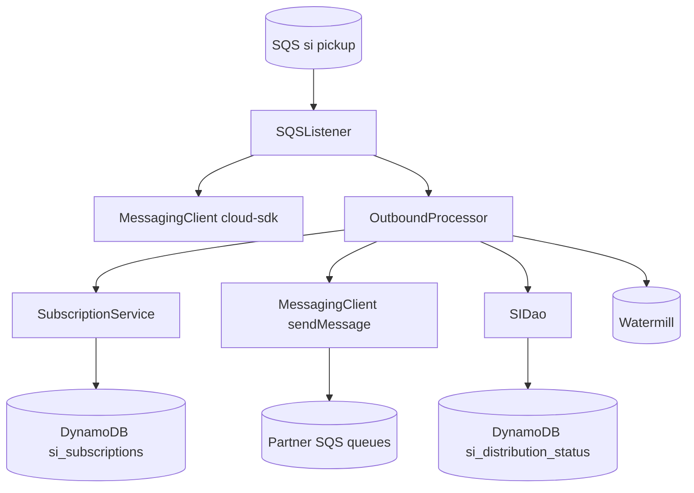
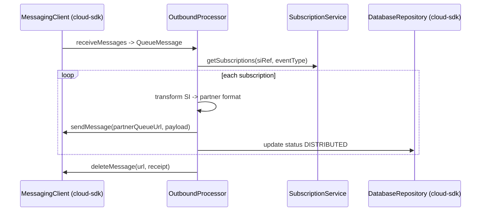

# Partner Integrator — pi-si-out-processor — AWS SDK 2.x (cloud-sdk) Upgrade Design

**Module:** `partner-integrator / pi-si-out-processor`
**Date:** 2026-06-30
**Status:** Target design — NOT STARTED (depends on `pi-commons` upgrade)
**Companion:** `2026-06-30-partner-integrator-pi-si-out-processor-current-state-DESIGN-copilot.md`
**Playbook:** `partner-integrator/docs/2026-06-30-partner-integrator-aws2x-DESIGN-copilot.md`

---

## 1. Change Overview

SI outbound processor. AWS scope: **SQS** (two bindings — consumer + producer/partner queues) and **DynamoDB**
(`si_subscriptions`, `si_distribution_status`). Watermill audit follows the messaging upgrade.

| AWS service | Current (v1) | Target |
|-------------|--------------|--------|
| **SQS** | `AmazonSQS` (listener + sender) | `MessagingClient<String>` (two roles, one client) |
| **DynamoDB** | `DynamoDBMapper` (`SIDao`/`SubscriptionService`) | `DatabaseRepository<T,K>` |

---

## 2. Maven Dependency Changes

```diff
  <dependency><groupId>com.inttra.mercury</groupId><artifactId>shipping-instruction</artifactId><version>1.0.M</version></dependency>
  <dependency><groupId>com.inttra.mercury</groupId><artifactId>pi-commons</artifactId><version>1.0</version></dependency>
+ <dependency><groupId>com.inttra.mercury</groupId><artifactId>dynamo-integration-test</artifactId><version>${mercury.commons.version}</version><scope>test</scope></dependency>
+ <dependency><groupId>com.amazonaws</groupId><artifactId>aws-java-sdk-dynamodb</artifactId><scope>test</scope></dependency>
```

## 3. Configuration Changes (`conf/<env>/config.yaml`)

```diff
  sqsPickupConfig: { queueUrl: ..., waitTimeSeconds: 20, maxNumberOfMessages: 10 }     # unchanged
  sqsDestinationConfig: { queueUrl: ..., waitTimeSeconds: 20, maxNumberOfMessages: 10 } # unchanged
  dynamoDbConfig:
    tableName: si_subscriptions
    region: us-east-1
+   sseEnabled: false
  watermillPublisherConfig: { queueUrl: ... }   # unchanged
```

## 4. Per-Service Spec

- **SQS consume:** `OutboundProcessor`/`SQSListener` use
  `MessagingClient.receiveMessages(ReceiveMessageOptions.builder().queueUrl(url).maxMessages(10).waitTimeSeconds(20).build())`
  → `QueueMessage<String>`; `deleteMessage(url, receipt)`.
- **SQS produce:** routing to partner queues via `MessagingClient.sendMessage(partnerQueueUrl, payload)` (the
  previous second `AmazonSQS` sender binding becomes the same `MessagingClient`, or a second injected instance).
- **DynamoDB:** `SIDao`/`SubscriptionService` use `DatabaseRepository` for `si_subscriptions` /
  `si_distribution_status`.

## 5. Guice Wiring Changes

```diff
- SIFeedApplicationInjector: bind AmazonSQS (listener) + AmazonSQS (sender) + AmazonDynamoDB
+ SIFeedApplicationInjector: MessagingClient<String> (consume+produce) + DatabaseRepository<...> (factory)
```

## 6. Target Component Diagram



## 7. Target Sequence — SI distribution (after)



## 8. Key Classes Changed

| Class | Change |
|-------|--------|
| `pom.xml` | add test deps; inherit cloud-sdk via pi-commons. |
| `SIFeedApplicationConfig` | `dynamoDbConfig` → `BaseDynamoDbConfig`. |
| `SIFeedApplicationInjector` | two `AmazonSQS` + `AmazonDynamoDB` → `MessagingClient` + `DatabaseRepository`. |
| `OutboundProcessor` | consume + produce via `MessagingClient`. |
| `SIDao` / `SubscriptionService` | mapper → `DatabaseRepository`. |
| `CreateTables`/`DeleteTables` | table bootstrap via cloud-sdk admin path. |

## 9. Testing Strategy

- **DynamoDB-Local IT** for subscription/status DAOs.
- **SQS** unit tests mocking `MessagingClient` (consume + produce) at booking level.
- Full local **JaCoCo** coverage on changed code.

## 10. Risks & Call-outs

- Partner-bound message formats (EDIFACT/XML/webhook) are external contracts — keep byte-identical.
- Two SQS roles (consumer + producer) must both migrate; preserve `si_subscriptions`/`si_distribution_status` schemas.
