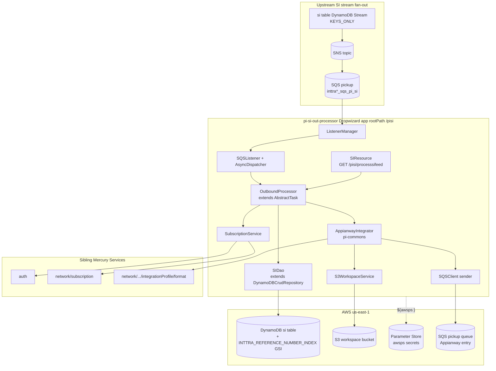
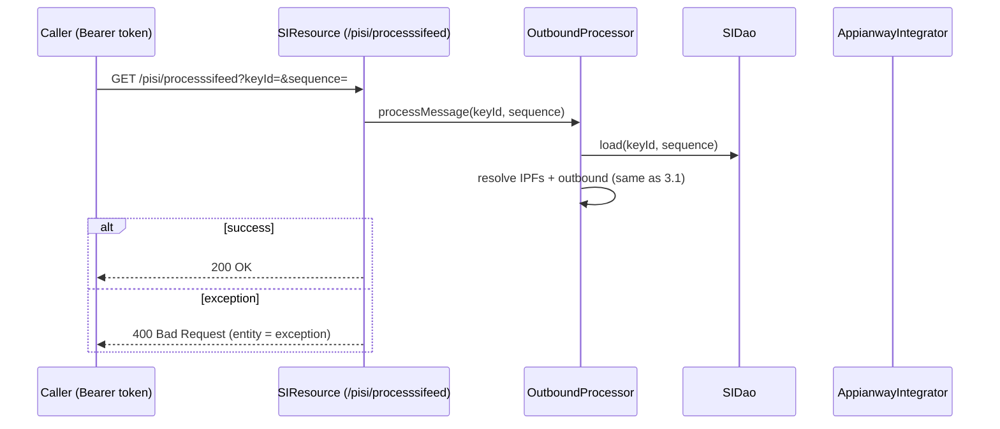

# Partner Integrator — pi-si-out-processor — Current-State Design

**Module:** `partner-integrator / pi-si-out-processor`
**Date:** 2026-06-30
**Status:** Current state — AWS SDK **1.x** (`com.amazonaws`) in production; cloud-sdk migration **NOT STARTED**
**Artifact:** `com.inttra.mercury:pi-si-out-processor:1.0` (Dropwizard 4 / Jetty 12 via the shared `InttraServer`; single shaded JAR `pi-si-out-processor-1.0.jar`)
**Main class:** `com.inttra.mercury.sifeed.outprocessor.SIPIOBApplication`

---

## 1. Business Purpose & Rules

`pi-si-out-processor` is the **outbound Shipping-Instruction distributor**. It reacts to changes on the shared
DynamoDB **`si`** table (whose change stream is fanned out by an upstream stream→SNS→SQS chain), looks up which
partner **Integration Profile Formats (IPFs)** are subscribed for the SI's transaction parties, and hands the SI
message off to the **Appianway** delivery pipeline (S3 workspace + the `pi-si` SQS pickup queue), which is what
actually performs partner format-conversion and delivery downstream.

Concretely, the only inbound trigger is an **SQS message that wraps an SNS notification that wraps a DynamoDB
`KEYS_ONLY` stream record** for the `si` table. The processor:

- Decodes the envelope (`SQS body → SNSEvent.SNS → DynamodbEvent.DynamodbStreamRecord`) in
  `OutboundProcessor.process`.
- On `INSERT`/`MODIFY` only, extracts the stream record's keys (`id` hash + `sequenceNumber` range) and **re-loads
  the full `SIVersion`** from DynamoDB by `(id, sequenceNumber)` — the stream is `KEYS_ONLY`, so the body is never in
  the event.
- Calls `SubscriptionService.getSubscribedIPFList(siVersion)`, which fetches all shipping-instruction subscriptions
  from the `network/subscription` REST service and evaluates each subscription's conditions against the SI's
  **transaction-party Inttra company ids** (`enrichedAttributes.transactionPartyList`).
- For every matched subscription, collects the **EDI action `refId`s** (the target IPF ids) and calls
  `AppianwayIntegrator.outbound(message, ipfIds, keyId, "pi-si-out-processor", "submitShippingInstruction")`.

There is **no partner format transformation, no EDIFACT/XML generation, and no distribution-status table in this
module** — Appianway (reached via the `pi-si` SQS pickup queue) owns conversion and delivery, and this processor
keeps no delivery-status record of its own. The same logic is also reachable synchronously via
`GET /pisi/processsifeed?keyId=&sequence=` on `SIResource` for replay/debugging.

### Key business rules

| Rule | Detail (source) |
|------|------|
| Trigger event types | `OutboundProcessor.process` switches on `OperationType.fromValue(record.getEventName())`; only `INSERT` and `MODIFY` are processed, `REMOVE` is a no-op. |
| Key presence | The DynamoDB stream keys map **must** contain `id`; otherwise `throw new RuntimeException("id key not found.")`. The range key `sequenceNumber` is read as `keys.get("sequenceNumber").getS()`. |
| Re-load from table | The `KEYS_ONLY` stream carries no payload, so `SIDao.load(id, sequenceNumber)` re-reads the full `SIVersion` (incl. the compressed `message`) from the `si` table. |
| Subscription scope | `SubscriptionService.getSubscriptions(-100)` queries `…/network/subscription/shipping-instruction/-100` (the magic `-100` is the "all/system" company-id selector used to pull every SI subscription). |
| Match condition | `ConditionEvaluator.evaluateConditions(subscription.getConditions(), ConditionOperator.AND, valuesMap)` with the source-value key `TRANSACTION_PARTY / INTTRA_COMPANY_ID` populated from `siVersion.getEnrichedAttributes().getTransactionPartyList()`. |
| Target selection | For each matching subscription, take `subscription.getEDIActions()`, drop nulls, map `Action::getRefId` → the list of outbound IPF ids. |
| Empty-result short-circuit | If the resolved IPF list is null/empty, **nothing is delivered** (no S3 write, no SQS send); the message is still ACKed. |
| Failure handling | Any exception in `processMessage` is logged and **re-thrown as `RuntimeException`**, so the message is **not** deleted and SQS redelivers (at-least-once). |
| Pass-through flag | `SIFeedApplicationConfig.usePassThrough` (`boolean`, `@NotNull`) is bound/read from config but is **not referenced** by `OutboundProcessor` today (reserved). |

---

## 2. Design & Component Diagram

Layered Dropwizard service built through the shared `InttraServer<SIFeedApplicationConfig>` builder
(`SIPIOBApplication.newServer()`): it registers the `CreateTables` / `DeleteTables` configured commands, the
`SIFeedApplicationInjector` Guice module generator, the `SIResource` JAX-RS resource, and a **post-setup hook** that
starts the SQS `ListenerManager`. The listener pulls from the `pickup` queue and dispatches each message to a freshly
provided `OutboundProcessor` task via an `AsyncDispatcher`.



### Key classes & interactions

| Layer | Class | Responsibility |
|-------|-------|----------------|
| Bootstrap | `SIPIOBApplication` | Builds `InttraServer`, registers `CreateTables`/`DeleteTables`, the injector generator, `SIResource`, and a post-setup hook that `manage()`s and `start()`s the `ListenerManager`. |
| Wiring | `SIFeedApplicationInjector` (Guice `AbstractModule`) | Builds `SQSListener` + `ListenerManager`; binds **two `AmazonSQS`** instances (`amazonSQSForListener`, `amazonSQSForSender`), **`AmazonS3`**, **`AmazonDynamoDB`** + `DynamoDBMapper` + `DynamoDBMapperConfig`, `AuthClient`, `IntegrationProfileFormatService`, `WorkspaceService→S3WorkspaceService`, the `AsyncDispatcher` (task factory → `OutboundProcessor` provider), and each `ServiceDefinition` by name. |
| Config | `SIFeedApplicationConfig extends ApplicationConfiguration` | `sqsPickupConfig`, `sqsDestinationConfig` (`SQSConfig`), `s3WorkspaceConfig` (`S3Config`), `usePassThrough` (`boolean`), `dynamoDbConfig` (`DynamoDbConfig` from `dynamo-client`). |
| Resource | `SIResource` (`@Path("/")`, root `/pisi`) | `GET /processsifeed?keyId=&sequence=` → `siTask.processMessage(keyId, sequence)`; 200 OK or 400 on exception. |
| Processor | `OutboundProcessor extends AbstractTask` | Decodes SQS→SNS→Dynamo-stream envelope; on INSERT/MODIFY re-loads `SIVersion`, resolves IPFs, calls Appianway. |
| Service | `SubscriptionService` (`@Singleton`) | `getSubscriptions(inttraCompanyId)` / `findByHashKey` via `NetworkServiceClient`; `getSubscribedIPFList(SIVersion)` runs `ConditionEvaluator` over subscriptions and returns matched EDI-action `refId`s. |
| Persistence | `SIDao extends DynamoDBCrudRepository<ContainerEvent, DynamoHashAndSortKey<String,String>>` | Constructed against `ContainerEvent` for the CRUD-repo contract, but its only real method `load(id, range)` calls `dynamoDBMapper.load(SIVersion.class, id, range)` — i.e. reads the **`si`** table. |
| Delivery | `AppianwayIntegrator` (pi-commons) | `outbound(...)`: writes `message` to the S3 workspace bucket under `{uuid}/{uuid}`, then for each IPF id resolves an `IntegrationProfileFormat` and sends a `MetaData` JSON to the **`pickup`** SQS queue (`sqsPickupConfig.getQueueUrl()`). |
| Delivery | `S3WorkspaceService` (pi-commons), `SQSClient` (pi-commons) | v1 `AmazonS3.putObject` / `AmazonSQS.sendMessage` underneath Appianway. |
| Commands | `CreateTables` / `DeleteTables` (`ConfiguredCommand`) | Create / delete the **`si`** table (`SI.class`), incl. stream spec, SSE, TTL on `expiresOn`, and the `INTTRA_REFERENCE_NUMBER_INDEX` GSI. |
| Support | `Utils` | Jackson `ObjectMapper` (case-insensitive, Joda + `LongDateDeserializer`), `fromJson`/`toJson`, JAXB marshal/unmarshal, **direct SSM `getParameters` lookup**, env-var helpers. |

---

## 3. Data Flow

### 3.1 Stream-driven outbound distribution (primary path)

```mermaid
sequenceDiagram
  participant PICK as SQS pickup queue
  participant LM as ListenerManager / SQSListener
  participant OP as OutboundProcessor
  participant DAO as SIDao
  participant DDB as DynamoDB si table
  participant SUB as SubscriptionService
  participant NS as network/subscription (REST)
  participant AW as AppianwayIntegrator
  participant S3 as S3 workspace
  participant IPF as integrationProfile/format (REST)
  participant DEL as SQS pickup (Appianway entry)

  PICK->>LM: receiveMessage (waitTime 20s, max 3)
  LM->>OP: process(Message, pickupQueueUrl)  (AsyncDispatcher task)
  OP->>OP: SNSEvent.SNS = fromJson(body); DynamodbStreamRecord = fromJson(sns.message)
  alt eventName INSERT or MODIFY
    OP->>OP: require keys.contains("id")
    OP->>DAO: load(keys.id.S, keys.sequenceNumber.S)
    DAO->>DDB: DynamoDBMapper.load(SIVersion.class, id, sequenceNumber)
    DDB-->>DAO: SIVersion (message decompressed via CompressionConverter)
    OP->>SUB: getSubscribedIPFList(siVersion)
    SUB->>NS: GET /network/subscription/shipping-instruction/-100
    NS-->>SUB: List<Subscription>
    SUB->>SUB: evaluateConditions(AND) over transactionPartyList
    SUB-->>OP: List<String> ipfIds (EDI action refIds)
    opt ipfIds non-empty
      OP->>AW: outbound(siVersion.message, ipfIds, id, "pi-si-out-processor", "submitShippingInstruction")
      AW->>S3: putObject(workspaceBucket, {uuid}/{uuid}, message)
      loop each ipfId
        AW->>IPF: getIntegrationProfileFormat(ipfId)
        AW->>DEL: sendMessage(pickupQueueUrl, MetaData JSON)
      end
    end
  else REMOVE
    OP->>OP: no-op
  end
```

> On success the listener framework deletes the SQS message; on any thrown exception the message is left for SQS
> redelivery (at-least-once). Delivery is fire-and-forget into Appianway — **no status is written back**.

### 3.2 Synchronous replay via REST



---

## 4. Data Stores & Integrations

### DynamoDB — table `si`

The entity classes (`SI` in pi-commons, `SIVersion` in `shipping-instruction`) both map `@DynamoDBTable(tableName =
"si")` with an identical key schema; `CreateTables` bootstraps from `SI.class`, while the processor reads via
`SIVersion.class`.

- **Hash key:** `id` (`@DynamoDBHashKey @DynamoDBAttribute("id")`).
- **Range key:** `sequenceNumber` (`@DynamoDBRangeKey @DynamoDBAutoGeneratedKey @DynamoDBAttribute("sequenceNumber")`; value pattern `m_{epochMillis}_{state}`).
- **GSI — `INTTRA_REFERENCE_NUMBER_INDEX`:** hash key `siInttraReferenceNumber` (`@DynamoDBIndexHashKey`). Not queried by this module (used by SI-side readers), but `CreateTables` provisions it.
- **Stream:** `@DynamoDBStream(StreamViewType.KEYS_ONLY)` — only `id` + `sequenceNumber` flow through the stream→SNS→SQS fan-out, which is exactly why the processor must re-load the full item.
- **TTL:** `expiresOn` (`Expires.EXPIRES_ON_ATTRIBUTE_NAME`); `CreateTables` enables TTL on this attribute.
- **Attribute encodings (must round-trip):** `message` → `@DynamoDBTypeConverted(CompressionConverter.class)` (compressed bytes/string on the wire); `expiresOn` → `@DynamoDBTypeConverted(DateToEpochSecond.class)` (epoch-seconds **number**); `enrichedAttributes` → nested map; the rest are plain strings.
- **Capacity:** from `dynamoDbConfig.readCapacityUnits`/`writeCapacityUnits` (applied to base table **and** the GSI in `CreateTables.createTableIfNotExists`).
- **Per-env table names** (`dynamoDbConfig.environment` prefix + entity table name `si`):

  | Env | Prefix (`dynamoDbConfig.environment`) | R/W capacity | Effective table |
  |-----|----------------------------------------|--------------|-----------------|
  | INT | `inttra_int` | 25 / 25 | `inttra_int_si` |
  | QA | `inttra2_qa` | 25 / 25 | `inttra2_qa_si` |
  | **CVT** | **`inttra2_test`** | 100 / 100 | `inttra2_test_si` |
  | PROD | `inttra2_prod` | 100 / 100 | `inttra2_prod_si` |

> The `SIFeedApplicationInjector.getNewDynamoDBMapperConfig` table-name resolver also has a special case: for
> `BookingDetail.class` it inserts a `_booking` segment (`{prefix}_booking_{table}`); for everything else (incl. `si`)
> it is `{prefix}_{table}`. `BookingDetail` is not used on the active path here but the `booking` artifact is a
> compile dependency.

### S3 — workspace bucket

`AppianwayIntegrator.outbound` writes the SI `message` to `s3WorkspaceConfig.bucket` under key `{rootWorkflowUuid}/{fileUuid}`
via `S3WorkspaceService.putObject(bucket, fileName, content)`.

| Config key | INT | QA | CVT | PROD |
|---|---|---|---|---|
| `s3WorkspaceConfig.bucket` | `inttra-int-workspace` | `inttra2-qa-workspace` | `inttra2-cv-workspace` | `inttra2-pr-workspace` |

### SQS

| Logical queue (config key) | Used by | INT | QA | CVT | PROD |
|---|---|---|---|---|---|
| Pickup (`sqsPickupConfig.queueUrl`) | `SQSListener` **inbound**, *and* Appianway **outbound** (`sendMessage`) | `…/081020446316/inttra_int_sqs_pi_si` | `…/642960533737/inttra2_qa_sqs_pi_si` | `…/642960533737/inttra2_cv_sqs_pi_si` | `…/642960533737/inttra2_pr_sqs_pi_si` |
| Destination (`sqsDestinationConfig.queueUrl`) | bound as the `SQSConfig` singleton; the `amazonSQSForSender` `SQSClient` carries the queue url **per send call** | `…/inttra_int_sqs_file_delivery` | `…/inttra2_qa_sqs_file_delivery` | `…/inttra2_cv_sqs_file_delivery` | `…/inttra2_pr_sqs_file_delivery` |

> Listener tuning is identical in every env: `waitTimeSeconds: 20`, `maxNumberOfMessages: 3`. **Note:** Appianway's
> `sendMessage` targets `sqsPickupConfig.getQueueUrl()` (the same pickup queue), not the destination queue — the
> destination queue / `S3Config`+`SQSConfig` bindings in the injector are the inputs Appianway is constructed from.
> There is **no SNS publish and no Kinesis** in this module.

### External REST services (via `NetworkServiceClient` / `AuthClient`)

- `auth` — OAuth (`clientId` + `${awsps:…/authclientsecret}`); `AuthClient` bound as eager singleton.
- `subscription` — `…/network/subscription`; `SubscriptionService.getSubscriptions` hits `…/shipping-instruction/-100`.
- `integration-profile-format` — `…/network/participant/integrationProfile/format`; `IntegrationProfileFormatServiceImpl` resolves an IPF's `formatId` + `integrationProfileId` for the Appianway `MetaData`.
- `format-service`, `integration-profile` — defined in `serviceDefinitions` (available for the IPF/format clients).

---

## 5. Maven Dependencies

| Artifact | Version | Notes |
|----------|---------|-------|
| `com.inttra.mercury:shipping-instruction` | `1.0.M` | SI domain models incl. `SIVersion`, `EnrichedAttributes`, `CompressionConverter`, `DateToEpochSecond`. Resolved from the `si-model-s3-release` S3 Maven repo; purged + re-`get` in the `initialize` phase. |
| `com.inttra.mercury:booking` | `1.0.M` | `BookingDetail` model (referenced only by the mapper table-name resolver). Resolved from the `booking-model-s3-release` S3 repo; purged + re-`get` in the `package` phase. |
| `com.inttra.mercury:pi-commons` | `1.0` | The framework backbone: `InttraServer`, `ListenerManager`/`SQSListener`/`SQSListenerClient`/`SQSClient`, `AsyncDispatcher`/`AbstractTask`/`TaskFactory`, `AppianwayIntegrator`, `S3WorkspaceService`, `NetworkServiceClient`/`AuthClient`, `DynamoSupport`, the `SI`/`ContainerEvent` VOs, `DynamoDBCrudRepository`/`DynamoDbConfig` (from `dynamo-client`). **Excludes** `org.mybatis:mybatis`. **This is the only path that pulls AWS SDK v1.** |
| `io.dropwizard:dropwizard-jdbi3` | `5.0.1` | Declared; no JDBI/SQL DAO is present in this module's source. |
| `com.amazonaws:aws-lambda-java-events` | `2.0.1` | **The one direct `com.amazonaws` `pom.xml` entry** — supplies the `DynamodbEvent`/`SNSEvent` POJOs used to deserialize the SQS envelope (excludes `joda-time`). |
| `io.swagger:swagger-annotations` | `1.5.15` | `@Api`/`@ApiImplicitParam` on `SIResource` (excludes `swagger-jaxrs`, `swagger-jersey2-jaxrs`). |
| `org.assertj:assertj-core` / JUnit 5 (`5.11.3`) / Mockito (`5.11.0`) | test | Unit tests (`*Test` for each main class). |
| Build | `maven-shade-plugin:3.5.1`, `maven-compiler-plugin:3.13.0` (release **17**), `aws-maven:6.0.0` extension | Fat JAR (`finalName=pi-si-out-processor-1.0`, main class `SIPIOBApplication`); `aws-maven` extension serves the S3 model repos. |

> **AWS SDK v1 is never declared as a runtime artifact** (only the Lambda **event** POJOs are). All client classes
> — `AmazonSQS`, `AmazonS3`, `AmazonDynamoDB`, `DynamoDBMapper`, and the SSM `AWSSimpleSystemsManagement*` in
> `Utils` — arrive **transitively via `pi-commons`** (which depends on `dynamo-client` + the AWS v1 line).
> `sonar.coverage.exclusions=**/config/**`.

---

## 6. Configuration & Deployment

### `conf/{int,qa,cvt,prod}/config.yaml`

- `server.rootPath: /pisi`, `applicationConnectors` HTTP 8080, `adminConnectors` HTTP 8081.
- `dynamoDbConfig` — `environment` (table prefix, §4), `readCapacityUnits`/`writeCapacityUnits` (25/25 INT+QA, 100/100 CVT+PROD), `sseEnabled: false`.
- `s3WorkspaceConfig.bucket` — per-env workspace bucket (§4).
- `sqsPickupConfig` / `sqsDestinationConfig` — `queueUrl`, `waitTimeSeconds: 20`, `maxNumberOfMessages: 3`.
- `usePassThrough` — **not present in any committed `config.yaml`**; it is a `@NotNull boolean`, so it defaults to `false` (a missing JSON boolean binds to `false`).
- `securityResources` — `oauthTokenValidationUri`, `userInfoUri`, `userPrincipalUri` (per-env `api(-alpha|-beta|-test).inttra.com`).
- `serviceDefinitions` — `auth` (`clientId` + `${awsps:/inttra{2}/<env>/mercuryservices/partner-integration/authclientsecret}`), `subscription`, `format-service`, `integration-profile`, `integration-profile-format`.
- **Secrets** resolved by pi-commons via AWS Parameter Store (`${awsps:…}`). Separately, `Utils.ssmParameterlookup` does a **direct** SSM `getParameters(withDecryption=true)` call for `clientSecretPath` if the env-var helper path is used.
- INT logs at `INFO`; QA/CVT/PROD log root `ERROR` with `com.inttra.mercury` at `INFO`. INT uses account `081020446316`; QA/CVT/PROD use `642960533737`.

### Deployment

- `build.sh` → `mvn … package sonar:sonar -P mercury-commons,sonar -pl partner-integrator/pi-si-out-processor --also-make` (Sonar key `mercury-services.partner-integrator-pi-si-out-processor`); renames the shaded JAR to `${RELEASE_NAME}.jar`, copies each `conf/<env>/config.yaml` as `config.yaml_<env>_conf`, copies `suppressions.xml`, and generates a Dockerfile (`FROM <ECR>:e2openjre11`, default `DEPLOY_USER=eoadmin`).
- `run.sh` → renames the active env's `config.yaml_${ENV}_conf` to `config.yaml`, then `java -Xms64m -Xmx${JVM_Xmx:-256m} -jar ${RELEASE_NAME}.jar server ./config.yaml` (no command → the Dropwizard `server` is run; `ListenerManager` is started by the post-setup hook).
- **Table/GSI bootstrap** — `java -jar … create-tables ./config.yaml` runs `CreateTables` (creates `si` with stream + SSE + TTL + the GSI at the configured capacity); `delete-tables` runs `DeleteTables`.
- **Credentials** — default AWS credential chain / ECS task IAM role. `AmazonSQSClientBuilder.standard().build()` (×2), `AmazonS3ClientBuilder.standard().build()`, `DynamoSupport.newClient(...)`, and the SSM client all rely on it; **no client-config tuning** (retry/timeout/pool) is set.

---

## 7. AWS Services & SDK 1.x Usage (CALL-OUT)

> **This module uses AWS SDK v1 (`com.amazonaws`) only.** A grep over the module finds **zero**
> `software.amazon.awssdk` and **zero** `cloudsdk`/`cloud-sdk` references. The only direct `com.amazonaws` *artifact*
> is `aws-lambda-java-events` (event POJOs); every AWS **client** is transitive via `pi-commons`.

| AWS service | SDK | Where (class) | Concrete v1 classes |
|-------------|-----|---------------|---------------------|
| **SQS** | v1 (direct client build) | `SIFeedApplicationInjector` (two `AmazonSQSClientBuilder.standard().build()`), driven via pi-commons `SQSListenerClient` (`receiveMessage`) and `SQSClient` (`sendMessage`/`deleteMessage`) | `AmazonSQS`, `AmazonSQSClientBuilder`, `com.amazonaws.services.sqs.model.Message` (and, in pi-commons, `ReceiveMessageRequest`/`ReceiveMessageResult`/`SendMessageRequest`/`DeleteMessageRequest`) |
| **S3** | v1 (direct client build) | `SIFeedApplicationInjector` (`AmazonS3ClientBuilder.standard().build()`), used by pi-commons `S3WorkspaceService` | `AmazonS3`, `AmazonS3ClientBuilder`, `S3Object`, `ObjectMetadata`, `PutObjectResult`, `com.amazonaws.util.IOUtils` |
| **DynamoDB** | v1 ORM (via `dynamo-client` in pi-commons) | `SIFeedApplicationInjector`, `SIDao`, `CreateTables`, `DeleteTables`; entities `SI`/`SIVersion`/`ContainerEvent`/`EnrichedAttributes` | `AmazonDynamoDB`, `DynamoDBMapper`, `DynamoDBMapperConfig`, `DynamoDBTableMapper`, `@DynamoDBTable`, `@DynamoDBHashKey`, `@DynamoDBRangeKey`, `@DynamoDBAutoGeneratedKey`, `@DynamoDBAttribute`, `@DynamoDBIndexHashKey`, `@DynamoDBTypeConverted`, `@DynamoDBIgnore`; admin model `CreateTableRequest`/`GlobalSecondaryIndex`/`StreamSpecification`/`SSESpecification`/`TimeToLiveSpecification`/`ProvisionedThroughput`/`TableUtils`; `OperationType`, `AttributeValue` |
| **Parameter Store (SSM)** | v1 (direct, in-module) | `Utils.ssmParameterlookup` | `AWSSimpleSystemsManagementClientBuilder`, `GetParametersRequest`, `GetParametersResult`, `Parameter` — **plus** the commons-resolved `${awsps:}` config path (no client) |
| **Lambda event types** | v1 POJOs only (no client) | `OutboundProcessor` (envelope decode) | `com.amazonaws.services.lambda.runtime.events.DynamodbEvent` (`DynamodbStreamRecord`), `SNSEvent` (`SNS`) — from `aws-lambda-java-events` |
| **SNS / Kinesis** | **none in-module** | upstream stream→SNS→SQS fan-out is external | — (this app only consumes the resulting SQS message) |

**DynamoDB custom converters (must round-trip):** `CompressionConverter` (`message` field — compressed on the wire),
`DateToEpochSecond` (`expiresOn` — epoch-seconds **N**). Both live in `shipping-instruction` / `pi-commons`, are v1
`DynamoDBTypeConverter` implementations, and are applied via `@DynamoDBTypeConverted`.

---

## 8. AWS 2.x / cloud-sdk Upgrade Plan (High Level)

Goal: replace direct AWS SDK v1 with the in-house **cloud-sdk** (`cloud-sdk-api` + `cloud-sdk-aws`, AWS SDK 2.x
Enhanced Client + Apache HTTP), mirroring the completed **booking** and **visibility** migrations. **Most of the
surface is in `pi-commons`**, not in this module.

| Step | Action | Reference |
|------|--------|-----------|
| 1 | Consume an upgraded **`pi-commons`** that has migrated `SQSListenerClient`/`SQSClient`/`S3WorkspaceService`/`DynamoSupport`/`DynamoDBCrudRepository`/`AppianwayIntegrator` to cloud-sdk. This module mostly inherits the change. | `booking` (cloud-sdk on `commons` `1.0.26-SNAPSHOT`) |
| 2 | **SQS** — replace the two `AmazonSQSClientBuilder.standard().build()` bindings in `SIFeedApplicationInjector` with the cloud-sdk messaging client; keep the `amazonSQSForListener` / `amazonSQSForSender` two-role split. Preserve the SQS message **shape** (SNS-wrapped Dynamo-stream JSON in, Appianway `MetaData` JSON out). | `booking`/`visibility` messaging modules |
| 3 | **DynamoDB** — migrate `SI`/`SIVersion`/`ContainerEvent`/`EnrichedAttributes` ORM annotations to Enhanced-client (`@DynamoDbBean`/`@Table`/keys), re-implement `CompressionConverter` + `DateToEpochSecond` as `AttributeConverter` (preserve compressed bytes + epoch-seconds `N`), and rewrite `SIDao` on `DatabaseRepository`. **Preserve** table name `si`, key schema (`id`+`sequenceNumber`), `INTTRA_REFERENCE_NUMBER_INDEX`, `KEYS_ONLY` stream, and TTL on `expiresOn`. | `network`/`registration` DAO patterns; `booking` converters |
| 4 | **S3** — `S3WorkspaceService` migrates to `StorageClient`/`StorageClientFactory`; this module just drops the `AmazonS3` binding and injects the cloud-sdk storage client (or inherits from commons). Preserve the `{uuid}/{uuid}` key shape. | `booking` `S3WorkspaceService` |
| 5 | **SSM** — migrate `Utils.ssmParameterlookup`'s direct `AWSSimpleSystemsManagement*` call to the v2/cloud-sdk SSM path (or fold into the commons `${awsps:}` resolver and delete the direct call). | commons `${awsps:}` |
| 6 | **Table bootstrap** — port `CreateTables`/`DeleteTables` to the cloud-sdk admin path; preserve stream view type, SSE, TTL, GSI, and capacity. | `booking` `DynamoDBCommand` |
| 7 | **Tests** — DynamoDB-Local IT for `SIDao` (`load` round-trip + converter fidelity), message-shape tests for the SQS envelope decode and the Appianway `MetaData`, full local JaCoCo on changed code. | `network`/`auth` `*DaoIT` |

**Risks / call-outs:**
- **Most code is in `pi-commons`** — this module cannot migrate independently; it is gated on the commons upgrade and on `shipping-instruction`/`booking` model artifacts being recompiled against Enhanced-client annotations.
- **`KEYS_ONLY` stream + re-load** — the envelope decode (`SQS→SNS→DynamodbStreamRecord`) and the `id`/`sequenceNumber` extraction must stay byte-shape-compatible; the upstream fan-out is external and unchanged.
- **`message` compression + epoch-seconds TTL** — `CompressionConverter` and `DateToEpochSecond` must produce **byte/number-identical** wire values so existing `si` items remain readable.
- **Two SQS roles, one of them re-used** — the Appianway sender targets the **pickup** queue url; keep the two-instance pattern but note the producer/consumer queue overlap.
- **`aws-lambda-java-events`** stays a v1 POJO dependency (event types), even after clients move to v2 — call this out explicitly; it does **not** need cloud-sdk.
- **CVT prefix trap** — CVT DynamoDB prefix is `inttra2_test` and the bucket is `inttra2-cv-workspace` — **not** `inttra2_cvt_*`. Carry these exact strings through the `BaseDynamoDbConfig` migration.
- **Sequencing** — one outgoing commit per the team workflow; every commit message must carry the Jira ticket prefix (e.g. `ION-xxxxx …`).
