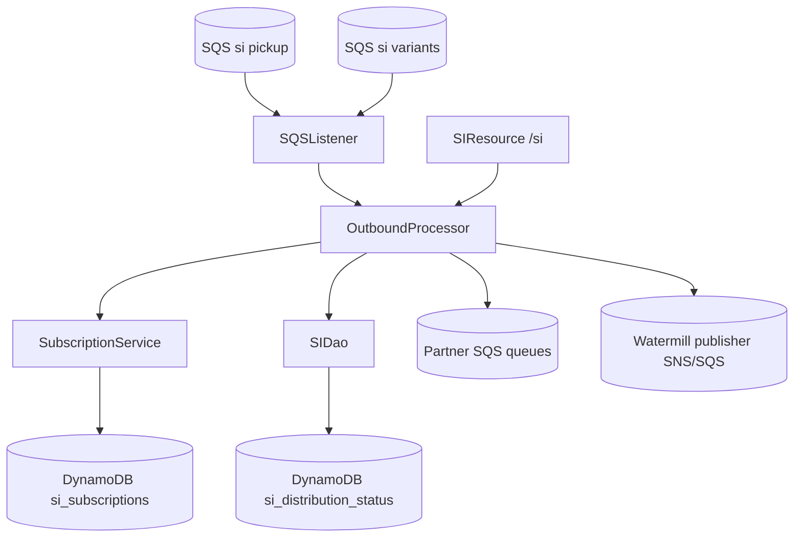
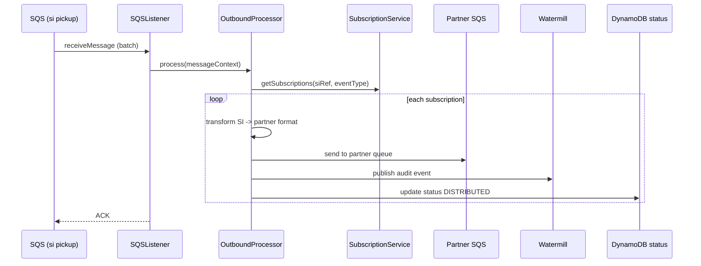

# Partner Integrator — pi-si-out-processor — Current-State Design

**Module:** `partner-integrator / pi-si-out-processor`
**Date:** 2026-06-30
**Status:** Current state (AWS SDK 1.x — upgrade NOT STARTED)
**Artifact:** `com.inttra.mercury:pi-si-out-processor:1.0` (Dropwizard, shaded JAR)
**Main class:** `com.inttra.mercury.sifeed.outprocessor.SIPIOBApplication`

---

## 1. Business Purpose & Rules

Outbound processor for **Shipping Instructions**. Consumes SI messages from SQS, queries partner subscriptions, and
routes/transforms SI to partner-specific output channels (EDIFACT, custom XML, REST webhook), tracking delivery
status in DynamoDB and auditing via Watermill.

### Flow / rules
1. Poll SQS queues (`sqsPickupConfig`, `sqsDestinationConfig`).
2. For each SI/event, query active subscriptions (partner, event type, commodity filter).
3. Transform to partner format; route to the partner SQS queue (or webhook).
4. Publish a Watermill audit event; update DynamoDB distribution status.
5. Validate: subscription active, event type matches filter, mandatory partner fields present, commodity allowed.

---

## 2. Design & Component Diagram

### Key classes

| Class | Role |
|-------|------|
| `SIPIOBApplication` | Dropwizard `main`. |
| `SIFeedApplicationInjector` | Guice: binds `AmazonSQS` (pickup + sender), `AmazonDynamoDB`, `SubscriptionService`. |
| `OutboundProcessor` | Query subscriptions → filter → transform → publish to partner queues. |
| `SubscriptionService` | Query subscriptions from DynamoDB; filter. |
| `SIDao` | DynamoDB SI versions + distribution status. |
| `SIResource` (`/si`) | `GET /si/{ref}`, `POST /si/{ref}/distribute`, `GET /si/{ref}/status`. |
| `CreateTables` / `DeleteTables` | Bootstrap commands for subscription/status tables. |

---

## 3. Data Flow — SI distribution

---

## 4. Data Stores & Integrations

| Resource | Usage |
|----------|-------|
| SQS `sqsPickupConfig` / `sqsDestinationConfig` | Inbound SI to distribute. |
| SQS partner queues | Outbound SI to partners. |
| DynamoDB `si_subscriptions` | Subscription metadata. |
| DynamoDB `si_distribution_status` | Delivery audit. |
| Watermill (SNS/SQS) | Audit event publishing. |

---

## 5. Maven Dependencies

| Artifact | Version | Notes |
|----------|---------|-------|
| **`com.inttra.mercury:shipping-instruction`** | **`1.0.M`** | SI domain models (version pin). |
| `com.inttra.mercury:pi-commons` | `1.0` | Framework + AWS v1 clients. |
| `io.dropwizard:dropwizard-jdbi3` | `5.0.1` | (DB access where used). |

AWS SDK v1 (`AmazonSQS` x2, `AmazonDynamoDB`, `DynamoDBMapper`) via `pi-commons`.

---

## 6. Configuration & Deployment

### Configuration (`conf/<env>/config.yaml`)
`sqsPickupConfig{queueUrl, waitTimeSeconds, maxNumberOfMessages}`, `sqsDestinationConfig{...}`,
`dynamoDbConfig{tableName: si_subscriptions, region}`, `watermillPublisherConfig{queueUrl}`,
`s3WorkspaceConfig{bucket}`. Config class `SIFeedApplicationConfig`.

### Deployment
`mvn -pl pi-si-out-processor -am clean package` → `pi-si-out-processor-1.0.jar`;
`java -jar pi-si-out-processor-1.0.jar server conf/<env>/config.yaml`. Tables bootstrapped via `CreateTables`.

---

## 7. AWS Services & SDK 1.x Usage (CALL-OUT)

| AWS service | v1 classes | Where |
|-------------|-----------|-------|
| **SQS** | `AmazonSQS` (listener + sender) | `SIFeedApplicationInjector`, `OutboundProcessor` |
| **DynamoDB** | `AmazonDynamoDB`, `DynamoDBMapper` | `SIDao`, `SubscriptionService` |

---

## 8. AWS 2.x / cloud-sdk Upgrade Plan (High Level)

| Step | Action | Reference |
|------|--------|-----------|
| 1 | Consume upgraded `pi-commons`. | pi-commons |
| 2 | **SQS** (both pickup + sender) → cloud-sdk `MessagingClient`/`MessagingClientFactory`; bind two instances as today. | booking, network |
| 3 | **DynamoDB** (`SIDao`, `SubscriptionService`) → cloud-sdk `DatabaseRepository`; preserve `si_subscriptions` / `si_distribution_status` schemas. | network, registration |
| 4 | Confirm Watermill publisher path uses the upgraded messaging client. | watermill-publisher |
| 5 | **Tests** — DynamoDB-Local IT for subscription/status DAOs; mocked SQS unit tests at booking level; full JaCoCo coverage. | network/auth `*DaoIT` |

**Call-out:** Partner-bound message formats (EDIFACT/XML/webhook payloads) are external contracts — keep
byte-identical. Two separate SQS bindings (consumer vs producer) must both migrate.
