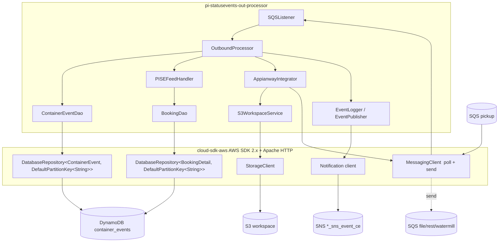
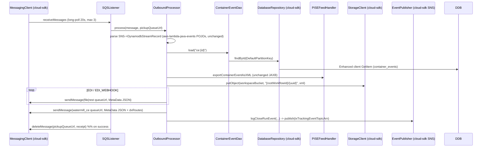

# Partner Integrator — pi-statusevents-out-processor — AWS SDK 2.x (cloud-sdk) Upgrade Design

**Module:** `partner-integrator / pi-statusevents-out-processor`
**Date:** 2026-06-30
**Status:** Target design (AWS 1.x → AWS 2.x via cloud-sdk) — **NOT STARTED** (gated on the `pi-commons` cloud-sdk upgrade)
**Companion:** `2026-06-30-partner-integrator-pi-statusevents-out-processor-current-state-DESIGN-claude.md`
**Reference upgrades:** `booking` (S3 + DynamoDB + SNS/SQS, complete), `visibility` (S3 + DynamoDB + SNS/SQS — also the owner of the `ContainerEvent` entity), `network`/`registration` (DynamoDB DAO patterns)

---

## 1. Change Overview

Remove the AWS SDK v1 (`com.amazonaws.*`) surface this module pulls **transitively through `pi-commons`** and replace
it with the in-house **cloud-sdk** (`cloud-sdk-api` + `cloud-sdk-aws`, AWS SDK 2.x Enhanced Client + Apache HTTP under
the hood). Five AWS services are in scope.

| AWS service | Current (v1, via pi-commons) | Target (cloud-sdk / v2) |
|-------------|-------------------------------|--------------------------|
| **DynamoDB (read)** | `DynamoDBMapper` + custom `DynamoDBMapperConfig` resolver (`ContainerEventDao.load`, `BookingDao` GSI query) | `DatabaseRepository<T,K>` via `DynamoRepositoryFactory.createEnhancedRepository(...)` + `DefaultQuerySpec` |
| **S3 (write)** | `AmazonS3` / `AmazonS3ClientBuilder` (direct, in `S3WorkspaceService`) | `StorageClient` + `StorageClientFactory.createDefaultS3Client()` |
| **SQS (poll)** | `AmazonSQS` (`amazonSQSForListener`), `SQSListenerClient`, `SQSListener` | cloud-sdk messaging client (`MessagingClient`/queue client — **verify exact name in booking/visibility**) |
| **SQS (send)** | `AmazonSQS` (`amazonSQSForSender`), `SQSClient` | cloud-sdk messaging client (send + delete) |
| **SNS (audit)** | `AmazonSNS` + `com.inttra.mercury.messaging.sns.SNSClient` behind `SNSEventPublisher`/`EventLogger` | cloud-sdk notification client behind the same `EventPublisher` contract |

**Out of scope / unchanged:**
- The **entity ORM annotations** — `ContainerEvent` and `BookingDetail` are *already* `@DynamoDbBean`/`@Table`
  cloud-sdk beans (owned by `visibility`/`booking`); **this module re-annotates nothing**. (This is the single biggest
  difference from the bill-of-lading upgrade, where the entity itself had to be re-annotated.)
- **Parameter Store** `${awsps:}` resolution (commons-handled). `Utils.ssmParameterlookup`'s direct v1 SSM call is a
  small, isolated port (or removable).
- **Appian-way / partner contracts** — the file/REST/Watermill delivery `MetaData` payloads are downstream contracts,
  not AWS clients.
- **Lambda event POJOs** — `aws-lambda-java-events` 3.13.0 (`DynamodbEvent.DynamodbStreamRecord`, `SNSEvent.SNS`,
  `models.dynamodb.AttributeValue`) stay on v1 event POJOs; they are pure deserialization classes used to parse the
  pickup message and have no v1 *client*. **Keep them** unless the upstream stream→SNS envelope shape changes.

**Backward-compatibility is mandatory.** The following must stay wire-identical:

- DynamoDB table names — the v1 resolver yields `{environment}_ContainerEvent` and `{environment}_booking_BookingDetail`
  (simple-name fallback, because the absent `@DynamoDBTable` annotation defeats the `@Table`-name path). The cloud-sdk
  repo must reproduce **these exact names**, including the `_booking_` infix and CVT's `inttra2_test` prefix.
- The `container_events` key schema (string hash key, the `ce:`-prefixed id passed to `load`) and `BookingDetail`'s
  `INTTRA_REFERENCE_NUMBER_INDEX` GSI key condition (`inttraReferenceNumber = :hashKeyValue`).
- S3 object key `{rootWorkflowId}/{UUID}` in the workspace bucket; bucket names per env.
- The **inbound pickup message** shape (SNS envelope → DynamoDB-stream record) and the **outbound** `MetaData` JSON
  emitted to the file-delivery, REST-delivery, and Watermill queues, including projection keys
  (`OUTBOUND_FORMAT_ID`, `CONTAINER_EVENT_ID`, `DX_ROUTES`, `DISTRIBUTOR_REST`, `EVENT_PROVIDER`, …).
- The `txTrackingEventTopicArn` SNS audit payload (`EventLogger.logCloseRunEvent` token map).
- **Decoupling rule:** the DynamoDB on-wire attribute formats are owned by the `visibility`/`booking` enhanced-client
  converters (e.g. `OffsetDateTimeTypeConverter`, `DateEpochSecondAttributeConverter` on `ContainerEvent`) and are
  *already correct*; do not introduce any local converter. The JSON shapes on the SQS/SNS wire (parsed by
  `Utils.newObjectMapper`, marshalled by `Json.toJsonString`) are independent of DynamoDB encodings and must not be
  altered by the client swap.

---

## 2. Maven Dependency Changes

Most of the v1 surface is **inside pi-commons**, so the dependency change here is small: align `pi-commons` (and the
`visibility`/`booking` pins) to their cloud-sdk lines and add the DynamoDB-Local IT framework. No `com.amazonaws`
client dependency is declared in this pom today, so there is nothing v1 to *remove* here except via the upgraded
transitive line.

```diff
  <dependencies>
    <dependency>
      <groupId>com.inttra.mercury</groupId>
      <artifactId>visibility</artifactId>
-     <version>1.4.M</version>
+     <version>${visibility.cloudsdk.version}</version>   <!-- cloud-sdk-released line; verify -->
    </dependency>
    <dependency>
      <groupId>com.inttra.mercury</groupId>
      <artifactId>booking</artifactId>
-     <version>2.1.8.M</version>
+     <version>${booking.cloudsdk.version}</version>      <!-- cloud-sdk-released line; verify -->
    </dependency>
    <dependency>
      <groupId>com.inttra.mercury</groupId>
      <artifactId>pi-commons</artifactId>
-     <version>1.0</version>
+     <version>${pi-commons.cloudsdk.version}</version>   <!-- the upgraded pi-commons that drops v1 clients -->
    </dependency>

+   <!-- cloud-sdk, in case any client is constructed locally rather than via upgraded pi-commons -->
+   <dependency>
+     <groupId>com.inttra.mercury</groupId>
+     <artifactId>cloud-sdk-api</artifactId>
+     <version>${mercury.commons.version}</version>
+   </dependency>
+   <dependency>
+     <groupId>com.inttra.mercury</groupId>
+     <artifactId>cloud-sdk-aws</artifactId>
+     <version>${mercury.commons.version}</version>
+   </dependency>

+   <!-- DynamoDB Local integration-test framework -->
+   <dependency>
+     <groupId>com.inttra.mercury</groupId>
+     <artifactId>dynamo-integration-test</artifactId>
+     <version>${mercury.commons.version}</version>
+     <scope>test</scope>
+   </dependency>
+   <!-- AWS SDK v1 DynamoDB kept ONLY for DynamoDB Local in tests (matches booking) -->
+   <dependency>
+     <groupId>com.amazonaws</groupId>
+     <artifactId>aws-java-sdk-dynamodb</artifactId>
+     <version>1.12.721</version>
+     <scope>test</scope>
+   </dependency>

    <!-- KEEP: Lambda event POJOs are still used to parse the pickup message -->
    <dependency>
      <groupId>com.amazonaws</groupId>
      <artifactId>aws-lambda-java-events</artifactId>
      <version>3.13.0</version>
    </dependency>
  </dependencies>
```

- After the upgraded `pi-commons` is consumed, **no `com.amazonaws` *client*** should remain on the prod classpath; the
  only retained `com.amazonaws` is `aws-lambda-java-events` (event POJOs) and the test-scoped DynamoDB-Local jar.
- cloud-sdk uses **Apache HTTP** (no Netty), matching the booking/visibility rebase.
- `// TODO verify` the exact released versions of `pi-commons`, `visibility`, and `booking` once the upstream
  migrations are tagged.

---

## 3. Configuration Changes (`conf/<env>/config.yaml`)

The `dynamoDbConfig` block keeps `environment`/`readCapacityUnits`/`writeCapacityUnits`/`sseEnabled` and gains the
cloud-sdk `BaseDynamoDbConfig` fields (`region`, optional local-emulator `regionEndpoint`/`signingRegion`). Queue urls,
bucket names, the SNS topic arn, and all prefixes — **including CVT's `inttra2_test`** — are untouched.

```diff
  dynamoDbConfig:
    environment: inttra2_qa            # CVT stays inttra2_test, INT inttra_int, PROD inttra2_prod
    readCapacityUnits: 25
    writeCapacityUnits: 25
    sseEnabled: false
+   region: us-east-1
+   # local Dynamo emulator only:
+   #regionEndpoint: http://localhost:8000
+   #signingRegion: us-west-2

  s3WorkspaceConfig:
    bucket: inttra2-qa-workspace       # unchanged (CVT inttra2-cv-workspace)
  sqsPickupConfig:        { queueUrl: ... }   # unchanged
  sqsDistributorConfig:   { queueUrl: ... }   # unchanged
  sqsRestDistributorConfig:{ queueUrl: ... }  # unchanged
  watermillPublisherConfig:{ queueUrl: ..., e2openEdiId: E2OPENSTD, formatId: 129 }  # unchanged
  txTrackingEventTopicArn: arn:aws:sns:us-east-1:...:inttra2_qa_sns_event_ce          # unchanged
```

**Config class change** — `SEFeedApplicationConfig.dynamoDbConfig` field type moves from
`com.inttra.mercury.dynamo.respository.module.DynamoDbConfig` to the cloud-sdk
`com.inttra.mercury.cloudsdk.database.config.BaseDynamoDbConfig` (keep `@Valid @NotNull`):

```diff
- import com.inttra.mercury.dynamo.respository.module.DynamoDbConfig;
+ import com.inttra.mercury.cloudsdk.database.config.BaseDynamoDbConfig;
  @Data
  @EqualsAndHashCode(callSuper = false)
  public class SEFeedApplicationConfig extends ApplicationConfiguration {
    ...
-   @Valid @NotNull private DynamoDbConfig dynamoDbConfig;
+   @Valid @NotNull private BaseDynamoDbConfig dynamoDbConfig;
  }
```

`SQSConfig`, `S3Config`, `WatermillPublisherConfig`, `usePassThrough`, `enableLoggingPayload`,
`txTrackingEventTopicArn` are unchanged.

---

## 4. Per-Service Spec

### 4.1 DynamoDB — `ContainerEventDao`, `BookingDao` (read-only)

The entities are already enhanced-client beans, so this is a **DAO + wiring** swap only.

**Before (v1):**
```java
// SEFeedApplicationInjector.configure()
AmazonDynamoDB client = DynamoSupport.newClient(config.getDynamoDbConfig());
DynamoDBMapperConfig mapperCfg = getNewDynamoDBMapperConfig(config.getDynamoDbConfig()); // custom resolver
DynamoDBMapper mapper = newMapper(client, config.getDynamoDbConfig(), mapperCfg);
bind(AmazonDynamoDB.class).toInstance(client);
bind(DynamoDBMapper.class).toInstance(mapper);
bind(DynamoDBMapperConfig.class).toInstance(mapperCfg);

// ContainerEventDao
public ContainerEvent load(String id) { return dynamoDBMapper.load(ContainerEvent.class, id); }

// BookingDao (GSI)
query(BookingDetail.INTTRA_REFERENCE_NUMBER_INDEX, inttraReferenceNumber, null,
      "inttraReferenceNumber = :hashKeyValue");
```

**After (cloud-sdk):** (mirrors `network`/`registration` DAOs + booking DynamoModule)
```java
// SEFeedDynamoModule (new)  — replaces the DynamoSupport/mapper bindings
@Provides @Singleton DynamoDbClientConfig provideCfg(SEFeedApplicationConfig c) {
    return c.getDynamoDbConfig().toClientConfigBuilder().consistentRead(false).build();
}
@Provides @Singleton ContainerEventDao provideCeDao(DynamoDbClientConfig cfg) {
    // table name MUST stay "{environment}_ContainerEvent" (simple-name fallback today)
    String table = cfg.getTablePrefix() + "ContainerEvent";
    DatabaseRepository<ContainerEvent, DefaultPartitionKey<String>> repo =
        DynamoRepositoryFactory.createEnhancedRepository(cfg, table, ContainerEvent.class,
            DynamoRepositoryConfig.builder().domainType(ContainerEvent.class).build());
    return new ContainerEventDao(repo);
}
@Provides @Singleton BookingDao provideBkDao(DynamoDbClientConfig cfg) {
    String table = cfg.getTablePrefix() + "booking_BookingDetail"; // KEEP the "_booking_" infix
    DatabaseRepository<BookingDetail, DefaultPartitionKey<String>> repo =
        DynamoRepositoryFactory.createEnhancedRepository(cfg, table, BookingDetail.class,
            DynamoRepositoryConfig.builder().domainType(BookingDetail.class).build());
    return new BookingDao(repo);
}

// ContainerEventDao
public ContainerEvent load(String id) {
    return repository.findById(new DefaultPartitionKey<>(id)).orElse(null);
}

// BookingDao (GSI via DefaultQuerySpec)
List<BookingDetail> rows = repository.query(DefaultQuerySpec.builder()
    .indexName(BookingDetail.INTTRA_REFERENCE_NUMBER_INDEX)
    .partitionKeyValue(CloudAttributeValue.ofString(inttraReferenceNumber))
    .consistentRead(false)
    .build());
```

- `ContainerEventDao`/`BookingDao` change from `extends DynamoDBCrudRepository<…>` to holding an injected
  `DatabaseRepository`. The carrier/customer version selection, `sortBookingDetails`, and the base-table re-query
  (`bookingId = :hk and sequenceNumber = :sk`) all migrate to `DefaultQuerySpec` with the same key conditions.
- **Critical:** reproduce the table names exactly. The current custom resolver does **not** use the entity's
  `@Table(name="container_events")`/`@Table(name="BookingDetail")` value — it falls back to the class simple name
  because it reads the now-absent v1 `@DynamoDBTable`. Confirm the live table names before wiring the prefix
  (`// TODO verify` against the running DynamoDB tables).

> **Gap call-out.** The v1 `DynamoSupport.newClient` honoured `regionEndpoint`/`signingRegion` for DynamoDB Local; map
> those onto `BaseDynamoDbConfig`'s emulator fields so the IT path keeps working.

### 4.2 S3 — `S3WorkspaceService` (pi-commons)

**Before (v1):** `bind(AmazonS3.class).toInstance(AmazonS3ClientBuilder.standard().build())`; `S3WorkspaceService`
calls `s3Client.putObject(bucket, fileName, content)` (String overload — the only path used by this module).

**After (cloud-sdk):** (booking `S3WorkspaceService` precedent)
```java
@Provides @Singleton StorageClient provideStorageClient() {
    return StorageClientFactory.createDefaultS3Client();
}
// S3WorkspaceService.putObject(bucket, fileName, content):
storageClient.putObject(bucket, fileName, content);
```

This is a pi-commons-owned change; the module only depends on `WorkspaceService.putObject(String,String,String)`, which
is unaffected at the call site (`AppianwayIntegrator.outbound`).

> **Gap call-out.** No `ClientConfiguration.withMaxErrorRetry(...)` is set today (the client is built with
> `.standard().build()`), so there is **no retry knob to preserve** — `createDefaultS3Client()` is a clean match. If
> per-client tuning is later needed, use `StorageClientFactory.createS3Client(AwsStorageConfig…)`.

### 4.3 SQS — poll (`SQSListenerClient`) and send (`SQSClient`)

Both are pi-commons classes wrapping the two `@Named` v1 `AmazonSQS` instances bound here.

**Before (v1):**
```java
bind(AmazonSQS.class).annotatedWith(Names.named("amazonSQSForListener"))
    .toInstance(AmazonSQSClientBuilder.standard().build());
bind(AmazonSQS.class).annotatedWith(Names.named("amazonSQSForSender"))
    .toInstance(AmazonSQSClientBuilder.standard().build());
// SQSListenerClient.receiveMessage(ReceiveMessageRequest) ; SQSClient.sendMessage(url, body) / deleteMessage(url, receipt)
```

**After (cloud-sdk):** the upgraded pi-commons binds a cloud-sdk messaging client (`MessagingClient` /
`MessagingClientFactory` — **verify exact type against booking/visibility**) for both poll and send; `SQSListener`,
`ListenerManager`, `AsyncDispatcher`, and `OutboundProcessor.process(Message, url)` keep their signatures (the
`Message` type becomes the cloud-sdk queue-message type). The `getSQSListener` provider continues to read
`sqsPickupConfig.getQueueUrl()/getWaitTimeSeconds()/getMaxNumberOfMessages()` unchanged.

```diff
- bind(AmazonSQS.class).annotatedWith(Names.named("amazonSQSForListener"))
-     .toInstance(AmazonSQSClientBuilder.standard().build());
- bind(AmazonSQS.class).annotatedWith(Names.named("amazonSQSForSender"))
-     .toInstance(AmazonSQSClientBuilder.standard().build());
+ // poll + send messaging clients now provided by upgraded pi-commons (cloud-sdk)
```

> **Gap call-out.** v1 long-poll knobs (`waitTimeSeconds`, `maxNumberOfMessages`) are passed explicitly into
> `SQSListener`; confirm the cloud-sdk receive call exposes equivalents (it does in booking) so the 20s/3-message
> behaviour is preserved.

### 4.4 SNS — tx-tracking audit

`EventLogger`/`SNSEventPublisher` (commons) publish to `txTrackingEventTopicArn`. Keep the `EventPublisher` provider
contract in `SEFeedApplicationInjector.createEventPublisher` and the `OutboundProcessor.logCloseRunEvent` call exactly;
only the underlying `SNSClient` swaps to the cloud-sdk notification client (commons-owned).

```diff
- bind(AmazonSNS.class).toInstance(AmazonSNSClientBuilder.standard().build());
+ // SNS client provided by upgraded commons (cloud-sdk notification client)
  @Provides @Singleton
  EventPublisher createEventPublisher(SEFeedApplicationConfig c, SNSClient snsClient) {
      return new SNSEventPublisher(c.getTxTrackingEventTopicArn(), snsClient); // unchanged
  }
```

### 4.5 SSM — `Utils.ssmParameterlookup`

The single direct v1 SSM usage. Port to the v2 `SsmClient` (`software.amazon.awssdk.services.ssm`) or, if the method is
not exercised at runtime (it is a static helper not called from the main flow), remove it in favour of `${awsps:}`.

---

## 5. Guice Wiring Changes (`SEFeedApplicationInjector`)

```diff
- import com.amazonaws.services.dynamodbv2.AmazonDynamoDB;
- import com.amazonaws.services.dynamodbv2.datamodeling.DynamoDBMapper;
- import com.amazonaws.services.dynamodbv2.datamodeling.DynamoDBMapperConfig;
- import com.amazonaws.services.dynamodbv2.datamodeling.DynamoDBTable;
- import com.amazonaws.services.s3.AmazonS3;  ...
- import com.amazonaws.services.sns.AmazonSNS; ...
- import com.amazonaws.services.sqs.AmazonSQS; ...

  public void configure() {
    bind(Clock.class).toInstance(Clock.systemUTC());
-   bind(AmazonSQS.class).annotatedWith(Names.named("amazonSQSForListener")).toInstance(AmazonSQSClientBuilder.standard().build());
-   bind(AmazonSQS.class).annotatedWith(Names.named("amazonSQSForSender")).toInstance(AmazonSQSClientBuilder.standard().build());
-   bind(AmazonS3.class).toInstance(AmazonS3ClientBuilder.standard().build());
-   bind(AmazonSNS.class).toInstance(AmazonSNSClientBuilder.standard().build());
    bind(AuthClient.class).asEagerSingleton();
    bind(IntegrationProfileFormatService.class).to(IntegrationProfileFormatServiceImpl.class);
    bind(IntegrationProfileService.class).to(IntegrationProfileServiceImpl.class);
    // service-definition + dispatcher bindings unchanged
    bind(WorkspaceService.class).to(S3WorkspaceService.class);   // S3WorkspaceService now cloud-sdk-backed
-   AmazonDynamoDB client = DynamoSupport.newClient(config.getDynamoDbConfig());
-   bind(AmazonDynamoDB.class).toInstance(client);
-   DynamoDBMapperConfig cfg = getNewDynamoDBMapperConfig(config.getDynamoDbConfig());
-   bind(DynamoDBMapperConfig.class).toInstance(cfg);
-   bind(DynamoDBMapper.class).toInstance(newMapper(client, config.getDynamoDbConfig(), cfg));
+   install(new SEFeedDynamoModule());   // provides ContainerEventDao + BookingDao on DatabaseRepository
  }
- public DynamoDBMapperConfig getNewDynamoDBMapperConfig(DynamoDbConfig c) { ... } // DELETE (table-name prefixing moves into SEFeedDynamoModule)
```

The `getSQSListener` and `listenerManager` providers stay; the messaging/storage/notification clients are now provided
by upgraded pi-commons rather than bound to v1 instances here.

---

## 6. Target Component Diagram



## 7. Target Data Flow — CSE distribution (after)



---

## 8. Key Classes Changed

| Class | Change |
|-------|--------|
| `pom.xml` | bump `pi-commons` to cloud-sdk line; align `visibility`/`booking` pins to cloud-sdk releases; add `cloud-sdk-api` + `cloud-sdk-aws` (if any client built locally); add `dynamo-integration-test` + test-scoped `aws-java-sdk-dynamodb`; **keep** `aws-lambda-java-events`. |
| `SEFeedApplicationConfig` | `dynamoDbConfig` type `DynamoDbConfig` → `BaseDynamoDbConfig`. |
| `SEFeedApplicationInjector` | drop the two `AmazonSQS`, `AmazonS3`, `AmazonSNS`, `AmazonDynamoDB`, `DynamoDBMapper`, `DynamoDBMapperConfig` bindings; `install(SEFeedDynamoModule)`; delete `getNewDynamoDBMapperConfig`. |
| `SEFeedDynamoModule` (**new**) | provides `DynamoDbClientConfig`, `ContainerEventDao`, `BookingDao` on `DatabaseRepository`; owns table-name prefixing (incl. `_booking_` infix). |
| `ContainerEventDao` | `extends DynamoDBCrudRepository` → injected `DatabaseRepository`; `load` → `findById`. |
| `BookingDao` | `extends DynamoDBCrudRepository` → injected `DatabaseRepository`; `query(index,…)` / base-table `query(hk,sk,…)` → `DefaultQuerySpec`; carrier/customer-version logic unchanged. |
| `OutboundProcessor` / `AppianwayIntegrator` / `DXRouteService` | no business-logic change; the injected `SQSClient`/`SQSListenerClient`/`WorkspaceService` are now cloud-sdk-backed (signatures preserved). |
| `Utils.ssmParameterlookup` | port to v2 `SsmClient` or remove. |
| `ContainerEvent`, `BookingDetail` | **No change** — already `@DynamoDbBean`/`@Table` cloud-sdk beans (owned upstream). |

---

## 9. Testing Strategy

- **DynamoDB-Local IT** (`dynamo-integration-test` `BaseDynamoDbIT`, `@Tag("integration")`):
  - `ContainerEventDao.load` round-trip against a `inttra2_test_ContainerEvent`-named local table (assert the
    `ce:`-prefixed id resolves and `enrichedProperties`/`containerEventSubmission` converters deserialize identically
    to the v1 mapper path).
  - `BookingDao.findBookingByInttraReference` against `INTTRA_REFERENCE_NUMBER_INDEX` (carrier `CONFIRM` + customer
    `REQUEST`/`AMEND` selection, the `sequenceNumber.split("_")[1]` sort, the base-table re-query).
  - **Table-name fidelity test** — assert the migrated module targets exactly `{env}_ContainerEvent` and
    `{env}_booking_BookingDetail` (regression guard for the resolver-fallback behaviour).
- **Messaging unit tests** — mock the cloud-sdk messaging client; assert `AppianwayIntegrator` sends EDI →
  file-delivery url, EDI_WEBHOOK → rest-delivery url (with `DISTRIBUTOR_REST="true"`), Watermill publish payload (with
  `DX_ROUTES`, `OUTBOUND_FORMAT_ID=129`, `EVENT_PROVIDER`), and the `processWatermillAlone`/`disableWatermillProcessing`
  gates. Reuse the existing `AppianwayIntegratorTest`/`OutboundProcessorTest`/`DXRouteServiceTest` after mock types
  change.
- **Storage unit test** — assert `S3WorkspaceService.putObject` is called with `{rootWorkflowId}/{uuid}` key.
- **SNS/EventLogger** — assert `logCloseRunEvent` token map (booking number, equipment id, event code, subscriptions,
  file name) is unchanged.
- **Message-shape tests** — feed the existing `container_event.json` / `dynamo_lambda*.json` fixtures through
  `OutboundProcessor.getProcessRequest` (SNS→stream MODIFY path + reprocess fallback) and assert identical parsing.
- Certify **full local JaCoCo coverage** on all changed code (note Sonar excludes `**/model/**`, `**/*Config.*`,
  `**/*Application.*`, so DAO + processor + integrator carry the weight):
  ```
  mvn -f partner-integrator/pi-statusevents-out-processor/pom.xml clean verify
  ```

---

## 10. Risks & Call-outs

- **Gated on pi-commons.** The entire v1 *client* surface lives in pi-commons (`SQSClient`, `SQSListenerClient`,
  `S3WorkspaceService`, `DynamoSupport`, the commons `SNSClient`). This module cannot migrate independently; sequence it
  *after* the pi-commons cloud-sdk release.
- **Table-name resolver trap (largest correctness risk).** The current custom `withTableNameResolver` reads the v1
  `@DynamoDBTable`, which the migrated entities no longer carry, so the effective tables are the **simple-name**
  fallbacks `{env}_ContainerEvent` and `{env}_booking_BookingDetail` — *not* `{env}_container_events` /
  `{env}_BookingDetail`. The cloud-sdk repo wiring must reproduce these exact, slightly counter-intuitive names.
  `// TODO verify` against live tables before cutover.
- **Entities already migrated — do not re-annotate.** Unlike bill-of-lading, `ContainerEvent`/`BookingDetail` are
  already `@DynamoDbBean` beans; touching them risks diverging from the `visibility`/`booking` owners. Reads must round-
  trip against items written by those owners.
- **Wire-shape compatibility** — the inbound SNS→stream envelope (parsed via `aws-lambda-java-events`), the
  file/REST/Watermill `MetaData` JSON, and the `txTrackingEventTopicArn` audit payload are all consumed downstream and
  must stay byte-identical. Keep `aws-lambda-java-events` on the classpath for the parse path.
- **`enableLoggingPayload`** must remain `false` in prod, `true` in int/qa/cvt after the config-type change.
- **CVT prefix trap** — DynamoDB prefix `inttra2_test`, workspace bucket `inttra2-cv-workspace`, queues `inttra2_cv_*`
  (not `inttra2_cvt_*`). Carry these exact strings through the `BaseDynamoDbConfig` migration.
- **GPS `CI` suppression** and the **MODIFY-only** gate are behavioural invariants that the message-parse refactor must
  preserve (regression-test both).
- **Sequencing** — incremental, test-verified commits; one outgoing commit per the team workflow; every commit message
  must carry the Jira ticket prefix (e.g. `ION-xxxxx …`).
