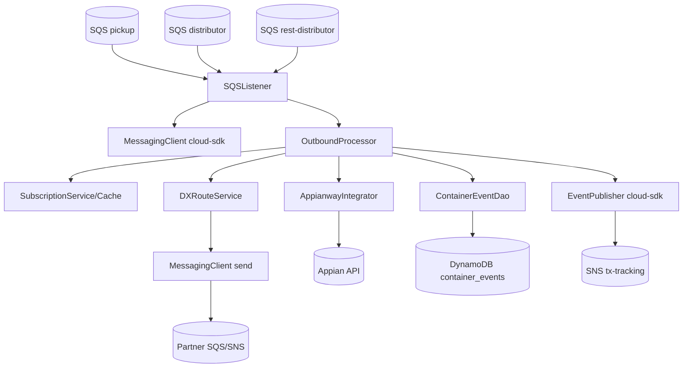
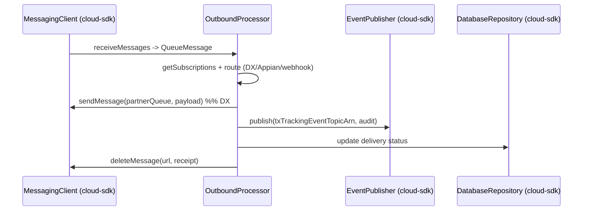

# Partner Integrator — pi-statusevents-out-processor — AWS SDK 2.x (cloud-sdk) Upgrade Design

**Module:** `partner-integrator / pi-statusevents-out-processor`
**Date:** 2026-06-30
**Status:** Target design — NOT STARTED (depends on `pi-commons` upgrade)
**Companion:** `2026-06-30-partner-integrator-pi-statusevents-out-processor-current-state-DESIGN-copilot.md`
**Playbook:** `partner-integrator/docs/2026-06-30-partner-integrator-aws2x-DESIGN-copilot.md`

---

## 1. Change Overview

Status-events outbound processor. AWS scope: **SQS** (three inbound + a sender), **SNS** (tx-tracking audit),
**DynamoDB** (`container_events`). Plus `booking`/`visibility` version pins to reconcile. Appian REST + partner
webhooks are non-AWS.

| AWS service | Current (v1) | Target |
|-------------|--------------|--------|
| **SQS** | `AmazonSQS` (3 inbound + sender) | `MessagingClient<String>` |
| **SNS** | `AmazonSNS` (tx-tracking) | `EventPublisher` |
| **DynamoDB** | `DynamoDBMapper` (`ContainerEventDao`/`BookingDao`) | `DatabaseRepository<T,K>` |

---

## 2. Maven Dependency Changes

```diff
- <dependency><groupId>com.inttra.mercury</groupId><artifactId>visibility</artifactId><version>1.4.M</version></dependency>
- <dependency><groupId>com.inttra.mercury</groupId><artifactId>booking</artifactId><version>2.1.8.M</version></dependency>
+ <dependency><groupId>com.inttra.mercury</groupId><artifactId>visibility</artifactId><version>{cloud-sdk-upgraded}</version></dependency>
+ <dependency><groupId>com.inttra.mercury</groupId><artifactId>booking</artifactId><version>{cloud-sdk-upgraded}</version></dependency>
  <dependency><groupId>com.inttra.mercury</groupId><artifactId>pi-commons</artifactId><version>1.0</version></dependency>
+ <dependency><groupId>com.inttra.mercury</groupId><artifactId>dynamo-integration-test</artifactId><version>${mercury.commons.version}</version><scope>test</scope></dependency>
+ <dependency><groupId>com.amazonaws</groupId><artifactId>aws-java-sdk-dynamodb</artifactId><scope>test</scope></dependency>
```

> **Call-out:** `booking:2.1.8.M` is the same stale pin fixed in the visibility CI; align both `booking` and
> `visibility` to their cloud-sdk-upgraded versions.

## 3. Configuration Changes (`conf/<env>/config.yaml`)

```diff
  sqsPickupConfig: { queueUrl: ... }            # unchanged
  sqsDistributorConfig: { queueUrl: ... }       # unchanged
  sqsRestDistributorConfig: { queueUrl: ... }   # unchanged
  txTrackingEventTopicArn: arn:aws:sns:...       # unchanged
  dynamoDbConfig:
    tableName: container_events
    region: us-east-1
+   sseEnabled: false
```

## 4. Per-Service Spec

- **SQS:** all three inbound queues + the sender use `MessagingClient<String>` (`receiveMessages`/`deleteMessage`/
  `sendMessage`); `DXRouteService` dispatch via the same client.
- **SNS:** tx-tracking audit via `EventPublisher.publish(txTrackingEventTopicArn, payload)`.
- **DynamoDB:** `ContainerEventDao`/`BookingDao` use `DatabaseRepository`; `ContainerEvent` → enhanced annotations.
- Appian (`AppianwayIntegrator`) + partner webhooks unchanged.

## 5. Guice Wiring Changes

```diff
- SEFeedApplicationInjector: bind AmazonSQS (listener + sender) + AmazonSNS + AmazonDynamoDB
+ SEFeedApplicationInjector: MessagingClient<String> + EventPublisher + DatabaseRepository<...>
```

## 6. Target Component Diagram



## 7. Target Sequence — status distribution (after)



## 8. Key Classes Changed

| Class | Change |
|-------|--------|
| `pom.xml` | align `booking`/`visibility` pins; add test deps. |
| `SEFeedApplicationConfig` | `dynamoDbConfig` → `BaseDynamoDbConfig`. |
| `SEFeedApplicationInjector` | SQS×2 + SNS + DynamoDB v1 → `MessagingClient` + `EventPublisher` + `DatabaseRepository`. |
| `OutboundProcessor` / `DXRouteService` | consume + produce via `MessagingClient`; audit via `EventPublisher`. |
| `ContainerEventDao` / `BookingDao` | mapper → `DatabaseRepository`. |
| `ContainerEvent` | v1 ORM → enhanced annotations. |

## 9. Testing Strategy

- **DynamoDB-Local IT** for `ContainerEventDao`.
- **SQS/SNS** unit tests mocking `MessagingClient`/`EventPublisher`; routing unit tests (DX/Appian/webhook).
- Full local **JaCoCo** coverage on changed code.

## 10. Risks & Call-outs

- Appian REST + partner webhooks are non-AWS contracts — keep payloads unchanged.
- Reconcile `booking:2.1.8.M` / `visibility:1.4.M` with their completed upgrades.
- tx-tracking SNS audit payloads must stay wire-compatible; preserve `container_events` schema/keys.
