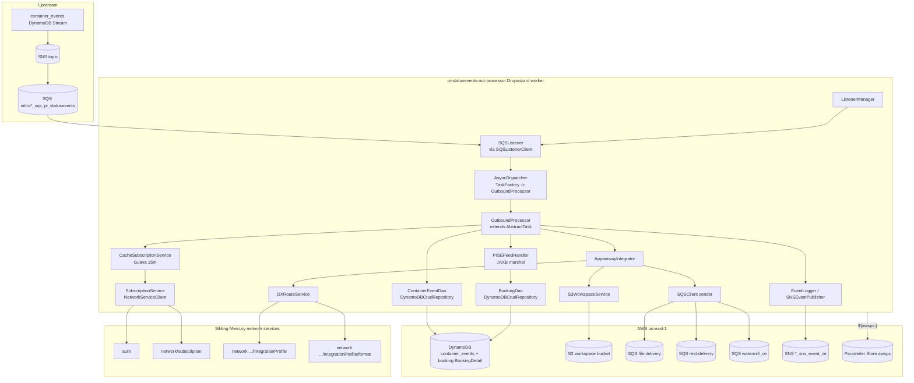
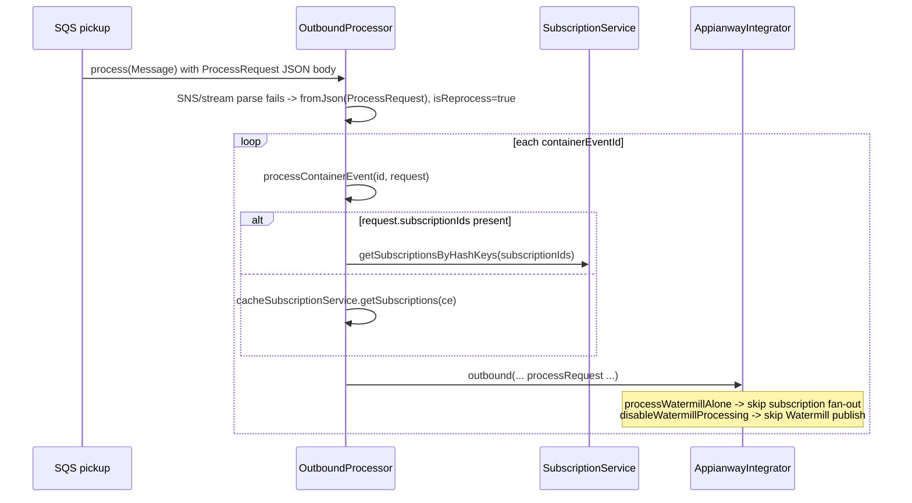

# Partner Integrator — pi-statusevents-out-processor — Current-State Design

**Module:** `partner-integrator / pi-statusevents-out-processor`
**Date:** 2026-06-30
**Status:** Current state — AWS SDK **1.x** (`com.amazonaws`) in production via **pi-commons**; cloud-sdk migration **NOT STARTED**
**Artifact:** `com.inttra.mercury:pi-statusevents-out-processor:1.0` (Dropwizard / `InttraServer`, single shaded JAR `pi-statusevents-out-processor-1.0.jar`)
**Main class:** `com.inttra.mercury.sefeed.outprocessor.StatusEventPIOBApplication`

---

## 1. Business Purpose & Rules

The `pi-statusevents-out-processor` is the **outbound distributor for container status events (CSE)**. It is *not* a
multi-channel router (DX vs Appian vs webhook) — it is a single SQS-driven worker that:

1. Picks up a **DynamoDB-stream-derived notification** from one SQS queue (`sqsPickupConfig`). The message is an SNS
   envelope (`SNSEvent.SNS`) wrapping a `DynamodbEvent.DynamodbStreamRecord` for the `container_events` table.
2. Loads the full `ContainerEvent` from **DynamoDB** by its `ce:`-prefixed id (`ContainerEventDao.load`).
3. Marshals the event into the **PI Status-Event export XML** (`PISEFeedHandler.exportContainerEventAsXML`, JAXB, an
   `ExportSEPartInt` document).
4. Writes that XML to an **S3 workspace** bucket (`S3WorkspaceService.putObject`) keyed `{rootWorkflowId}/{uuid}`.
5. Resolves the **partner subscriptions** that match the event (network `subscription` service + a 15-minute Guava
   cache + a condition evaluator) and, for each EDI / EDI_WEBHOOK action, emits a delivery `MetaData` message to either
   the **file-delivery SQS** (`sqsDistributorConfig`) or the **REST-delivery SQS** (`sqsRestDistributorConfig`).
6. Always (unless suppressed) emits a **Watermill** publish `MetaData` message to `watermillPublisherConfig.queueUrl`,
   enriched with E2open DX routes resolved from the integration-profile/format network services.
7. Closes a **workflow tracking event** through `EventLogger.logCloseRunEvent` (the `EventPublisher` is an
   `SNSEventPublisher` over `txTrackingEventTopicArn`).

> The "outbound" here means *fan-out of one CSE to the file/REST/Watermill delivery queues*; the actual transport to
> partners is performed by the downstream distributor and Watermill services, not by this module.

### Key business rules (from source)

| Rule | Detail (source) |
|------|------|
| Trigger = MODIFY only | `OutboundProcessor.getProcessRequest`: only `OperationType.MODIFY` stream records are processed; INSERT/REMOVE are logged and ignored. Requires the `id` key on the stream record (else `RuntimeException("id key not found.")`). |
| Reprocess fallback | If the body is not a valid SNS→Dynamo-stream envelope, it is re-parsed as a `ProcessRequest` (`isReprocess=true`); then each `containerEventIds[]` entry is processed. |
| Id prefix gate | `processContainerEvent` only acts when `keyId.startsWith("ce:")` (`AWS_CONTAINER_EVENT_KEY`); otherwise the run is tokenised `Ignored=true`. |
| Enriched required | XML is produced only if `containerEvent != null && getEnrichedProperties() != null`. |
| GPS events suppressed | If `containerEventSubmission.getEventTypeCode()` equals `"CI"` (`GPS_EVENT_CODE`), outbound is skipped and the run is tokenised `Ignored=true` (Watermill + subscription fan-out are not invoked). |
| Subscription source | Normal path: `cacheSubscriptionService.getSubscriptions(containerEvent)`. Reprocess with explicit `subscriptionIds`: `subscriptionService.getSubscriptionsByHashKeys(...)`. |
| Subscription cache | `CacheSubscriptionService`: Guava `LoadingCache`, key fixed `-100`, `expireAfterWrite=15min`, `maximumSize=1000`; loader calls `subscriptionService.getSubscriptionList(inttraCompanyId)` against `network/subscription/container-event`. |
| Subscription filter | `SubscriptionHelper.filterSubscriptions`: builds a values map of EVENT_CODE, TRANSACTION_PARTY (recipient + 4F company ids), TRANSACTION_PARTY_WO_4F, then `ConditionEvaluator.evaluateConditions(..., AND, valuesMap)`. |
| Action routing | `AppianwayIntegrator.processSubscriptions`: only `ActionType.EDI` and `ActionType.EDI_WEBHOOK` actions are dispatched. `EDI` → `sqsDistributorConfig`; `EDI_WEBHOOK` → `sqsRestDistributorConfig` (and sets `Projection.DISTRIBUTOR_REST="true"`). `refId` must be numeric to be collected as an IPF id. |
| Watermill gate | Skipped when `processRequest.isDisableWatermillProcessing()`. Subscription fan-out skipped when `processRequest.isProcessWatermillAlone()`. |
| DX route derivation | `DXRouteService.findDXRoutes`: looks up the active E2open integration profile (`e2openEdiId=E2OPENSTD`) and its active formats; for each `fileNamePattern` attribute, splits on `_` and takes `tokens[1]` as the DX route. |
| Payload logging | XML payload added to tracking tokens only when `enableLoggingPayload=true` (true in int/qa/cvt, **false in prod**). |
| Booking enrichment | `PISEFeedHandler.getFirstMatchedBooking`: when the first matched booking carries no parties, `BookingDao.findBookingByInttraReference` re-reads `BookingDetail` (carrier + customer versions) from DynamoDB. |
| Marshalling | JAXB `ExportSEPartInt`, formatted output, `JAXB_ENCODING="ISO-8859-1"`, context from `CJAXBContextFactory.getPartnerIntJAXBContext()`. Schema version `CVisibilityConstants.STR_VISIBILITY_SCHEMA_VERSION`. Inttra sender id `"1000"`. |
| Allowed references | Only `CarrierBookingReference` (re-typed to `BookingNumber`) and `BillOfLadingNumber`, capped at 10; shipment id + freight-forwarder ref appended from the matched booking. |

---

## 2. Design & Component Diagram

A headless Dropwizard worker bootstrapped through the shared `InttraServer<SEFeedApplicationConfig>` builder. There are
**no JAX-RS resources** — the entry point is a `postSetupHook` that starts a `ListenerManager` (pi-commons) which runs a
single `SQSListener` polling `sqsPickupConfig`. Each received message is dispatched to a fresh `OutboundProcessor` task
through an `AsyncDispatcher` (pool size = `maxNumberOfMessages`).



### Key classes & interactions

| Layer | Class | Responsibility |
|-------|-------|----------------|
| Bootstrap | `StatusEventPIOBApplication` | Builds `InttraServer`; `postSetupHook` resolves `ListenerManager`, registers it with the Dropwizard lifecycle and `start()`s it. **No resources registered.** |
| Wiring | `SEFeedApplicationInjector` (Guice `AbstractModule`) | Binds two **v1** `AmazonSQS` instances (`amazonSQSForListener`/`amazonSQSForSender`), one **v1** `AmazonS3`, one **v1** `AmazonSNS`; builds the **v1** `AmazonDynamoDB` + `DynamoDBMapper` + `DynamoDBMapperConfig` (custom table-name resolver); binds `SQSListener`, `AsyncDispatcher`, `WorkspaceService→S3WorkspaceService`, the network services, and the `SNSEventPublisher` over `txTrackingEventTopicArn`. |
| Config | `SEFeedApplicationConfig extends ApplicationConfiguration` | `sqsPickupConfig`, `sqsDistributorConfig`, `sqsRestDistributorConfig` (`SQSConfig`), `s3WorkspaceConfig` (`S3Config`), `watermillPublisherConfig`, `dynamoDbConfig` (`com.inttra.mercury.dynamo.respository.module.DynamoDbConfig`), `txTrackingEventTopicArn`, `usePassThrough`, `enableLoggingPayload`. |
| Listener | `SQSListener` + `SQSListenerClient` + `ListenerManager` (pi-commons) | Long-poll `sqsPickupConfig` (`waitTimeSeconds=20`, `maxNumberOfMessages=3`); hand each `com.amazonaws.services.sqs.model.Message` to the dispatcher. |
| Task | `OutboundProcessor extends AbstractTask` | The core flow (§1). Parses SNS→Dynamo-stream → loads CE → marshals XML → S3 → subscription fan-out → Watermill → close tracking event. |
| Handler | `PISEFeedHandler` | Pure transformation: `ContainerEvent` (+ optional `Booking`) → `ExportSEPartInt` JAXB → ISO-8859-1 XML string. ~30 private builders for parties, references, locations, dates, equipment, transport. |
| Persistence | `ContainerEventDao extends DynamoDBCrudRepository<ContainerEvent, DynamoHashAndSortKey<String,String>>` | `load(id)` = `dynamoDBMapper.load(ContainerEvent.class, id)`. |
| Persistence | `BookingDao extends DynamoDBCrudRepository<BookingDetail, DynamoHashAndSortKey<String,String>>` | `findBookingByInttraReference` → GSI query on `INTTRA_REFERENCE_NUMBER_INDEX`, picks last CONFIRM (carrier) + last REQUEST/AMEND (customer) versions. |
| Subscriptions | `SubscriptionService` | JAX-RS `NetworkServiceClient` GETs `network/subscription/container-event[/{companyId}]` and `/subscription/{hashKey}`. |
| Subscriptions | `CacheSubscriptionService` | Guava `LoadingCache` (15 min / 1000); delegates to `SubscriptionService` + `SubscriptionHelper.filterSubscriptions`. |
| Subscriptions | `SubscriptionHelper` | Static filter via `ConditionEvaluator` over EVENT_CODE / TRANSACTION_PARTY(_WO_4F) values. |
| Outbound | `AppianwayIntegrator` | S3 write, per-subscription EDI/EDI_WEBHOOK dispatch to file/REST SQS, Watermill publish; builds appianway `MetaData` projection maps. |
| Outbound | `DXRouteService` | Resolves active E2open IPF/formats; turns `fileNamePattern` attributes into DX route tokens. |
| Model | `ProcessRequest` | Reprocess request DTO (`containerEventIds`, `subscriptionIds`, `processWatermillAlone`, `disableWatermillProcessing`). |
| Support | `Utils` | `newObjectMapper` (case-insensitive, Joda + Long-date deserializer), `fromJson`, and an **SSM** lookup (`AWSSimpleSystemsManagementClientBuilder`). |

---

## 3. Data Flow

### 3.1 Normal CSE distribution (stream-triggered)

```mermaid
sequenceDiagram
  participant Q as SQS pickup (inttra*_sqs_pi_statusevents)
  participant SL as SQSListener
  participant OP as OutboundProcessor
  participant CED as ContainerEventDao
  participant DDB as DynamoDB container_events
  participant FH as PISEFeedHandler
  participant WS as S3WorkspaceService
  participant S3 as S3 workspace bucket
  participant CSS as CacheSubscriptionService
  participant AW as AppianwayIntegrator
  participant SQSC as SQSClient (sender)
  participant EL as EventLogger (SNS)

  Q->>SL: receiveMessage (batch up to 3)
  SL->>OP: process(Message, pickupQueueUrl)
  OP->>OP: SNSEvent.SNS -> DynamodbStreamRecord; assert MODIFY + key "id"
  OP->>CED: load("ce:{id}")
  CED->>DDB: DynamoDBMapper.load(ContainerEvent.class, id)
  DDB-->>CED: ContainerEvent
  alt enrichedProperties != null AND eventTypeCode != "CI"
    OP->>FH: exportContainerEventAsXML(containerEvent)
    FH->>FH: build ExportSEPartInt, JAXB marshal (ISO-8859-1)
    FH-->>OP: XML payload
    OP->>CSS: getSubscriptions(containerEvent)
    CSS-->>OP: List<Subscription> (filtered)
    OP->>AW: outbound(payload, subs, keyId, metaData, tokens, req, ce)
    AW->>WS: putObject(workspaceBucket, "{rootWorkflowId}/{uuid}", payload)
    WS->>S3: AmazonS3.putObject
    loop each EDI / EDI_WEBHOOK action
      AW->>SQSC: sendMessage(file|rest queueUrl, MetaData JSON)
    end
    AW->>SQSC: sendMessage(watermill_ce queueUrl, MetaData JSON + dxRoutes)
  else CI / no enrichment
    OP->>OP: tokens.Ignored = true
  end
  OP->>EL: logCloseRunEvent(...) -> SNS *_sns_event_ce
```

> Message acknowledgement (SQS delete) is handled by the pi-commons `AbstractTask`/dispatcher framework around
> `OutboundProcessor.process`; a thrown `RuntimeException` (e.g. CE load/marshal failure) propagates so the message is
> retried/dead-lettered by SQS rather than deleted.

### 3.2 Reprocess path (manual replay)



### 3.3 Booking enrichment sub-flow (`PISEFeedHandler`)

```mermaid
sequenceDiagram
  participant FH as PISEFeedHandler
  participant BKD as BookingDao
  participant DDB as DynamoDB (BookingDetail GSI)

  FH->>FH: getFirstMatchedBooking(containerEvent)
  alt first matched booking has no parties
    FH->>BKD: findBookingByInttraReference(bookingNumber)
    BKD->>DDB: query INTTRA_REFERENCE_NUMBER_INDEX (inttraReferenceNumber = :hk)
    DDB-->>BKD: BookingDetail rows
    BKD->>BKD: pick last CONFIRM (carrier) + last REQUEST/AMEND (customer); re-query base table by bookingId+sequenceNumber
    BKD-->>FH: Optional<Booking>
  end
  FH->>FH: parties-with-access, references (FF ref + shipmentId), matched transactions
```

---

## 4. Data Stores & Integrations

### DynamoDB

The module **reads** two entities; it does not write to DynamoDB. Both entities are owned by upstream modules and are
**already on the cloud-sdk enhanced-client annotations**, yet this module accesses them through the **v1**
`DynamoDBMapper` (see §7 — this is the central migration hazard).

| Entity (owner) | Annotation (in the jar) | Access here | Notes |
|---|---|---|---|
| `ContainerEvent` (`visibility:1.4.M`, `com.inttra.mercury.visibility.common.model.containerEvent`) | `@DynamoDbBean` + `@Table(name="container_events")` (cloud-sdk), key field `hashKey`, `@TTL expiresOn`, GSIs `bookingNumber-index`, `equipmentIdentifier-index`, `siInttraReferenceNumber-index`, `blNumber-index`, `bkInttraReferenceNumber-equipmentIdentifier-index` | `ContainerEventDao.load(id)` via **v1** `DynamoDBMapper.load` | Hash key the loader passes is the `ce:`-prefixed string id. |
| `BookingDetail` (`booking:2.1.8.M`, `com.inttra.mercury.booking.model`) | `@DynamoDbBean` + `@Table(name="BookingDetail")` (cloud-sdk), GSI `INTTRA_REFERENCE_NUMBER_INDEX` | `BookingDao` via **v1** `DynamoDBMapper` + `DynamoDBCrudRepository.query(...)` | Used only for enrichment fallback. |

**Table-name resolution** is done by a custom resolver in `SEFeedApplicationInjector.getNewDynamoDBMapperConfig`:
`"{environment}_{@DynamoDBTable.tableName | simpleName}"`, **except** `BookingDetail`, which uses
`"{environment}_booking_{...}"`. Note the resolver reads the **v1** `@DynamoDBTable` annotation, which these entities no
longer carry — so it falls back to `getSimpleName()` (`ContainerEvent`, `BookingDetail`), not the `@Table` value.

| Env | `dynamoDbConfig.environment` | Effective CE table (resolver) | Effective Booking table |
|-----|------------------------------|-------------------------------|--------------------------|
| INT | `inttra_int` | `inttra_int_ContainerEvent` | `inttra_int_booking_BookingDetail` |
| QA | `inttra2_qa` | `inttra2_qa_ContainerEvent` | `inttra2_qa_booking_BookingDetail` |
| **CVT** | **`inttra2_test`** | `inttra2_test_ContainerEvent` | `inttra2_test_booking_BookingDetail` |
| PROD | `inttra2_prod` | `inttra2_prod_ContainerEvent` | `inttra2_prod_booking_BookingDetail` |

- Capacities: `readCapacityUnits: 25`, `writeCapacityUnits: 25`, `sseEnabled: false` in every env. There is **no
  `DynamoDBCommand`/table bootstrap** in this module — tables are owned/created upstream (visibility, booking).
- `// TODO verify` the exact effective table name against the live tables: the resolver's reliance on the now-absent
  `@DynamoDBTable` annotation means simple-name fallback is in play, which should be confirmed before migration.

### S3 — workspace bucket

`AppianwayIntegrator.outbound` writes the marshalled XML once, via `S3WorkspaceService.putObject(bucket, key, content)`
(string overload). Key = `{rootWorkflowId}/{UUID}`. Bucket name from `s3WorkspaceConfig.bucket`. No reads.

| Env | `s3WorkspaceConfig.bucket` |
|-----|-----------------------------|
| INT | `inttra-int-workspace` |
| QA | `inttra2-qa-workspace` |
| CVT | `inttra2-cv-workspace` |
| PROD | `inttra2-pr-workspace` |

### SQS

| Config key | Direction | INT | QA | CVT | PROD |
|---|---|---|---|---|---|
| `sqsPickupConfig` | **inbound** (poll) | `inttra_int_sqs_pi_statusevents` | `inttra2_qa_sqs_pi_statusevents` | `inttra2_cv_sqs_pi_statusevents` | `inttra2_pr_sqs_pi_statusevents` |
| `sqsDistributorConfig` | **outbound** (EDI file delivery) | `inttra_int_sqs_file_delivery` | `inttra2_qa_sqs_file_delivery` | `inttra2_cv_sqs_file_delivery` | `inttra2_pr_sqs_file_delivery` |
| `sqsRestDistributorConfig` | **outbound** (EDI_WEBHOOK / REST delivery) | `inttra_int_sqs_rest_delivery` | `inttra2_qa_sqs_rest_delivery` | `inttra2_cv_sqs_rest_delivery` | `inttra2_pr_sqs_rest_delivery` |
| `watermillPublisherConfig.queueUrl` | **outbound** (Watermill CE) | `inttra_int_sqs_watermill_ce` | `inttra2_qa_sqs_watermill_ce` | `inttra2_cv_sqs_watermill_ce` | `inttra2_pr_sqs_watermill_ce` |

All queues are `https://sqs.us-east-1.amazonaws.com/{acct}/...`; account `081020446316` (INT) and `642960533737`
(QA/CVT/PROD). Pickup poll: `waitTimeSeconds=20`, `maxNumberOfMessages=3`. **The pickup config carries `queueUrl` only —
`getWaitTimeSeconds()`/`getMaxNumberOfMessages()` come from `SQSConfig` defaults unless overridden; only pickup sets
them explicitly.**

> `sqsDistributorConfig` and `sqsRestDistributorConfig` are **send-only** targets here, *not* additional inbound poll
> sources. The module polls exactly one queue (`sqsPickupConfig`).

### SNS

- `txTrackingEventTopicArn` — workflow/tracking audit topic, published via `SNSEventPublisher`/`EventLogger`
  (`logCloseRunEvent`). Per env: `arn:aws:sns:us-east-1:{acct}:inttra_int_sns_event_ce`,
  `inttra2_qa_sns_event_ce`, `inttra2_cv_sns_event_ce`, `inttra2_pr_sns_event_ce`.
- The **inbound** SNS topic that fans the `container_events` DynamoDB stream into the pickup SQS is upstream (the
  parent-doc "dual-publish SNS" behaviour); this module only sees the resulting SQS message and never instantiates an
  inbound SNS client.

### Watermill

A logical SQS contract (`watermill_ce` queue above). `watermillPublisherConfig` also carries `e2openEdiId=E2OPENSTD`
and `formatId=129`, consumed by `DXRouteService` (active E2open profile lookup) and stamped into the Watermill
`MetaData` (`OUTBOUND_FORMAT_ID`).

### External REST services (`NetworkServiceClient`, via `serviceDefinitions`)

`auth` (OAuth, `clientId` + `${awsps:…/authclientsecret}`), `subscription` (`network/subscription`), `format-service`
(`network/message/format`), `integration-profile` (`network/participant/integrationProfile`),
`integration-profile-format` (`network/participant/integrationProfile/format`). Per-env hosts:
`api-alpha`(int)/`api-beta`(qa)/`api-test`(cvt)/`api`(prod)`.inttra.com`.

---

## 5. Maven Dependencies

| Artifact | Version | Purpose / AWS impact |
|----------|---------|----------------------|
| `com.inttra.mercury:pi-commons` | `1.0` | `InttraServer`, `SQSListener`/`SQSListenerClient`/`SQSClient`, `S3WorkspaceService`, `DynamoSupport`, `AbstractTask`/`AsyncDispatcher`, network-service clients, `DynamoDBCrudRepository`. **This is the sole carrier of AWS SDK v1** (`AmazonSQS`, `AmazonS3`, `AmazonSNS`, `AmazonDynamoDB`, `DynamoDBMapper`) onto the classpath. |
| `com.inttra.mercury:visibility` | `1.4.M` | `ContainerEvent` (+ enriched props, submission, geography) and `Subscription`/`ConditionEvaluator` model. **Already cloud-sdk-annotated** (`@DynamoDbBean`/`@Table`). |
| `com.inttra.mercury:booking` | `2.1.8.M` | `Booking`/`BookingDetail`/`Contract`/`TransactionParty`. **Already cloud-sdk-annotated.** Resolved via a `file:${basedir}/lib` repo + a `maven-dependency-plugin` `purge`/`get` of `com.inttra.mercury:booking:2.1.8.M`. |
| `io.dropwizard:dropwizard-jdbi3` | `5.0.1` | Declared; no JDBI DAO is used in `src` (carried for the Dropwizard/JDBI stack). |
| `com.amazonaws:aws-lambda-java-events` | `3.13.0` (excludes `joda-time`) | **Event POJOs only** — `DynamodbEvent.DynamodbStreamRecord`, `SNSEvent.SNS`, `models.dynamodb.AttributeValue` used to parse the pickup message. Not a Lambda runtime. |
| `xml-apis:xml-apis` | `2.0.2` | JAXB/XML support for the export marshalling. |
| `io.swagger:swagger-annotations` | `1.6.14` | Annotations only (jaxrs/jersey2 excluded). |
| `junit-jupiter` / `mockito` / `assertj` | `5.11.3` / `5.14.2` (+`2.17.0`) / `3.26.3` | `test`. |
| Build | `maven-shade-plugin:3.5.1` (main class `StatusEventPIOBApplication`), `maven-compiler-plugin:3.13.0` (release **17**), `maven-surefire-plugin:3.5.2`, `com.github.platform-team:aws-maven:6.0.0` extension | Fat JAR; Sonar exclusions `**/model/**,**/*Config.*,**/*Application.*`. |

> **AWS SDK is never declared directly in this pom** (other than the Lambda *event* POJOs). All v1 clients arrive
> transitively through `pi-commons`. The `visibility`/`booking` jars pull `software.amazon.awssdk` enhanced-client
> annotations transitively (needed to compile the entities), but **no v2 client is constructed in this module**.

---

## 6. Configuration & Deployment

### `conf/{int,qa,cvt,prod}/config.yaml`

- `logging` (console appender; `com.inttra.mercury` at INFO).
- `securityResources` — `oauthTokenValidationUri`/`userInfoUri`/`userPrincipalUri` per env.
- `serviceDefinitions` — the five network services (§4); `auth` carries `clientId` and
  `clientSecret: ${awsps:/inttra{2}/<env>/mercuryservices/partner-integration/authclientsecret}`.
- `dynamoDbConfig` — `environment` (table prefix), `readCapacityUnits/writeCapacityUnits: 25`, `sseEnabled: false`.
- `s3WorkspaceConfig.bucket`, three `SQSConfig` queues, `watermillPublisherConfig` (`queueUrl`, `e2openEdiId`,
  `formatId`), `txTrackingEventTopicArn`, `enableLoggingPayload` (false only in prod).
- **No `server:` block in int/cvt/prod** (`qa/config.yaml` carries a stray `/booking` rootPath block, unused — this is
  a worker, not an HTTP service). `usePassThrough` is declared on the config class but not set in any env yaml.
- **Secrets** resolved by commons via AWS Parameter Store (`${awsps:…}`); `Utils.ssmParameterlookup` also performs a
  direct v1 SSM `getParameters(withDecryption)` lookup.

### Deployment

- `build.sh` → `mvn … package sonar:sonar -P mercury-commons,sonar -pl partner-integrator/pi-statusevents-out-processor
  --also-make`; renames the shaded JAR to `${RELEASE_NAME}.jar`, copies `suppressions.xml`, templatises `run.sh`, and
  copies each `conf/<env>/config.yaml` to `config.yaml_<env>_conf`; builds a Docker image `FROM <ECR>:e2openjre11`.
- `run.sh` → selects the active env config, then `java -Xms64m -Xmx${JVM_Xmx:-256m} -jar ${RELEASE_NAME}.jar server
  ./config.yaml`.
- **Credentials** — default AWS credential chain / ECS task IAM role; every v1 client is built with
  `…ClientBuilder.standard().build()` (`AmazonSQSClientBuilder`, `AmazonS3ClientBuilder`, `AmazonSNSClientBuilder`,
  `AmazonDynamoDBClientBuilder` via `DynamoSupport.newClient`). No region/endpoint set unless
  `dynamoDbConfig.regionEndpoint` is provided.

---

## 7. AWS Services & SDK 1.x Usage (CALL-OUT)

> **This module uses AWS SDK v1 (`com.amazonaws`) exclusively, all via pi-commons.** A grep of `src/main` finds **zero
> `software.amazon.awssdk` client usage** and **zero `cloudsdk` usage** — the only `software.amazon.awssdk` symbols on
> the classpath are the enhanced-client *annotations* baked into the already-migrated `visibility`/`booking` entities,
> which this module reads through the v1 mapper. The v1 surface spans SQS (poll + send), S3 (write), DynamoDB (read),
> SNS (audit) and SSM (direct lookup).

| AWS service | SDK | Where (class) | Concrete v1 classes |
|-------------|-----|---------------|---------------------|
| **SQS (poll)** | v1 (via pi-commons) | `SEFeedApplicationInjector` (binds `amazonSQSForListener`), `SQSListener`/`SQSListenerClient` | `AmazonSQS`, `AmazonSQSClientBuilder`, `ReceiveMessageRequest`, `ReceiveMessageResult` |
| **SQS (send)** | v1 (via pi-commons) | `SEFeedApplicationInjector` (binds `amazonSQSForSender`), `SQSClient` used by `AppianwayIntegrator` | `AmazonSQS`, `SendMessageRequest`, `DeleteMessageRequest` |
| **S3** | v1 (via pi-commons) | `SEFeedApplicationInjector` (binds `AmazonS3`), `S3WorkspaceService` | `AmazonS3`, `AmazonS3ClientBuilder`, `PutObjectResult`, `S3Object`, `ObjectMetadata`, `com.amazonaws.util.IOUtils` |
| **DynamoDB** | v1 ORM (via pi-commons) | `SEFeedApplicationInjector` (`DynamoSupport.newClient`/`newMapper`), `ContainerEventDao`, `BookingDao` | `AmazonDynamoDB`, `AmazonDynamoDBClientBuilder`, `DynamoDBMapper`, `DynamoDBMapperConfig`, `DynamoDBTable` (resolver), `DynamoDBCrudRepository` |
| **SNS** | v1 (via commons) | `SEFeedApplicationInjector` (binds `AmazonSNS`), `SNSEventPublisher`/`EventLogger` | `AmazonSNS`, `AmazonSNSClientBuilder`, `com.inttra.mercury.messaging.sns.SNSClient` |
| **SSM / Parameter Store** | v1 (direct) | `Utils.ssmParameterlookup` | `AWSSimpleSystemsManagementClientBuilder`, `GetParametersRequest/Result`, `Parameter` (plus `${awsps:}` resolved by commons) |
| **Lambda events (POJO only)** | `aws-lambda-java-events` 3.13.0 | `OutboundProcessor.getProcessRequest` | `DynamodbEvent.DynamodbStreamRecord`, `SNSEvent.SNS`, `models.dynamodb.AttributeValue`, `OperationType` — *no Lambda runtime; pure deserialization POJOs* |

**Client construction** (`SEFeedApplicationInjector.configure`): `AmazonSQSClientBuilder.standard().build()` (×2,
`@Named`), `AmazonS3ClientBuilder.standard().build()`, `AmazonSNSClientBuilder.standard().build()`,
`DynamoSupport.newClient(dynamoDbConfig)` → `AmazonDynamoDB`; the `DynamoDBMapper` is built with a **custom
`withTableNameResolver`** (not the pi-commons default `withTableNameOverride`).

---

## 8. AWS 2.x / cloud-sdk Upgrade Plan (High Level)

Goal: remove the v1 surface that this module pulls through **pi-commons**, replacing it with the in-house **cloud-sdk**
(`cloud-sdk-api` + `cloud-sdk-aws`, AWS SDK 2.x Enhanced Client + Apache HTTP), mirroring the completed **booking** and
**visibility** migrations. Because the entities (`ContainerEvent`, `BookingDetail`) are **already** on the enhanced
client, the DynamoDB step here is a *DAO/wiring* swap, not an entity re-annotation.

| Step | Action | Reference |
|------|--------|-----------|
| 1 | Upgrade **pi-commons** itself to cloud-sdk (the real prerequisite — it owns the v1 clients), then consume the upgraded line here; align `visibility`/`booking` pins to their cloud-sdk-released versions. | pi-commons; `booking`, `visibility` poms |
| 2 | **DynamoDB read** — replace `DynamoSupport.newClient`/`newMapper` + the custom `DynamoDBMapperConfig` resolver with a cloud-sdk `DatabaseRepository<ContainerEvent,…>` / `<BookingDetail,…>` from `DynamoRepositoryFactory.createEnhancedRepository(...)`. Re-implement `ContainerEventDao.load` as `findById` and `BookingDao` GSI lookups as `DefaultQuerySpec`. Preserve table-name prefixing (incl. the `_booking_` special case) and `inttra2_test` CVT prefix. | `network`/`registration` DAOs; `booking` DynamoModule |
| 3 | **S3** — replace the `AmazonS3` binding + `S3WorkspaceService` body with `StorageClient` + `StorageClientFactory.createDefaultS3Client()` (the `putObject(String)` overload is the only one used here). | `booking` `S3WorkspaceService` |
| 4 | **SQS** — replace the two `AmazonSQS` bindings (`SQSListenerClient`/`SQSClient`) with the cloud-sdk messaging client (poll + send + delete); keep `SQSListener`/`ListenerManager` semantics. | `booking`/`network` messaging modules |
| 5 | **SNS** — keep the `SNSEventPublisher`/`EventLogger` contract; swap its underlying `SNSClient` to the cloud-sdk notification client. | `booking` event publisher |
| 6 | **SSM** — port `Utils.ssmParameterlookup` to the v2 SSM client (or drop it in favour of `${awsps:}` if unused at runtime). | commons |
| 7 | **Tests** — DynamoDB-Local IT for `ContainerEventDao`/`BookingDao` (`dynamo-integration-test`, `BaseDynamoDbIT`, `@Tag("integration")`); mocked messaging/storage unit tests; preserve full local JaCoCo on changed code. | `network`/`auth` `*DaoIT` |

**Risks / call-outs:**
- **The migration is gated on pi-commons** — almost the entire v1 surface lives in `SQSClient`/`SQSListenerClient`/
  `S3WorkspaceService`/`DynamoSupport`/`SNSClient`. This module cannot move independently of that artifact.
- **Table-name resolver mismatch** — the custom `withTableNameResolver` reads the absent v1 `@DynamoDBTable`, so the
  effective table is the simple-name fallback (`…_ContainerEvent`, `…_booking_BookingDetail`). The cloud-sdk repo must
  reproduce these exact names, including the `_booking_` infix, or reads will hit non-existent tables.
- **Message-shape compatibility** — the pickup message is an SNS→DynamoDB-stream envelope parsed with
  `aws-lambda-java-events`; the file/REST/Watermill delivery messages are `MetaData` JSON. All of these wire shapes
  must stay byte-identical (downstream distributor + Watermill consume them).
- **`enableLoggingPayload`** stays env-specific (false in prod) — do not let a refactor flip the default.
- **CVT prefix trap** — CVT DynamoDB prefix is `inttra2_test` and the workspace bucket is `inttra2-cv-workspace`
  (not `inttra2_cvt_*`); carry these exact strings through the config-class type change.
- **Sequencing** — one outgoing commit per the team workflow; every commit message must carry the Jira ticket prefix
  (e.g. `ION-xxxxx …`).
