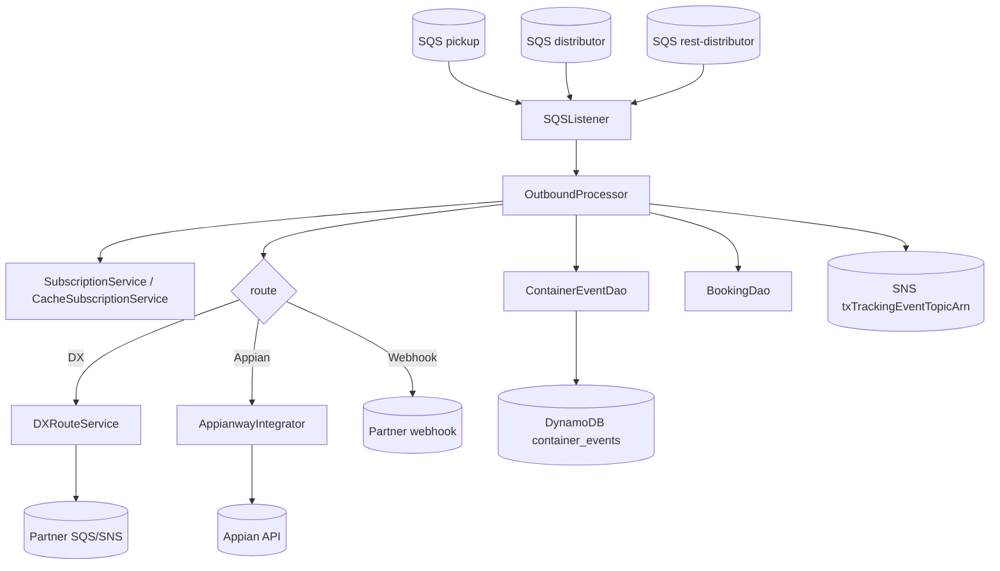
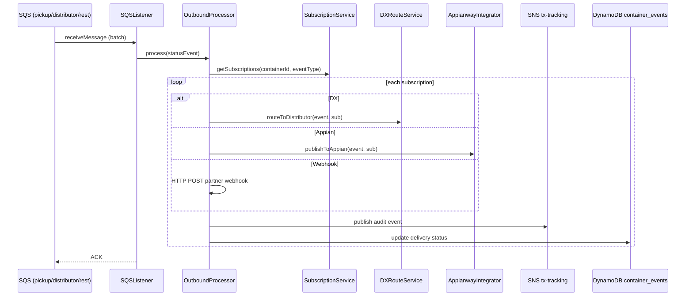

# Partner Integrator — pi-statusevents-out-processor — Current-State Design

**Module:** `partner-integrator / pi-statusevents-out-processor`
**Date:** 2026-06-30
**Status:** Current state (AWS SDK 1.x — upgrade NOT STARTED)
**Artifact:** `com.inttra.mercury:pi-statusevents-out-processor:1.0` (Dropwizard, shaded JAR)
**Main class:** `com.inttra.mercury.sefeed.outprocessor.StatusEventPIOBApplication`

---

## 1. Business Purpose & Rules

Outbound processor for **Status Events** (container events, shipment status, booking status). Consumes status events
from SQS, resolves partner subscriptions, and routes to subscribers via three channels: **DX (distributor exchange)**,
**Appian BPM**, or **partner webhook**. Delivery is audited to an SNS topic (tx-tracking) and DynamoDB.

### Flow / rules
1. Poll three SQS queues: `sqsPickupConfig` (primary, from visibility), `sqsDistributorConfig` (3PL),
   `sqsRestDistributorConfig` (REST 3PL).
2. Query active subscriptions (subscription type + event filter: POL/POD/container-specific).
3. Route per subscription:
   - **DX** → `DXRouteService` (SQS/SNS dispatch, EDI format)
   - **Appian** → `AppianwayIntegrator` (HTTP POST with workflow metadata)
   - **Webhook** → REST POST to partner endpoint
4. Publish audit event to SNS `txTrackingEventTopicArn`; update `container_events` delivery status.
5. Validate: required fields (container id, event type, timestamp), subscription active, filter match.

---

## 2. Design & Component Diagram

### Key classes

| Class | Role |
|-------|------|
| `StatusEventPIOBApplication` | Dropwizard `main`; starts SQS listeners post-setup. |
| `SEFeedApplicationInjector` | Guice: binds `AmazonSQS` (listener + sender), `AmazonSNS`, `AmazonDynamoDB`. |
| `OutboundProcessor` | Query subscriptions → filter → route via DX/Appian/webhook → audit. |
| `PISEFeedHandler` (`extends CFeedHandler`) | Feed handling. |
| `SubscriptionService` / `CacheSubscriptionService` | Subscriptions from visibility module or in-memory cache (TTL). |
| `DXRouteService` | Route to distributor exchange (SQS/SNS, EDI format). |
| `AppianwayIntegrator` | POST to Appian BPM with workflow metadata. |
| `ContainerEventDao` (`@DynamoDBTable("container_events")`) | Status event store. |
| `BookingDao` | Booking detail enrichment. |
| `WatermillPublisherConfig` / `WorkflowAware` / `MetaData` | Audit + BPM context. |

---

## 3. Data Flow — status event distribution

---

## 4. Data Stores & Integrations

| Resource | Usage |
|----------|-------|
| SQS `sqsPickupConfig` / `sqsDistributorConfig` / `sqsRestDistributorConfig` | Inbound status events. |
| DynamoDB `container_events` | Status events + delivery status (container_id + event_timestamp). |
| DynamoDB (booking) | Enrichment via `BookingDao`. |
| SNS `txTrackingEventTopicArn` | Audit/delivery events to tx-tracking. |
| Appian REST API | BPM workflow trigger. |
| Partner webhooks | REST POST to partner endpoints. |
| Subscription service (visibility / cache) | Active subscriptions. |
| Watermill (SNS/SQS) | Audit event publishing. |

---

## 5. Maven Dependencies

| Artifact | Version | Notes |
|----------|---------|-------|
| **`com.inttra.mercury:visibility`** | **`1.4.M`** | Subscription/status models (version pin — align during upgrade). |
| **`com.inttra.mercury:booking`** | **`2.1.8.M`** | Booking models (version pin — also flagged in visibility CI fix). |
| `com.inttra.mercury:pi-commons` | `1.0` | Framework + AWS v1 clients. |
| `io.dropwizard:dropwizard-jdbi3` | `5.0.1` | DB access where used. |

AWS SDK v1 (`AmazonSQS` x2, `AmazonSNS`, `AmazonDynamoDB`, `DynamoDBMapper`) via `pi-commons`.

---

## 6. Configuration & Deployment

### Configuration (`conf/<env>/config.yaml`)
Three SQS queues (`sqsPickupConfig`, `sqsDistributorConfig`, `sqsRestDistributorConfig`), `dynamoDbConfig`,
SNS `txTrackingEventTopicArn`, `watermillPublisherConfig`, pass-through mode. Config class `SEFeedApplicationConfig`.

### Deployment
`mvn -pl pi-statusevents-out-processor -am clean package` → `pi-statusevents-out-processor-1.0.jar`;
`java -jar pi-statusevents-out-processor-1.0.jar server conf/<env>/config.yaml`.

---

## 7. AWS Services & SDK 1.x Usage (CALL-OUT)

| AWS service | v1 classes | Where |
|-------------|-----------|-------|
| **SQS** | `AmazonSQS` (listener + sender) | `SEFeedApplicationInjector`, `OutboundProcessor`, `DXRouteService` |
| **SNS** | `AmazonSNS` | tx-tracking audit publish |
| **DynamoDB** | `AmazonDynamoDB`, `DynamoDBMapper`, ORM on `ContainerEvent` | `ContainerEventDao`, `BookingDao` |

---

## 8. AWS 2.x / cloud-sdk Upgrade Plan (High Level)

| Step | Action | Reference |
|------|--------|-----------|
| 1 | Consume upgraded `pi-commons`; align `visibility:1.4.M` / `booking:2.1.8.M` pins to the cloud-sdk-upgraded versions (note: `booking:2.1.8.M` is the same stale pin fixed in the visibility CI). | pi-commons, booking, visibility |
| 2 | **SQS** (3 inbound + sender) → cloud-sdk `MessagingClient`/`MessagingClientFactory`. | booking, network |
| 3 | **SNS** (tx-tracking audit) → cloud-sdk `NotificationService`/`SnsService`. | booking, network |
| 4 | **DynamoDB** (`ContainerEventDao`, `BookingDao`) → cloud-sdk `DatabaseRepository`; preserve `container_events` schema/keys. | network, registration |
| 5 | **Tests** — DynamoDB-Local IT for `ContainerEventDao`; mocked SQS/SNS unit tests at booking level; routing unit tests (DX/Appian/webhook); full JaCoCo coverage. | network/auth `*DaoIT` |

**Call-out:** Appian REST and partner webhooks are non-AWS contracts — keep payloads unchanged. The `booking`/
`visibility` version pins must be reconciled with their completed upgrades. tx-tracking SNS audit payloads must stay
wire-compatible.
