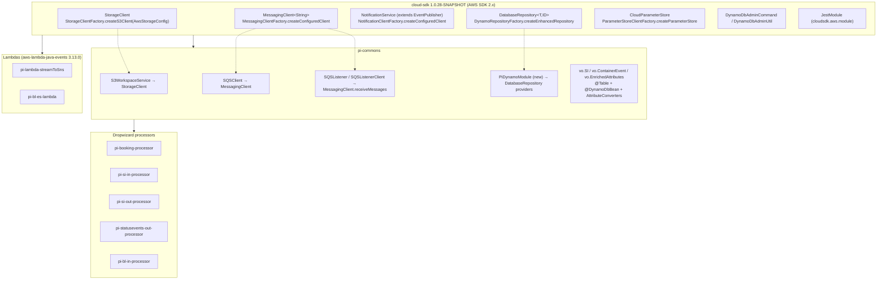
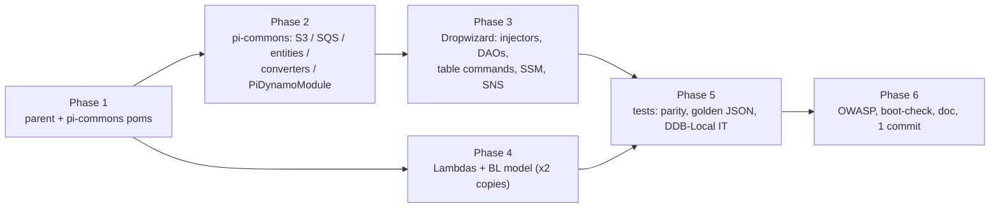

# partner-integrator — AWS SDK 1.x → 2.x (cloud-sdk) Upgrade — Plan & Design

**Jira:** ION-16397 · **Branch:** `feature/ION-16397-pi-aws-upgrade` · **Date:** 2026-07-31
**Target commons line:** `mercury-services-commons` **1.0.28-SNAPSHOT** (`commons`, `cloud-sdk-api`, `cloud-sdk-aws`, `dynamo-integration-test`)
**Reference migrations:** `booking` (ION-14382), `visibility` (ION-12316), `booking-cargoscreen` (ION-16397, commit `2f8a4829e8`), `watermill-publisher`
**Companion docs:** `2026-06-30-partner-integrator-current-state-DESIGN-claude.md`, `2026-06-30-partner-integrator-aws2x-DESIGN-claude.md`, `docs/2026-0730-mercury-services-aws-pending.md`

**Process constraints:** exactly **one** outgoing commit on this branch; commit message contains `ION-16397`; **do not push**; all tests must pass (nothing weakened or `@Disabled`); no unrelated refactors.

---

## 0. Executive summary

`partner-integrator` ("PI") is the largest remaining AWS-SDK-v1 module in the monorepo: **8 submodules, 104 files
in `src/main/java` and 26 in `src/test/java`** referencing `com.amazonaws.*`. It uses **DynamoDB (v1
`DynamoDBMapper` ORM), S3, SQS, SNS and SSM/Parameter Store**, plus two AWS Lambda handlers.

Baseline verified on `develop` @ `b86d536fed`: **BUILD SUCCESS, 4452 tests, 0 failures** (§1.3).

The migration is **not** uniformly mechanical. Discovery surfaced three hard constraints that shape the plan:

| # | Constraint | Consequence |
|---|---|---|
| **C1** | `commons` 1.0.28-SNAPSHOT **deletes the entire `com.inttra.mercury.messaging.*` package** and **`com.inttra.mercury.module.JestModule`**. PI imports 6 symbols from `messaging.*` and `JestModule`. | The commons bump alone breaks compilation. Every removed symbol must be re-pointed at `com.inttra.mercury.cloudsdk.*`, and `ESConfiguration`-style config classes must implement the cloud-sdk `ElasticSearchServiceConfig` interface. |
| **C2** | `dynamo-client` is **not published at 1.0.28-SNAPSHOT** (latest is 1.0.25-SNAPSHOT) and is a deprecated lib per the pending-inventory doc. PI imports 6 symbols from `com.inttra.mercury.dynamo.*` across 20+ files. | `dynamo-client` must be **dropped**, not bumped. `DynamoDBCrudRepository` → cloud-sdk `DatabaseRepository`, `DynamoHashKey`/`DynamoHashAndSortKey` → `DefaultPartitionKey`/`DefaultCompositeKey`, `dynamo.annotation.DynamoDBStream` → `cloudsdk.database.annotation.DynamoDBStream`, `dynamo.respository.module.DynamoDbConfig` → `cloudsdk.database.config.BaseDynamoDbConfig`. |
| **C3** | Three DynamoDB **entity classes live in pinned external model jars**, not in this repo's build. Their v1 `@DynamoDB*` annotations cannot be changed from a PI-only branch. | See §2 — this is the one genuine blocker. `booking` is resolvable today (**3.0.0.M** exists and is v2-annotated); `visibility` is resolvable with a rebuild; `shipping-instruction` is **not**. |

A fourth finding is decisive for the Lambda/stream path and is good news:

> **`aws-lambda-java-events` 2.x is itself an AWS-SDK-v1 dependency.** In 2.2.2,
> `DynamodbEvent.DynamodbStreamRecord extends com.amazonaws.services.dynamodbv2.model.Record` — a v1 **SDK** class.
> In 3.x it extends the self-contained `com.amazonaws.services.lambda.runtime.events.models.dynamodb.Record`.
> So `aws-lambda-java-events` **must** be normalized to the 3.x line (PI already uses 3.13.0 in one module) or four
> submodules keep dragging `aws-java-sdk-dynamodb` onto the classpath no matter what we do to application code.
> Verified: 3.13.0's `models.dynamodb.Record` and `models.dynamodb.AttributeValue` expose **byte-identical getter
> names** (`getEventID/getEventName/getDynamodb/…`, `getS/getN/getB/getSS/getNS/getBS/getM/getL/getNULL/getBOOL`),
> so the Jackson-serialized SNS envelope shape is unchanged — but it is guarded by a golden-JSON test (§7.2).

---

## 1. Current state (verified 2026-07-31)

### 1.1 v1 surface per submodule

| Submodule | `src/main` files w/ `com.amazonaws` | `src/test` | AWS services (v1) | Runtime |
|---|---:|---:|---|---|
| `pi-commons` | 24 | 6 | DynamoDB ORM, S3, SQS | library jar |
| `pi-booking-processor` | 2 | 1 | DynamoDB | Dropwizard (shaded) |
| `pi-si-in-processor` | 2 | 0 | DynamoDB | Dropwizard (shaded) |
| `pi-si-out-processor` | 6 | 5 | DynamoDB, S3, SQS, SNS, **SSM**, Lambda events | Dropwizard (shaded) |
| `pi-statusevents-out-processor` | 5 | 5 | DynamoDB, S3, SQS, SNS, **SSM**, Lambda events | Dropwizard (shaded) |
| `pi-bl-in-processor` | 32 | 4 | DynamoDB ORM + table admin | Dropwizard (shaded) |
| `pi-bl-es-lambda` | 31 | 3 | DynamoDB ORM, Lambda events | Lambda (shaded jar) |
| `pi-lambda-streamToSns` | 2 | 2 | SNS, DynamoDB stream models, Lambda events | Lambda (assembly zip) |
| **Total** | **104** | **26** | | |

The `pi-bl-in-processor` (32) and `pi-bl-es-lambda` (31) counts are dominated by **28 duplicated BL model classes**
(`AirFlow`, `BLContract`, `BLVersion`, `Charge`, … `Weight`) present **verbatim in both submodules**. They are
`@DynamoDBDocument`/`@DynamoDBTypeConvertedEnum` nested beans — mechanically simple, but the two copies **must stay
byte-identical** or the indexer and the writer disagree on the stored shape.

### 1.2 Cross-module symbol inventory (the compile-break set)

| Symbol imported by PI | Count | Status in 1.0.28-SNAPSHOT | Replacement |
|---|---:|---|---|
| `com.inttra.mercury.dynamo.respository.module.DynamoDbConfig` | 20 | artifact not published at 1.0.28 | `cloudsdk.database.config.BaseDynamoDbConfig` |
| `…dynamo.respository.id.DynamoHashAndSortKey` | 10 | ″ | `cloudsdk.database.api.id.DefaultCompositeKey<String,String>` |
| `…dynamo.respository.DynamoRepositoryConfig` | 7 | ″ | `cloudsdk.database.config.DynamoRepositoryConfig` |
| `…dynamo.respository.DynamoDBCrudRepository` | 7 | ″ | `cloudsdk.database.api.DatabaseRepository<T,ID>` |
| `…dynamo.annotation.DynamoDBStream` | 6 | ″ | `cloudsdk.database.annotation.DynamoDBStream` |
| `…dynamo.respository.id.DynamoHashKey` | 1 | ″ | `cloudsdk.database.api.id.DefaultPartitionKey<String>` |
| `com.inttra.mercury.messaging.model.MetaData` | 5 | **deleted** | `cloudsdk.notification.workflow.MetaData` |
| `…messaging.logging.EventLogger` | 4 | **deleted** | `cloudsdk.notification.workflow.EventLogger` |
| `…messaging.sns.SNSClient` | 3 | **deleted** | (no direct equivalent — see §5.3) |
| `…messaging.logging.SNSEventPublisher` | 3 | **deleted** | `cloudsdk.notification.api.NotificationService` via `NotificationClientFactory` |
| `…messaging.logging.EventPublisher` | 3 | **deleted** | `cloudsdk.notification.workflow.EventPublisher` |
| `…messaging.model.Event` | 1 | **deleted** | `cloudsdk.notification.workflow.Event` |
| `com.inttra.mercury.module.JestModule` | 1 | **deleted** | `cloudsdk.aws.module.JestModule` (takes `cloudsdk.config.ElasticSearchServiceConfig`) |
| `com.inttra.mercury.config.ApplicationConfiguration` / `ServiceDefinition` / `ElasticSearchServiceConfig` | — | present, unchanged | unchanged |

### 1.3 Baseline build (must be reproduced green at the end)

```
mvn -f partner-integrator/pom.xml clean verify      # BUILD SUCCESS
```

| Submodule | Baseline tests |
|---|---:|
| pi-commons | 1216 |
| pi-booking-processor | 2025 |
| pi-statusevents-out-processor | 50 |
| pi-lambda-streamToSns | 16 |
| pi-si-in-processor | 504 |
| pi-bl-in-processor | 313 |
| pi-si-out-processor | 264 |
| pi-bl-es-lambda | 64 |
| **Total** | **4452 / 0 failures** |

> **Build-hygiene hazard discovered:** `pi-booking-processor` and `pi-statusevents-out-processor` run
> `maven-dependency-plugin:purge-local-repository` with `<manualInclude>com.inttra.mercury:booking</manualInclude>`
> at the `package` phase, then `dependency:get` the pinned version. **This deletes _every_ version of
> `com.inttra.mercury:booking` from `~/.m2`** — including the `3.0.0.M` jar that `visibility/visibility-commons`
> depends on (observed during the baseline run: `~/.m2/.../booking/` was reduced to `1.0.M` only). It is recoverable
> from `visibility/visibility-commons/lib/`, but it makes local builds order-dependent. Addressed in §4.4.

---

## 2. The model-jar blocker (C3) — decision required

PI does **not** own the entity classes for three of its four DynamoDB tables. They arrive as pinned `*.M` "model"
jars, some from an S3-backed Maven wagon, some from git-tracked per-module `lib/` repositories.

| Table | Entity class | Comes from | v2-annotated? | PI submodules affected |
|---|---|---|:--:|---|
| `<prefix>_booking_booking` | `com.inttra.mercury.booking.model.BookingDetail` | `com.inttra.mercury:booking` — pinned **2.1.7.M** (`pi-booking-processor/lib/`), **2.1.8.M** (`pi-statusevents-out-processor/lib/`), **1.0.M** (S3 wagon, `pi-si-out-processor`) | **YES at 3.0.0.M** | pi-booking-processor, pi-statusevents-out-processor, pi-si-out-processor |
| `<prefix>_container_events` | `com.inttra.mercury.visibility.common.model.containerEvent.ContainerEvent` | `com.inttra.mercury:visibility` — pinned **1.4.M** (`pi-statusevents-out-processor/lib/`) | **no jar, but v2 source is in-repo** | pi-statusevents-out-processor |
| `<prefix>_si` | `com.inttra.mercury.shippinginstruction.model.SIVersion` | `com.inttra.mercury:shipping-instruction` — pinned **1.0.M** (S3 wagon) | **NO** | pi-si-in-processor, pi-si-out-processor |
| `<prefix>_bill_of_lading` | `…blfeed.model.BLVersion` / `…pi.model.BLVersion` | **PI-owned source** (duplicated in two submodules) | n/a — we migrate it | pi-bl-in-processor, pi-bl-es-lambda |

### 2.1 `booking` → **3.0.0.M** (resolved, no decision needed)

`booking-3.0.0.M` exists, is git-tracked at `visibility/visibility-commons/lib/com/inttra/mercury/booking/3.0.0.M/`,
and its POM description reads *"Booking model classes with AWS SDK v2 DynamoDB annotations (cloud-sdk)"*. Verified:
`BookingDetail` no longer implements `DynamoHashAndSortKey`, carries
`software.amazon.awssdk.enhanced.dynamodb.mapper.annotations.DynamoDbPartitionKey` +
`@DynamoDbAttribute("bookingId")` and the cloud-sdk `@TTL`, and the jar ships the full v2 converter set
(`AuditAttributeConverter`, `MetaDataConverter`, `ContractAttributeConverter`, `EnrichedAttributesConverter`,
`RangeAttributeConverter`, …) plus a ready-made `BookingDynamoDbAdminCommand`.

**API coverage check:** of the **105** distinct `com.inttra.mercury.booking.*` classes PI imports, `3.0.0.M` supplies
**104**. The single miss is `com.inttra.mercury.booking.dynamodb.DynamoSupport` — the v1 `DynamoDBMapper` helper,
which this migration removes anyway (used only in `BookingApplicationInjector`).

→ **Plan:** copy `booking-3.0.0.M.{jar,pom}` into `pi-booking-processor/lib/` and
`pi-statusevents-out-processor/lib/` (the established convention — `visibility-commons` does exactly this), pin all
three submodules to `3.0.0.M`, and point `pi-si-out-processor`'s `booking-model-s3-release` repository at the local
`lib/` repo as well so its `1.0.M` pin is retired.

### 2.2 `visibility` `ContainerEvent` → rebuild the model jar (low risk, one extra step)

The v2 `ContainerEvent` **already exists in this repo**, at
`visibility/visibility-commons/src/main/java/…/model/containerEvent/ContainerEvent.java` — `@Table(name="container_events")`
+ `@DynamoDbBean` + `@DynamoDbPartitionKey` on `getHashKey()` mapped to attribute `id`, `@TTL`-adjacent
`@DynamoDbConvertedBy(DateEpochSecondAttributeConverter.class)` on `expiresOn`, and five `@DynamoDbSecondaryPartitionKey`
GSIs. `visibility-commons/pom.xml` already carries a `-Pvisibility-model` profile that jars exactly
`com/inttra/mercury/visibility/common/model/**`.

**All 18 `com.inttra.mercury.visibility.*` classes PI imports are present in `visibility-commons`.** (PI's tests import
`com.inttra.mercury.visibility.common.TestUtil`, which is **not** in `visibility-1.4.M` either — PI carries its own copy
at `pi-statusevents-out-processor/src/test/java/com/inttra/mercury/visibility/common/TestUtil.java`. No action.)

→ **Plan:** build `mvn -f visibility/visibility-commons/pom.xml -Pvisibility-model package`, install the result as
`com.inttra.mercury:visibility:2.0.M` into `pi-statusevents-out-processor/lib/`, and repin. Document the exact
command so it is reproducible. Verify the model-jar include list covers `model/containerEvent/converters/**` (it does —
the include is a path prefix).

### 2.3 `shipping-instruction` `SIVersion` → **no v2 artifact exists** — RESOLVED: Option A

`shipping-instruction-1.0.M` is v1-annotated, and the in-repo source
(`shipping-instruction/src/main/java/…/model/SIVersion.java`) is **also** v1-annotated — `@DynamoDBTable("si")`,
`@DynamoDBHashKey`/`@DynamoDBRangeKey`/`@DynamoDBAutoGeneratedKey`, `@DynamoDBTypeConverted(CompressionConverter)`,
`@DynamoDBTypeConverted(DateToEpochSecond)`, `implements DynamoHashAndSortKey`. The `shipping-instruction` module is
listed as **pending migration** in `docs/2026-0730-mercury-services-aws-pending.md` §1.2 (62 v1 files, tracked
separately as ION-16396).

> **Verified 2026-07-31 — the ION-16396 migration has not been implemented.** Review asked whether PI could consume
> the upgraded v2 SI model generated from that ticket's branch. It cannot yet:
>
> ```
> git rev-parse feature/ION-16396-si-aws-upgrade   ->  b86d536fedd4b5b85aa38f091e5f394465edb3fe
> git rev-parse develop                            ->  b86d536fedd4b5b85aa38f091e5f394465edb3fe
> git diff --stat develop feature/ION-16396-si-aws-upgrade   ->  (empty)
> ```
>
> The branch is an empty placeholder at develop's tip. The only ION-16396 artifact present is the **untracked**
> `shipping-instruction/docs/2026-07-30-si-aws-upgrade-design.md` (421 lines, design only — not `git add`-ed, no
> commits, no stash, no worktree, no remote branch). Its own §4.1 scopes **48 bean classes** plus the `siDraft`
> entity, a CloudFormation migration and the `@DynamoDBAutoGeneratedKey` problem — i.e. the model is not separable
> from the rest of that ticket: migrating only `SIVersion` in place would break `shipping-instruction`'s own
> `SIDao`/`DynamoSupport`, which still call v1 `DynamoDBMapper` on it, and the reactor build with it.

Three options, in the order I'd rank them:

**Option A (recommended) — own the `si` entity inside `pi-commons`.**
`pi-commons` **already has its own entity for the same table**: `com.inttra.mercury.common.vo.SI`
(`@DynamoDBTable("si")`, same `id`/`sequenceNumber` keys, same `INTTRA_REFERENCE_NUMBER_INDEX` GSI, same
`CompressionConverter`/`DateToEpochSecond`, same `EnrichedAttributes`). Field-by-field it is **`SIVersion` minus the
`contract` attribute**. Today `vo.SI` is used only by the `CreateTables`/`DeleteTables` admin commands — i.e. PI already
declares the `si` schema twice and provisions the table from its own copy.

Plan: migrate `vo.SI` to v2, **add the missing `contract` field**, and repoint `pi-si-in-processor` and
`pi-si-out-processor` from `shippinginstruction.model.SIVersion` to `com.inttra.mercury.common.vo.SI`
(≈6 main files + their tests: `SIDao`, `SIFeedHandler`, `SIFeedService`, `OutboundProcessor`).

- ✅ Removes PI's dependency on an unmigrated sibling; no cross-module release coupling; PI keeps a single `si`
  schema definition instead of two divergent ones (a latent-bug cleanup).
- ⚠️ The stored item shape must be **byte-identical** to what `SIVersion` writes. Guarded by the converter-parity and
  round-trip tests in §7.1/§7.3; the field sets are provably equal once `contract` is added.
- ⚠️ `shipping-instruction`'s own app still writes the same table via v1 `SIVersion`. That is **fine and unchanged** —
  v1 and v2 write the same attribute names/types; this is exactly the coexistence the booking and visibility
  migrations already rely on. It stays true until ION-16396 lands.

**Option B — migrate `SIVersion` in the `shipping-instruction` module and publish a new `.M` jar.**
Correct in the long run, but it means editing a module outside this ticket's scope whose own application still uses
v1 `DynamoDBMapper` on that class — so it forces the ION-16396 migration into this branch. Rejected for this ticket.

**Option C — leave the SI DynamoDB path on v1.**
Keep `dynamo-client:1.0.25-SNAPSHOT` + `aws-java-sdk-dynamodb` for `pi-si-in-processor`/`pi-si-out-processor` only.
Technically possible (v1 and v2 coexist), but it leaves 2 of 8 submodules unmigrated, keeps a v1 SDK on two shaded
jars, and `dynamo-client` 1.0.25 has never been tested against `commons` 1.0.28. Documented as the fallback only.

**DECISION (2026-07-31): Option A.** Review's preference was to consume the ION-16396 v2 SI model; since that work
does not exist yet (above), Option A is the only route that both (a) gives PI a genuine **v2** `si` entity now and
(b) completes all 8 submodules on this branch. It is also **forward-compatible with ION-16396 by construction**: the
stored item is byte-identical either way, so when the SI model jar ships, PI switches back by changing one import in
each of ~6 files plus the pom pin. That switch point is called out in §5.5 and §9/R1 so it is not lost.

**DECISION (2026-07-31): `visibility` — build `2.0.M` into `pi-statusevents-out-processor/lib/`** (§2.2), per review.
Mirrors the existing `booking`/`visibility` `lib/` convention rather than pulling visibility's whole dependency tree
(MySQL, aws-mysql-jdbc, ES-RHLC, jmockit, metrics-guice) into PI's shaded jar.

---

## 3. Target architecture



### 3.1 Service-by-service mapping (verified against the 1.0.28-SNAPSHOT jars)

| v1 usage in PI | cloud-sdk 1.0.28 target | Verified signature |
|---|---|---|
| `AmazonS3` + `GetObjectRequest`/`CopyObjectRequest`/`ObjectMetadata`/`S3Object` | `StorageClient` | `putObject(b,k,String\|byte[]\|InputStream,long\|File)`, `putObject(b,k,byte[],Map<String,String>,String)`, `getContent(b,k,Charset)`, `getObject(b,k) → StorageObject{getContent(),getMetadata()}`, `copyObject(sb,sk,tb,tk[,Map,String])` |
| `AmazonSQS.sendMessage/deleteMessage` | `MessagingClient<String>` | `sendMessage(url,T)`, `sendMessage(url,T,Map<String,String>)` *(attributes, **not** delay)*, `deleteMessage(url,handle)` |
| `AmazonSQS.receiveMessage(ReceiveMessageRequest)` | `MessagingClient.receiveMessages(ReceiveMessageOptions)` | `ReceiveMessageOptions.builder().queueUrl().maxMessages().waitTimeSeconds().visibilityTimeoutSeconds()`; returns `List<QueueMessage<String>>` |
| `AmazonSNS.publish(PublishRequest)` | `NotificationService.publish(topicArn, message)` | `NotificationClientFactory.createConfiguredClient(NotificationClientConfig)` / `createDefaultClient(topicArn)` |
| commons `SNSEventPublisher(topicArn, SNSClient)` implementing `EventPublisher` | `NotificationService` (which **extends** `cloudsdk.notification.workflow.EventPublisher`) | `EventPublisher.publishEvent(List<Event>)` |
| `DynamoDBMapper` + `DynamoDBMapperConfig` table resolver | `DatabaseRepository<T,ID>` from `DynamoRepositoryFactory.createEnhancedRepository(DynamoDbClientConfig, tableName, T.class, DynamoRepositoryConfig)`; prefix from `DynamoDbClientConfig.getTablePrefix()` | `findById(ID[,consistent])`, `save`, `update`, `saveIfNotExist`, `query(QuerySpec)`, `batchSave`, `deleteById`, `count`, `export` |
| `DynamoDBCrudRepository.query(index, hash, range, expr)` | `DefaultQuerySpec.builder().indexName().partitionKeyName().partitionKeyValue(CloudAttributeValue.ofString()).sortKeyName().sortKeyValue().sortKeyCondition("EQ").consistentRead()` | as used by `booking/BookingDetailDao` |
| `@DynamoDBTable` / `@DynamoDBHashKey` / `@DynamoDBRangeKey` / `@DynamoDBIndexHashKey` / `@DynamoDBAttribute` / `@DynamoDBIgnore` / `@DynamoDBDocument` | cloud-sdk `@Table(name=)` + v2 `@DynamoDbBean` / `@DynamoDbPartitionKey` / `@DynamoDbSortKey` / `@DynamoDbSecondaryPartitionKey(indexNames=)` / `@DynamoDbAttribute` / `@DynamoDbIgnore` / nested `@DynamoDbBean` | as used by `visibility-commons/ContainerEvent` |
| `dynamo.annotation.DynamoDBStream(StreamViewType.KEYS_ONLY)` | `cloudsdk.database.annotation.DynamoDBStream(StreamViewType.KEYS_ONLY)` (v2 `StreamViewType`) | 1:1 |
| `DynamoDBTypeConverter<Long,Date>` (`DateToEpochSecond`) | cloud-sdk `DateEpochSecondAttributeConverter` | writes **N** — see §6.1 for parity proof |
| `DynamoDBTypeConverter<String,String>` (`CompressionConverter`) | **new** `CompressionAttributeConverter implements AttributeConverter<String>` (PI-owned) | writes **S** |
| `TableUtils` + `CreateTableRequest`/`GlobalSecondaryIndex`/`StreamSpecification`/`SSESpecification`/`TimeToLiveSpecification`/`UpdateTableRequest` (in `CreateTables`/`DeleteTables`) | `cloudsdk.database.command.DynamoDbAdminCommand` + `cloudsdk.database.util.DynamoDbAdminUtil` (`createTableIfNotExists`, `createTableWithSSEEnabledIfNotExists`, `addGlobalSecondaryIndexIfNotExists`, `enableTimeToLive`, `enableStreams`, `waitForTableActive`) | drop-in for the whole admin path |
| `AWSSimpleSystemsManagementClientBuilder.defaultClient().getParameters(...)` (`Utils.ssmParameterlookup`) | `ParameterStoreClientFactory.createParameterStore(AwsParameterStoreConfig)` → `CloudParameterStore.getParameter(name, withDecryption)` | **must** pass explicit region **and** credentials provider (§6.4) |
| `com.amazonaws.util.StringUtils` / `IOUtils` | `org.apache.commons.lang3.StringUtils` / JDK `InputStream.readAllBytes()` | trivial residue |
| `com.amazonaws.retry.RetryUtils.*` (`AWSUtil.isRetryable`) | `cloudsdk.aws.retry.AwsRetryCondition` | see §6.3 |
| `com.inttra.mercury.module.JestModule` | `cloudsdk.aws.module.JestModule` | config class must implement `cloudsdk.config.ElasticSearchServiceConfig` |
| `aws-lambda-java-events` 2.0.1 / 2.2.2 / 3.13.0 (drift) | normalize to **3.13.0** in parent `dependencyManagement` | removes the last v1-SDK edge from the Streams path |

### 3.2 Explicitly **not** used, and why

- **`cloudsdk.aws.module.SQSModule` / `SQSReader` / `SQSWriter` / `SNSModule`** — these are legacy shims that still
  expose `com.amazonaws.services.sqs.AmazonSQS` / `AmazonSNS` (v1) in their signatures. Using them would defeat the
  purpose. PI goes to `MessagingClient` / `NotificationService`.
- **`cloudsdk.notification.workflow.SnsEventPublisher`** — implements no interface and takes a raw v2 `SnsClient`
  (same finding as the `booking-cargoscreen` migration). `NotificationService` is the topic-bound `EventPublisher`.
- **Hand-built `DynamoDbClient.builder()`** — forbidden per the pending-inventory doc §E. Everything goes through
  `DynamoRepositoryFactory`.
- **Elasticsearch / Jest** — out of scope (separate OpenSearch track). `pi-bl-in-processor` and `pi-bl-es-lambda`
  keep Jest; only the `JestModule` coordinates change.
- **IBM MQ, Oracle/JDBI3, Appian, partner EDIFACT** — untouched.
- **`aws-lambda-java-core`** (`RequestHandler`, `Context`, `LambdaLogger`) — Lambda **runtime**, not the SDK. Stays.

---

## 4. Dependency plan

### 4.1 Parent `partner-integrator/pom.xml`

Introduce the shared version properties and a `dependencyManagement` block so the drift in §1 can't come back:

```xml
<properties>
  <maven.compiler.release>17</maven.compiler.release>
  <mercury.commons.version>1.0.28-SNAPSHOT</mercury.commons.version>
  <aws.lambda.events.version>3.13.0</aws.lambda.events.version>
  <jackson-bom.version>2.21.4</jackson-bom.version>
</properties>

<dependencyManagement>
  <dependencies>
    <dependency><groupId>com.fasterxml.jackson</groupId><artifactId>jackson-bom</artifactId>
      <version>${jackson-bom.version}</version><type>pom</type><scope>import</scope></dependency>
    <dependency><groupId>com.amazonaws</groupId><artifactId>aws-lambda-java-events</artifactId>
      <version>${aws.lambda.events.version}</version></dependency>
    <dependency><groupId>com.inttra.mercury</groupId><artifactId>cloud-sdk-api</artifactId>
      <version>${mercury.commons.version}</version></dependency>
    <dependency><groupId>com.inttra.mercury</groupId><artifactId>cloud-sdk-aws</artifactId>
      <version>${mercury.commons.version}</version></dependency>
    <dependency><groupId>com.inttra.mercury</groupId><artifactId>dynamo-integration-test</artifactId>
      <version>${mercury.commons.version}</version><scope>test</scope></dependency>
  </dependencies>
</dependencyManagement>
```

The `jackson-bom 2.21.4` import mirrors the `rates` / `watermill-publisher` / `booking-cargoscreen` OWASP fix.
**Any hard-coded `jackson-*` `<version>` on a direct dependency must be removed** or it overrides the BOM —
`pi-commons` currently pins `jackson-module-afterburner 2.19.2`, which is exactly that trap.

### 4.2 Per-submodule diff

```diff
  <!-- pi-commons -->
- <mercury.commons.version>1.R.01.025</mercury.commons.version>
- <mercury.dynamodbclient.version>1.R.01.025</mercury.dynamodbclient.version>
- <aws.java.sdk.version>1.12.715</aws.java.sdk.version>
  (versions now inherited from the parent)

- <dependency>com.amazonaws:aws-java-sdk-dynamodb:${aws.java.sdk.version}</dependency>
- <dependency>com.inttra.mercury:dynamo-client:${mercury.dynamodbclient.version}</dependency>
- <dependency>com.fasterxml.jackson.module:jackson-module-afterburner:2.19.2</dependency>   <!-- drop the version -->
+ <dependency>com.inttra.mercury:cloud-sdk-api</dependency>
+ <dependency>com.inttra.mercury:cloud-sdk-aws</dependency>
+ <dependency>com.fasterxml.jackson.module:jackson-module-afterburner</dependency>          <!-- BOM-managed -->
+ <dependency>com.inttra.mercury:dynamo-integration-test<scope>test</scope></dependency>
```

| Submodule | Changes |
|---|---|
| `pi-commons` | as above; `commons` → `1.0.28-SNAPSHOT` |
| `pi-booking-processor` | `booking` 2.1.7.M → **3.0.0.M**; add jar+pom to `lib/`; update `dependency:get` artifact coordinate |
| `pi-si-in-processor` | `shipping-instruction` 1.0.M **removed** (Option A) or retained (Option C) |
| `pi-si-out-processor` | `booking` 1.0.M → **3.0.0.M** (via local `lib/`); `shipping-instruction` per Option A/C; `aws-lambda-java-events` 2.0.1 → managed 3.13.0 |
| `pi-statusevents-out-processor` | `booking` 2.1.8.M → **3.0.0.M**; `visibility` 1.4.M → **2.0.M**; both into `lib/`; update `dependency:get` |
| `pi-bl-in-processor` | `aws-lambda-java-events` 2.2.2 → managed 3.13.0; add cloud-sdk (currently transitive via pi-commons — declare it) |
| `pi-bl-es-lambda` | drop `dynamo-client`; add cloud-sdk; `aws-lambda-java-events` → 3.13.0 |
| `pi-lambda-streamToSns` | drop `aws-java-sdk-dynamodb`, `aws-java-sdk-sns`; add cloud-sdk; `aws-lambda-java-events` → 3.13.0; keep `aws-lambda-java-core` |

### 4.3 Exit criterion for the dependency work

```powershell
# zero AWS SDK v1 artifacts anywhere in the reactor
mvn -f partner-integrator/pom.xml dependency:tree | Select-String 'com.amazonaws:aws-java-sdk'
# expected: no matches (aws-lambda-java-core / -events 3.13.0 may appear; they are not the SDK)

# zero v1 imports in main sources
Select-String -Path partner-integrator\**\src\main\java\**\*.java -Pattern '^\s*import\s+com\.amazonaws\.' |
  Where-Object { $_.Line -notmatch 'services\.lambda\.runtime' }
# expected: no matches
```

### 4.4 `purge-local-repository` hygiene

`<manualInclude>com.inttra.mercury:booking</manualInclude>` is too broad — it wipes all `booking` versions from the
developer's `~/.m2`, including the one `visibility-commons` needs. Narrow it to the pinned coordinate
(`com.inttra.mercury:booking:3.0.0.M`) in both poms so the purge is idempotent and side-effect-free. This is a
one-line change per pom and directly serves the migration (the whole point of the purge is to force the pinned model
jar to be re-fetched).

---

## 5. Per-submodule implementation plan

Sequencing is forced by the dependency graph: **pi-commons first** (every Dropwizard submodule inherits it), then the
entities, then the injectors, then the Lambdas (which don't depend on pi-commons).



### 5.1 `pi-commons` — S3 (`S3WorkspaceService`, `WorkspaceService`, `AWSUtil`)

The v1 interface leaks `PutObjectResult` into `WorkspaceService`, which has no cloud-sdk equivalent
(`StorageClient.putObject` returns `void`). Three `putObject*` methods return it; **no caller reads the return value**
(to be re-verified before the change). → change the interface methods to `void`, and note it in the commit message as
an intentional API narrowing rather than inventing a fake result object.

| `WorkspaceService` method | New implementation |
|---|---|
| `copyObject(sb,sk,tb,tk)` | `storage.copyObject(sb,sk,tb,tk)` |
| `copyObjectWithMetaDate(…, Map)` | `storage.copyObject(sb,sk,tb,tk, metaDataMap, null)` — the 6-arg default overload |
| `putObject(b,f,String)` | `storage.putObject(b,f,content)` |
| `putObject(b,f,byte[])` | `storage.putObject(b,f,content)` (byte[] overload sets content-length internally) |
| `putObjectWithMetaData(b,f,byte[],Map)` | `storage.putObject(b,f,content,metaDataMap,null)` |
| `getContent(b,f)` | `storage.getContent(b,f,StandardCharsets.UTF_8)` — **behaviour note below** |
| `getContent(b,f,Charset)` | `storage.getContent(b,f,charset)` |
| `getS3ObjectWrapper(b,f)` | `storage.getObject(b,f)` → `new S3ObjectWrapper(read(o.getContent()), o.getMetadata())`; **close the stream** |
| `getS3InputStream(b,f)` | `storage.getObject(b,f).getContent()` |
| `getMetaData(b,f)` | `storage.getObject(b,f).getMetadata()` — verify a metadata-only path exists; else document the extra GET |
| `copyS3FileToFileSystem(b,k,f)` | `try (InputStream in = storage.getObject(b,k).getContent()) { Files.copy(in, Path.of(f), REPLACE_EXISTING); }` |

> ⚠️ **Behaviour difference to preserve deliberately.** The v1 no-charset `getContent(b,f)` reads via
> `BufferedReader.lines().collect(joining("\n"))` — that **normalises CRLF to LF and strips a trailing newline**.
> The charset overload uses `IOUtils.toByteArray` + `new String(bytes, charset)` — byte-exact. These are *not*
> equivalent, and EDI payloads are newline-sensitive. The line-joining behaviour is kept verbatim in a private
> `read(InputStream)` helper, and a test asserts CRLF/trailing-newline handling for **both** overloads so the
> difference is documented rather than accidentally "fixed". Same discipline as the `booking-cargoscreen`
> ISO-8859-1 read contract.

Also: v1 leaked the object stream in several paths (`getObject(...).getObjectContent()` never closed). Against a
bounded v2 connection pool that is a hang risk, so every path closes its stream — the same defect fixed in
`booking-cargoscreen`.

`AWSUtil.isRetryable(SdkClientException)` → re-express over `cloudsdk.aws.retry.AwsRetryCondition`; keep the
`IOException.class.isInstance(ex.getCause())` clause. `RecoverableException` wrapping is preserved everywhere.

### 5.2 `pi-commons` — SQS (`SQSClient`, `SQSListenerClient`, `SQSListener`, `task/*`, `threaddispatcher/*`)

`SQSClient` and `SQSListenerClient` currently take two **separately named** v1 clients
(`@Named("amazonSQSForSender")` / `@Named("amazonSQSForListener")`). The distinction exists so the long-polling
receive loop doesn't share a connection pool with the send path — worth keeping. → bind two `MessagingClient<String>`
instances under the same `@Named` keys, built from two `AwsMessagingClientConfig`s.

`SQSListener.pollAndExecute(ReceiveMessageRequest)` → `receiveMessages(ReceiveMessageOptions)`. The
`dispatcher.getIdleThreadCount()`-driven dynamic `maxNumberOfMessages` and the `AbortedException` shutdown path are
preserved (`com.amazonaws.AbortedException` → `software.amazon.awssdk.core.exception.AbortedException`).

**Message type change — the largest ripple in `pi-commons`.** `Task`, `AbstractTask`, `TaskFactory`, `Dispatcher`,
`AsyncDispatcher`, `TaskMessage` are all typed on `com.amazonaws.services.sqs.model.Message`. Options:

- **(chosen)** retype to `cloudsdk.messaging.api.QueueMessage<String>` — the cloud-sdk abstraction, keeps
  `getMessageId()`/`getReceiptHandle()`/`getPayload()`/`getAttributes()`. `Message.getBody()` → `getPayload()`.
- rejected: retype to v2 `software.amazon.awssdk.services.sqs.model.Message` — would leak the raw SDK through
  `pi-commons`' public API for no benefit.

> ⚠️ **`QueueMessage` is immutable.** If any handler signals control flow by *mutating* message attributes — the
> exact trap that required `CargoScreenQueueMessage` in `booking-cargoscreen` — a mechanical retype would compile and
> then silently drop the flag. **Verification step before Phase 2 lands:** grep every `setMessageAttributes` /
> `getMessageAttributes().put` / `setBody` on the message type across all 8 submodules. If any exists, introduce a
> mutable `PiQueueMessage` adapter with end-to-end tests proving the flag still takes effect. (Not yet observed in
> PI, unlike cargoscreen — but it is not assumed.)

> ⚠️ **cloud-sdk gap — per-message delay.** `SQSClient.sendMessage(target, content, int delay)` maps to v1
> `SendMessageRequest.setDelaySeconds`. `MessagingClient` has **no delay parameter** — its 3-arg overload is *message
> attributes* (verified in `SqsMessagingClient` source). The overload is currently exercised by **9 assertions in
> `SQSClientTest`** and by no production caller. Plan: keep the public method, implement it against a
> cloud-sdk-configured v2 `SqsClient` obtained from the same `AwsMessagingClientConfig` (region/credentials/HTTP from
> cloud-sdk, not hand-rolled), keep all 9 tests passing, and **raise the gap with the commons team** as a request for
> `sendMessage(url, payload, Duration delay)`. Documented in §9.

### 5.3 `pi-commons` — SNS / event logging

`com.inttra.mercury.messaging.sns.SNSClient` and `messaging.logging.SNSEventPublisher` are gone. The replacement is
`NotificationClientFactory.createConfiguredClient(NotificationClientConfig.builder().topicArn(...).region(...).credentialsProvider(...).build())`,
which returns a `NotificationService` — and `NotificationService extends EventPublisher`, so `EventPublisher`
injection points bind directly to it with no adapter. `messaging.logging.EventLogger` →
`cloudsdk.notification.workflow.EventLogger(EventPublisher, EventGenerator)`; `messaging.model.MetaData`/`Event` →
`cloudsdk.notification.workflow.MetaData`/`Event`.

`MetaData` moves from a mutable `@Data` bean to a **final class with `parseJson`/`toJsonString`** and no setters.
`pi-commons` uses it in 5 places (incl. `appianway`), so construction sites move to the builder. `MetaDataTest`
(5 tests) will need updating — the JSON round-trip assertions are the ones to keep.

### 5.4 `pi-commons` — DynamoDB (`DynamoSupport`, `vo.SI`, `vo.ContainerEvent`, `vo.EnrichedAttributes`, converters)

`DynamoSupport` (v1 client + mapper + `DynamoDBMapperConfig` table-name resolver) is **deleted** and replaced by a
Guice module, mirroring `VisibilityDynamoModule`:

```java
public class PiDynamoModule extends AbstractModule {
    @Provides @Singleton
    DynamoDbClientConfig provideDynamoDbClientConfig() {
        return config.getDynamoDbConfig()          // BaseDynamoDbConfig
                     .toClientConfigBuilder()
                     .consistentRead(false)
                     .build();                     // carries region + tablePrefix
    }
    // one @Provides per Dao, via createEnhancedRepository(clientConfig, prefix + @Table.name, T.class, repoCfg)
}
```

Table-name resolution must stay **identical**. v1 built `String.format("%s_%s", prefix, @DynamoDBTable.tableName)`;
v2 uses `clientConfig.getTablePrefix() + @Table.name()`. → `tablePrefix` must be set to `environment + "_"`
(with the trailing underscore) — a one-character mistake here silently points production at a non-existent table, so
it gets a dedicated assertion per submodule (§7.4).

**The `_booking` special case must survive.** `SEFeedApplicationInjector.getNewDynamoDBMapperConfig` resolves
`BookingDetail` to `<prefix>_booking_booking` and everything else to `<prefix>_<table>`. With per-entity repositories
this becomes explicit and clearer: the `BookingDao` provider uses `prefix + "booking_" + "booking"`. Asserted in
§7.4.

Entity migrations (`vo.SI`, `vo.ContainerEvent`):

```java
@Table(name = "si")                                  // com.inttra.mercury.cloudsdk.database.annotation.Table
@DynamoDbBean
@DynamoDBStream(StreamViewType.KEYS_ONLY)            // cloudsdk.database.annotation, v2 StreamViewType
@Data @Builder @NoArgsConstructor @AllArgsConstructor
@JsonIgnoreProperties(ignoreUnknown = true)
public class SI implements Expires {
    public static final String INTTRA_REFERENCE_NUMBER_INDEX = "INTTRA_REFERENCE_NUMBER_INDEX";

    public SI(String id, String state, Date expiresOn) {          // preserves m_{millis}_{state}
        this.id = id;
        this.sequenceNumber = String.format("m_%d_%s", System.currentTimeMillis(), state);
        setExpiresOn(expiresOn);
    }

    @DynamoDbPartitionKey @DynamoDbAttribute("id")            public String getId() { … }
    @DynamoDbSortKey      @DynamoDbAttribute("sequenceNumber") public String getSequenceNumber() { … }
    @DynamoDbSecondaryPartitionKey(indexNames = INTTRA_REFERENCE_NUMBER_INDEX)
                                                              public String getSiInttraReferenceNumber() { … }
    @DynamoDbConvertedBy(CompressionAttributeConverter.class)  public String getMessage() { … }
    @DynamoDbConvertedBy(DateEpochSecondAttributeConverter.class) @TTL public Date getExpiresOn() { … }
    // + contract (Option A), enrichedAttributes (nested @DynamoDbBean → M)
}
```

Notes:
- The `DynamoHashKey`/`DynamoHashAndSortKey` `getHashKey()`/`getSortKey()` indirection is **dropped** — the enhanced
  client reads `getId()`/`getSequenceNumber()` directly and `@DynamoDbAttribute` keeps the stored names. The
  `@JsonIgnore` on the old key accessors existed only to hide that indirection from REST/JSON; removing both keeps the
  JSON shape unchanged. **Asserted** by a JSON round-trip test, because this is the kind of change that silently alters
  an outbound payload.
- **`@DynamoDBAutoGeneratedKey` has no enhanced-client equivalent.** `sequenceNumber` is already generated in the
  3-arg constructor (`m_{currentTimeMillis}_{state}`); v1's auto-gen was a no-op safety net for the default
  constructor path. The generation stays in the constructor; a test asserts the format.
- `vo.EnrichedAttributes` was `@DynamoDBDocument` → stored as **M**. A v2 nested `@DynamoDbBean` also stores **M**,
  so **no custom converter is needed** — this is the S-vs-M rule from the booking/visibility migrations: match the v1
  type per field, don't pick a blanket one.
- `networkservices/**/model/{Country,CountryIdentifier,Geography,ContainerType,PackageType}` carry `@DynamoDBDocument`
  / `@DynamoDBTypeConvertedEnum` but are **REST DTOs**, never persisted. → annotations are simply **removed** (they
  were always inert), not translated. Confirmed: these types appear in no `@DynamoDbBean` graph.

Converters:
- `DateToEpochSecond` (`DynamoDBTypeConverter<Long,Date>`, `date.getTime()/1000`) → cloud-sdk
  `DateEpochSecondAttributeConverter`. **Parity proof required** (§6.1) — including the negative/pre-epoch and
  sub-second-truncation cases, where integer division on a negative `getTime()` differs from `Math.floorDiv`.
- `CompressionConverter` (`DynamoDBTypeConverter<String,String>`; ISO-8859-1 bytes, gzip+Base64 above 307 200 bytes,
  `COMPRESSED|` prefix) → new PI-owned `CompressionAttributeConverter implements AttributeConverter<String>` with
  `attributeValueType() == AttributeValueType.S`, delegating to the **existing** `CompressionConverter` logic so
  there is one implementation, not two.

### 5.5 Dropwizard processors

| Submodule | Work |
|---|---|
| `pi-booking-processor` | `BookingApplicationInjector`: drop `AmazonDynamoDB`/`DynamoDBMapper`/`DynamoDBMapperConfig` bindings and `booking.dynamodb.DynamoSupport`; install `PiDynamoModule`-style provider. `BookingDao`: `DynamoDBCrudRepository<BookingDetail, DynamoHashAndSortKey>` → `DatabaseRepository<BookingDetail, DefaultCompositeKey<String,String>>`; the three `query(...)` calls → `DefaultQuerySpec`. `booking` → 3.0.0.M. |
| `pi-si-in-processor` | `SIApplicationInjector` + `SIDao` same shape; entity `SIVersion` → `vo.SI` (Option A). `SIFeedHandler`/`SIFeedService` type changes. |
| `pi-si-out-processor` | Widest surface: `SIFeedApplicationInjector` (S3+SQS+SNS+DDB), `SIDao`, `OutboundProcessor`, `Utils.ssmParameterlookup` → `CloudParameterStore`, `CreateTables`/`DeleteTables` → `DynamoDbAdminCommand`. **Latent bug found:** `SIDao extends DynamoDBCrudRepository<ContainerEvent, …>` but its only method loads `SIVersion` — the generic parameter is wrong (harmless under v1's untyped mapper, a compile error under typed repositories). It gets corrected to the SI entity, and the correction is called out in the commit message rather than slipped in. |
| `pi-statusevents-out-processor` | `SEFeedApplicationInjector` (S3+SQS+SNS+DDB + the `_booking` resolver), `BookingDao`, `ContainerEventDao`, `OutboundProcessor`, `Utils.ssmParameterlookup`. `EventPublisher` provider → `NotificationService`. `booking` → 3.0.0.M, `visibility` → 2.0.M. |
| `pi-bl-in-processor` | `BLApplicationInjector`, `dao/DynamoSupport` (module-local copy — delete), `BLDynamoDao`, `CreateTables`/`DeleteTables` (which use `TableUtils` + GSI/TTL/stream/SSE specs → `DynamoDbAdminUtil`), and **28 BL model classes**. `JestModule` coordinates + `ESConfiguration implements cloudsdk.config.ElasticSearchServiceConfig`. |

### 5.6 Lambdas

**`pi-lambda-streamToSns`** (`StreamToSnSProcessor`, `StreamStatusEventsToSnsProcessor`):

```java
// before
snsClient = AmazonSNSClientBuilder.defaultClient();
snsClient.publish(new PublishRequest().withTopicArn(topicArn).withMessage(message));
switch (OperationType.fromValue(record.getEventName())) { case INSERT: case REMOVE: … }

// after — explicit region AND credentials provider (the ION-16387 outage pattern)
notificationService = NotificationClientFactory.createConfiguredClient(
        NotificationClientConfig.builder()
            .topicArn(topicArn)
            .region(resolveRegion())                       // AWS_REGION with US_EAST_1 fallback
            .credentialsProvider(AwsCredentialsProviderWrapper.of(DefaultCredentialsProvider.create()))
            .build());
notificationService.publish(topicArn, message);
switch (OperationType.fromValue(record.getEventName())) { … }   // now events.models.dynamodb.OperationType
```

The **dual-publish** rule in `StreamStatusEventsToSnsProcessor` (INSERT/REMOVE → both `snsTopicArn` and
`allEventsSnsTopicArn`; MODIFY → all-events only) is preserved with two `NotificationService` instances, and the
routing table gets a dedicated test.

> **⚠ ION-16387 lesson, applied here.** `AwsParameterStoreConfig`/`NotificationClientConfig`/`DynamoDbClientConfig`
> all extend `BaseAwsConfig`, whose validation **throws `IllegalArgumentException: CredentialsProvider must not be
> null`** when it is omitted. That is precisely what took down the visibility outbound-poller and error-email Lambdas
> at cold start. Every config built in this migration sets **both** `region` and `credentialsProvider` explicitly,
> and §7.5 adds a test asserting non-null for each.

**`pi-bl-es-lambda`** (`HandlerSupport`, `IndexerHandler`, `dao/DynamoSupport`, `BLDynamoDao`, 28 BL models): the
SNS-in-SQS envelope parsing (`extractSns` → `extractDynamoDbStreamRecord`) is unchanged; `DynamoDBMapper.load(id, seq)`
→ `DatabaseRepository.findById(new DefaultCompositeKey<>(id, seq))`; Jest indexing untouched. Its BL model copy must
be updated **identically** to `pi-bl-in-processor`'s — enforced by a byte-comparison check in Phase 4 rather than by
eyeballing.

---

## 6. Backward-compatibility contracts (the things that break silently)

### 6.1 Stored DynamoDB attribute types — must match v1 **per field**

| Entity.field | v1 mechanism | Stored type | v2 mechanism | Same type? |
|---|---|:--:|---|:--:|
| `SI.message`, `SIVersion.message` | `DynamoDBTypeConverter<String,String>` | **S** | `CompressionAttributeConverter` (`AttributeValueType.S`) | ✔ |
| `SI.expiresOn`, `ContainerEvent.expiresOn`, `BLVersion.expiresOn` | `DynamoDBTypeConverter<Long,Date>` | **N** | `DateEpochSecondAttributeConverter` | ✔ (parity test) |
| `SI.enrichedAttributes`, `ContainerEvent.enrichedAttributes` | `@DynamoDBDocument` | **M** | nested `@DynamoDbBean` | ✔ |
| BL model nested beans (28 classes) | `@DynamoDBDocument` | **M** | nested `@DynamoDbBean` | ✔ |
| `EquipmentSizeCode` & friends | `@DynamoDBTypeConvertedEnum` | **S** | v2 default enum converter | ⚠ **verify**: v2's `EnumAttributeConverter` uses `toString()`, v1's used `name()`. If any of these enums overrides `toString()` the stored string changes. Every enum in the BL model graph is checked, and an explicit converter is added where they differ. |
| `SI.contract` (Option A, new field) | `@DynamoDBAttribute` on `SIVersion` | **S** | plain `String` property | ✔ |

This is the S-vs-M rule from `[[reference_aws2x_format_decoupling]]`: the v2 converter must write the same type the v1
converter wrote, **per field** — booking and visibility legitimately made *opposite* choices for identically-named
fields, so there is no blanket answer.

### 6.2 Table names, keys, GSIs, streams, TTL

- `<prefix>_si`, `<prefix>_bill_of_lading`, `<prefix>_container_events`, `<prefix>_booking_booking` — unchanged,
  including the `_booking` segment.
- `id` (HASH) + `sequenceNumber` (RANGE) on `si`/`bill_of_lading`/`booking`; `id` (HASH) on `container_events`.
- `INTTRA_REFERENCE_NUMBER_INDEX` on `siInttraReferenceNumber` (SI) and `blInttraReferenceNumber` (BL).
- `StreamViewType.KEYS_ONLY` on all streamed tables — the relay Lambdas depend on it.
- TTL attribute `expiresOn`, epoch-**seconds** numeric.
- RCU/WCU and `sseEnabled` per env, unchanged.

### 6.3 Retry / timeout parity

v1 defaults that must not silently change: `AmazonS3ClientBuilder.standard()` used the v1 default retry policy
(3 retries, full-jitter backoff) and `AWSUtil.isRetryable`. cloud-sdk's `BaseAwsConfig` **forces a 30 s
`apiCallTimeout` when unset**, which can be shorter than the worst-case retry chain — the exact trap documented in the
`booking-cargoscreen` commit. → set `apiCallTimeout` explicitly (60 s) wherever a retry chain can exceed 30 s, and
set `circuitBreakerEnabled(false)` / `useClientDefaults(false)` where v1 parity requires no circuit breaker. Recorded
per client in the final doc with the arithmetic.

### 6.4 Wire envelopes

- **SNS body from the relay Lambdas** = `JsonHelper.toJson(mapper, DynamodbStreamRecord)`. The `aws-lambda-java-events`
  2.x→3.x move changes the record's **class** but not its getter names → same JSON. **Guarded by a golden-JSON test**
  (§7.2) using a captured production-shaped record, not by inspection.
- **SNS-in-SQS envelope** parsed by `IndexerHandler` and `OutboundProcessor` — unchanged.
- **SQS bodies** to file-delivery / rest-delivery / watermill-CE queues — unchanged (`MessagingClient` sends the same
  string).
- **SNS CE event JSON** on `txTrackingEventTopicArn` — `Event`/`MetaData` move package but keep their JSON field
  names; asserted by a round-trip test.

### 6.5 Config-file changes

```diff
  dynamoDbConfig:
    readCapacityUnits: 25
    writeCapacityUnits: 25
    environment: inttra2_prod        # table prefix — unchanged
    sseEnabled: false
+   region: us-east-1                # cloud-sdk BaseDynamoDbConfig requires an explicit region
```

`s3WorkspaceConfig.bucket`, `sqs*Config.queueUrl`, `txTrackingEventTopicArn`, `mqPickupConfig`, `database`,
`blElasticSearch`, `securityResources`, `serviceDefinitions` and every `${awsps:…}` lookup are **unchanged**. The
`region` key is added to all four env files (`int`, `qa`, `cvt`, `prod`) of every Dropwizard submodule; the config
class field type changes from `dynamo.respository.module.DynamoDbConfig` to
`cloudsdk.database.config.BaseDynamoDbConfig`.

---

## 7. Testing strategy

Baseline is 4452 passing tests; the end state must be **≥ 4452 and 0 failures**, with none weakened or `@Disabled`.
26 test files reference `com.amazonaws` and will be retyped. New tests, by purpose:

### 7.1 Converter parity (the wire-compat guard)
For each migrated converter, assert the v2 `AttributeValue` **equals** what the v1 converter produced, over a
value matrix: empty string, single char, exactly 307 200 bytes, 307 201 bytes (the compression boundary), ISO-8859-1
high bytes (0x80–0xFF), embedded newlines; and for dates: epoch 0, a normal timestamp, a **pre-1970 negative**
timestamp, and a timestamp with non-zero millis (truncation direction).

### 7.2 Golden-JSON envelope tests
Serialize a fully-populated `DynamodbStreamRecord` (all `AttributeValue` variants: S, N, B, SS, NS, BS, M, L, NULL,
BOOL) under 3.13.0 and assert byte-equality against a committed golden file captured from the 2.2.2 shape. Likewise
for the SNS-in-SQS envelope that `IndexerHandler` and `OutboundProcessor` parse, and for the CE event JSON.

### 7.3 Entity round-trip
`SI`, `ContainerEvent`, `BLVersion`, `BookingDetail` — write via the repository, read back, assert every field; and
assert the raw item's attribute names and **types** (`S`/`N`/`M`) via the low-level client, which is what actually
catches an S↔M regression.

### 7.4 Table-name resolution
Per submodule, assert the resolved table name string for every entity, including `<prefix>_booking_booking` and the
trailing-underscore prefix. Cheap tests that prevent a production outage.

### 7.5 Client-wiring / credentials
Per Lambda and per Dropwizard injector, assert a client is constructed and that `getRegion()` **and**
`getCredentialsProvider()` are non-null — this reproduces and guards the ION-16387 failure. Use a
`resolveRegion(Supplier<Region>)` seam to cover the success / null / exception branches deterministically.

### 7.6 DynamoDB-Local integration tests
Via `dynamo-integration-test` (`BaseDynamoDbIT`, `@Tag("integration")`) for `si` (+ GSI + auto sequence number),
`container_events`, `bill_of_lading` (+ GSI), `booking` — mirroring visibility's and booking's `*DaoIT`.

### 7.7 Behaviour-preservation tests for the risky spots
`getContent` CRLF/trailing-newline contract (both overloads); SQS `delaySeconds` still applied; dual-publish routing
(INSERT/REMOVE/MODIFY); stream close on every S3 read path; `_booking` table resolution; enum `toString()` vs `name()`.

---

## 8. Verification & delivery

| Step | Command / action |
|---|---|
| Compile gate | `mvn -f partner-integrator/pom.xml clean test-compile` |
| Full gate | `mvn -f partner-integrator/pom.xml clean verify` → BUILD SUCCESS, ≥ 4452 tests, 0 failures |
| No v1 SDK | `mvn … dependency:tree \| Select-String 'com.amazonaws:aws-java-sdk'` → empty |
| No v1 imports | `Select-String` over `src/main/java` excluding `services.lambda.runtime` → empty |
| BL model parity | byte-compare the 28 duplicated model files between `pi-bl-in-processor` and `pi-bl-es-lambda` |
| OWASP | `dependency-check` per shaded jar, baseline **and** post, into `C:\temp\latest-dep-chk-reports\<module>\{baseline,post}` with `--nvdApiKey $env:NVD_API_KEY`; report the HIGH/CRITICAL delta per module (expect 0 remaining, as in cargoscreen 6→0) |
| Boot-check | `java -jar <module>/target/<jar> server <module>/conf/int/config.yaml` for the 5 Dropwizard submodules; healthcheck HTTP 200. Apply the **continue-on-INT-outage** rule: if a failure is an eager call to a down INT endpoint (the `rates` precedent), verify it against the deployed INT task/logs, flag it, and continue; fix genuine defects. |
| VS Code | Run + Debug entries in `.vscode/launch.json` for all 5 Dropwizard mains (git-ignored, developer-local) |
| Session context | `session_add_context` (id `5a888b9118314ed3`) after each phase: decisions, findings, blockers, test results, the commit SHA |
| Commit | `git add -A && git commit -m "ION-16397: …"`; then `git log --oneline develop..HEAD` = **exactly one line**; fold later work with `git commit --amend` |
| Push | **NO.** Reviewer pushes. |

---

## 9. Risks, gaps and open items

| # | Item | Severity | Handling |
|---|---|---|---|
| R1 | `shipping-instruction` has no v2 model jar; **ION-16396 branch verified empty** (§2.3) | **blocker-class → resolved** | **Option A** — PI owns `vo.SI`. Switch-back to the ION-16396 model jar when it ships = one import in ~6 files + the pom pin; stored item is byte-identical either way, so no data migration is ever needed. |
| R2 | `visibility:2.0.M` must be built and committed to `lib/` (§2.2) | medium → accepted | reproducible `-Pvisibility-model` command, logged in Appendix A |
| R3 | 28 BL model classes duplicated across two submodules | medium | byte-comparison gate in §8 |
| R4 | `@DynamoDBTypeConvertedEnum` → v2 `toString()` vs `name()` | medium | audit every enum in the entity graph; explicit converter where they differ (§6.1) |
| R5 | cloud-sdk `MessagingClient` has **no per-message delay** | medium | keep the API via a cloud-sdk-configured v2 `SqsClient`; **raise with the commons team** |
| R6 | `WorkspaceService` returns v1 `PutObjectResult` | low | narrow to `void` after confirming no caller reads it; call out in the commit message |
| R7 | `BaseAwsConfig` forces 30 s `apiCallTimeout`, may truncate the retry chain | medium | set explicitly with the arithmetic documented (§6.3) |
| R8 | `MetaData` becomes immutable | low | construction sites move to the builder; JSON round-trip asserted |
| R9 | `purge-local-repository` deletes all `booking` versions from `~/.m2` | low (dev friction) | narrow `manualInclude` to the pinned coordinate (§4.4) |
| R10 | `QueueMessage` immutability could silently drop a mutated control flag | **high if present** | explicit grep gate before Phase 2; mutable adapter + end-to-end test if found (the cargoscreen precedent) |
| R11 | `getContent` newline normalisation differs between overloads | medium | preserved verbatim + tested both ways (§5.1) |
| R12 | Model-artifact pins drift (`booking` 1.0.M/2.1.7.M/2.1.8.M) | low | all three converge on 3.0.0.M |
| R13 | Jest/Elasticsearch stays on v1-adjacent code | accepted | out of scope; separate OpenSearch track |
| R14 | `libs/dynamo-client` becomes unused by PI but other modules still use it | informational | not deleted; noted for the owning ticket |

---

## 10. Definition of done

- [ ] Session `5a888b9118314ed3` records model, decisions, findings, per-phase test results and the commit SHA.
- [ ] `commons` / `cloud-sdk-api` / `cloud-sdk-aws` / `dynamo-integration-test` at **1.0.28-SNAPSHOT**; `dynamo-client`
      and every `com.amazonaws:aws-java-sdk-*` removed from all 8 submodules.
- [ ] `aws-lambda-java-events` normalized to **3.13.0** in parent `dependencyManagement`; `jackson-bom 2.21.4` imported
      and no hard-coded `jackson-*` version overrides it.
- [ ] Zero `com.amazonaws.*` imports in `src/main/java` except `services.lambda.runtime.*` (handler runtime).
- [ ] Table names, key schemas, GSIs, `KEYS_ONLY` streams, TTL attribute and **stored attribute types (S/N/M per
      field)** provably unchanged.
- [ ] Wire envelopes (SNS `DynamodbStreamRecord` JSON, SNS-in-SQS, SQS delivery bodies, CE event JSON) proven
      byte-identical by golden tests.
- [ ] `mvn -f partner-integrator/pom.xml clean verify` BUILD SUCCESS, **≥ 4452 tests, 0 failures**, nothing disabled.
- [ ] OWASP baseline + post reports published per module; HIGH/CRITICAL delta documented; 0 remaining or justified.
- [ ] Boot-check run for all 5 Dropwizard submodules; INT-outage failures verified-and-flagged, real defects fixed.
- [ ] VS Code Run/Debug configs added for all 5 Dropwizard mains.
- [ ] Exactly **one** commit on `feature/ION-16397-pi-aws-upgrade`, message contains `ION-16397`, **not pushed**.
- [ ] This document updated with the full command log, per-module CVE delta, boot-check results and every deviation.

---

## Appendix A — discovery commands used

```powershell
# v1 surface per submodule
grep -rl 'com\.amazonaws' partner-integrator/<module>/src/main/java
grep -rho 'import com\.amazonaws\.[^;]*' partner-integrator/<module>/src/main/java | sort -u

# cross-module symbol inventory
grep -rho 'import com\.inttra\.mercury\.(messaging|dynamo|cloudsdk)[^;]*' --include=*.java partner-integrator/ |
  sort | uniq -c | sort -rn

# what 1.0.28-SNAPSHOT actually contains / removes
unzip -l ~/.m2/.../commons/1.0.28-SNAPSHOT/commons-1.0.28-SNAPSHOT.jar        # messaging/* and module/JestModule gone
unzip -l ~/.m2/.../cloud-sdk-api/1.0.28-SNAPSHOT/cloud-sdk-api-1.0.28-SNAPSHOT.jar
javap -cp "<cloud-sdk-api>;<cloud-sdk-aws>" com.inttra.mercury.cloudsdk.storage.api.StorageClient …

# model-jar blocker
javap -cp booking/3.0.0.M/booking-3.0.0.M.jar com.inttra.mercury.booking.model.BookingDetail
comm -23 <PI booking imports> <classes in booking-3.0.0.M>          # 104/105 covered

# aws-lambda-java-events 2.x is an AWS-SDK-v1 dependency
javap -cp aws-lambda-java-events-2.2.2.jar  ...DynamodbEvent\$DynamodbStreamRecord   # extends dynamodbv2.model.Record
javap -cp aws-lambda-java-events-3.13.0.jar ...DynamodbEvent\$DynamodbStreamRecord   # extends events.models.dynamodb.Record

# baseline
mvn -f partner-integrator/pom.xml clean verify                      # BUILD SUCCESS, 4452 tests
```

## Appendix A2 — staging the model jars (Phase 0, reproducible)

**`booking:3.0.0.M`** — copied from the git-tracked source of truth into both consuming `lib/` repos:

```bash
for d in partner-integrator/pi-booking-processor/lib \
         partner-integrator/pi-statusevents-out-processor/lib; do
  mkdir -p $d/com/inttra/mercury/booking/3.0.0.M
  cp visibility/visibility-commons/lib/com/inttra/mercury/booking/3.0.0.M/booking-3.0.0.M.{jar,pom} \
     $d/com/inttra/mercury/booking/3.0.0.M/
done
```

**`visibility:2.0.M`** — built from the migrated `visibility-commons` sources.

> ⚠️ **The `-Pvisibility-model` profile is broken on `develop`** and cannot be used as-is:
> ```
> mvn -f visibility/visibility-commons/pom.xml -Pvisibility-model -Dmaven.test.skip=true package
> [ERROR] maven-jar-plugin:3.4.1:jar (visibility-model) on project visibility-commons:
>         You have to use a classifier to attach supplemental artifacts to the project
>         instead of replacing them.
> ```
> The profile's `<finalName>` override collides with the main artifact under maven-jar-plugin 3.4.1; it needs a
> `<classifier>`. That is a **pre-existing defect in another module's pom** — fixing it is out of scope for ION-16397
> and would be an unrelated change, so it is **reported, not patched here**. The jar is instead assembled directly
> from the compiled classes using the profile's own include list, which produces the identical artifact shape:

```bash
mvn -f visibility/visibility-commons/pom.xml -Dmaven.test.skip=true package    # compile only

cd visibility/visibility-commons/target/classes
find com/inttra/mercury/visibility/common -type d \
     \( -path '*/common/model' -o -path '*/common/model/*' \
     -o -path '*/common/*/model' -o -path '*/common/*/model/*' \) | sort > /tmp/dirs
jar --create --file <PI>/lib/com/inttra/mercury/visibility/2.0.M/visibility-2.0.M.jar $(cat /tmp/dirs | tr '\n' ' ')
# + a flat model pom mirroring booking-3.0.0.M.pom
```

**Verification of the produced jar:**

| Check | Result |
|---|---|
| package set vs `visibility-1.4.M` | **identical** — same 16 model packages (`model`, `model/constraints`, `model/containerEvent`, `model/containerEvent/converters`, `model/external`, `model/versions/v1/external`, `networkservices/{format,geography,integrationprofile,integrationprofileformat,participant,referencedata,subscription}/model`, `processor/model`) |
| class count | 148 (1.4.M: 147) |
| PI's 18 `com.inttra.mercury.visibility.*` imports covered | **all except `visibility.common.TestUtil`** — which is absent from `1.4.M` too; PI carries its own copy at `pi-statusevents-out-processor/src/test/java/com/inttra/mercury/visibility/common/TestUtil.java`. No action. |
| `ContainerEvent` is v2 | confirmed — `cloudsdk.database.annotation.{Table,TTL}` + `DynamoDbBean`, `DynamoDbPartitionKey`, `DynamoDbAttribute`, `DynamoDbConvertedBy`, `DynamoDbSecondaryPartitionKey`, `DynamoDbSecondarySortKey` |

## Appendix B — reference implementations in this repo

| Pattern | Where |
|---|---|
| `*DynamoModule` + per-entity `DatabaseRepository` providers | `visibility/visibility-commons/…/config/VisibilityDynamoModule.java` |
| `*Dao` over `DatabaseRepository` + `DefaultQuerySpec` GSI queries | `booking/…/dao/BookingDetailDao.java` |
| v2-annotated entity with converters, GSIs, `@TTL` | `visibility/visibility-commons/…/model/containerEvent/ContainerEvent.java` |
| v2 model jar committed to a per-module `lib/` repo | `visibility/visibility-commons/lib/com/inttra/mercury/booking/3.0.0.M/` |
| Dropwizard table-admin command on cloud-sdk | `booking-3.0.0.M` → `com.inttra.mercury.booking.dynamodb.BookingDynamoDbAdminCommand` |
| commons-1.0.28 breakage playbook (messaging/*, JestModule, retry parity, mutable queue message) | commit `2f8a4829e8` (booking-cargoscreen) |
| Lambda region+credentials wiring | ION-16387 / `docs/2026-0730-mercury-services-aws-pending.md` §C |
