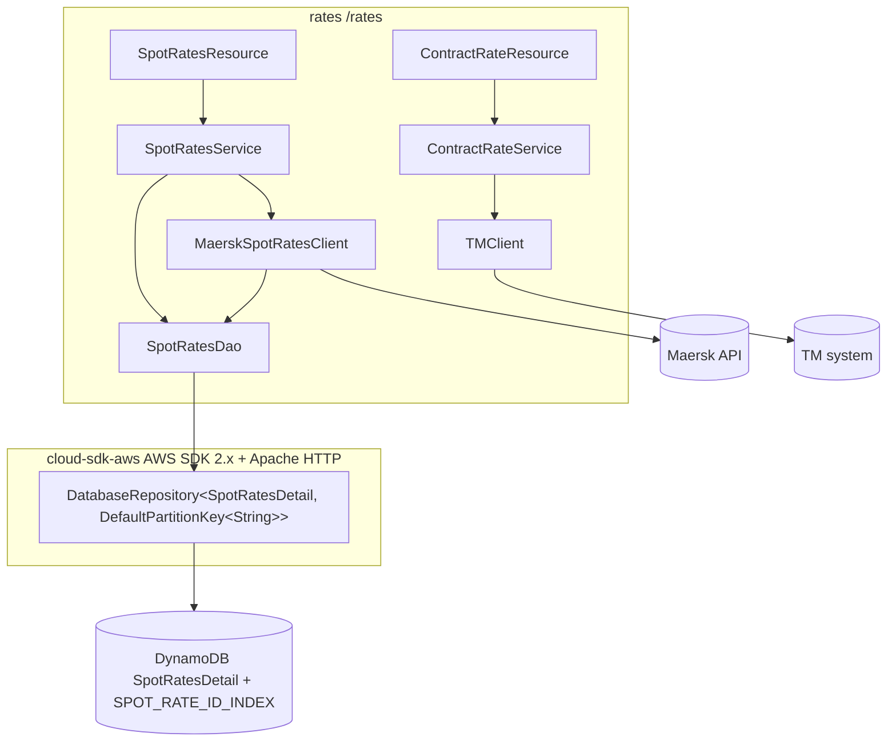

# Rates — AWS SDK 2.x (cloud-sdk) Upgrade Design

**Module:** `rates`
**Date:** 2026-06-30
**Status:** Target design (AWS 1.x → AWS 2.x via cloud-sdk) — **NOT STARTED**
**Companion:** `2026-06-30-rates-current-state-DESIGN-claude.md`
**Reference upgrades:** `booking` (already migrated a **byte-for-byte twin** of this entity — primary reference),
`network`/`registration` (DynamoDB DAO patterns)

---

## 1. Change Overview

Replace all AWS SDK v1 (`com.amazonaws.*`) usage with the in-house **cloud-sdk** (`cloud-sdk-api` + `cloud-sdk-aws`,
AWS SDK 2.x Enhanced Client + Apache HTTP under the hood). Exactly **one** AWS service is in scope.

| AWS service | Current (v1) | Target (cloud-sdk / v2) |
|-------------|--------------|--------------------------|
| **DynamoDB** | `aws-java-sdk-dynamodb 1.12.655` (direct) + transitive via `dynamo-client`; `AmazonDynamoDB`/`DynamoDBMapper`/`DynamoSupport` + v1 ORM annotations | `com.inttra.mercury.cloudsdk.database.api.DatabaseRepository<T,K>` + `DynamoRepositoryFactory.createEnhancedRepository(...)` + enhanced-client annotations + `DefaultQuerySpec` |

**Out of scope:** the Maersk / TM / network REST integrations (`ExternalClient`, MapStruct mappers, `TMClient`,
Swagger, Jackson-XML — all unaffected); Parameter Store (`${awsps:}` still resolved by commons). **No S3, SQS, SNS,
SES, or Kinesis** exists in this module.

**Backward-compatibility is mandatory.** `rates` writes into the shared **`*_booking` DynamoDB namespace**, and
**booking has already migrated the identical `SpotRatesDetail` table to the enhanced client** — so rates must produce
**exactly** booking's on-wire shape. The following must stay wire-identical:

- Table name `SpotRatesDetail` (prefixed `<environment>_`, e.g. `inttra2_test_booking_SpotRatesDetail` in CVT); hash
  key attribute `spotRateKey` (S); GSI `SPOT_RATE_ID_INDEX` on `spotRateId` (S).
- TTL attribute `expiresOn` as **epoch-seconds (N)** with millisecond precision dropped (`(t/1000)*1000`); 400-day
  expiry computed from `audit.createdDateUtc`.
- `spotRates` as a **JSON string (S)**: `"<fqcn>:<json>"`, or `"<rawLen>|<fqcn>:<base64(gzip(json))>"` when the JSON
  exceeds 300 KB; Jackson configured `FAIL_ON_UNKNOWN_PROPERTIES=false`, `SORT_PROPERTIES_ALPHABETICALLY=true`.
- `audit` as a **map (M)** with `createdDateUtc`/`lastModifiedDateUtc` as ISO date-time strings; `carrierId`,
  `carrierResponse`, `spotRateId` as plain strings (S).
- **Decoupling rule:** the DynamoDB on-wire encodings are independent of the REST JSON. `Audit`'s Jackson
  `@JsonFormat(pattern="yyyy-MM-dd'T'HH:mm:ss.SSSZ", timezone="UTC")` governs the REST representation, while the
  `AttributeConverter` governs the DynamoDB attribute (`OffsetDateTimeTypeConverter` writes `ISO_DATE_TIME`). Keep both
  their **current, distinct** encodings; do not let the v2 converter leak into the JSON path or vice-versa.

---

## 2. Maven Dependency Changes

```diff
  <properties>
-   <mercury.commons.version>1.R.01.023</mercury.commons.version>
-   <mercury.dynamodbclient.version>1.R.01.023</mercury.dynamodbclient.version>
-   <dynamodb-local.version>1.11.86</dynamodb-local.version>
+   <mercury.commons.version>1.0.26-SNAPSHOT</mercury.commons.version>
+   <jackson.version>2.21.0</jackson.version>
  </properties>

+ <!-- Pin Jackson to one line so swagger / jackson-dataformat-xml / cloud-sdk don't drift (see booking pom) -->
+ <dependencyManagement>
+   <dependencies>
+     <dependency>
+       <groupId>com.fasterxml.jackson</groupId>
+       <artifactId>jackson-bom</artifactId>
+       <version>${jackson.version}</version>
+       <type>pom</type><scope>import</scope>
+     </dependency>
+   </dependencies>
+ </dependencyManagement>

  <dependencies>
    <dependency>
      <groupId>com.inttra.mercury</groupId>
      <artifactId>commons</artifactId>
      <version>${mercury.commons.version}</version>
    </dependency>

-   <dependency>
-     <groupId>com.inttra.mercury</groupId>
-     <artifactId>dynamo-client</artifactId>
-     <version>${mercury.dynamodbclient.version}</version>
-   </dependency>
-   <!-- direct v1 DynamoDB removed from prod -->
-   <dependency>
-     <groupId>com.amazonaws</groupId>
-     <artifactId>aws-java-sdk-dynamodb</artifactId>
-     <version>1.12.655</version>
-   </dependency>
+   <dependency>
+     <groupId>com.inttra.mercury</groupId>
+     <artifactId>cloud-sdk-api</artifactId>
+     <version>${mercury.commons.version}</version>
+   </dependency>
+   <dependency>
+     <groupId>com.inttra.mercury</groupId>
+     <artifactId>cloud-sdk-aws</artifactId>
+     <version>${mercury.commons.version}</version>
+   </dependency>

+   <!-- DynamoDB Local integration-test framework -->
+   <dependency>
+     <groupId>com.inttra.mercury</groupId>
+     <artifactId>dynamo-integration-test</artifactId>
+     <version>${mercury.commons.version}</version>
+     <scope>test</scope>
+   </dependency>
+   <!-- AWS SDK v1 DynamoDB kept ONLY for DynamoDB Local in tests (matches booking) -->
+   <dependency>
+     <groupId>com.amazonaws</groupId>
+     <artifactId>aws-java-sdk-dynamodb</artifactId>
+     <version>1.12.721</version>
+     <scope>test</scope>
+   </dependency>
  </dependencies>
```

- **Removed (prod):** `dynamo-client` **and** the direct `aws-java-sdk-dynamodb 1.12.655`. After this there is **no
  `com.amazonaws` on the prod classpath** — which means the stray v1 annotations in `ContainerType` (§4.4) must be
  fixed in the same change or compilation breaks.
- The unused `dynamodb-local.version` property is dropped (the v1 DynamoDB test dependency now carries DynamoDB Local
  via `dynamo-integration-test`).
- cloud-sdk uses **Apache HTTP** (no Netty), matching the booking/visibility rebase. MapStruct, Swagger, and
  `jackson-dataformat-xml` are unaffected.

---

## 3. Configuration Changes (`conf/<env>/config.yaml`)

The `spotRateConfig.dynamoDbConfig` block keeps its existing keys and adds the cloud-sdk `BaseDynamoDbConfig` fields.
The `environment` prefixes — **including CVT's `inttra2_test_booking`** — and capacities stay unchanged.

```diff
  spotRateConfig:
    spotRatesEnabled: ${awsps:/inttra2/cvt/rates/config/spotRates}
    dynamoDbConfig:
      readCapacityUnits: 25
      writeCapacityUnits: 25
      environment: inttra2_test_booking   # CVT; INT inttra_int_booking, QA inttra2_qa_booking, PROD inttra2_prod_booking
      sseEnabled: false                    # PROD stays true
+     region: us-east-1
+     # local Dynamo emulator only:
+     #regionEndpoint: http://localhost:8000
+     #signingRegion: us-west-2
    services:
      - name: maersk-spot-rates            # unchanged
        ...
```

**Config class change** — `SpotRateConfig.dynamoDbConfig` moves from
`com.inttra.mercury.dynamo.respository.module.DynamoDbConfig` to
`com.inttra.mercury.cloudsdk.database.config.BaseDynamoDbConfig` (the type booking's `BookingConfig.dynamoDbConfig`
already uses):

```diff
- import com.inttra.mercury.dynamo.respository.module.DynamoDbConfig;
+ import com.inttra.mercury.cloudsdk.database.config.BaseDynamoDbConfig;
  @Data
  public class SpotRateConfig {
    @Valid @NotNull private String spotRatesEnabled;
    @Valid @NotNull List<ExternalServiceDefinition> services;
-   @Valid @NotNull private DynamoDbConfig dynamoDbConfig;
+   @Valid @NotNull private BaseDynamoDbConfig dynamoDbConfig;
  }
```

> The commented `regionEndpoint`/`signingRegion` keys keep working for the local emulator — `BaseDynamoDbConfig`
> exposes the equivalent overrides used by `DynamoRepositoryFactory`.

---

## 4. Per-Service Spec — DynamoDB

The migrated `booking` module contains a **near-verbatim twin** of this entity at
`com.inttra.mercury.booking.carrierspotrates.model.canonical.SpotRatesDetail` (same table, same hash key, same
`SPOT_RATE_ID_INDEX`, same `@TTL expiresOn`, same `SpotRates`/`Audit` fields). The rates migration should mirror it
field-for-field.

### 4.1 Entity — `SpotRatesDetail`

**Before (v1 ORM):**
```java
@DynamoDBTable(tableName = "SpotRatesDetail")
public class SpotRatesDetail implements Expires, DynamoHashKey<String> {
  public static final String SPOT_RATE_ID_INDEX = "SPOT_RATE_ID_INDEX";
  @DynamoDBIgnore private String spotRateKey;
  @DynamoDBAttribute private Audit audit;
  @DynamoDBAttribute private String carrierId;
  @DynamoDBAttribute @DynamoDBTypeConverted(converter = SpotRatesConverter.class) private SpotRates spotRates;
  @DynamoDBAttribute private String carrierResponse;
  @DynamoDBAttribute @DynamoDBTypeConverted(converter = DateToEpochSecond.class) private Date expiresOn;
  @DynamoDBAttribute @DynamoDBIndexHashKey(globalSecondaryIndexName = SPOT_RATE_ID_INDEX) private String spotRateId;
  @DynamoDBHashKey @DynamoDBAttribute(attributeName = "spotRateKey") public String getHashKey() { return spotRateKey; }
}
```

**After (Enhanced client — mirrors booking exactly):**
```java
import com.inttra.mercury.cloudsdk.database.annotation.GsiConfig;
import com.inttra.mercury.cloudsdk.database.annotation.TTL;
import com.inttra.mercury.cloudsdk.database.annotation.Table;
import com.inttra.mercury.cloudsdk.database.converter.DateEpochSecondAttributeConverter;
import software.amazon.awssdk.enhanced.dynamodb.mapper.annotations.*;
import software.amazon.awssdk.services.dynamodb.model.ProjectionType;

@Table(name = "SpotRatesDetail")
@DynamoDbBean
public class SpotRatesDetail implements Expires {
  public static final String SPOT_RATE_ID_INDEX = "SPOT_RATE_ID_INDEX";
  private String spotRateKey; private Audit audit; private String carrierId;
  private SpotRates spotRates; private String carrierResponse;
  @TTL private Date expiresOn; private String spotRateId;

  @DynamoDbPartitionKey @DynamoDbAttribute("spotRateKey")
  public String getSpotRateKey() { return spotRateKey; }

  @DynamoDbConvertedBy(SpotRatesAttributeConverter.class) @DynamoDbAttribute("spotRates")
  public SpotRates getSpotRates() { return spotRates; }

  @DynamoDbConvertedBy(DateEpochSecondAttributeConverter.class) @DynamoDbAttribute("expiresOn")
  public Date getExpiresOn() { return expiresOn; }            // epoch-seconds N, wire-identical

  @GsiConfig(indexName = SPOT_RATE_ID_INDEX, projection = ProjectionType.KEYS_ONLY)  // verify projection vs existing table
  @DynamoDbSecondaryPartitionKey(indexNames = SPOT_RATE_ID_INDEX) @DynamoDbAttribute("spotRateId")
  public String getSpotRateId() { return spotRateId; }

  @DynamoDbConvertedBy(AuditAttributeConverter.class) @DynamoDbAttribute("audit")
  public Audit getAudit() { return audit; }
  // carrierId / carrierResponse: plain @DynamoDbAttribute getters
}
```

- The `spotRateKey` UUID is generated in `SpotRatesDao.calcRandomUUID()` (`UUID.randomUUID()` dashes stripped) — there
  was never a v1 `@DynamoDBAutoGeneratedKey`, so no auto-gen gap; the service-side generation carries over unchanged.
- `setExpiresOn` keeps the `(t/1000)*1000` millisecond drop (matches booking).
- The deprecated `getHashKey()`/`setHashKey()` accessors may be retained `@JsonIgnore @Deprecated` for source
  compatibility (as booking did) but no longer define the key.
- **GSI projection:** booking annotated `KEYS_ONLY`. The existing `*_booking_SpotRatesDetail` GSI projection is
  whatever was originally provisioned (not declared in the rates entity today). `// TODO verify the live GSI projection
  and match it` — `findBySpotRateId` only needs `spotRateKey` from the GSI before the hash-key fetch, so KEYS_ONLY is
  sufficient behaviourally.

### 4.2 Converters → `software.amazon.awssdk.enhanced.dynamodb.AttributeConverter`

| v1 converter | v2 replacement | On-wire encoding (must stay identical) |
|---|---|---|
| `SpotRatesConverter` | `SpotRatesAttributeConverter` (`AttributeValue` `S`) | `"<fqcn>:<json>"` / `"<len>|<fqcn>:<base64(gzip(json))>"` above 300 KB; same `ObjectMapper` flags | 
| `DateToEpochSecond` | `DateEpochSecondAttributeConverter` (cloud-sdk built-in, `AttributeValue` `N`) | epoch-seconds |
| `OffsetDateTimeTypeConverter` | port to an `OffsetDateTime` `AttributeConverter` (used inside `AuditAttributeConverter`) | `ISO_DATE_TIME` write; `ISO_OFFSET_DATE_TIME` read w/ `ISO_DATE` fallback |

`Audit` (`@DynamoDBDocument` today) becomes a map encoded by `AuditAttributeConverter` (booking ships one). Confirm
booking's `SpotRatesAttributeConverter`/`AuditAttributeConverter` produce byte-identical strings to the rates v1
converters before reusing; if booking's `ObjectMapper` flags differ (e.g. `SORT_PROPERTIES_ALPHABETICALLY`), port the
rates converter instead so already-cached items keep parsing.

### 4.3 DAO — `SpotRatesDao`

**Before (v1, extends `DynamoDBCrudRepository`):**
```java
public class SpotRatesDao extends DynamoDBCrudRepository<SpotRatesDetail, DynamoHashAndSortKey<String,String>> {
  @Inject public SpotRatesDao(DynamoDBMapper m, DynamoDBMapperConfig c) { super(m, c, DynamoRepositoryConfig...); }
  public List<SpotRatesDetail> findByOfferKey(String k) {
    return query(k, "spotRateKey = :hashKeyValue", DYNAMO_READ_BEHAVIOUR.CONSISTENT); }
  public List<SpotRatesDetail> findBySpotRateId(String id) {
    var r = query(SPOT_RATE_ID_INDEX, id, null, "spotRateId = :hashKeyValue", NOT_CONSISTENT);
    return r.isEmpty() ? new ArrayList<>() : findByOfferKey(r.get(0).getSpotRateKey()); }
  public void saveSpotRates(...) { ... this.save(spotRatesDetail); }
}
```

**After (injected `DatabaseRepository` + `DefaultQuerySpec` — mirrors booking `SpotRatesDao`):**
```java
import com.inttra.mercury.cloudsdk.database.api.DatabaseRepository;
import com.inttra.mercury.cloudsdk.database.api.id.DefaultPartitionKey;
import com.inttra.mercury.cloudsdk.database.impl.DefaultQuerySpec;
import com.inttra.mercury.cloudsdk.database.model.CloudAttributeValue;

public class SpotRatesDao {
  private static final int DAYS_TO_EXPIRE = 400;
  private final DatabaseRepository<SpotRatesDetail, DefaultPartitionKey<String>> repository;

  @Inject public SpotRatesDao(DatabaseRepository<SpotRatesDetail, DefaultPartitionKey<String>> repository) {
    this.repository = repository;
  }

  public List<SpotRatesDetail> findByOfferKey(String offerKey) {                 // consistent base-table read
    return repository.findById(new DefaultPartitionKey<>(offerKey), true)
                     .map(List::of).orElseGet(List::of);
  }

  public List<SpotRatesDetail> findBySpotRateId(String spotRateId) {             // GSI then hash-key fetch
    List<SpotRatesDetail> hits = repository.query(DefaultQuerySpec.builder()
        .indexName(SpotRatesDetail.SPOT_RATE_ID_INDEX)
        .partitionKeyValue(CloudAttributeValue.ofString(spotRateId))
        .consistentRead(false)
        .build());
    return hits.isEmpty() ? new ArrayList<>() : findByOfferKey(hits.get(0).getSpotRateKey());
  }

  public void saveSpotRates(String inttraCompanyId, Audit audit, String carrierResponse, SpotRates spotRates) {
    SpotRatesDetail d = new SpotRatesDetail(calcRandomUUID(), spotRates.getSpotRateId(),
        calcExpiresOn(audit.getCreatedDateUtc()));
    d.setAudit(audit); d.setCarrierId(inttraCompanyId); d.setSpotRates(spotRates); d.setCarrierResponse(carrierResponse);
    repository.save(d);
  }
  // calcRandomUUID / calcExpiresOn unchanged
}
```

- **The GSI→hash-key two-step in `findBySpotRateId` is preserved** (KEYS_ONLY GSI projection then a consistent
  base-table read for the full item) — this is a behavioural contract, keep it.
- `findByOfferKey`'s `CONSISTENT` read maps to `findById(key, true)`; the GSI read stays eventually-consistent
  (`consistentRead(false)`).

### 4.4 Stray v1 annotations — `ContainerType`

`networkservices/containertype/model/ContainerType` imports `@DynamoDBDocument` + `@DynamoDBTypeConvertedEnum` from
`com.amazonaws` despite being a non-persisted REST DTO. Once the prod `aws-java-sdk-dynamodb` is removed these imports
won't resolve. **Drop the annotations** (the class is never written to DynamoDB) — no enhanced-client replacement is
needed.

---

## 5. Guice Wiring Changes

```diff
  // RatesApplication — module generators unchanged in shape:
  //   moduleGenerators.add(RatesModule::new);
- //   moduleGenerators.add(SpotRatesModule::new);   // v1 client/mapper module
+ //   moduleGenerators.add(SpotRatesModule::new);   // now a cloud-sdk repo/provider module (renamed bindings)
```

```diff
  // SpotRatesModule.configure()
- DynamoDbConfig dynamoDbConfig = ratesConfig.getSpotRateConfig().getDynamoDbConfig();
- AmazonDynamoDB amazonDynamoDBClient = DynamoSupport.newClient(dynamoDbConfig);
- bind(AmazonDynamoDB.class).toInstance(amazonDynamoDBClient);
- DynamoDBMapperConfig cfg = DynamoSupport.newDynamoDBMapperConfig(dynamoDbConfig);
- bind(DynamoDBMapperConfig.class).toInstance(cfg);
- DynamoDBMapper mapper = DynamoSupport.newMapper(amazonDynamoDBClient, dynamoDbConfig, cfg);
- bind(DynamoDBMapper.class).toInstance(mapper);
  // (keep the @Named ExternalServiceDefinition bindings for the maersk-* services)
```

```diff
+ // SpotRatesModule — cloud-sdk providers (pattern lifted from BookingDynamoModule)
+ @Provides @Singleton
+ DynamoDbClientConfig provideDynamoDbClientConfig(RatesConfig c) {
+     BaseDynamoDbConfig cfg = c.getSpotRateConfig().getDynamoDbConfig();
+     return cfg.toClientConfigBuilder().build();        // region/endpoint/prefix from BaseDynamoDbConfig
+ }
+ @Provides @Singleton
+ SpotRatesDao provideSpotRatesDao(DynamoDbClientConfig clientConfig) {
+     String tableName = clientConfig.getTablePrefix()
+         + SpotRatesDetail.class.getAnnotation(Table.class).name();   // cloudsdk.database.annotation.Table
+     DatabaseRepository<SpotRatesDetail, DefaultPartitionKey<String>> repo =
+         DynamoRepositoryFactory.createEnhancedRepository(clientConfig, tableName, SpotRatesDetail.class,
+             DynamoRepositoryConfig.builder().domainType(SpotRatesDetail.class).build());
+     return new SpotRatesDao(repo);
+ }
```

`DynamoSupport` is deleted (the factory replaces both the client and the mapper). `MaerskSpotRatesClient` and
`SpotRatesService` are unchanged — they depend on `SpotRatesDao`, whose constructor signature changes from
`(DynamoDBMapper, DynamoDBMapperConfig)` to `(DatabaseRepository<…>)`.

---

## 6. Target Component Diagram



## 7. Target Data Flow — spot rate persist + GSI re-read (after)

```mermaid
sequenceDiagram
  participant M as MaerskSpotRatesClient
  participant MAP as MaerskRateMapper
  participant DAO as SpotRatesDao
  participant REPO as DatabaseRepository (cloud-sdk)
  participant DDB as DynamoDB

  M->>MAP: map Maersk Offers -> SpotRates
  M->>DAO: saveSpotRates(companyId, audit, rawJson, spotRates)
  DAO->>DAO: spotRateKey = UUID; expiresOn = created+400d (epoch-sec)
  DAO->>REPO: save(SpotRatesDetail)  (Enhanced client PutItem)
  REPO->>DDB: putItem (SpotRatesAttributeConverter S, DateEpochSecondAttributeConverter N)

  note over DAO,DDB: re-read by id
  DAO->>REPO: query SPOT_RATE_ID_INDEX where spotRateId = :v (consistentRead=false)
  REPO->>DDB: query GSI (KEYS_ONLY)
  DDB-->>REPO: spotRateKey(s)
  DAO->>REPO: findById(spotRateKey, true)  (consistent base-table read)
  REPO->>DDB: getItem
```

---

## 8. Key Classes Changed

| Class | Change |
|-------|--------|
| `pom.xml` | remove `dynamo-client` + direct `aws-java-sdk-dynamodb` (prod); add `cloud-sdk-api` + `cloud-sdk-aws`; add `dynamo-integration-test` + test-scoped `aws-java-sdk-dynamodb`; pin Jackson; drop `dynamodbclient.version`/`dynamodb-local.version` props. |
| `SpotRateConfig` | `dynamoDbConfig` type `DynamoDbConfig` → `BaseDynamoDbConfig`. |
| `SpotRatesModule` | drop `AmazonDynamoDB`/`DynamoDBMapper`/`DynamoDBMapperConfig` bindings; add `DynamoDbClientConfig` + `SpotRatesDao` providers (keep `@Named` maersk service-definition bindings). |
| `DynamoSupport` | **removed** (`DynamoRepositoryFactory` replaces client + mapper construction). |
| `SpotRatesDetail` | v1 ORM annotations → `@DynamoDbBean`/`@Table` + `@DynamoDbPartitionKey`/`@DynamoDbSecondaryPartitionKey`/`@TTL`/`@GsiConfig`; getters carry `@DynamoDbConvertedBy`. |
| `Audit` | `@DynamoDBDocument` → encoded via `AuditAttributeConverter`; timestamps via ported `OffsetDateTime` converter. |
| `SpotRatesDao` | `extends DynamoDBCrudRepository<…, DynamoHashAndSortKey>` → injected `DatabaseRepository<…, DefaultPartitionKey<String>>`; `query(...)`→`DefaultQuerySpec`; `findByOfferKey`→`findById(key, true)`; preserve GSI→hash-key two-step. |
| `SpotRatesConverter`, `DateToEpochSecond`, `OffsetDateTimeTypeConverter` | re-implement as `AttributeConverter` (reuse booking's `SpotRatesAttributeConverter` / `DateEpochSecondAttributeConverter` / `AuditAttributeConverter` after verifying byte-identity). |
| `ContainerType` (networkservices) | drop the stray `@DynamoDBDocument`/`@DynamoDBTypeConvertedEnum` v1 annotations so no `com.amazonaws` remains on the prod classpath. |

---

## 9. Testing Strategy

- **DynamoDB-Local IT** (`dynamo-integration-test` `BaseDynamoDbIT`, `@Tag("integration")`) for `SpotRatesDao`:
  `save`→`findByOfferKey` round-trip on `spotRateKey`; `findBySpotRateId` GSI query + the two-step hash-key fetch; TTL
  `expiresOn` written as epoch-seconds (assert `N`, ms dropped); converter fidelity — write an item with the v1
  `SpotRatesConverter` format (including the GZIP-above-300 KB branch) and assert the new `AttributeConverter` reads it
  back identically; `Audit` map round-trip with both timestamp encodings.
- **Cross-module compat:** assert a `SpotRatesDetail` written by **booking's** enhanced client is readable by rates'
  repository and vice-versa (shared `*_booking_SpotRatesDetail` table).
- Maersk MapStruct mapper unit tests (`MaerskRateMapperTest`, etc.) and `ContractRateService`/`TMClient` tests are
  unaffected; update `SpotRatesDaoTest` / `SpotRatesModuleTest` / `DynamoSupportTest` for the new types (`DynamoSupport`
  test is deleted with the class).
- Certify **full local JaCoCo coverage** on all changed code:
  ```
  mvn -f rates/pom.xml clean verify
  ```

---

## 10. Risks & Call-outs

- **Lowest-risk upgrade in the batch** — a single AWS service, one entity, one DAO, no S3/SQS/SNS/Kinesis, and a
  pre-existing **booking twin** (`carrierspotrates.SpotRatesDetail`) to copy field-for-field.
- **Shared `*_booking` namespace.** `rates` reads/writes the same `SpotRatesDetail` table that booking already
  migrated. The on-wire shape (converters, TTL, GSI) must match booking **exactly**; verify booking's
  `SpotRatesAttributeConverter`/`AuditAttributeConverter` output is byte-identical to the rates v1 converters before
  reuse, else port the rates converters so already-cached rates stay readable.
- **TTL epoch-seconds + JSON converter fidelity** are the core hazards (the `<fqcn>:` prefix and GZIP-above-300 KB
  branch must round-trip).
- **Stray `ContainerType` v1 annotations** are an easy build-breaker — removing prod `com.amazonaws` makes them
  unresolvable; fix in the same commit.
- **No table-bootstrap command in `rates`** — `SpotRatesDetail`/`SPOT_RATE_ID_INDEX` are externally provisioned, so the
  migration does not need an `AbstractDynamoCommand`; just verify the live GSI projection so `@GsiConfig` matches.
- **CVT prefix trap** — CVT uses `inttra2_test_booking` (**not** `inttra2_cvt`); PROD alone has `sseEnabled: true`.
  Carry these through the `BaseDynamoDbConfig` migration.
- **Sequencing** — one outgoing commit per the team workflow, and every commit message must carry the Jira ticket
  prefix (e.g. `ION-xxxxx …`).
