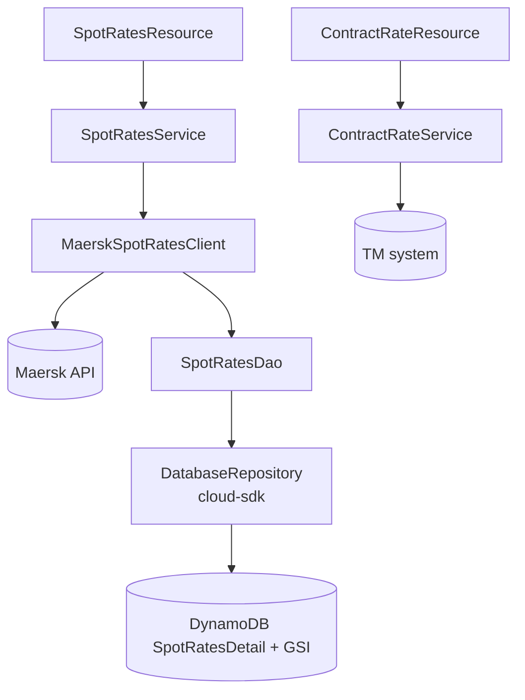
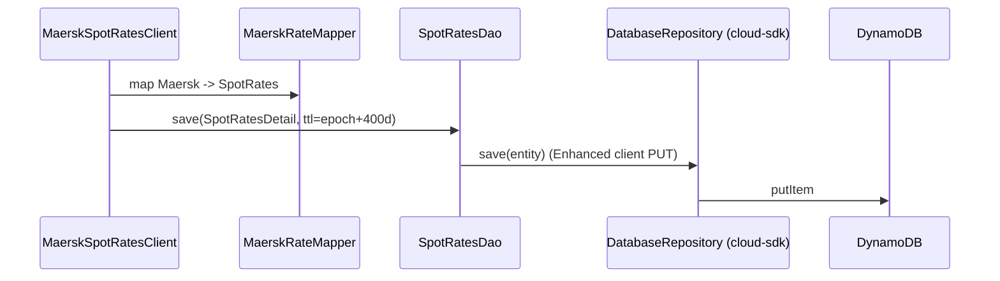

# Rates — AWS SDK 2.x (cloud-sdk) Upgrade Design

**Module:** `rates`
**Date:** 2026-06-30
**Status:** Target design (AWS 1.x → AWS 2.x via cloud-sdk) — NOT STARTED
**Companion:** `2026-06-30-rates-current-state-DESIGN-copilot.md`
**Reference upgrades:** `network`, `registration` (DynamoDB); lowest-complexity in the batch

---

## 1. Change Overview

`rates` uses **only DynamoDB** among AWS services (table `SpotRatesDetail`). The upgrade replaces the direct AWS SDK v1
DynamoDB client/mapper with the cloud-sdk Enhanced-client repository.

| AWS service | Current (v1) | Target (cloud-sdk / v2) |
|-------------|--------------|--------------------------|
| **DynamoDB** | `aws-java-sdk-dynamodb 1.12.655` + `DynamoDBMapper` + `DynamoSupport` + v1 ORM | `DatabaseRepository<T,K>` + `DynamoRepositoryFactory` + Enhanced-client annotations |

No SQS/SNS/S3/SES. The Maersk/TM/network REST integrations are unaffected.

**Backward-compat:** preserve table `SpotRatesDetail`, hash key `spotRateKey`, GSI `SPOT_RATE_ID_INDEX`, and the
**TTL `expiresOn` epoch-seconds encoding** (400-day expiry) so already-cached rates remain readable.

---

## 2. Maven Dependency Changes

```diff
  <properties>
+   <mercury.commons.version>1.0.26-SNAPSHOT</mercury.commons.version>
  </properties>

    <dependency>
      <groupId>com.inttra.mercury</groupId>
      <artifactId>commons</artifactId>
-     <version>1.R.01.023</version>
+     <version>${mercury.commons.version}</version>
    </dependency>
-   <dependency>
-     <groupId>com.inttra.mercury</groupId>
-     <artifactId>dynamo-client</artifactId>
-     <version>1.R.01.023</version>
-   </dependency>
-   <dependency>
-     <groupId>com.amazonaws</groupId>
-     <artifactId>aws-java-sdk-dynamodb</artifactId>
-     <version>1.12.655</version>
-   </dependency>
+   <dependency>
+     <groupId>com.inttra.mercury</groupId>
+     <artifactId>cloud-sdk-api</artifactId>
+     <version>${mercury.commons.version}</version>
+   </dependency>
+   <dependency>
+     <groupId>com.inttra.mercury</groupId>
+     <artifactId>cloud-sdk-aws</artifactId>
+     <version>${mercury.commons.version}</version>
+   </dependency>
+   <dependency>
+     <groupId>com.inttra.mercury</groupId>
+     <artifactId>dynamo-integration-test</artifactId>
+     <version>${mercury.commons.version}</version>
+     <scope>test</scope>
+   </dependency>
+   <dependency>
+     <groupId>com.amazonaws</groupId>
+     <artifactId>aws-java-sdk-dynamodb</artifactId>
+     <scope>test</scope>   <!-- DynamoDB Local only -->
+   </dependency>
```

MapStruct/Swagger/Jackson-XML unaffected; pin Jackson via `dependencyManagement`.

---

## 3. Configuration Changes (`conf/<env>/config.yaml`)

```diff
  spotRateConfig:
    dynamoDbConfig:
      readCapacityUnits: 25
      writeCapacityUnits: 25
      environment: inttra_int_booking
+     region: us-east-1
      sseEnabled: false
    spotRatesEnabled: ${awsps:/inttra/int/rates/config/spotRates}
    services: [ ... Maersk ... ]   # unchanged
```

`SpotRateConfig.dynamoDbConfig` field type changes from legacy `DynamoDbConfig` to cloud-sdk `BaseDynamoDbConfig`.

---

## 4. Per-Service Spec — DynamoDB

**Entity before (v1 ORM):**
```java
@DynamoDBTable(tableName = "SpotRatesDetail")
public class SpotRatesDetail {
  @DynamoDBHashKey private String spotRateKey;
  @DynamoDBIndexHashKey(globalSecondaryIndexName="SPOT_RATE_ID_INDEX") private String spotRateId;
  @DynamoDBAttribute @DynamoDBTypeConverted(converter=DateToEpochSecond.class) private Date expiresOn;
  @DynamoDBTypeConverted(converter=SpotRatesConverter.class) private SpotRates spotRates;
}
```

**Entity after (enhanced client):**
```java
@DynamoDbBean
@Table(name = "SpotRatesDetail")
public class SpotRatesDetail {
  @DynamoDbPartitionKey private String spotRateKey;
  @DynamoDbSecondaryPartitionKey(indexNames="SPOT_RATE_ID_INDEX") private String spotRateId;
  @DynamoDbConvertedBy(DateEpochSecondAttributeConverter.class) private Date expiresOn; // epoch-sec TTL preserved
  @DynamoDbConvertedBy(SpotRatesJsonAttributeConverter.class) private SpotRates spotRates;
}
```

**Converters → `AttributeConverter`:**
- `DateEpochSecondAttributeConverter` (cloud-sdk built-in) replaces `DateToEpochSecond` — same epoch-seconds N type.
- `SpotRatesJsonAttributeConverter` replaces `SpotRatesConverter` (JSON String, identical serialization).
- `OffsetDateTimeAttributeConverter` replaces `OffsetDateTimeTypeConverter` (ISO-8601 String).

**Module / DAO before/after:**
```java
// before: SpotRatesModule binds AmazonDynamoDB + DynamoDBMapper via DynamoSupport; SpotRatesDao extends DynamoDBCrudRepository
// after:
@Provides @Singleton DynamoDbClientConfig cfg(RatesConfig c){ return c.getSpotRateConfig().getDynamoDbConfig().toClientConfigBuilder().build(); }
@Provides @Singleton DatabaseRepository<SpotRatesDetail, DefaultPartitionKey<String>> repo(DynamoDbClientConfig cfg){
  String tableName = cfg.getTablePrefix() + SpotRatesDetail.class.getAnnotation(Table.class).name(); // cloudsdk.database.annotation.Table
  return DynamoRepositoryFactory.createEnhancedRepository(cfg, tableName, SpotRatesDetail.class,
      DynamoRepositoryConfig.builder().domainType(SpotRatesDetail.class).build());
}
// SpotRatesDao: repository.save(detail); repository.findById(new DefaultPartitionKey<>(hashKey), true);
// GSI: repository.query(DefaultQuerySpec.builder().indexName("SPOT_RATE_ID_INDEX")
//        .partitionKeyName("spotRateId").partitionKeyValue(CloudAttributeValue.ofString(id)).build());
```

---

## 5. Guice Wiring Changes

```diff
- bind(AmazonDynamoDB.class).toInstance(DynamoSupport.newClient(dynamoDbConfig));
- bind(DynamoDBMapper.class).toInstance(DynamoSupport.newMapper(...));
+ @Provides @Singleton DynamoDbClientConfig provideCfg(RatesConfig c){ ... toClientConfigBuilder().build(); }
+ @Provides @Singleton DatabaseRepository<SpotRatesDetail, DefaultPartitionKey<String>> provideRepo(DynamoDbClientConfig cfg){ ... }
```

`SpotRatesDao` is injected with `DatabaseRepository` instead of `DynamoDBMapper`.

---

## 6. Target Component Diagram



## 7. Target Sequence — spot rate persist (after)



---

## 8. Key Classes Changed

| Class | Change |
|-------|--------|
| `pom.xml` | remove `dynamo-client` + `aws-java-sdk-dynamodb` (prod); add cloud-sdk-api/aws + test deps. |
| `RatesConfig`/`SpotRateConfig` | `dynamoDbConfig` → `BaseDynamoDbConfig`. |
| `SpotRatesModule` | `DynamoSupport` client/mapper → cloud-sdk repo providers. |
| `SpotRatesDetail`, `Audit` | v1 ORM → `@DynamoDbBean`/`@Table`/enhanced keys. |
| `SpotRatesDao` | `DynamoDBCrudRepository` → `DatabaseRepository` + `DefaultQuerySpec`. |
| `SpotRatesConverter`, `DateToEpochSecond`, `OffsetDateTimeTypeConverter` | re-implement as `AttributeConverter`. |
| `DynamoSupport` | removed (factory replaces it). |

---

## 9. Testing Strategy

- **DynamoDB-Local IT** for `SpotRatesDao` (`BaseDynamoDbIT`, `@Tag("integration")`): put/get by `spotRateKey`,
  GSI `SPOT_RATE_ID_INDEX` query, TTL epoch-seconds field, JSON converter fidelity.
- Maersk-mapper unit tests unchanged.
- Full local **JaCoCo** coverage on changed code (`mvn -f rates/pom.xml clean verify`).

---

## 10. Risks & Call-outs

- **Lowest-risk upgrade** (single AWS service, isolated DAO).
- Main fidelity concern: **epoch-seconds TTL** + **JSON converter** must round-trip identically so cached spot rates
  stay readable; preserve table + GSI names.
- No SQS/SNS/S3/SES involved.
