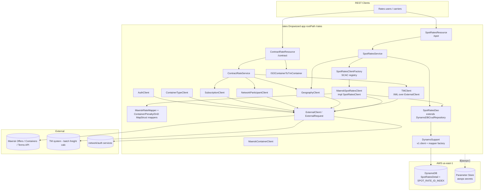
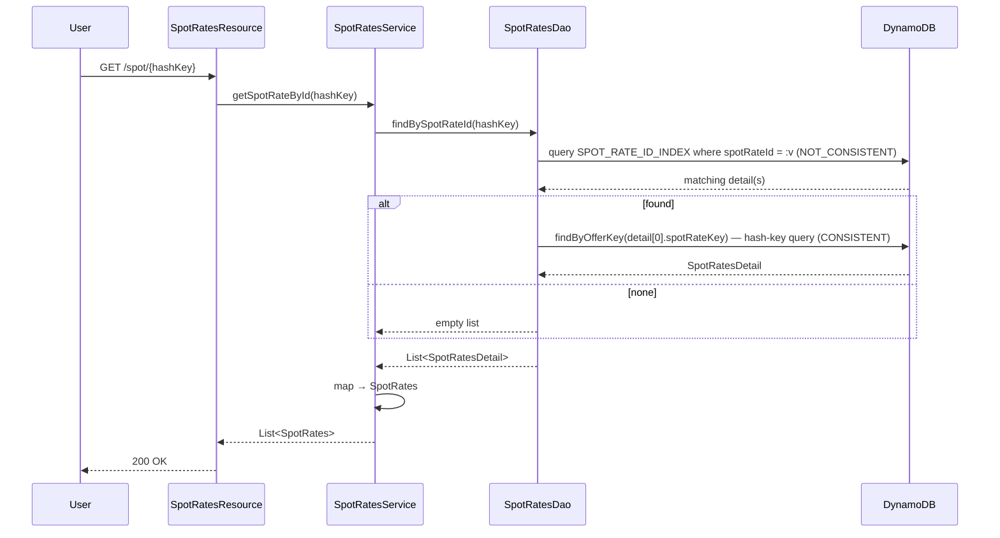
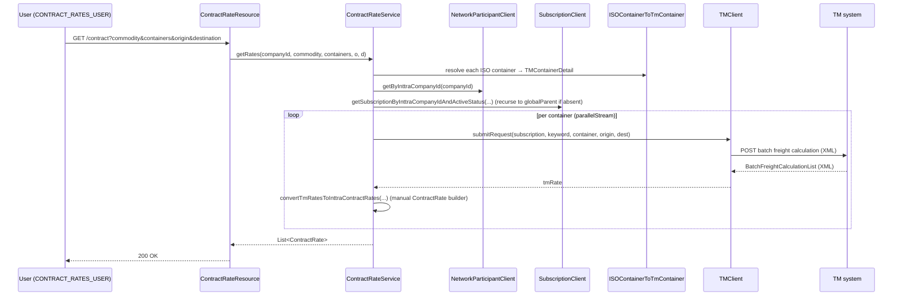

# Rates — Current-State Design

**Module:** `rates`
**Date:** 2026-06-30
**Status:** Current state — AWS SDK **1.x** (`com.amazonaws`) in production; cloud-sdk migration **NOT STARTED**
**Artifact:** `com.inttra.mercury:rates:1.0` (Dropwizard 4 / Jetty 12, single shaded JAR `rates-1.0.jar`)
**Main class:** `com.inttra.mercury.rates.RatesApplication`

---

## 1. Business Purpose & Rules

The `rates` service is the freight-rates lookup service. It exposes **two independent domains** behind one Dropwizard
app (rootPath `/rates`):

- **Spot Rates** (`/spot`) — real-time carrier freight quotes. The only wired carrier client today is **Maersk**
  (`MaerskSpotRatesClient`); `SpotRatesClientFactory` is a SCAC→client registry seeded with a single Maersk client.
  Each live quote is mapped to a canonical `SpotRates` (MapStruct) and **cached in DynamoDB** (`SpotRatesDetail`) with a
  400-day TTL. A persisted quote can be re-read by key.
- **Contract Rates** (`/contract`) — search of negotiated shipper–carrier contract rates via an external **TM**
  (Transportation Management) system. No AWS persistence; purely a request/response orchestration that resolves the
  caller's subscription, maps ISO container codes to TM codes, calls TM batch freight calculation (XML), and maps the
  result back to the INTTRA `ContractRate` schema.

### REST endpoints

| Resource | Path | Verb | Role / Auth |
|----------|------|------|-------------|
| `SpotRatesResource` | `/spot` | GET | authenticated (no `@RolesAllowed`); `carrierScacs`, `originUnloc`, `departureDate`, `destinationUnloc`, `containers` |
| `SpotRatesResource` | `/spot/inttraCompanyId/{inttraCompanyId}` | GET | authenticated; quotes for one carrier company id |
| `SpotRatesResource` | `/spot/{hashKey}` | GET | authenticated; re-read persisted quotes (`getSpotRateById` → `findBySpotRateId`) |
| `ContractRateResource` | `/contract` | GET | **`@RolesAllowed("CONTRACT_RATES_USER")`** |
| `ContractRateResource` | `/contract/containertype` | GET | authenticated; lists ISO container codes available to contract rates |

### Key business rules (pulled from source)

| Domain | Rule | Detail (source) |
|--------|------|------|
| Spot | Origin/destination valid | `SpotRatesService.validateLocation` calls `GeographyClient.getLocationByUncode`; null ⇒ `400 "Invalid <Origin/Destination> location code"`. |
| Spot | Departure date format & not-past | `validateDate`: `LocalDate.parse(date, "yyyy-MM-dd")`; `date.isBefore(LocalDate.now())` ⇒ `400 "cannot be a date in the past"`; parse failure ⇒ `400`. |
| Spot | Container syntax | `splitContainers`: each token `<qty>x<ISO_TYPE>`; `qty` must be digits and `> 0`; empty input ⇒ `400`. Containers are consolidated (summed per ISO code) before the Maersk call. |
| Spot | SCAC scope | If `carrierScacs` blank, all carriers that offer spot rates are queried (`getNetworkParticipantsWithSpotRates`); otherwise each SCAC is resolved via the factory, invalid SCACs are logged and skipped. |
| Spot | Carrier registry | `SpotRatesClientFactory` resolves each configured SCAC (`MAEU, SAFM, SEJJ, SEAU, MCCQ`) to a `NetworkParticipant` via `NetworkParticipantClient.getByScacCode` at construction; unresolvable SCACs are dropped with a warning. |
| Spot | Cache TTL | `SpotRatesDao.DAYS_TO_EXPIRE = 400`; `expiresOn = audit.createdDateUtc + 400d`, stored as DynamoDB **epoch-seconds** (TTL). Millisecond precision is dropped (`(t/1000)*1000`). |
| Spot | Feature flag | `SpotRateConfig.spotRatesEnabled` (`${awsps:.../rates/config/spotRates}`) exposes `isSpotRatesEnabled()`. **Note:** the flag is parsed but is **not** referenced by any current-state class (`getSpotRates*` paths do not gate on it) — present in config/POJO only. `// TODO verify intended gate.` |
| Contract | Role | `@RolesAllowed("CONTRACT_RATES_USER")`; missing `companyId` on the principal ⇒ `404`. |
| Contract | Container syntax | `getContainers`: `<qty>x<ISO>` split on first `x`; `qty` must match `^\d{1,5}$`; ISO code must resolve to a `TMContainer` via `ISOContainerToTmContainer`, else error accumulated → `400`. |
| Contract | Subscription resolution | `getSubscription`: find active subscription for company; if none and a distinct `globalParentId` exists, recurse to the parent company; validates a non-empty first webhook action with a `refId`, else `404`. |
| Contract | Carrier mapping | TM carrier → INTTRA SCAC via `contract-rates/TMCarrierToINTTRAScac.csv` (loaded at construction; missing/empty file ⇒ `IllegalArgumentException`). |

---

## 2. Design & Component Diagram

Layered Dropwizard service started through the shared `InttraServer<RatesConfig>` builder. Two Guice module generators
are registered: `RatesModule` (binds `RatesConfig` + each top-level `ServiceDefinition` by name) and `SpotRatesModule`
(builds the **AWS SDK v1** DynamoDB client/mapper via `DynamoSupport` and binds each spot `ExternalServiceDefinition` by
name). There is **no `DynamoDBCommand` / table-bootstrap command** in this module (unlike bill-of-lading) — the
`SpotRatesDetail` table and its GSI are assumed pre-provisioned in the shared `*_booking` account.



### Key classes & interactions

| Layer | Class | Responsibility |
|-------|-------|----------------|
| Bootstrap | `RatesApplication` | Builds `InttraServer<RatesConfig>`, registers `ContractRateResource` + `SpotRatesResource`, and the two module generators (`RatesModule`, `SpotRatesModule`). |
| Wiring | `RatesModule` (Guice `AbstractModule`) | Binds `RatesConfig`; binds each top-level `serviceDefinitions` entry as `@Named ServiceDefinition`. |
| Wiring | `SpotRatesModule` (Guice `AbstractModule`) | **Builds the v1 DynamoDB stack:** `DynamoSupport.newClient` → `AmazonDynamoDB`, `DynamoSupport.newDynamoDBMapperConfig` → `DynamoDBMapperConfig`, `DynamoSupport.newMapper` → `DynamoDBMapper`; binds each spot `ExternalServiceDefinition` (`maersk-*`) by name. |
| Config | `RatesConfig extends ApplicationConfiguration` | `@NotNull SpotRateConfig spotRateConfig`. |
| Config | `SpotRateConfig` | `spotRatesEnabled` (String flag), `List<ExternalServiceDefinition> services`, `DynamoDbConfig dynamoDbConfig`. |
| Resource | `SpotRatesResource` (`/spot`) | 3 GET endpoints (by SCAC list, by company id, by persisted key). |
| Resource | `ContractRateResource` (`/contract`) | `search` (role-gated) + `/containertype`. |
| Service | `SpotRatesService` | Validates inputs (geography, date, containers), fans out over network participants, delegates to the carrier client; `getSpotRateById` reads the cache. |
| Service | `ContractRateService` | Subscription resolution, container mapping, TM call orchestration, TM→INTTRA `ContractRate` mapping (large manual builder), carrier-SCAC CSV map. |
| Factory | `SpotRatesClientFactory` | `ConcurrentHashMap<scac, {SpotRatesClient, NetworkParticipant}>` seeded from the Maersk client's SCAC list at construction. |
| Carrier | `MaerskSpotRatesClient` (impl `SpotRatesClient`) | Builds the Maersk offers URI (`{base}/brand/{scac}/departuredate/{date}?`), adds `Consumer-key` header, calls via `ExternalRequest`, maps with `MaerskRateMapper`, persists via `spotRatesDao.saveSpotRates`. |
| Carrier | `MaerskContainerClient`, `MaerskTermsAndConditionsClient` | Container-info + terms look-ups against the other two Maersk service definitions. |
| Mapping | `MaerskRateMapper`, `ContainerMapper`, `PenaltyMapper`, `DetentionAndDemurrageMapper` | MapStruct mappers Maersk schema → canonical `SpotRates` graph. |
| Persistence | `SpotRatesDao extends DynamoDBCrudRepository<SpotRatesDetail, DynamoHashAndSortKey<String,String>>` | `findByOfferKey` (hash key, CONSISTENT), `findBySpotRateId` (GSI then hash-key fetch, NOT_CONSISTENT), `saveSpotRates` (builds entity + TTL). |
| Persistence | `DynamoSupport` (util) | v1 `AmazonDynamoDB` + `DynamoDBMapper` + `DynamoDBMapperConfig` factory with `<env>_` table-name prefix override. |
| Model | `SpotRatesDetail` (`@DynamoDBTable("SpotRatesDetail")`) | Entity: hash key `spotRateKey`, GSI hash `spotRateId`, TTL `expiresOn`, JSON-encoded `spotRates`, nested `Audit`. |
| Model | `Audit` (`@DynamoDBDocument`) | Two `OffsetDateTime` timestamps via `OffsetDateTimeTypeConverter`; built from `InttraPrincipal`. |
| Converter | `SpotRatesConverter`, `DateToEpochSecond`, `OffsetDateTimeTypeConverter` | v1 `DynamoDBTypeConverter` impls (see §7). |
| External | `TMClient` | XML (`XmlMapper`, UPPER_CAMEL_CASE) request/response to the TM system over `ExternalClient`. |
| Network | `GeographyClient`, `NetworkParticipantClient`, `SubscriptionClient`, `ContainerTypeClient`, `AuthClient` | JAX-RS look-ups via the shared `ExternalClient`/`NetworkClient`; participant/geography results cached in `ServiceCache`. |

---

## 3. Data Flow

### 3.1 Spot rate query + cache write (read-through)

```mermaid
sequenceDiagram
  participant U as User (authenticated)
  participant R as SpotRatesResource
  participant S as SpotRatesService
  participant G as GeographyClient
  participant F as SpotRatesClientFactory
  participant M as MaerskSpotRatesClient
  participant EC as ExternalClient
  participant API as Maersk Offers API
  participant MAP as MaerskRateMapper
  participant DAO as SpotRatesDao
  participant DDB as DynamoDB SpotRatesDetail

  U->>R: GET /spot?carrierScacs&originUnloc&departureDate&destinationUnloc&containers
  R->>S: getSpotRateOffersByScac(actor, scacs, ...)
  S->>S: validateLocation(origin) / validateLocation(dest)
  S->>G: getLocationByUncode(unloc)  (per origin/dest)
  S->>S: validateDate(yyyy-MM-dd, not past) + splitContainers
  S->>S: new Audit(actor)
  loop per resolved NetworkParticipant
    S->>F: getSpotRatesClientFromScac(scac)
    F-->>S: MaerskSpotRatesClient (or null → skip)
    S->>M: getSpotRates(participant, audit, date, containers, o, d, lang)
    M->>M: buildUri {base}/brand/{scac}/departuredate/{date}? + Consumer-key header
    M->>EC: externalRequest.apply(uri, params, headers, retries, Offers)
    EC->>API: GET offers
    API-->>EC: Offers JSON
    EC-->>M: Offers
    M->>MAP: map(Offers, preferredLanguage) → SpotRates
    alt spotRates != null
      M->>DAO: saveSpotRates(inttraCompanyId, audit, rawJson, spotRates)
      DAO->>DAO: spotRateKey = UUID(no dashes); expiresOn = created + 400d (epoch-sec)
      DAO->>DDB: DynamoDBMapper.save (SpotRatesConverter JSON, DateToEpochSecond TTL)
    end
    M-->>S: SpotRates
  end
  S-->>R: List<SpotRates> (nulls filtered)
  R-->>U: 200 OK + JSON
```

> The `carrierResponse` attribute stores the **raw** Maersk JSON (`JsonUtil.toJsonString(response)`); `spotRates` stores
> the canonical mapped graph (via `SpotRatesConverter`, GZIP+Base64 above 300 KB). Both are persisted on every quote.

### 3.2 Persisted-quote re-read by id (cache read)



> Note the **two-step GSI→hash-key read**: the path param is matched against the GSI hash `spotRateId`, then the first
> hit's `spotRateKey` drives a consistent base-table read. This N+1 shape must be preserved on migration.

### 3.3 Contract rate search (no AWS)



---

## 4. Data Stores & Integrations

### DynamoDB — table `SpotRatesDetail`

- **Hash key:** `spotRateKey` (`@DynamoDBHashKey @DynamoDBAttribute(attributeName="spotRateKey")` on `getHashKey()`;
  the entity implements `DynamoHashKey<String>`, the Java field is `spotRateKey`, also `@DynamoDBIgnore` on the field
  itself so only the getter defines the key). UUID with dashes stripped, generated in `SpotRatesDao.calcRandomUUID`.
- **GSI — `SPOT_RATE_ID_INDEX`:** hash key `spotRateId` (S) (`@DynamoDBIndexHashKey`). No range key declared. Used by
  `findBySpotRateId`. Projection is not declared on the entity (defined at table-provisioning time outside this module).
- **TTL:** `expiresOn` — `@DynamoDBTypeConverted(DateToEpochSecond.class)` → **epoch-seconds (N)**; 400-day expiry,
  ms precision dropped. `Expires.EXPIRES_ON_ATTRIBUTE_NAME = "expiresOn"`.
- **DAO key type:** `SpotRatesDao extends DynamoDBCrudRepository<SpotRatesDetail, DynamoHashAndSortKey<String,String>>`
  — declared as a hash+sort key type even though `SpotRatesDetail` has **only a hash key**; queries pass the hash-key
  value and a `"spotRateKey = :hashKeyValue"` / `"spotRateId = :hashKeyValue"` condition. `// TODO verify the sort-key
  type parameter is vestigial (no sort key in the schema).`
- **Read behaviour:** `findByOfferKey` uses `DYNAMO_READ_BEHAVIOUR.CONSISTENT`; `findBySpotRateId` uses
  `NOT_CONSISTENT` on the GSI.
- **Attribute encodings:** `spotRates` → JSON string (`SpotRatesConverter`, class-name prefix + optional GZIP/Base64);
  `expiresOn` → epoch-seconds number; `audit` → map (M, `@DynamoDBDocument`) with two ISO-8601 timestamp strings;
  `carrierId`, `carrierResponse`, `spotRateId` → plain strings (S).
- **Capacity:** 25 RCU / 25 WCU (config `readCapacityUnits`/`writeCapacityUnits`).
- **Per-env table names** — `DynamoSupport` prefixes the entity table name with `<environment>_`:

  | Env | `dynamoDbConfig.environment` | Effective table | SSE |
  |-----|------------------------------|-----------------|-----|
  | INT | `inttra_int_booking` | `inttra_int_booking_SpotRatesDetail` | false |
  | QA | `inttra2_qa_booking` | `inttra2_qa_booking_SpotRatesDetail` | false |
  | **CVT** | **`inttra2_test_booking`** | `inttra2_test_booking_SpotRatesDetail` | false |
  | PROD | `inttra2_prod_booking` | `inttra2_prod_booking_SpotRatesDetail` | **true** |

  > The table prefix is the shared **`*_booking`** account, not a `rates`-specific prefix — `rates` writes into the
  > booking DynamoDB namespace. CVT uses `inttra2_test_booking` (**not** `inttra2_cvt`). PROD is the only env with
  > `sseEnabled: true`.

### External REST integrations

| Integration | Service definition(s) | Notes |
|---|---|---|
| **Maersk** | `maersk-spot-rates`, `maersk-container-types`, `maersk-terms-and-conditions` | `GET`; `Consumer-key: ${awsps:.../maerskAPIToken}` header on rates/containers (terms has no token); 15 s connect/read timeouts; SCAC list `MAEU, SAFM, SEJJ, SEAU, MCCQ`. Stage host `offers.api-stage.maersk.com` in non-prod, `offers.api.maersk.com` in prod. |
| **TM system** | (URI from subscription `refId`) | XML batch freight calculation via `TMClient` (`XmlMapper`, UPPER_CAMEL_CASE, `yyyyMMdd` inbound / `yyyy-MM-dd` outbound dates). |
| **auth** | `auth` (`clientId`+`clientSecret` from `${awsps:}`) | OAuth token issuance for the internal calls. |
| **network/reference/participants** | `participants` | SCAC↔company resolution. |
| **network/reference/geography** | `geography` | UN/LOCODE validation. |
| **network/subscription/Rates** | `subscription` | Contract-rate subscription resolution. |
| **network/containertype** | `containertype` | ISO container code catalogue. |
| **network/packagetype** | `packagetype` | (defined; package-type lookups). |

> All internal calls go through the shared `ExternalClient`/`NetworkClient` JAX-RS wrapper. Participant/geography
> results are memoised in `ServiceCache`.

### Parameter Store

Secrets resolved by commons at config load: `${awsps:/inttra{2}/<env>/rates/config/spotRates}` (feature flag),
`${awsps:/inttra{2}/<env>/rates/config/maerskAPIToken}` (Maersk consumer key), and
`${awsps:/inttra{2}/<env>/rates/mercuryservices/{authclientid,authclientsecret}}`.

**No S3, SQS, SNS, SES, or Kinesis** is used by `rates`. DynamoDB is the only AWS service touched at runtime.

---

## 5. Maven Dependencies

| Artifact | Version | Notes |
|----------|---------|-------|
| `com.inttra.mercury:commons` | `1.R.01.023` (`${mercury.commons.version}`) | `InttraServer`, `ApplicationConfiguration`, JAX-RS `ServiceDefinition`, `${awsps:}` resolution. |
| `com.inttra.mercury:dynamo-client` | `1.R.01.023` (`${mercury.dynamodbclient.version}`) | `DynamoDBCrudRepository`, `DynamoRepositoryConfig`, `DynamoHashKey`/`DynamoHashAndSortKey`, `DYNAMO_READ_BEHAVIOUR`, `DynamoDbConfig`. |
| **`com.amazonaws:aws-java-sdk-dynamodb`** | **`1.12.655`** | **AWS SDK v1 — DynamoDB client + mapper + ORM annotations, declared DIRECTLY in this POM.** |
| `org.mapstruct:mapstruct` | `1.6.3` | Maersk→canonical mappers (annotation-processor path with `lombok-mapstruct-binding:0.2.0`). |
| `io.swagger:swagger-annotations/core/jaxrs/jersey2-jaxrs/models` | `1.5.24` | OpenAPI; `swagger-maven-plugin:3.1.7` generates `generated/swagger-ui/rates-api-1.0` at `compile`. Many transitive Jackson/snakeyaml/javassist exclusions. |
| `org.webjars:swagger-ui` | `5.18.2` (`runtime`) | Swagger UI assets. |
| `com.fasterxml.jackson.dataformat:jackson-dataformat-xml` | `2.19.2` | TM XML parsing (`TMClient`). |
| `org.yaml:snakeyaml` | `2.3` | YAML (config). |
| `org.junit.jupiter:junit-jupiter` / `org.mockito:mockito-junit-jupiter` / `mockito-core` / `org.assertj:assertj-core` | `5.11.3` / `2.17.0` / `5.14.2` / `3.12.2` (`test`) | Unit + IT. |
| Build | `maven-shade-plugin:3.5.3`, `maven-compiler-plugin:3.13.0` (release **17**), `surefire`/`failsafe:3.2.5` | Fat JAR (`finalName=rates-1.0`), `ServicesResourceTransformer` + `ManifestResourceTransformer` main class. |

> **Unlike most modules, `rates` declares `aws-java-sdk-dynamodb 1.12.655` DIRECTLY** (in addition to the transitive
> v1 pulled by `dynamo-client`). Both must be removed/re-scoped on migration. There is **no `dynamodb-local`** test
> dependency declared today despite the `dynamodb-local.version` property being present (`1.11.86`) — the property is
> set but unused. `// TODO verify no test relies on an inherited dynamodb-local.`

---

## 6. Configuration & Deployment

### `conf/{int,qa,cvt,prod}/config.yaml`

- `server.rootPath: /rates`, `applicationConnectors` 8080, `adminConnectors` 8081, `adminContextPath: /admin`.
- `spotRateConfig.dynamoDbConfig` — `readCapacityUnits: 25`, `writeCapacityUnits: 25`, `environment` (table prefix,
  see §4), `sseEnabled` (false except prod), commented `regionEndpoint`/`signingRegion` for the local Dynamo emulator.
- `spotRateConfig.spotRatesEnabled` — `${awsps:.../rates/config/spotRates}` feature flag.
- `spotRateConfig.services` — the three Maersk service definitions (`uri`, `method`, `connectTimeout`, `readTimeout`,
  `Consumer-key` header, `scacs` list).
- `securityResources` — `oauthTokenValidationUri`, `userInfoUri`, `userPrincipalUri`
  (`api-alpha`/`api-beta`/`api-test`/`api` per env).
- `serviceDefinitions` — `auth` (`clientId`+`clientSecret`), `participants`, `geography`, `subscription`,
  `packagetype`, `containertype`.
- `jerseyClient` — 32/128 threads, `timeout: 10s`, `connectionTimeout: 5s`, `retries: 1`, gzip off.
- **Secrets** resolved by commons via AWS Parameter Store (`${awsps:/inttra{2}/<env>/...}`).
- Config class chain: `RatesConfig extends ApplicationConfiguration` → `SpotRateConfig` →
  `com.inttra.mercury.dynamo.respository.module.DynamoDbConfig`.

### Deployment

- `build.sh` → `mvn ... clean package sonar:sonar -P mercury-commons,sonar ... -pl rates --also-make -P dw-rates`;
  Sonar project `mercury-services.rates`; moves the shaded JAR to `${RELEASE_NAME}.jar`, copies each
  `conf/<env>/config.yaml` to `config.yaml_<env>_conf`, generates the Dockerfile (`FROM <ECR>:e2openjre11`).
- `run.sh` → renames the active env's config to `config.yaml`, deletes the others, then
  `java -Xms128m -Xmx${JVM_Xmx} -jar ${RELEASE_NAME}.jar server ./config.yaml`.
- **Table/GSI bootstrap** — **none in this module** (no `AbstractDynamoCommand`); `SpotRatesDetail` +
  `SPOT_RATE_ID_INDEX` are provisioned externally in the `*_booking` account.
- **Credentials** — default AWS credential chain / ECS task IAM role; `AmazonDynamoDBClientBuilder.standard().build()`
  in `DynamoSupport.newClient` (or `withEndpointConfiguration(...)` when `regionEndpoint` is set, for the local
  emulator). IAM needs DynamoDB read/write on `*_booking_SpotRatesDetail` + the GSI, and `ssm:GetParameter`.

---

## 7. AWS Services & SDK 1.x Usage (CALL-OUT)

> **This module actively uses AWS SDK v1 (`com.amazonaws`) only.** A repo-wide grep finds **zero**
> `software.amazon.awssdk` and **zero** `cloudsdk` references in `rates`. **DynamoDB is the only AWS service** used at
> runtime; `aws-java-sdk-dynamodb 1.12.655` is declared **directly** in the POM.

| AWS service | SDK | Where (class) | Concrete v1 classes |
|-------------|-----|---------------|---------------------|
| **DynamoDB** | v1 (direct + via `dynamo-client`) | `SpotRatesModule`, `DynamoSupport`, `SpotRatesDao`, `SpotRatesDetail`, `Audit`, the three converters | `AmazonDynamoDB`, `AmazonDynamoDBClientBuilder`, `AwsClientBuilder.EndpointConfiguration`, `DynamoDBMapper`, `DynamoDBMapperConfig`, `DynamoDBMapperConfig.TableNameOverride`, `@DynamoDBTable`, `@DynamoDBHashKey`, `@DynamoDBAttribute`, `@DynamoDBIndexHashKey`, `@DynamoDBIgnore`, `@DynamoDBDocument`, `@DynamoDBTypeConverted`, `DynamoDBTypeConverter` |
| **Parameter Store** | resolved by commons (`${awsps:…}`) | config only | — (no direct SSM client) |
| S3 / SQS / SNS / SES / Kinesis | **none** | — | — |

**Client build** (`SpotRatesModule.configure`): `DynamoSupport.newClient(dynamoDbConfig)` →
`AmazonDynamoDBClientBuilder.standard().build()` (or endpoint-config for local), bound as `AmazonDynamoDB`;
`DynamoSupport.newDynamoDBMapperConfig` builds a `DynamoDBMapperConfig` whose `TableNameOverride` and
`TableNameResolver` both prepend `"<environment>_"`; `DynamoSupport.newMapper` builds the `DynamoDBMapper`. All three
are Guice singletons.

**DynamoDB custom converters (v1 `DynamoDBTypeConverter`):**

| Converter | Mapping | On-wire encoding |
|---|---|---|
| `DateToEpochSecond` | `Date` ↔ `Long` | **epoch-seconds** (DynamoDB `N`) — TTL attribute `expiresOn` |
| `SpotRatesConverter` | `SpotRates` ↔ `String` | `"<fqcn>:<json>"`, and `"<rawLen>|<fqcn>:<base64(gzip(json))>"` when serialized JSON > 300 KB; Jackson with `FAIL_ON_UNKNOWN_PROPERTIES=false`, `SORT_PROPERTIES_ALPHABETICALLY=true` |
| `OffsetDateTimeTypeConverter` | `OffsetDateTime` ↔ `String` | `DateTimeFormatter.ISO_DATE_TIME` on write; parse `ISO_OFFSET_DATE_TIME` (falls back to `ISO_DATE`+midnight UTC). Also a Jackson `StdDeserializer`. Used by `Audit.createdDateUtc` / `lastModifiedDateUtc`. |

> **Stray v1 annotations:** `networkservices/containertype/model/ContainerType` imports `@DynamoDBDocument` and
> `@DynamoDBTypeConvertedEnum` even though it is a REST DTO never persisted by the rates DAO. These must still be
> migrated/removed when `aws-java-sdk-dynamodb` is dropped from the prod classpath, or compilation breaks.

---

## 8. AWS 2.x / cloud-sdk Upgrade Plan (High Level)

Goal: replace direct AWS SDK v1 with the in-house **cloud-sdk** (`cloud-sdk-api` + `cloud-sdk-aws`, AWS SDK 2.x
Enhanced Client + Apache HTTP). **`booking` already migrated a byte-for-byte twin of this entity** — its
`carrierspotrates.model.canonical.SpotRatesDetail` is the same table (`SpotRatesDetail`, hash `spotRateKey`, GSI
`SPOT_RATE_ID_INDEX`, TTL `expiresOn`) on the enhanced client, with `SpotRatesAttributeConverter`,
`DateEpochSecondAttributeConverter`, and `AuditAttributeConverter` already written. This is the lowest-risk upgrade in
the batch and can largely lift booking's work.

| Step | Action | Reference |
|------|--------|-----------|
| 1 | Bump `commons` → `1.0.26-SNAPSHOT`; **remove** `dynamo-client` **and the direct `aws-java-sdk-dynamodb 1.12.655`**; add `cloud-sdk-api` + `cloud-sdk-aws`; add `dynamo-integration-test` (test) + test-scoped `aws-java-sdk-dynamodb` (DynamoDB Local); pin Jackson `2.21.0`. | `booking/pom.xml` |
| 2 | **DynamoDB entity** — migrate `SpotRatesDetail` + `Audit` ORM annotations to `@DynamoDbBean`/`@Table` + enhanced keys + `@TTL`/`@GsiConfig`. **Preserve** table name, `spotRateKey` hash key, `SPOT_RATE_ID_INDEX` GSI hash, and the `expiresOn` epoch-seconds + `spotRates` JSON encodings. | `booking` `carrierspotrates.SpotRatesDetail` (exact twin) |
| 3 | **Converters** — re-implement `SpotRatesConverter`→`SpotRatesAttributeConverter`, `DateToEpochSecond`→`DateEpochSecondAttributeConverter` (cloud-sdk built-in), `OffsetDateTimeTypeConverter`→`AuditAttributeConverter`/`OffsetDateTime` converter, as `software.amazon.awssdk.enhanced.dynamodb.AttributeConverter`. | `booking` `dynamodb.converter.*` |
| 4 | **DAO/wiring** — rewrite `SpotRatesDao` on `DatabaseRepository<SpotRatesDetail, DefaultPartitionKey<String>>` + `DefaultQuerySpec` (preserve the GSI→hash-key two-step in `findBySpotRateId`); replace `DynamoSupport`/`SpotRatesModule` v1 bindings with a `BaseDynamoDbConfig` + `DynamoRepositoryFactory` provider module. | `booking` `BookingDynamoModule`, `SpotRatesDao` |
| 5 | Migrate the stray `ContainerType` v1 annotations (drop or port) so no `com.amazonaws` remains on the prod classpath. | — |
| 6 | **Tests** — DynamoDB-Local IT for `SpotRatesDao` (hash-key get, GSI query + two-step fetch, TTL epoch-seconds, converter fidelity); keep Maersk-mapper unit tests; full local JaCoCo. | `booking` `SpotRatesDaoTest`, `network`/`registration` `*DaoIT` |

**Risks / call-outs:**
- **Lowest-complexity upgrade** in the batch — a single AWS service, one entity, one DAO, no S3/SQS/SNS, and a
  pre-existing booking twin to copy.
- **TTL epoch-seconds + JSON converter fidelity** are the core hazards: the `SpotRatesConverter` class-name-prefix +
  GZIP-above-300 KB format and the epoch-seconds `expiresOn` must round-trip identically so already-cached rates stay
  readable.
- **`rates` writes into the shared `*_booking` DynamoDB namespace** — coordinate with booking so both modules' enhanced
  clients agree on the `SpotRatesDetail` table/GSI/encodings (booking already migrated; rates must match it exactly).
- **CVT prefix trap** — CVT is `inttra2_test_booking`, **not** `inttra2_cvt`. PROD alone has `sseEnabled: true`.
- The `DynamoHashAndSortKey<String,String>` key type in `SpotRatesDao` is vestigial (no sort key) and should collapse
  to a partition-key repository on migration.
