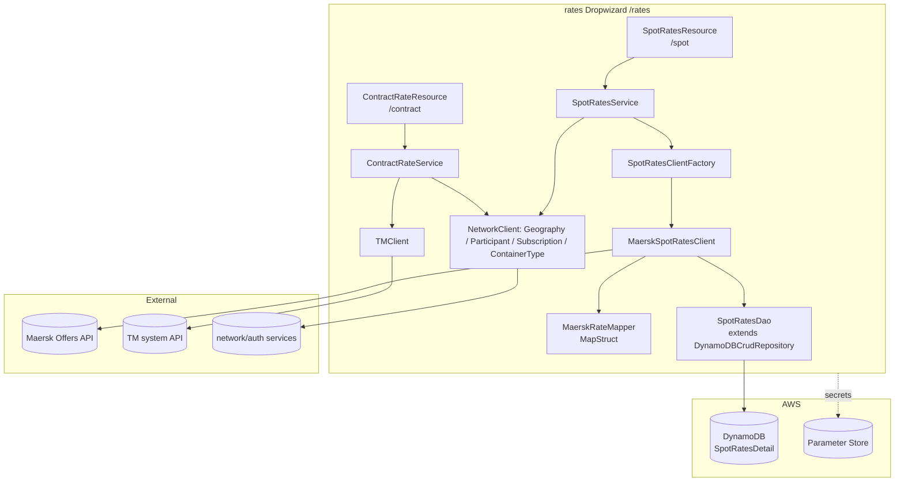
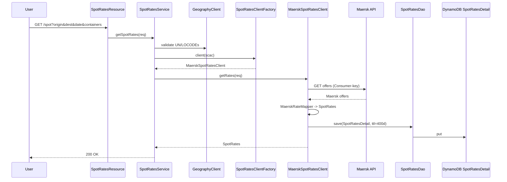
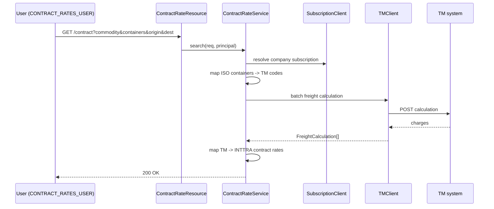

# Rates — Current-State Design

**Module:** `rates`
**Date:** 2026-06-30
**Status:** Current state (AWS SDK 1.x — upgrade NOT STARTED)
**Artifact:** `com.inttra.mercury:rates:1.0` (Dropwizard, single shaded JAR)
**Main class:** `com.inttra.mercury.rates.RatesApplication`

---

## 1. Business Purpose & Rules

The `rates` service is the freight-rates lookup service. It exposes two independent domains:

- **Spot Rates** — real-time carrier freight quotes (currently **Maersk**), persisted/cached in DynamoDB.
- **Contract Rates** — search of negotiated shipper–carrier contract rates via an external **TM** (Transportation
  Management) system.

### Business rules

| Domain | Rules |
|--------|-------|
| Spot | Origin/destination must be valid UN/LOCODE; departure date `yyyy-MM-dd`; containers as `<qty>x<ISO_TYPE>` (≥1); rate cached **400 days** TTL; multi-carrier SCACs (`MAEU, SAFM, SEJJ, SEAU, MCCQ`); FMC-regulated rates filtered. |
| Contract | Requires role `CONTRACT_RATES_USER`; resolve company → subscription; map ISO container codes ↔ TM codes; call TM batch freight calculation; map result back to INTTRA contract-rate schema. |

---

## 2. Design & Component Diagram

### REST endpoints

| Resource | Path | Verb | Role |
|----------|------|------|------|
| `SpotRatesResource` | `/spot` | GET | any (auth) |
| `SpotRatesResource` | `/spot/inttraCompanyId/{id}` | GET | any |
| `SpotRatesResource` | `/spot/{hashKey}` | GET | any |
| `ContractRateResource` | `/contract` | GET | `CONTRACT_RATES_USER` |
| `ContractRateResource` | `/contract/containertype` | GET | any |

### Key classes

| Class | Role |
|-------|------|
| `SpotRatesService` | Validate inputs; coordinate geography, carrier client, persistence. |
| `SpotRatesClientFactory` | SCAC → `SpotRatesClient` impl registry. |
| `MaerskSpotRatesClient` | Call Maersk API (Consumer-key header), map + persist. |
| `MaerskRateMapper` (MapStruct) | Maersk schema → canonical `SpotRates`. |
| `SpotRatesDao` (extends `DynamoDBCrudRepository`) | Hash-key + GSI queries on `SpotRatesDetail`. |
| `SpotRatesDetail` (`@DynamoDBTable("SpotRatesDetail")`) | Entity with `expiresOn` TTL + GSI. |
| `ContractRateService` / `TMClient` / `ISOContainerToTmContainer` | Contract-rate orchestration + TM mapping. |

---

## 3. Data Flow

### 3.1 Spot rate query

### 3.2 Contract rate search

---

## 4. Data Stores & Integrations

### DynamoDB — `SpotRatesDetail`
- Hash key `spotRateKey` (UUID); GSI `SPOT_RATE_ID_INDEX` on `spotRateId`; TTL `expiresOn` (400 days).
- 25 RCU / 25 WCU; table prefix `inttra_<env>_booking` (from `environment`); SSE off by default.

### External REST
- **Maersk** offers / containers / terms (`Consumer-key` from Parameter Store).
- Internal **network/auth** services: participants, geography, subscription, container types, package types.
- **TM system** batch freight calculation.

### Parameter Store
`${awsps:/inttra/<env>/rates/config/spotRates}` (feature flag), `${awsps:/.../maerskAPIToken}`, auth client id/secret.

---

## 5. Maven Dependencies

| Artifact | Version | Notes |
|----------|---------|-------|
| `com.inttra.mercury:commons` | `1.R.01.023` | Dropwizard base, `InttraServer`. |
| `com.inttra.mercury:dynamo-client` | `1.R.01.023` | `DynamoDBCrudRepository`. |
| **`com.amazonaws:aws-java-sdk-dynamodb`** | **`1.12.655`** | **AWS SDK v1 — DynamoDB client + mapper (declared directly).** |
| `org.mapstruct:mapstruct` | `1.6.3` | Maersk → canonical mappers. |
| `io.swagger:swagger-annotations/jaxrs/jersey2-jaxrs` | `1.5.24` | OpenAPI; `swagger-maven-plugin:3.1.7` generates spec (`generated/swagger-ui/`). |
| `com.fasterxml.jackson.dataformat:jackson-dataformat-xml` | `2.19.2` | Contract CSV/XML parsing. |
| Tests | JUnit Jupiter 5.11.3, Mockito 2.17.0, AssertJ 3.12.2 | Unit + IT (failsafe). |
| Build | shade 3.5.3, compiler 3.13.0 (Java 17), surefire/failsafe 3.2.5 | Fat JAR. |

---

## 6. Configuration & Deployment

### Configuration (`conf/{int,qa,cvt,prod}/config.yaml`)
- `server.rootPath: /rates`, ports 8080/8081.
- `spotRateConfig.dynamoDbConfig` — 25/25 capacity, `environment: inttra_<env>_booking`, `sseEnabled`.
- `spotRateConfig.spotRatesEnabled` — Parameter Store feature flag.
- `spotRateConfig.services` — Maersk endpoints with `Consumer-key` header + SCAC list.
- `securityResources`, `serviceDefinitions` (auth, participants, geography, subscription, containertype, packagetype).
- Config classes: `RatesConfig extends ApplicationConfiguration` → `SpotRateConfig` → `DynamoDbConfig`.

### Deployment
- `build.sh` (+ Sonar, profiles `mercury-commons`, `dw-rates`) → `rates-1.0.jar`, Docker (JRE 11).
- `run.sh` → `java -Xms128m -Xmx${JVM_Xmx} -jar rates-1.0.jar server config.yaml`.
- `ENV` selects per-env config; secrets via Parameter Store (IAM `ssm:GetParameter`).

---

## 7. AWS Services & SDK 1.x Usage (CALL-OUT)

> **AWS SDK v1 only.** DynamoDB is the **only** AWS service used. No SQS/SNS/S3/SES. `aws-java-sdk-dynamodb 1.12.655`
> is declared **directly** in the POM. **No** cloud-sdk / AWS v2 usage yet.

| AWS service | SDK | Where | v1 classes |
|-------------|-----|-------|------------|
| **DynamoDB** | v1 | `SpotRatesModule`, `SpotRatesDao`, `DynamoSupport`, `SpotRatesDetail`, `Audit`, converters | `AmazonDynamoDB`, `DynamoDBMapper`, `DynamoDBMapperConfig`, `@DynamoDBTable/@DynamoDBHashKey/@DynamoDBAttribute/@DynamoDBIndexHashKey/@DynamoDBDocument/@DynamoDBTypeConverted`, `DynamoDBTypeConverter` (`SpotRatesConverter`, `DateToEpochSecond`, `OffsetDateTimeTypeConverter`) |

Client build (`SpotRatesModule`): `DynamoSupport.newClient(dynamoDbConfig)` + `DynamoSupport.newMapper(...)`, bound as Guice singletons.

---

## 8. AWS 2.x / cloud-sdk Upgrade Plan (High Level)

| Step | Action | Reference |
|------|--------|-----------|
| 1 | Bump `commons`/`dynamo-client` to the cloud-sdk-bearing version; **remove the direct `aws-java-sdk-dynamodb 1.12.655`** dependency. | booking, visibility |
| 2 | **DynamoDB** — migrate `SpotRatesDetail`/`Audit` ORM annotations + `SpotRatesDao` to the cloud-sdk `DatabaseRepository`/enhanced-client pattern; replace `DynamoSupport` client/mapper construction with the cloud-sdk DynamoDB factory. | booking, network, registration |
| 3 | Re-implement custom converters (`SpotRatesConverter`, `DateToEpochSecond` epoch TTL, `OffsetDateTimeTypeConverter`) as v2 attribute converters — **preserve TTL epoch-seconds encoding and the `expiresOn` semantics** (400-day expiry). | network |
| 4 | Preserve table name (`SpotRatesDetail`), hash key (`spotRateKey`), and GSI (`SPOT_RATE_ID_INDEX`) for backward compatibility with existing cached data. | — |
| 5 | **Tests** — add DynamoDB-Local integration tests for `SpotRatesDao` (put/get, GSI query, TTL field), Maersk-mapper unit tests; full local JaCoCo coverage on changed code. | network/auth `*DaoIT` |

**Call-outs:** Lowest-complexity upgrade in this batch (single AWS service, well-isolated DAO). The main fidelity
concern is the **TTL epoch-second encoding** and the custom converters — these must round-trip identically so already
cached spot rates remain readable.
