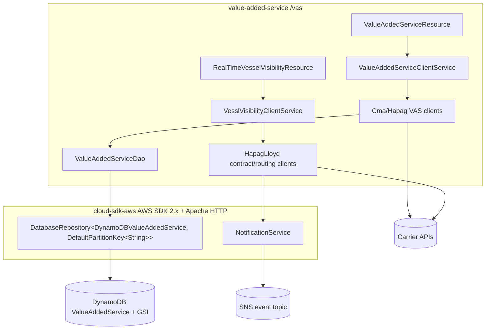

# Value Added Service (VAS) — AWS SDK 2.x (cloud-sdk) Upgrade Design

**Module:** `value-added-service`
**Date:** 2026-06-30
**Status:** Target design (AWS 1.x → AWS 2.x via cloud-sdk) — **NOT STARTED**
**Companion:** `2026-06-30-value-added-service-current-state-DESIGN-claude.md`
**Reference upgrades:** `booking` (S3 + DynamoDB + SNS/SQS, complete), `visibility` (S3 + DynamoDB + SNS/SQS), `network`/`registration` (DynamoDB DAO patterns)

---

## 1. Change Overview

Replace all direct AWS SDK v1 (`com.amazonaws.*`) usage with the in-house **cloud-sdk** (`cloud-sdk-api` +
`cloud-sdk-aws`, AWS SDK 2.x Enhanced Client + Apache HTTP under the hood). Exactly **two** AWS services are in scope.

| AWS service | Current (v1) | Target (cloud-sdk / v2) |
|-------------|--------------|--------------------------|
| **DynamoDB** | `aws-java-sdk-dynamodb 1.12.652` (direct) + `DynamoDBMapper` v1 ORM (via `dynamo-client`) | `DatabaseRepository<T,K>` + Enhanced-client annotations (`cloud-sdk-aws`) + `DefaultQuerySpec` |
| **SNS** | `com.amazonaws.services.sns.AmazonSNS` / `AmazonSNSClientBuilder` (direct, published via commons `SNSClient`/`SNSEventPublisher`/`EventLogger`) | `com.inttra.mercury.cloudsdk.notification.api.NotificationService` + `NotificationClientFactory.createDefaultClient(topicArn)` |

**Out of scope:** the CMA-CGM / Hapag-Lloyd / INTTRA-network REST integrations (plain JAX-RS, unchanged); Parameter
Store (`${awsps:}` still resolved by commons); the carrier OAuth flows; the swagger-maven-plugin generation.

**Backward-compatibility is mandatory.** The following must remain wire-identical so existing items stay readable and
the downstream SNS consumer keeps parsing:

- DynamoDB table `ValueAddedService`; GSI `valueAddedServiceBookingNumber-index` (hash `bookingNumber`, **KEYS_ONLY**,
  5/5); hash key DynamoDB attribute name `id`.
- Attribute encodings: `carrierResponse` and `inttraResponse` as **JSON strings (S)** (commons `DynamoSupport`
  serialization); `expiresOn` as an **epoch-seconds Number (N)** (`DateToEpochSecond`); `audit` as a **map (M)** with
  `createdDateUtc`/`lastModifiedDateUtc` as **ISO-8601 strings**; `scacCode` as **String (S)**.
- The per-env table prefixes — INT `inttra_int`, QA `inttra2_qa`, **CVT `inttra2_cvt`**, PROD `inttra2_prod` — and the
  SNS topic ARNs (`inttra_int_sns_event`, `inttra2_qa_sns_event`, `inttra2_cv_sns_event`, `inttra2_pr_sns_event`).
- **Decoupling rule:** the DynamoDB on-wire formats are independent of the REST/SNS JSON formats. `Audit`'s
  `@JsonFormat(pattern="yyyy-MM-dd'T'HH:mm:ss.SSSZ", timezone="UTC")` governs REST/event JSON, while the
  `AttributeConverter` governs the DynamoDB string. Both must keep their **current, distinct** encodings; do not let the
  v2 attribute converter leak into the JSON path or vice-versa.

---

## 2. Maven Dependency Changes

```diff
  <properties>
    <swagger.version>1.5.24</swagger.version>
-   <mercury.commons.version>1.R.01.023</mercury.commons.version>
-   <mercury.dynamodbclient.version>1.R.01.023</mercury.dynamodbclient.version>
+   <mercury.commons.version>1.0.26-SNAPSHOT</mercury.commons.version>
+   <jackson.version>2.21.0</jackson.version>
  </properties>

+ <!-- Pin Jackson to one line so swagger/commons/cloud-sdk don't drift (see booking pom) -->
+ <dependencyManagement>
+   <dependencies>
+     <dependency>
+       <groupId>com.fasterxml.jackson</groupId>
+       <artifactId>jackson-bom</artifactId>
+       <version>${jackson.version}</version>
+       <type>pom</type><scope>import</scope>
+     </dependency>
+   </dependencies>
+ </dependencyManagement>

  <dependencies>
    <dependency>
      <groupId>com.inttra.mercury</groupId>
      <artifactId>commons</artifactId>
      <version>${mercury.commons.version}</version>
    </dependency>

-   <!-- direct AWS SDK v1 DynamoDB - removed from prod -->
-   <dependency>
-     <groupId>com.amazonaws</groupId>
-     <artifactId>aws-java-sdk-dynamodb</artifactId>
-     <version>1.12.652</version>
-   </dependency>
-   <dependency>
-     <groupId>com.inttra.mercury</groupId>
-     <artifactId>dynamo-client</artifactId>
-     <version>${mercury.dynamodbclient.version}</version>
-   </dependency>
+   <dependency>
+     <groupId>com.inttra.mercury</groupId>
+     <artifactId>cloud-sdk-api</artifactId>
+     <version>${mercury.commons.version}</version>
+   </dependency>
+   <dependency>
+     <groupId>com.inttra.mercury</groupId>
+     <artifactId>cloud-sdk-aws</artifactId>
+     <version>${mercury.commons.version}</version>
+   </dependency>

+   <!-- DynamoDB Local integration-test framework -->
+   <dependency>
+     <groupId>com.inttra.mercury</groupId>
+     <artifactId>dynamo-integration-test</artifactId>
+     <version>${mercury.commons.version}</version>
+     <scope>test</scope>
+   </dependency>
+   <!-- AWS SDK v1 DynamoDB kept ONLY for DynamoDB Local in tests (matches booking) -->
+   <dependency>
+     <groupId>com.amazonaws</groupId>
+     <artifactId>aws-java-sdk-dynamodb</artifactId>
+     <version>1.12.721</version>
+     <scope>test</scope>
+   </dependency>
  </dependencies>
```

- **Removed (prod):** the direct `aws-java-sdk-dynamodb 1.12.652` **and** `dynamo-client` (which transitively supplied
  v1 DynamoDB and the v1 **SNS** classes). After this, **no `com.amazonaws` on the prod classpath** (only test-scoped).
- cloud-sdk uses **Apache HTTP** (no Netty), matching the booking/visibility rebase.
- `DynamoSupport`, `DateToEpochSecond`, `OffsetDateTimeTypeConverter` came from `dynamo-client`; their replacements must
  be sourced from cloud-sdk or ported into the module (see §4).

---

## 3. Configuration Changes (`conf/<env>/config.yaml`)

The `dynamoDbConfig` block today carries only `environment`. Migrating to the cloud-sdk `BaseDynamoDbConfig` adds
`region` (and optional local-emulator endpoint). The `environment` prefixes — **including CVT's `inttra2_cvt`** — the
`dynamoDbTableConfig` throughput/GSI block, and `snsEventTopicArn` stay unchanged.

```diff
  dynamoDbConfig:
    environment: inttra2_cvt          # INT inttra_int, QA inttra2_qa, PROD inttra2_prod
+   region: us-east-1
+   sseEnabled: false
+   # local Dynamo emulator only:
+   #regionEndpoint: http://localhost:8000
+   #signingRegion: us-west-2

  dynamoDbTableConfig:
    - tableName: ValueAddedService
      readThroughput: 5
      writeThroughput: 5
      globalSecondaryIndexes:
        - indexName: valueAddedServiceBookingNumber-index
          hashKey: bookingNumber
          projectionType: KEYS_ONLY     # preserve exactly
          readThroughput: 5
          writeThroughput: 5

  snsEventTopicArn: arn:aws:sns:us-east-1:642960533737:inttra2_cv_sns_event   # unchanged
```

**Config class change** — `ValueAddedServiceConfig.dynamoDbConfig` field type moves from
`com.inttra.mercury.dynamo.respository.module.DynamoDbConfig` to
`com.inttra.mercury.cloudsdk.database.config.BaseDynamoDbConfig` (annotate `@Valid @NotNull`, as in `BookingConfig`):

```diff
- import com.inttra.mercury.dynamo.respository.module.DynamoDbConfig;
+ import com.inttra.mercury.cloudsdk.database.config.BaseDynamoDbConfig;
  @Data
  public class ValueAddedServiceConfig extends ApplicationConfiguration {
    List<ExternalServiceDefinition> externalVasServices;
-   private DynamoDbConfig dynamoDbConfig;
+   @Valid @NotNull private BaseDynamoDbConfig dynamoDbConfig;
    private List<DynamoDbTableCreationCommandConfig> dynamoDbTableConfig;  // keep for bootstrap
    private String valueAddedServiceEnabled;
    private String snsEventTopicArn;
  }
```

> Note: `DynamoDbTableCreationCommandConfig`/`DynamoDbGsiConfig` come from `dynamo-client`. If `dynamo-client` is fully
> removed, the table-bootstrap command (`DynamoValueAddedServiceTableCommand`) must move to the cloud-sdk admin path and
> these config types replaced with the cloud-sdk equivalents (or the bootstrap command retired in favour of the
> cloud-sdk table provisioner) — see §4.3.

---

## 4. Per-Service Spec

### 4.1 SNS — `ValueAddedServiceModule` / event publishing

**Before (v1):**
```java
// ValueAddedServiceModule.configure()
bind(AmazonSNS.class).toInstance(AmazonSNSClientBuilder.standard().build());

// @Provides EventPublisher
return new SNSEventPublisher(config.getSnsEventTopicArn(), snsClient); // commons SNSClient wraps AmazonSNS
```

**After (cloud-sdk):** (mirrors booking `BookingMessagingModule.provideNotificationService`)
```java
// ValueAddedServiceModule (or a new ValueAddedServiceMessagingModule)
@Provides @Singleton
NotificationService provideNotificationService(ValueAddedServiceConfig c) {
    String topicArn = c.getSnsEventTopicArn();
    if (topicArn == null || topicArn.trim().isEmpty()) {
        throw new IllegalStateException("VAS event topic ARN is not configured");
    }
    return NotificationClientFactory.createDefaultClient(topicArn);   // cloud-sdk-aws SDK 2.x
}
```

- Drop the `AmazonSNS` `bind(...)` and the `com.amazonaws.services.sns.*` imports.
- The commons `EventLogger` used by `HapagLloydRoutingClient`/`HapagLloydContractClient` must be re-pointed at the
  cloud-sdk `NotificationService`. If the commons `EventLogger`/`SNSEventPublisher` on `1.0.26-SNAPSHOT` already wraps
  the cloud-sdk notification path, the only module change is the provider above; **verify against the commons line that
  booking ships on** before assuming. If commons still expects a v1 `SNSClient`, keep the commons `EventPublisher`
  provider and only swap the underlying client construction.

> **Gap call-out.** The v1 `AmazonSNSClientBuilder.standard()` used the default credential/region chain implicitly.
> `NotificationClientFactory.createDefaultClient(topicArn)` fixes the topic at construction and does not expose per-call
> region/retry knobs; this matches booking and is acceptable since VAS publishes to a single per-env topic.

### 4.2 DynamoDB — `DynamoDBValueAddedService` + `Audit` + `ValueAddedServiceDao`

**Entity before (v1 ORM):**
```java
@DynamoDBTable(tableName = "ValueAddedService")            // TABLE_NAME constant
public class DynamoDBValueAddedService implements DynamoHashKey<String> {
  @DynamoDBHashKey(attributeName = "id") private String hashKey;
  @DynamoDBAttribute private String scacCode;
  @DynamoDBTypeConverted(converter = CarrierResponseConverter.class) private Object carrierResponse;
  @DynamoDBTypeConverted(converter = InttraValueAddedServiceResponseConverter.class) private ValueAddedServiceResponse inttraResponse;
  @DynamoDBIndexHashKey(globalSecondaryIndexName = "valueAddedServiceBookingNumber-index") private String bookingNumber;
  @DynamoDBAttribute @DynamoDBTypeConverted(converter = DateToEpochSecond.class) private Date expiresOn;
  @DynamoDBAttribute private Audit audit;   // @DynamoDBDocument
}
```

**Entity after (Enhanced client — annotate getters as booking does):**
```java
@DynamoDbBean
@Table(name = "ValueAddedService")          // com.inttra.mercury.cloudsdk.database.annotation.Table
public class DynamoDBValueAddedService {
  @DynamoDbPartitionKey @DynamoDbAttribute("id") public String getHashKey() {...}

  @DynamoDbAttribute("scacCode") public String getScacCode() {...}

  @DynamoDbConvertedBy(CarrierResponseAttributeConverter.class)        // JSON String, generic Object
  @DynamoDbAttribute("carrierResponse") public Object getCarrierResponse() {...}

  @DynamoDbConvertedBy(InttraResponseAttributeConverter.class)         // JSON String, wire-identical
  @DynamoDbAttribute("inttraResponse") public ValueAddedServiceResponse getInttraResponse() {...}

  @DynamoDbSecondaryPartitionKey(indexNames = "valueAddedServiceBookingNumber-index")
  @DynamoDbAttribute("bookingNumber") public String getBookingNumber() {...}

  @DynamoDbConvertedBy(EpochSecondAttributeConverter.class)            // Number (N), epoch seconds
  @DynamoDbAttribute("expiresOn") public Date getExpiresOn() {...}

  @DynamoDbAttribute("audit") public Audit getAudit() {...}            // nested @DynamoDbBean
}
```

- **`bookingNumber`** is GSI-only with no range key. Declare it as a secondary **partition** key on the same index name
  and preserve **KEYS_ONLY** projection in the bootstrap path. (It remains unpopulated by the current write path — keep
  that behaviour; do not start writing it.)
- **Nested `@DynamoDBDocument Audit`** → `@DynamoDbBean` (no `@Table`); its two `OffsetDateTime` getters get
  `@DynamoDbConvertedBy(OffsetDateTimeAttributeConverter.class)`, while the `@JsonFormat` on those fields is kept for the
  REST/event JSON path (decoupling rule).

**Converters** (re-implement as `software.amazon.awssdk.enhanced.dynamodb.AttributeConverter`; reuse cloud-sdk's shared
converters where the on-wire format provably matches):

| v1 converter | v2 replacement | On-wire encoding (unchanged) |
|---|---|---|
| `CarrierResponseConverter` (`Object` ↔ JSON via `DynamoSupport`) | `CarrierResponseAttributeConverter` (`AttributeValue` `S`) | JSON string of a **generic `Object`** — must round-trip CMA + Hapag payloads |
| `InttraValueAddedServiceResponseConverter` | `InttraResponseAttributeConverter` (`AttributeValue` `S`) | JSON string of `ValueAddedServiceResponse` |
| `DateToEpochSecond` (`dynamo-client`) | `EpochSecondAttributeConverter` (`AttributeValue` `N`) | `Date` → `instant.getEpochSecond()` Number |
| commons `OffsetDateTimeTypeConverter` (in `Audit`) | cloud-sdk `OffsetDateTimeTypeConverter` or ported (`S`) | ISO-8601 string — **confirm format matches before reuse** |

> The `CarrierResponseConverter`/`InttraValueAddedServiceResponseConverter` delegate to commons `DynamoSupport`. If
> `DynamoSupport` ships only in `dynamo-client`, port the exact `objectToString`/`stringToObject` Jackson configuration
> into the new converters so serialization is byte-identical (the generic-`Object` path is the fidelity hot-spot).

**DAO before/after** (`findById`):
```java
// BEFORE — extends DynamoDBCrudRepository; query by hash key, strongly consistent
public List<DynamoDBValueAddedService> findById(String id) {
    return query(id, "id = :hashKeyValue", DYNAMO_READ_BEHAVIOUR.CONSISTENT);
}

// AFTER — injected DatabaseRepository (mirrors booking SpotRatesToInttraRefDao)
private final DatabaseRepository<DynamoDBValueAddedService, DefaultPartitionKey<String>> repository;

public List<DynamoDBValueAddedService> findById(String id) {
    return repository.findById(new DefaultPartitionKey<>(id), /*consistentRead*/ true)
        .map(List::of).orElseGet(List::of);   // preserve "list of 0..1" shape callers expect
}

public <T> void save(InttraPrincipal actor, String scacCode, T carrierResponse, ValueAddedServiceResponse inttraResponse) {
    DynamoDBValueAddedService e = new DynamoDBValueAddedService();
    Audit audit = new Audit(actor);
    e.setHashKey(inttraResponse.getId());
    e.setScacCode(scacCode);
    e.setCarrierResponse(carrierResponse);
    e.setInttraResponse(inttraResponse);
    e.setAudit(audit);
    e.setExpiresOn(calcExpiresOn(audit.getCreatedDateUtc()));   // +400 days, unchanged
    repository.save(e);
}
```

- `findById` today returns a `List` because v1 `query` returns a collection; the partition-key lookup returns at most
  one item, so wrap the `Optional` to keep `ValueAddedServiceClientService.findSavedValueAddedServiceById` (which
  `.stream().map(getInttraResponse)`) behaviourally identical.
- Keep the strongly-consistent read (`true`), matching the current `DYNAMO_READ_BEHAVIOUR.CONSISTENT`.
- The 400-day `calcExpiresOn` logic and `DAYS_TO_EXPIRE` constant are unchanged.

### 4.3 Table bootstrap — `DynamoValueAddedServiceTableCommand`

The command reads `dynamoDbTableConfig` and calls `createTableAndWaitUntilActive` + `createGlobalSecondaryIndexesIfNotExist`
on the v1 `AbstractDynamoCommand`. On migration, re-implement via the cloud-sdk table-admin API, **preserving** table
name `ValueAddedService`, hash key `id`, GSI `valueAddedServiceBookingNumber-index` (hash `bookingNumber`, **KEYS_ONLY**),
and 5/5 capacities. (If cloud-sdk does not yet expose a Guice-friendly admin command, flag as a gap and keep a
test-scoped v1 bootstrap for DynamoDB Local only.)

---

## 5. Guice Wiring Changes

```diff
  // ValueAddedServiceApp.main
- .moduleGenerator((c, e) -> new DynamoDBModule(c.getDynamoDbConfig(), e))
+ .moduleGenerator(ValueAddedServiceDynamoModule::new)   // cloud-sdk repo provider

  // ValueAddedServiceModule.configure()
- bind(AmazonSNS.class).toInstance(AmazonSNSClientBuilder.standard().build());
  bind(Clock.class).toInstance(Clock.systemUTC());
  // (keep ServiceDefinition + ExternalServiceDefinition + the three multibinders)
```

```diff
- @Provides @Singleton EventPublisher createEventPublisher(ValueAddedServiceConfig c, SNSClient snsClient) {
-     return new SNSEventPublisher(c.getSnsEventTopicArn(), snsClient);
- }
+ @Provides @Singleton NotificationService provideNotificationService(ValueAddedServiceConfig c) {
+     return NotificationClientFactory.createDefaultClient(c.getSnsEventTopicArn());
+ }

+ // ValueAddedServiceDynamoModule (new) — pattern from BookingDynamoModule
+ @Provides @Singleton DynamoDbClientConfig provideDynamoCfg(ValueAddedServiceConfig c) {
+     return c.getDynamoDbConfig().toClientConfigBuilder().consistentRead(true).build();
+ }
+ @Provides @Singleton DatabaseRepository<DynamoDBValueAddedService, DefaultPartitionKey<String>> provideRepo(DynamoDbClientConfig cfg) {
+     String tableName = cfg.getTablePrefix() + DynamoDBValueAddedService.class.getAnnotation(Table.class).name();
+     return DynamoRepositoryFactory.createEnhancedRepository(cfg, tableName, DynamoDBValueAddedService.class,
+         DynamoRepositoryConfig.builder().domainType(DynamoDBValueAddedService.class).build());
+ }
```

`ValueAddedServiceDao`'s constructor changes from `(DynamoDBMapper, DynamoDBMapperConfig)` to an injected
`DatabaseRepository<DynamoDBValueAddedService, DefaultPartitionKey<String>>` (or keep the DAO but inject the repo).

> If the commons `EventLogger`/`SNSEventPublisher` on the target commons line still requires the legacy `SNSClient`
> wiring, retain the `EventPublisher` provider and only replace the client it wraps — verify against the commons version
> booking depends on before deleting the `EventPublisher` binding.

---

## 6. Target Component Diagram



## 7. Target Data Flow — VAS search (after)

```mermaid
sequenceDiagram
  participant R as ValueAddedServiceResource
  participant S as ValueAddedServiceClientService
  participant C as Cma/Hapag VAS client
  participant DAO as ValueAddedServiceDao
  participant REPO as DatabaseRepository (cloud-sdk)

  R->>S: getValueAddedServices(req, actor)
  S->>C: process(req, actor)  (after feature-flag + SCAC route)
  C->>C: validate + map + call carrier (OAuth)
  C->>DAO: save(actor, scac, carrierResponse, inttraResponse)
  DAO->>DAO: expiresOn = createdDateUtc + 400d (epoch seconds)
  DAO->>REPO: save(entity)  (Enhanced client PutItem; JSON-string converters)
  C-->>S: ValueAddedServiceResponse
  S-->>R: 200 [response]
```

---

## 8. Key Classes Changed

| Class | Change |
|-------|--------|
| `pom.xml` | remove direct `aws-java-sdk-dynamodb 1.12.652` + `dynamo-client` (prod); add `cloud-sdk-api` + `cloud-sdk-aws`; add `dynamo-integration-test` + test-scoped `aws-java-sdk-dynamodb`; pin Jackson; drop `dynamodbclient.version`. |
| `ValueAddedServiceApp` | replace `DynamoDBModule` generator with `ValueAddedServiceDynamoModule`. |
| `ValueAddedServiceModule` | drop the `AmazonSNS` binding; `EventPublisher` provider → `NotificationService` provider (or re-point its wrapped client); keep `Clock`, service-definition bindings and the three multibinders. |
| `ValueAddedServiceDynamoModule` (**new**) | `DynamoDbClientConfig` + `DatabaseRepository` providers. |
| `ValueAddedServiceConfig` | `dynamoDbConfig` type `DynamoDbConfig` → `BaseDynamoDbConfig` (`@Valid @NotNull`). |
| `DynamoDBValueAddedService` | v1 ORM annotations → `@DynamoDbBean`/`@Table` + enhanced key annotations; `bookingNumber` → `@DynamoDbSecondaryPartitionKey`. |
| `Audit` | `@DynamoDBDocument` → `@DynamoDbBean`; timestamps `@DynamoDbConvertedBy`; keep `@JsonFormat`. |
| `ValueAddedServiceDao` | `extends DynamoDBCrudRepository` → injected `DatabaseRepository`; `query(...)` → `findById`/`save`; preserve consistent read and `List` return shape. |
| `CarrierResponseConverter`, `InttraValueAddedServiceResponseConverter` | re-implement as `AttributeConverter` (port `DynamoSupport` JSON if needed). |
| `DateToEpochSecond` usage | replace with a v2 `AttributeConverter` writing epoch-seconds Number. |
| `DynamoValueAddedServiceTableCommand` | table/GSI bootstrap via cloud-sdk admin path; preserve name, key, KEYS_ONLY GSI, 5/5. |

---

## 9. Testing Strategy

- **DynamoDB-Local IT** (`dynamo-integration-test` `BaseDynamoDbIT`, `@Tag("integration")`) for `ValueAddedServiceDao`:
  `save`→`findById` round-trip (strongly consistent); the **generic-`Object` `carrierResponse`** JSON fidelity (write a
  CMA response and a Hapag response, re-read, assert structural equality); `inttraResponse` JSON fidelity; `expiresOn`
  epoch-seconds Number round-trip and the +400-day calculation; GSI `valueAddedServiceBookingNumber-index` existence /
  KEYS_ONLY projection; converter fidelity by re-reading an item written by the v1 mapper.
- **SNS** at booking/network level: unit tests mocking `NotificationService` (and the commons `EventLogger` path) —
  assert the event topic ARN and payload shape are unchanged.
- Carrier-mapper + validator unit tests are unchanged (no AWS surface).
- Reuse existing DAO / service / mapper tests after mock types change (`DynamoDBMapper`/`AmazonSNS` →
  `DatabaseRepository`/`NotificationService`).
- Certify **full local JaCoCo coverage** on all changed code (note `**/model/**` is Sonar-excluded, so the converters +
  DAO + module carry the weight):
  ```
  mvn -f value-added-service/pom.xml clean verify
  ```

---

## 10. Risks & Call-outs

- **Generic-`Object` `carrierResponse` is the largest fidelity risk.** The v2 `AttributeConverter` must serialize via the
  exact `DynamoSupport` Jackson configuration so archived CMA/Hapag payloads remain readable; a polymorphism or
  type-info change would corrupt history.
- **`expiresOn` is an app-managed epoch-seconds Number, not a native DynamoDB TTL.** Keep the `N` encoding identical; do
  not "upgrade" it to a native TTL attribute (no TTL is configured on the table today).
- **`bookingNumber` GSI is provisioned but unpopulated** — preserve the KEYS_ONLY index on migration; do not begin
  writing the attribute as a side effect of the enhanced-client mapping.
- **SNS is two-layered.** The bound `EventPublisher` is dormant; the real publisher is commons `EventLogger`. Verify
  whether the target commons line already wraps the cloud-sdk `NotificationService`; if so the module change is just the
  provider, if not, keep the `EventPublisher` wiring and swap only the underlying client.
- **CVT prefix trap** — DynamoDB prefix is `inttra2_cvt` while the CVT SNS topic is `inttra2_cv_sns_event` (and INT runs
  in a different AWS account, `081020446316`). Carry these exact strings through the `BaseDynamoDbConfig` /
  `NotificationClientFactory` migration.
- **`dynamo-client` removal cascade** — `DynamoSupport`, `DateToEpochSecond`, `OffsetDateTimeTypeConverter`,
  `DynamoDbTableCreationCommandConfig`, `DynamoDbGsiConfig`, `AbstractDynamoCommand`, `DynamoHashKey` all come from
  `dynamo-client`. Each must be replaced (cloud-sdk equivalent) or ported before the prod dependency is dropped.
- **Sequencing** — migrate SNS and DynamoDB in incremental, test-verified steps; one outgoing commit per the team
  workflow, and every commit message must carry the Jira ticket prefix (e.g. `ION-xxxxx …`).
