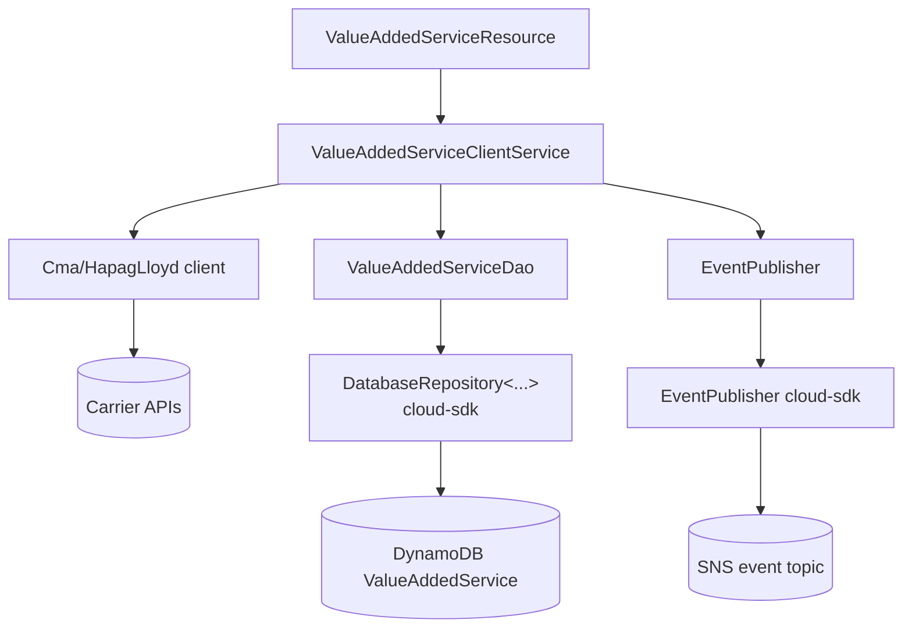
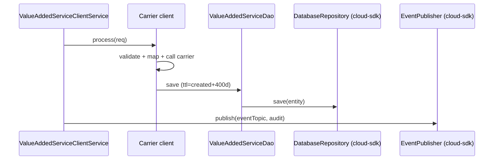

# Value Added Service (VAS) — AWS SDK 2.x (cloud-sdk) Upgrade Design

**Module:** `value-added-service`
**Date:** 2026-06-30
**Status:** Target design (AWS 1.x → AWS 2.x via cloud-sdk) — NOT STARTED
**Companion:** `2026-06-30-value-added-service-current-state-DESIGN-copilot.md`
**Reference upgrades:** `booking`/`network` (SNS), `network`/`registration` (DynamoDB)

---

## 1. Change Overview

`value-added-service` uses two AWS services: **DynamoDB** (table `ValueAddedService`) and **SNS** (event audit). Both
migrate to cloud-sdk.

| AWS service | Current (v1) | Target (cloud-sdk / v2) |
|-------------|--------------|--------------------------|
| **DynamoDB** | `aws-java-sdk-dynamodb 1.12.652` + `DynamoDBMapper` + v1 ORM | `DatabaseRepository<T,K>` + Enhanced-client annotations |
| **SNS** | `AmazonSNS` / `AmazonSNSClientBuilder` (direct) + commons `SNSEventPublisher` | `EventPublisher` + `NotificationClientFactory.createDefaultClient(topicArn)` |

The CMA-CGM / Hapag Lloyd / network REST integrations are unaffected.

**Backward-compat:** preserve table `ValueAddedService`, key `id`, GSI `valueAddedServiceBookingNumber-index`, the
**400-day TTL** encoding, and the event SNS payload shape.

---

## 2. Maven Dependency Changes

```diff
  <properties>
+   <mercury.commons.version>1.0.26-SNAPSHOT</mercury.commons.version>
  </properties>

-   <dependency>
-     <groupId>com.amazonaws</groupId>
-     <artifactId>aws-java-sdk-dynamodb</artifactId>
-     <version>1.12.652</version>
-   </dependency>
    <dependency>
      <groupId>com.inttra.mercury</groupId>
      <artifactId>commons</artifactId>
-     <version>1.R.01.023</version>
+     <version>${mercury.commons.version}</version>
    </dependency>
-   <dependency>
-     <groupId>com.inttra.mercury</groupId>
-     <artifactId>dynamo-client</artifactId>
-     <version>1.R.01.023</version>
-   </dependency>
+   <dependency>
+     <groupId>com.inttra.mercury</groupId>
+     <artifactId>cloud-sdk-api</artifactId>
+     <version>${mercury.commons.version}</version>
+   </dependency>
+   <dependency>
+     <groupId>com.inttra.mercury</groupId>
+     <artifactId>cloud-sdk-aws</artifactId>
+     <version>${mercury.commons.version}</version>
+   </dependency>
+   <dependency>
+     <groupId>com.inttra.mercury</groupId>
+     <artifactId>dynamo-integration-test</artifactId>
+     <version>${mercury.commons.version}</version>
+     <scope>test</scope>
+   </dependency>
+   <dependency>
+     <groupId>com.amazonaws</groupId>
+     <artifactId>aws-java-sdk-dynamodb</artifactId>
+     <scope>test</scope>   <!-- DynamoDB Local only -->
+   </dependency>
```

Pin Jackson via `dependencyManagement`.

---

## 3. Configuration Changes (`conf/<env>/config.yaml`)

```diff
  dynamoDbConfig:
    environment: inttra_<env>_vas
+   region: us-east-1
    readCapacityUnits: ...
    writeCapacityUnits: ...
+   sseEnabled: false

  snsEventTopicArn: "arn:aws:sns:us-east-1:...:value-added-service-events"   # unchanged
```

`ValueAddedServiceConfig.dynamoDbConfig` → cloud-sdk `BaseDynamoDbConfig`; `snsEventTopicArn` stays (now passed to the
notification factory).

---

## 4. Per-Service Spec

### 4.1 SNS — `ValueAddedServiceModule` / event publishing

**Before (v1):**
```java
AmazonSNS sns = AmazonSNSClientBuilder.standard().build();
bind(AmazonSNS.class).toInstance(sns);
// SNSEventPublisher (commons) wraps AmazonSNS
```

**After (cloud-sdk):**
```java
@Provides @Singleton EventPublisher provideEventPublisher(ValueAddedServiceConfig c) {
    return NotificationClientFactory.createDefaultClient(c.getSnsEventTopicArn());
}
// EventPublisher publishes via eventPublisher.publish(topicArn, payload)
```

### 4.2 DynamoDB — `DynamoDBValueAddedService` + `ValueAddedServiceDao`

**Entity before (v1 ORM):**
```java
@DynamoDBTable(tableName = "ValueAddedService")
public class DynamoDBValueAddedService {
  @DynamoDBHashKey private String id;
  @DynamoDBIndexHashKey(globalSecondaryIndexName="valueAddedServiceBookingNumber-index") private String bookingNumber;
  @DynamoDBTypeConverted(converter=InttraValueAddedServiceResponseConverter.class) private InttraResponse inttraResponse;
  @DynamoDBTypeConverted(converter=CarrierResponseConverter.class) private Object carrierResponse;
  @DynamoDBAttribute private Long expiresOn;
}
```

**Entity after (enhanced client):**
```java
@DynamoDbBean
@Table(name = "ValueAddedService")
public class DynamoDBValueAddedService {
  @DynamoDbPartitionKey private String id;
  @DynamoDbSecondaryPartitionKey(indexNames="valueAddedServiceBookingNumber-index") private String bookingNumber;
  @DynamoDbConvertedBy(InttraResponseJsonAttributeConverter.class) private InttraResponse inttraResponse;
  @DynamoDbConvertedBy(CarrierResponseJsonAttributeConverter.class) private Object carrierResponse; // generic Object JSON
  private Long expiresOn; // 400-day TTL (epoch)
}
```

**Converters → `AttributeConverter`:** `InttraResponseJsonAttributeConverter`, `CarrierResponseJsonAttributeConverter`
(preserve exact JSON serialization, esp. the **generic-`Object` `carrierResponse`**), plus the embedded `Audit`.

**DAO before/after:**
```java
// before: extends DynamoDBCrudRepository, DynamoDBMapper
// after:  DatabaseRepository<DynamoDBValueAddedService, DefaultPartitionKey<String>>
repository.save(entity);
repository.findById(new DefaultPartitionKey<>(id), true);
repository.query(DefaultQuerySpec.builder()
    .indexName("valueAddedServiceBookingNumber-index")
    .partitionKeyName("bookingNumber").partitionKeyValue(CloudAttributeValue.ofString(bk)).build());
```

---

## 5. Guice Wiring Changes

```diff
- bind(AmazonSNS.class).toInstance(AmazonSNSClientBuilder.standard().build());
- // DynamoDBModule (commons) -> DynamoDBMapper
+ @Provides @Singleton EventPublisher notifications(ValueAddedServiceConfig c){ return NotificationClientFactory.createDefaultClient(c.getSnsEventTopicArn()); }
+ @Provides @Singleton DynamoDbClientConfig dynamoCfg(ValueAddedServiceConfig c){ return c.getDynamoDbConfig().toClientConfigBuilder().build(); }
+ @Provides @Singleton DatabaseRepository<DynamoDBValueAddedService, DefaultPartitionKey<String>> repo(DynamoDbClientConfig cfg){
+     String tableName = cfg.getTablePrefix() + DynamoDBValueAddedService.class.getAnnotation(Table.class).name(); // cloudsdk.database.annotation.Table
+     return DynamoRepositoryFactory.createEnhancedRepository(cfg, tableName, DynamoDBValueAddedService.class,
+         DynamoRepositoryConfig.builder().domainType(DynamoDBValueAddedService.class).build()); }
```

---

## 6. Target Component Diagram



## 7. Target Sequence — VAS search (after)



---

## 8. Key Classes Changed

| Class | Change |
|-------|--------|
| `pom.xml` | remove `aws-java-sdk-dynamodb` + `dynamo-client` (prod); add cloud-sdk-api/aws + test deps. |
| `ValueAddedServiceConfig` | `dynamoDbConfig` → `BaseDynamoDbConfig`. |
| `ValueAddedServiceModule` | `AmazonSNS` binding → `EventPublisher`; DynamoDB module → repo provider. |
| `DynamoDBValueAddedService`, `Audit` | v1 ORM → `@DynamoDbBean`/`@Table`/enhanced keys. |
| `ValueAddedServiceDao` | `DynamoDBCrudRepository` → `DatabaseRepository` + `DefaultQuerySpec`. |
| `InttraValueAddedServiceResponseConverter`, `CarrierResponseConverter` | re-implement as `AttributeConverter`. |
| `DynamoValueAddedServiceTableCommand` | table/GSI bootstrap via cloud-sdk admin path. |

---

## 9. Testing Strategy

- **DynamoDB-Local IT** for `ValueAddedServiceDao`: save/get by `id`, GSI by booking number, TTL field, and the
  **`carrierResponse` generic-Object JSON** converter fidelity.
- **SNS** at booking/network level: unit tests mocking `EventPublisher`.
- Carrier-mapper unit tests unchanged.
- Full local **JaCoCo** coverage on changed code (`mvn -f value-added-service/pom.xml clean verify`).

---

## 10. Risks & Call-outs

- The **`carrierResponse` generic-`Object` JSON converter** is the trickiest fidelity point — ensure the v2 converter
  serializes identically so archived carrier responses remain readable.
- Preserve table/key/GSI names and the 400-day TTL encoding.
- SNS migration must mirror **booking/network** (`EventPublisher`/`NotificationClientFactory`).
