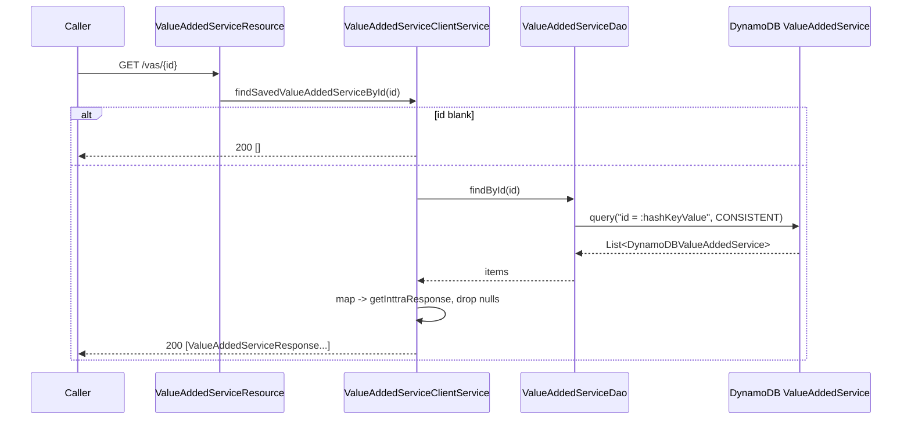
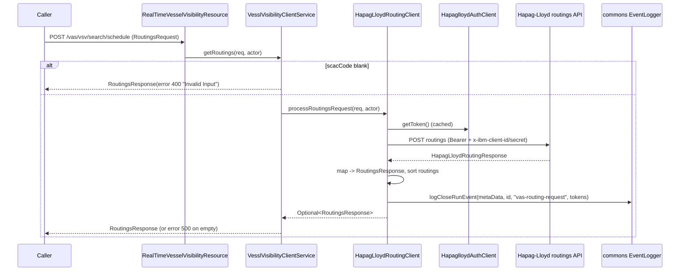

# Value Added Service (VAS) — Current-State Design

**Module:** `value-added-service`
**Date:** 2026-06-30
**Status:** Current state — AWS SDK **1.x** (`com.amazonaws`) in production; cloud-sdk migration **NOT STARTED**
**Artifact:** `com.inttra.mercury:value-added-service:1.0` (Dropwizard 4 / Jetty 12, single shaded JAR `value-added-service-1.0.jar`)
**Main class:** `com.inttra.mercury.vas.ValueAddedServiceApp`

---

## 1. Business Purpose & Rules

`value-added-service` is the INTTRA gateway to two families of carrier ancillary data:

- **Value Added Services (VAS) search** — given an INTTRA booking/shipment request, fetch the value-added-service
  offerings a carrier exposes (insurance, documentation, customs, etc.). Today two carriers are wired: **CMA-CGM**
  (`CmaValueAddedServiceClient`, SCACs `CMDU/ANNU/APLU/CHNL`) and **Hapag-Lloyd**
  (`HapaglloydValueAddedServiceClient`, SCAC `HLCU`, plus `0BEL` in INT). Each carrier search response (both the raw
  carrier payload and the mapped INTTRA payload) is archived in **DynamoDB** under a UUID id.
- **Real-Time Vessel Space Visibility (VSV)** — two read-only lookups against Hapag-Lloyd only: a **contract-party**
  lookup (`GET /vas/vsv/contract-parties/{contractOrPartyNumber}/{scacCode}` → `HapagLloydContractClient`) and a
  **schedule / routings** search (`POST /vas/vsv/search/schedule` → `HapagLloydRoutingClient`). VSV results are **not**
  persisted to DynamoDB; instead each routing call emits an audit event through the commons `EventLogger`.

The request/response pattern for every carrier client is: **validate → map INTTRA→carrier → call carrier API (OAuth
Bearer) → map carrier→INTTRA → (VAS only) persist**.

### REST endpoints

| Path | Verb | Resource (`rootPath: /vas`) | Purpose |
|------|------|------------------------------|---------|
| `/search` | POST | `ValueAddedServiceResource` | Search VAS offerings; routes by SCAC, persists, returns `List<ValueAddedServiceResponse>`. |
| `/{id}` | GET | `ValueAddedServiceResource` | Retrieve archived response(s) by DynamoDB hash key `id`. |
| `/vsv/contract-parties/{contractOrPartyNumber}/{scacCode}` | GET | `RealTimeVesselVisibilityResource` | Hapag-Lloyd contract-party lookup → `PartyResponse`. |
| `/vsv/search/schedule` | POST | `RealTimeVesselVisibilityResource` | Hapag-Lloyd routings / schedule search → `RoutingsResponse`. |

### Key business rules

| Rule | Detail (source) |
|------|------|
| Feature flag | `ValueAddedServiceClientService.getValueAddedServices` returns an **empty list** immediately when `valueAddedServiceConfig.isValueAddedServiceEnabled()` is false. The flag is `${awsps:/inttra…/vas/config/valueAddedServiceEnabled}` (a Parameter-Store string parsed via `Boolean.parseBoolean`). |
| Carrier routing by SCAC | `ValueAddedServiceClientService` and `VesslVisibilityClientService` build `ConcurrentHashMap<SCAC(uppercase) → client>` at construction from each client's `getScacs()` (the `scacs:` list on its `externalVasServices` entry). Unknown / null SCAC ⇒ empty result. |
| Graceful failure | `processRequest` / `processContractRequest` / `processRoutingRequest` catch `WebApplicationException` + `MessageBodyProviderNotFoundException`, log, and return an empty list / `Optional.empty()` rather than propagating an error. VSV wraps the empty case in a `RoutingsResponse`/`PartyResponse` carrying an `ErrorResponse` (`statusCode 500`, or `400 "Invalid Input"` when `scacCode` is blank). |
| CMA request validation | `InttraValueAddedServiceRequestValidatorForCma.validate` rejects (HTTP `400`, joined message) on: missing Port of Load / Port of Discharge; invalid UN/LOCODE for any of place-of-receipt/POL/POD/place-of-delivery (verified via `GeographyClient.getLocationByUncode`); missing Movement Type; missing Haulage; missing/invalid Departure Date (`yyyy-MM-dd`); no containers; and per-container ISO type (`ContainerTypeClient`), quantity > 0, HS code (`HSCodeClient`), net weight > 0, net-weight UOM, and volume/volume-UOM consistency. |
| Locale defaulting | For a `User` principal the CMA validator maps `preferredLanguage` → `Locale`; null ⇒ `Locale.EN`. The CMA response mapper falls back to `Locale.en_US` when request locale is null. |
| Persistence (cache) | On every successful VAS search `ValueAddedServiceDao.save` writes one `DynamoDBValueAddedService` item keyed on the INTTRA response `id`, storing `scacCode`, the raw carrier response, the INTTRA response, an `Audit`, and `expiresOn`. |
| Expiry window | `ValueAddedServiceDao.DAYS_TO_EXPIRE = 400`; `expiresOn = audit.createdDateUtc + 400 days`, stored as an **epoch-seconds Number** via `DateToEpochSecond`. (Application-managed expiry field — **no native DynamoDB TTL is configured** by the table-bootstrap command.) |
| `bookingNumber` GSI | The entity declares `bookingNumber` as the hash key of GSI `valueAddedServiceBookingNumber-index`, but the **save path never sets it** (`save(...)` populates only id/scac/responses/audit/expiresOn). The GSI is provisioned but effectively unpopulated in the current write path. |
| OAuth token caching | `CmaAuthClient` (`@Singleton`) caches the bearer token until `expireTimestamp` (carrier `expires_in` − elapsed − 5s, default TTL 300s). Hapag-Lloyd auth is cached via `HapaglloydAuthClient` (`cacheTimeout: 18`). |
| Auth | Endpoints are guarded by the shared commons `InttraServer` security stack (`securityResources` OAuth validation URIs); the resources read the `InttraPrincipal` from the JAX-RS `SecurityContext`. No per-method `@RolesAllowed` are declared in this module. |

---

## 2. Design & Component Diagram

Layered Dropwizard service started through the shared `InttraServer<ValueAddedServiceConfig>` builder
(`ValueAddedServiceApp.main`). Two module generators are wired: `ValueAddedServiceModule` (SCAC/service-definition
bindings, the `AmazonSNS` instance, `Clock`, the carrier-client multibinders, and the commons `EventPublisher`) and
the commons `DynamoDBModule` (built from `config.getDynamoDbConfig()`). A `DynamoValueAddedServiceTableCommand` is
registered for table/GSI bootstrap.

```mermaid
flowchart TB
  subgraph Clients[REST Clients]
    U[VAS / VSV callers]
  end

  subgraph App[value-added-service Dropwizard app  rootPath /vas]
    direction TB
    R1[ValueAddedServiceResource<br/>/search, /{id}]
    R2[RealTimeVesselVisibilityResource<br/>/vsv/*]
    VCS[ValueAddedServiceClientService<br/>SCAC routing]
    VVS[VesslVisibilityClientService<br/>SCAC routing]
    CMA[CmaValueAddedServiceClient]
    HLV[HapaglloydValueAddedServiceClient]
    HLC[HapagLloydContractClient]
    HLR[HapagLloydRoutingClient]
    VAL[Inttra*RequestValidator*]
    MAP[Inttra to Carrier mappers]
    EC[ExternalClient<br/>JAX-RS + retries]
    AUTHC[CmaAuthClient / HapaglloydAuthClient]
    DAO[ValueAddedServiceDao<br/>extends DynamoDBCrudRepository]
    NSC[NetworkClient + AuthClient<br/>Geography/HSCode/ContainerType/Participant]
    EL[commons EventLogger]
    EP[commons EventPublisher / SNSEventPublisher<br/>bound, not injected by VAS flows]
  end

  subgraph AWS[AWS  us-east-1]
    DDB[(DynamoDB<br/>ValueAddedService + 1 GSI)]
    SNS[(SNS event topic<br/>inttra*_sns_event)]
    PS[(Parameter Store<br/>awsps secrets)]
  end

  subgraph Ext[External APIs]
    CMAA[(CMA-CGM VAS + OAuth + assets)]
    HLA[(Hapag-Lloyd VAS / contract / routing + OAuth)]
    NET[(INTTRA network/auth/geography/hs/containertype)]
  end

  U --> R1 --> VCS
  U --> R2 --> VVS
  VCS --> CMA & HLV
  VVS --> HLC & HLR
  CMA --> VAL & MAP & AUTHC & EC
  HLV --> EC
  HLC --> EC
  HLR --> EC & EL
  EC --> CMAA & HLA
  CMA --> DAO
  HLV --> DAO
  DAO --> DDB
  VAL --> NSC --> NET
  EL -. via commons SNSClient .-> SNS
  EP -. via commons SNSClient .-> SNS
  App -. ${awsps:} .-> PS
```

### Key classes & interactions

| Layer | Class | Responsibility |
|-------|-------|----------------|
| Bootstrap | `ValueAddedServiceApp` | Builds `InttraServer`, registers the two resources, the `DynamoValueAddedServiceTableCommand`, and the `ValueAddedServiceModule` + `DynamoDBModule` generators. |
| Wiring | `ValueAddedServiceModule` (Guice `AbstractModule`) | Binds `ValueAddedServiceConfig`, **`AmazonSNS`** (`AmazonSNSClientBuilder.standard().build()`), `Clock.systemUTC()`, named `ServiceDefinition`s + `ExternalServiceDefinition`s, three multibinders (`ExternalValueAddedServiceClient`→CMA/Hapag VAS; `ExternalContractPartyClient`→Hapag contract; `ExternalRoutingClient`→Hapag routing), and `@Provides EventPublisher` = `new SNSEventPublisher(snsEventTopicArn, snsClient)`. |
| Config | `ValueAddedServiceConfig extends ApplicationConfiguration` | `externalVasServices` (`List<ExternalServiceDefinition>`), `dynamoDbConfig` (`DynamoDbConfig` from `dynamo-client`), `dynamoDbTableConfig` (`List<DynamoDbTableCreationCommandConfig>`), `valueAddedServiceEnabled` (string flag), `snsEventTopicArn`. |
| Resource | `ValueAddedServiceResource` (`/`) | `POST /search` → `getValueAddedServices`; `GET /{id}` → `findSavedValueAddedServiceById`. |
| Resource | `RealTimeVesselVisibilityResource` (`/vsv`) | `GET /contract-parties/{n}/{scac}`; `POST /search/schedule`. |
| Service | `ValueAddedServiceClientService` | Feature-flag gate, SCAC→VAS-client routing, persistence read-back, graceful-failure wrapping. |
| Service | `VesslVisibilityClientService` | SCAC→contract-client and SCAC→routing-client routing for VSV. |
| Carrier | `CmaValueAddedServiceClient` / `HapaglloydValueAddedServiceClient` | `process(req, actor)`: validate → map → `ExternalClient.makeApiCall` → map → `valueAddedServiceDao.save`. |
| Carrier | `HapagLloydContractClient` / `HapagLloydRoutingClient` | VSV contract & routing; both call commons `EventLogger.logCloseRunEvent` with request/response tokens. |
| HTTP | `ExternalClient` | JAX-RS `Client` wrapper; `makeApiCall` retries `retries` times on `WebApplicationException`/`ProcessingException`, rethrows others as `500`. |
| Auth | `CmaAuthClient` (`@Singleton`) / `HapaglloydAuthClient` | OAuth2 token acquisition + in-memory caching. |
| Persistence | `ValueAddedServiceDao extends DynamoDBCrudRepository<DynamoDBValueAddedService, DynamoHashKey<String>>` | `save(actor, scac, carrierResponse, inttraResponse)`; `findById(id)` (consistent read, `id = :hashKeyValue`). |
| Network | `NetworkClient` + `AuthClient` + `GeographyClient`/`HSCodeClient`/`ContainerTypeClient`/`ParticipantClient` | INTTRA reference look-ups for validation; `NetworkClient` retries `RETRY_LIMIT = 2` on `401/404/5xx`. |
| Model | `DynamoDBValueAddedService` (`@DynamoDBTable("ValueAddedService")`) | Hash key `id`, GSI hash `bookingNumber`, two JSON converters, `expiresOn` epoch-seconds, embedded `@DynamoDBDocument Audit`. |
| Model | `Audit` (`@DynamoDBDocument`) | Actor/timestamp metadata; two `OffsetDateTime` fields via `OffsetDateTimeTypeConverter`. |
| Converter | `InttraValueAddedServiceResponseConverter`, `CarrierResponseConverter` | v1 `DynamoDBTypeConverter<String,…>`; both delegate to commons `DynamoSupport` (JSON). `CarrierResponseConverter` serializes a **generic `Object`**. |

---

## 3. Data Flow

### 3.1 VAS search (write path)

```mermaid
sequenceDiagram
  participant U as Caller (Bearer token)
  participant R as ValueAddedServiceResource
  participant S as ValueAddedServiceClientService
  participant C as Cma/Hapag VAS client
  participant V as Validator (+ Geography/HS/Container)
  participant API as Carrier API (OAuth Bearer)
  participant DAO as ValueAddedServiceDao
  participant DDB as DynamoDB ValueAddedService

  U->>R: POST /vas/search (ValueAddedServiceRequest)
  R->>S: getValueAddedServices(req, actor)
  alt valueAddedServiceEnabled == false OR null req OR unknown SCAC
    S-->>U: 200 [] (empty)
  else
    S->>C: process(req, actor)
    C->>V: validate(req, actor)
    C->>C: map INTTRA -> carrier request
    C->>API: makeApiCall(POST, OAuth Bearer)
    API-->>C: carrier response
    C->>C: map carrier -> INTTRA response (with id)
    C->>DAO: save(actor, scac, carrierResponse, inttraResponse)
    DAO->>DAO: build item; expiresOn = createdDateUtc + 400d
    DAO->>DDB: DynamoDBMapper.save (CarrierResponse/InttraResponse as JSON strings)
    C-->>S: ValueAddedServiceResponse
    S-->>U: 200 [response]
    Note over S,C: any WebApplicationException -> logged, returns 200 []
  end
```

### 3.2 Archived-response read (`GET /vas/{id}`)



### 3.3 VSV schedule search (read path, no persistence)



---

## 4. Data Stores & Integrations

### DynamoDB — table `ValueAddedService`

- **Hash key:** `id` (`@DynamoDBHashKey(attributeName="id")`; the Java field is `hashKey`, exposed as DynamoDB
  attribute `id`). The id value is the INTTRA response id set by the carrier response mapper.
- **GSI — `valueAddedServiceBookingNumber-index`:** hash `bookingNumber` (S), projection **KEYS_ONLY** (per
  `dynamoDbTableConfig`), 5 RCU / 5 WCU. **No range key.** Note the write path never populates `bookingNumber`.
- **Throughput:** base table 5 RCU / 5 WCU and the GSI 5/5 (from `dynamoDbTableConfig`, **not** from `dynamoDbConfig` —
  `dynamoDbConfig` in this module only carries `environment`).
- **Read behaviour:** `findById` uses `DYNAMO_READ_BEHAVIOUR.CONSISTENT` (strongly consistent).
- **Attribute encodings:**
  - `carrierResponse` — **generic `Object`** → JSON string (S) via `CarrierResponseConverter` (`DynamoSupport.objectToString` / `stringToObject`).
  - `inttraResponse` — `ValueAddedServiceResponse` → JSON string (S) via `InttraValueAddedServiceResponseConverter`.
  - `expiresOn` — `java.util.Date` → **epoch-seconds Number (N)** via `dynamo-client` `DateToEpochSecond`.
  - `scacCode` — String (S); `audit` — Map (M) `@DynamoDBDocument`; `audit.createdDateUtc`/`lastModifiedDateUtc` →
    ISO-8601 String via commons `OffsetDateTimeTypeConverter`; the REST/JSON form of those timestamps is governed
    separately by `@JsonFormat(pattern="yyyy-MM-dd'T'HH:mm:ss.SSSZ", timezone="UTC")`.
- **Per-env table names** (`dynamoDbConfig.environment` prefix + `ValueAddedService`):

  | Env | Prefix (`dynamoDbConfig.environment`) | Effective table |
  |-----|----------------------------------------|-----------------|
  | INT | `inttra_int` | `inttra_int…ValueAddedService` |
  | QA | `inttra2_qa` | `inttra2_qa…ValueAddedService` |
  | **CVT** | **`inttra2_cvt`** | `inttra2_cvt…ValueAddedService` |
  | PROD | `inttra2_prod` | `inttra2_prod…ValueAddedService` |

  > VAS uses **`inttra2_cvt`** in CVT (not `inttra2_test` as other modules do). Verified in `conf/cvt/config.yaml`.

### SNS — event topic (`snsEventTopicArn`)

`ValueAddedServiceModule` binds an `AmazonSNS` (v1, `AmazonSNSClientBuilder.standard().build()`) and provides a commons
`EventPublisher` (`new SNSEventPublisher(snsEventTopicArn, snsClient)`). The commons `SNSClient`/`EventLogger`
ultimately publish via that `AmazonSNS`. **The `EventPublisher` is bound but not injected by any VAS class** — the
observable SNS traffic comes from `EventLogger.logCloseRunEvent` in the Hapag-Lloyd VSV clients
(`HapagLloydRoutingClient`, `HapagLloydContractClient`). Per-env topic ARNs:

| Env | `snsEventTopicArn` | Account |
|-----|--------------------|---------|
| INT | `arn:aws:sns:us-east-1:081020446316:inttra_int_sns_event` | 081020446316 |
| QA | `arn:aws:sns:us-east-1:642960533737:inttra2_qa_sns_event` | 642960533737 |
| CVT | `arn:aws:sns:us-east-1:642960533737:inttra2_cv_sns_event` | 642960533737 |
| PROD | `arn:aws:sns:us-east-1:642960533737:inttra2_pr_sns_event` | 642960533737 |

> The CVT/PROD topics use the `inttra2_cv_*` / `inttra2_pr_*` short forms even though the DynamoDB prefix is
> `inttra2_cvt` / `inttra2_prod`.

### External REST services

- **CMA-CGM** — `cmaVas` (`apis.cma-cgm.net/.../valueAddedServices/search`, POST), `cmaAuth`
  (`auth.cma-cgm.com/as/token.oauth2`, `grant_type=client_credentials`, `scope=commercialproduct:read:be`), `cmaAsset`
  (`www.cma-cgm.com/static/ecommerce/VASAssets/`, GET).
- **Hapag-Lloyd** — `hapaglloydVas`, `hapaglloydAuth`, `hapaglloydContract`, `hapaglloydRoutings`
  (`api-test.hlag.com` in INT/CVT, `api.hlag.com` in QA/PROD). Headers carry `Authorization: Bearer`,
  `x-ibm-client-id`, `x-ibm-client-secret`, `APIM-Debug`; auth additionally uses `userId`/`password`.
- **INTTRA network/auth** (`serviceDefinitions`) — `auth`, `participants` (`network/reference/participants`),
  `geography` (`network/reference/geography`), `hscode` (`network/hs`), `containertype` (`network/containertype`),
  per env on `api-alpha`/`api-beta`/`api-test`/`api.inttra.com`. `NetworkClient` adds OAuth `Authorization` from
  `AuthClient` and retries twice.
- All carrier and auth secrets resolve from **Parameter Store**: `${awsps:/inttra{2}/<env>/vas/...}`.

---

## 5. Maven Dependencies

| Artifact | Version | Notes |
|----------|---------|-------|
| **`com.amazonaws:aws-java-sdk-dynamodb`** | **`1.12.652`** | **AWS SDK v1 DynamoDB — declared directly** (the only direct AWS dependency). |
| `com.inttra.mercury:commons` | `1.R.01.023` (`${mercury.commons.version}`) | `InttraServer`, security stack, `DynamoDBModule`, `EventPublisher`/`SNSEventPublisher`/`SNSClient`/`EventLogger`, JAX-RS `Client`, `${awsps:}` resolution. |
| `com.inttra.mercury:dynamo-client` | `1.R.01.023` (`${mercury.dynamodbclient.version}`) | `DynamoDBCrudRepository`, `DynamoDbConfig`, `AbstractDynamoCommand`, `DynamoHashKey`, `DynamoSupport`, `DateToEpochSecond`, `OffsetDateTimeTypeConverter`. |
| `io.swagger:swagger-annotations` | `1.5.24` | OpenAPI annotations (swagger-maven-plugin generates `value-added-service-api-1.0`). |
| `org.projectlombok:lombok` | `${lombok.version}` (parent) | `@Data`, `@Builder`, `@Slf4j`. |
| `org.junit.jupiter:junit-jupiter` | `5.11.3` (`test`) | Unit tests (JUnit 5). |
| `org.mockito:mockito-junit-jupiter` / `mockito-core` | `2.17.0` / `5.14.2` (`test`) | Mocking. |
| Build | `maven-shade-plugin:3.5.3`, `maven-compiler-plugin:3.13.0` (release **17**), `maven-surefire/failsafe-plugin:3.2.5`, `swagger-maven-plugin:3.1.7` | Fat JAR (`finalName=value-added-service-1.0`), `ManifestResourceTransformer` main class `…vas.ValueAddedServiceApp`, `ServicesResourceTransformer`, `createDependencyReducedPom`. |

> **AWS SDK** arrives **two** ways: `aws-java-sdk-dynamodb 1.12.652` declared directly, plus DynamoDB v1 + **SNS v1**
> (`com.amazonaws.services.sns.*`) transitively through `dynamo-client`/`commons`. There is **no `software.amazon.awssdk`
> and no `cloudsdk` reference anywhere in the module.** `sonar.coverage.exclusions=**/model/**`.

---

## 6. Configuration & Deployment

### `conf/{int,qa,cvt,prod}/config.yaml`

- `server.rootPath: /vas`, `applicationConnectors` http 8080, `adminConnectors` http 8081.
- `jerseyClient` — 32/128 threads, `workQueueSize: 8`, `timeout: 10s`, `connectionTimeout: 5s` (INT) / `7s`
  (QA/CVT/PROD), `retries: 1`, gzip + chunked encoding off.
- `securityResources` — `oauthTokenValidationUri`, `userInfoUri`, `userPrincipalUri` (per-env
  `api(-alpha|-beta|-test).inttra.com/auth/...`).
- `serviceDefinitions` — `auth` (`clientId` + `${awsps:…/authclientsecret}`), `participants`, `geography`, `hscode`,
  `containertype`.
- `externalVasServices` — the seven CMA/Hapag entries (uri, method, headers, `scacs`, timeouts default 15000ms,
  `retries` default 1), with carrier secrets as `${awsps:/inttra{2}/<env>/vas/...}`.
- `dynamoDbConfig.environment` — table prefix (see §4); **no capacities here.**
- `dynamoDbTableConfig` — one entry for `ValueAddedService` (read/write throughput 5/5) with the
  `valueAddedServiceBookingNumber-index` GSI (`hashKey: bookingNumber`, `projectionType: KEYS_ONLY`, 5/5).
- `valueAddedServiceEnabled: ${awsps:/inttra{2}/<env>/vas/config/valueAddedServiceEnabled}`.
- `snsEventTopicArn` — per-env (see §4).

### Deployment

- `build.sh` → `mvn … package sonar:sonar -P mercury-commons,sonar -pl <module> --also-make`
  (`projectKey=mercury-services.value-added-service`); renames the shaded JAR to `${RELEASE_NAME}.jar`, copies each
  `conf/<env>/config.yaml` as `config.yaml_<env>_conf` and `suppressions.xml`, generates the Dockerfile
  (`FROM <ECR>:e2openjre11`). `build_pr.sh` is the PR-pipeline variant.
- `run.sh` → renames the active env's config to `config.yaml`, then
  `java -Xms128m -Xmx${JVM_Xmx} -jar ${RELEASE_NAME}.jar server ./config.yaml`.
- **Table/GSI bootstrap** — `DynamoValueAddedServiceTableCommand extends AbstractDynamoCommand<ValueAddedServiceConfig>`
  reads `dynamoDbTableConfig`, then `createTableAndWaitUntilActive(...)` + `createGlobalSecondaryIndexesIfNotExist(...)`
  for `DynamoDBValueAddedService` using the configured throughput and GSI list.
- **Credentials** — default AWS credential chain / ECS task IAM role; `AmazonSNSClientBuilder.standard().build()` and
  the `dynamo-client` mapper both use it.

---

## 7. AWS Services & SDK 1.x Usage (CALL-OUT)

> **This module actively uses AWS SDK v1 (`com.amazonaws`) only.** A repo-wide grep finds **zero**
> `software.amazon.awssdk` and **zero** `cloudsdk` references in `value-added-service`. Two AWS services are touched:
> **DynamoDB** (v1 ORM) and **SNS** (v1 client, publish via commons).

| AWS service | SDK | Where (class) | Concrete v1 classes |
|-------------|-----|---------------|---------------------|
| **DynamoDB** | v1 ORM (direct dep + `dynamo-client`) | `ValueAddedServiceDao`, `DynamoDBValueAddedService`, `Audit`, both converters, `DynamoValueAddedServiceTableCommand` | `DynamoDBMapper`, `DynamoDBMapperConfig`, `@DynamoDBTable`, `@DynamoDBHashKey`, `@DynamoDBAttribute`, `@DynamoDBIndexHashKey`, `@DynamoDBDocument`, `@DynamoDBTypeConverted`, `DynamoDBTypeConverter`. |
| **SNS** | v1 (direct client, publish via commons) | `ValueAddedServiceModule` (binding) → commons `SNSClient`/`SNSEventPublisher`/`EventLogger` | `com.amazonaws.services.sns.AmazonSNS`, `AmazonSNSClientBuilder` (`.standard().build()`). Publishing is delegated through commons — VAS holds no `PublishRequest` directly. |
| **Parameter Store** | resolved by commons (`${awsps:…}`) | config only | — (no direct SSM client). |

**SNS binding** (`ValueAddedServiceModule.configure`): `bind(AmazonSNS.class).toInstance(AmazonSNSClientBuilder.standard().build())`;
`@Provides EventPublisher createEventPublisher(config, SNSClient) → new SNSEventPublisher(config.getSnsEventTopicArn(), snsClient)`.

**DynamoDB custom converters:** `CarrierResponseConverter` (`Object` ↔ JSON String via `DynamoSupport`),
`InttraValueAddedServiceResponseConverter` (`ValueAddedServiceResponse` ↔ JSON String), plus `dynamo-client`'s
`DateToEpochSecond` (`Date` ↔ epoch-seconds Long/Number) and `OffsetDateTimeTypeConverter` (used inside `Audit`).

---

## 8. AWS 2.x / cloud-sdk Upgrade Plan (High Level)

Goal: replace direct AWS SDK v1 with the in-house **cloud-sdk** (`cloud-sdk-api` + `cloud-sdk-aws`, AWS SDK 2.x
Enhanced Client + Apache HTTP), mirroring the completed **booking** and **visibility** migrations.

| Step | Action | Reference |
|------|--------|-----------|
| 1 | Bump `commons` → `1.0.26-SNAPSHOT`; **remove** the direct `aws-java-sdk-dynamodb 1.12.652` and `dynamo-client`; add `cloud-sdk-api` + `cloud-sdk-aws`; add `dynamo-integration-test` (test) and keep `aws-java-sdk-dynamodb` test-scoped for DynamoDB Local; pin Jackson in `dependencyManagement`. | `booking/pom.xml` |
| 2 | **SNS** — replace the `AmazonSNS` binding in `ValueAddedServiceModule` with a cloud-sdk `NotificationService` provider (`NotificationClientFactory.createDefaultClient(snsEventTopicArn)`); keep the event payload wire-compatible. | `booking` `BookingMessagingModule` |
| 3 | **DynamoDB** — migrate `DynamoDBValueAddedService` (+ `Audit`) ORM annotations to `@DynamoDbBean`/`@Table`/enhanced keys; re-implement `CarrierResponseConverter`, `InttraValueAddedServiceResponseConverter`, and the epoch-seconds + `OffsetDateTime` converters as `software.amazon.awssdk.enhanced.dynamodb.AttributeConverter`; rewrite `ValueAddedServiceDao` on `DatabaseRepository` + `DefaultQuerySpec`. **Preserve** table/GSI names, key schema, KEYS_ONLY projection, JSON + epoch-seconds + ISO-date encodings. | `booking` `SpotRatesToInttraRefDao`, `network`/`registration` DAOs |
| 4 | Swap Guice wiring to cloud-sdk factories (a `ValueAddedServiceDynamoModule` + notification provider); migrate `dynamoDbConfig` to `BaseDynamoDbConfig`. | `booking` `BookingDynamoModule` |
| 5 | **Tests** — DynamoDB-Local IT for `ValueAddedServiceDao` (save→`findById`, the `Object` `carrierResponse` JSON fidelity, epoch-seconds round-trip); SNS publish mirrored at booking/network test level; carrier-mapper + validator unit tests unchanged; full local JaCoCo on changed code. | `booking`/`network` `*DaoIT` |

**Risks / call-outs:**
- The **generic-`Object` `carrierResponse` JSON converter** is the highest-fidelity risk — archived items must
  deserialize identically (CMA `CmaValueAddedServiceResponse` vs Hapag `HapagLloydValueAddedService` payloads).
- **`expiresOn` is an epoch-seconds Number** written by `DateToEpochSecond`, not a native DynamoDB TTL — the v2
  converter must keep the same Number encoding so existing items remain comparable.
- The **`bookingNumber` GSI is provisioned but unpopulated** today; preserve the index definition (KEYS_ONLY) on
  migration even though no item carries the attribute.
- **CVT prefix trap** — DynamoDB prefix is `inttra2_cvt`, while the CVT SNS topic is `inttra2_cv_sns_event`; carry both
  exact strings through the `BaseDynamoDbConfig`/notification migration.
- **SNS is two-layered** — the `EventPublisher` is bound but dormant; the real publisher is commons `EventLogger`.
  The migration must keep both the `NotificationService` factory wiring and the commons-level publish behaviour intact.
