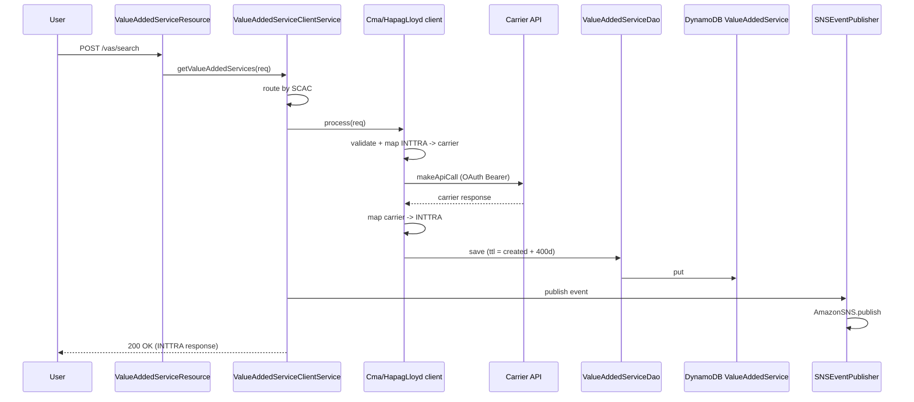
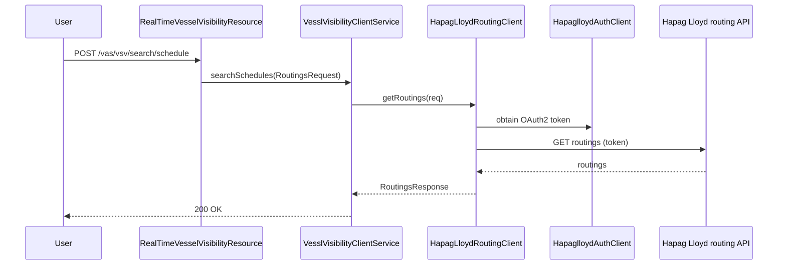

# Value Added Service (VAS) — Current-State Design

**Module:** `value-added-service`
**Date:** 2026-06-30
**Status:** Current state (AWS SDK 1.x — upgrade NOT STARTED)
**Artifact:** `com.inttra.mercury:value-added-service:1.0` (Dropwizard, single shaded JAR)
**Main class:** `com.inttra.mercury.vas.ValueAddedServiceApp`

---

## 1. Business Purpose & Rules

`value-added-service` lets INTTRA customers query and book ancillary carrier services (insurance, documentation,
customs brokerage, etc.) and look up real-time vessel-space visibility (VSV). It integrates with carrier APIs
(**CMA-CGM**, **Hapag Lloyd**) and archives every request/response in DynamoDB.

Two primary flows:

- **VAS Search** (`POST /vas/search`) — fetch available value-added services for a booking/shipment from the carrier.
- **Real-Time Vessel Visibility** — contract-party lookup (`GET /vas/vsv/contract-parties/...`) and schedule search
  (`POST /vas/vsv/search/schedule`).

### Business rules

| Rule | Detail |
|------|--------|
| Carrier routing | SCAC → carrier client (CMA vs Hapag Lloyd); each carrier has its own validator + request/response mapper. |
| Required request | SCAC, route (origin/destination), container info. |
| Caching | All responses persisted **400 days** (`DAYS_TO_EXPIRE = 400`) in DynamoDB. |
| Graceful failure | If a carrier API fails, return an empty list rather than error. |
| Event audit | Each search event published to an SNS topic via `SNSEventPublisher`. |

---

## 2. Design & Component Diagram

```mermaid
flowchart TB
  subgraph App[value-added-service Dropwizard /vas]
    VR[ValueAddedServiceResource\n/vas/search, /vas/{id}]
    RR[RealTimeVesselVisibilityResource\n/vas/vsv/*]
    VCS[ValueAddedServiceClientService]
    VVS[VesslVisibilityClientService]
    CMA[CmaValueAddedServiceClient]
    HL[HapaglloydValueAddedServiceClient]
    HLC[HapagLloydContractClient / RoutingClient]
    EC[ExternalClient]
    DAO[ValueAddedServiceDao\nextends DynamoDBCrudRepository]
    NSC[NetworkClient / AuthClient / HSCode / ContainerType / Participant]
    EP[SNSEventPublisher]
  end

  subgraph AWS[AWS]
    DDB[(DynamoDB\nValueAddedService)]
    SNS[(SNS event topic)]
    PS[(Parameter Store)]
  end

  subgraph Ext[Carrier + Network APIs]
    CMAA[(CMA-CGM API+OAuth)]
    HLA[(Hapag Lloyd API+OAuth)]
    NET[(network/auth)]
  end

  VR --> VCS
  RR --> VVS
  VCS --> CMA & HL
  VVS --> HLC
  CMA --> EC --> CMAA
  HL --> EC
  HLC --> HLA
  VCS --> DAO --> DDB
  VCS --> EP --> SNS
  VCS --> NSC --> NET
  App -. secrets .-> PS
```

### REST endpoints

| Path | Verb | Resource | Purpose |
|------|------|----------|---------|
| `/vas/search` | POST | `ValueAddedServiceResource` | Search VAS offerings by carrier. |
| `/vas/{id}` | GET | `ValueAddedServiceResource` | Retrieve archived response. |
| `/vas/vsv/contract-parties/{contractOrPartyNumber}/{scacCode}` | GET | `RealTimeVesselVisibilityResource` | Contract party lookup. |
| `/vas/vsv/search/schedule` | POST | `RealTimeVesselVisibilityResource` | Vessel schedule / routing search. |

### Key classes

| Class | Role |
|-------|------|
| `ValueAddedServiceClientService` | SCAC → carrier client routing for VAS search. |
| `VesslVisibilityClientService` | SCAC → contract/routing client routing for VSV. |
| `CmaValueAddedServiceClient` / `HapaglloydValueAddedServiceClient` | Validate → map → call carrier → map → persist. |
| `ExternalClient` | Shared HTTP wrapper (retries, error logging). |
| `ValueAddedServiceDao` (extends `DynamoDBCrudRepository`) | CRUD + GSI query by booking number. |
| `DynamoDBValueAddedService` (`@DynamoDBTable("ValueAddedService")`) | Entity with TTL + GSI + embedded `Audit`. |
| `InttraValueAddedServiceResponseConverter` / `CarrierResponseConverter` | Custom DynamoDB type converters (JSON). |
| `CmaAuthClient` / `HapaglloydAuthClient` | OAuth2 token acquisition. |

---

## 3. Data Flow

### 3.1 VAS search



### 3.2 VSV schedule search



---

## 4. Data Stores & Integrations

### DynamoDB — `ValueAddedService`
- Partition key `id`; TTL `expiresOn` (400 days, epoch); GSI `valueAddedServiceBookingNumber-index` on booking number.
- Attributes: `scacCode`, `inttraResponse` (custom converter), `carrierResponse` (generic Object converter), `bookingNumber`, embedded `audit`.

### SNS
Event topic from `config.snsEventTopicArn`; `SNSEventPublisher` (commons) publishes each VAS search event.

### External REST
- **CMA-CGM** — VAS search + OAuth token + assets.
- **Hapag Lloyd** — VAS search + contract parties + routing (OAuth2, `x-ibm-client-id/secret`).
- **INTTRA network/auth** — participants, HS codes, container types, geography, token validation.
- Carrier credentials from Parameter Store (`${awsps:/inttra/<env>/vas/...}`).

---

## 5. Maven Dependencies

| Artifact | Version | Notes |
|----------|---------|-------|
| **`com.amazonaws:aws-java-sdk-dynamodb`** | **`1.12.652`** | **AWS SDK v1 — DynamoDB (declared directly).** |
| `com.inttra.mercury:commons` | `1.R.01.023` | Dropwizard base, auth, **SNS** abstraction (`SNSEventPublisher`), DynamoDB module. |
| `com.inttra.mercury:dynamo-client` | `1.R.01.023` | `DynamoDBCrudRepository`. |
| `io.swagger:swagger-annotations` | `1.5.24` | OpenAPI annotations. |
| `org.projectlombok:lombok` | parent | `@Data`,`@Builder`,`@Slf4j`. |
| Tests | JUnit Jupiter 5.11.3, Mockito 5.14.2 / junit-jupiter 2.17.0 | Unit tests. |

---

## 6. Configuration & Deployment

### Configuration (`conf/{int,qa,cvt,prod}/config.yaml`)
- `server.rootPath: /vas`, ports 8080/8081.
- `externalVasServices` — carrier endpoints (CMA VAS/auth/assets, Hapag VAS/contract/routing) with SCAC lists + headers.
- `serviceDefinitions` — auth, participants, geography, hscode, containertype.
- `dynamoDbConfig`, `dynamoDbTableConfig`, `valueAddedServiceEnabled` (flag), `snsEventTopicArn`.
- Secrets via Parameter Store; config class `ValueAddedServiceConfig extends ApplicationConfiguration`.

### Deployment
- `build.sh` (+ Sonar) → `value-added-service-1.0.jar`, Docker (OpenJRE 11).
- `run.sh` → `java -Xms128m -Xmx${JVM_Xmx} -jar value-added-service-1.0.jar server config.yaml`.
- DynamoDB table bootstrap via `db-command` (`DynamoValueAddedServiceTableCommand`).

---

## 7. AWS Services & SDK 1.x Usage (CALL-OUT)

> **AWS SDK v1.** DynamoDB (direct `aws-java-sdk-dynamodb 1.12.652`) **and** SNS (`AmazonSNS` v1) are used. **No** AWS v2 / cloud-sdk yet.

| AWS service | SDK | Where | v1 classes |
|-------------|-----|-------|------------|
| **DynamoDB** | v1 | `ValueAddedServiceDao`, `DynamoDBValueAddedService`, `Audit`, converters | `DynamoDBMapper`, `DynamoDBMapperConfig`, `@DynamoDBTable/@DynamoDBHashKey/@DynamoDBAttribute/@DynamoDBIndexHashKey/@DynamoDBDocument/@DynamoDBTypeConverted`, `DynamoDBTypeConverter` (`InttraValueAddedServiceResponseConverter`, `CarrierResponseConverter`) |
| **SNS** | v1 (direct) | `ValueAddedServiceModule` | `AmazonSNS`, `AmazonSNSClientBuilder` (`.standard().build()`), bound via Guice; publish delegated through commons `SNSEventPublisher` |
| **Parameter Store** | commons (`${awsps:...}`) | config | — |

---

## 8. AWS 2.x / cloud-sdk Upgrade Plan (High Level)

| Step | Action | Reference |
|------|--------|-----------|
| 1 | Bump `commons`/`dynamo-client` to the cloud-sdk-bearing version; **remove direct `aws-java-sdk-dynamodb 1.12.652`**. | booking, visibility |
| 2 | **SNS** — replace `AmazonSNS`/`AmazonSNSClientBuilder` in `ValueAddedServiceModule` with the cloud-sdk `NotificationService`/`SnsService` + factory and config block; keep the event payload shape wire-compatible. | **booking**, **network** |
| 3 | **DynamoDB** — migrate `DynamoDBValueAddedService`/`Audit` + `ValueAddedServiceDao` to the cloud-sdk `DatabaseRepository`/enhanced-client; re-implement `InttraValueAddedServiceResponseConverter` & `CarrierResponseConverter` (JSON of arbitrary Object) as v2 attribute converters. | booking, network, registration |
| 4 | Preserve table name (`ValueAddedService`), key `id`, GSI `valueAddedServiceBookingNumber-index`, and 400-day TTL encoding for backward compatibility. | — |
| 5 | **Tests** — DynamoDB-Local IT for `ValueAddedServiceDao` (save/get, GSI by booking number, TTL); SNS publish mirrored at **booking/network** test level (unit, mocked); carrier-mapper unit tests; full local JaCoCo coverage on changed code. | network/auth `*DaoIT`, booking |

**Call-outs:** Two AWS services (DynamoDB + SNS). The `carrierResponse` generic-`Object` JSON converter is the
trickiest fidelity point — ensure the v2 converter serializes identically so archived carrier responses remain
readable. SNS migration should mirror **booking**/**network** exactly.
