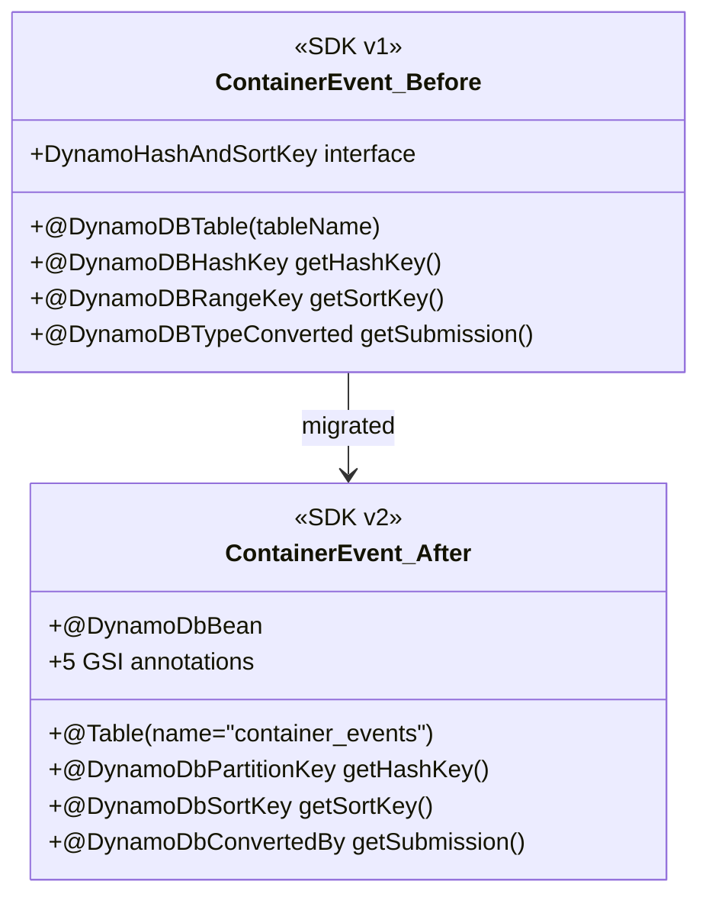
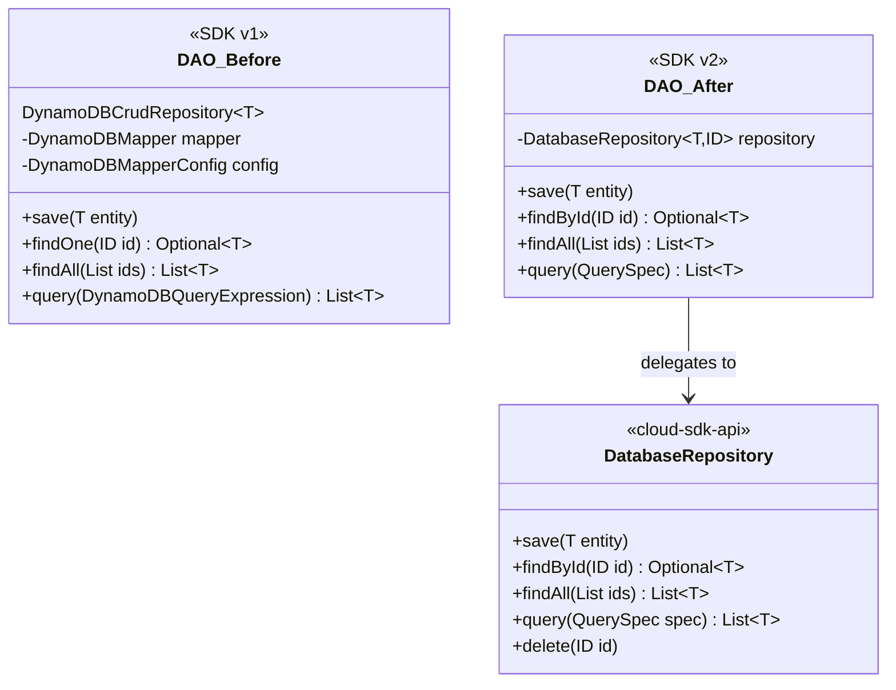
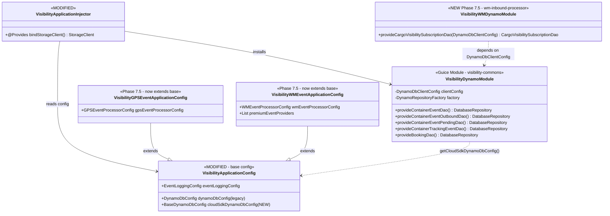
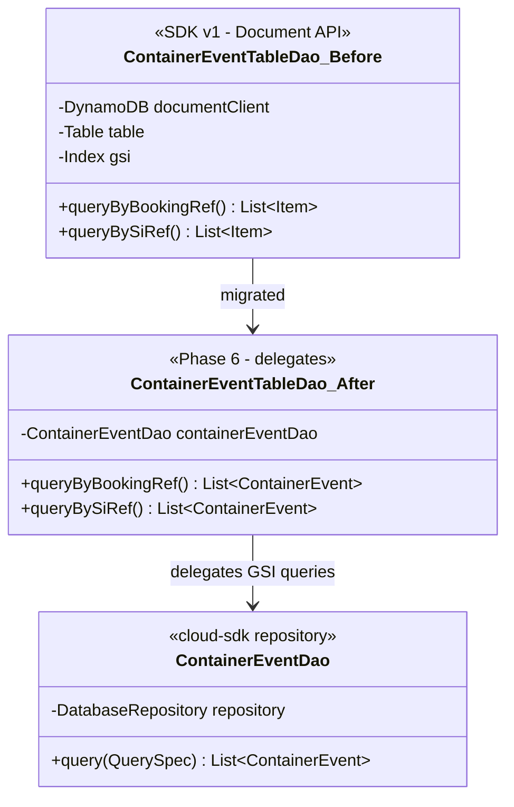
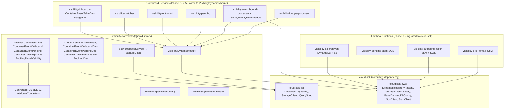

# Visibility Module — AWS SDK 2.x Upgrade Design Document

**Jira Ticket**: ION-12316  
**Branch**: `feature/ION-12316-visibiilty-aws-upgrade-copilot`  
**Date**: 2026-05-31 (updated 2026-06-01)  
**Agent**: Claude Opus 4.6 / 4.8  
**Status**: ALL PHASES COMPLETE (5–9). Full `mvn verify -pl visibility -amd` = BUILD SUCCESS, all 11 modules, 0 failures / 0 errors. Not pushed; no PR (per instruction).

> A consolidated change-and-verification summary is also available in [2026-06-01-aws-sdk-upgrade-summary.md](2026-06-01-aws-sdk-upgrade-summary.md).

---

## 1. Executive Summary

Migrate the `visibility` module from AWS SDK v1 DynamoDB annotations and clients to `cloud-sdk-api` + `cloud-sdk-aws` libraries (AWS SDK v2 Enhanced Client). This aligns visibility with already-upgraded modules (booking, auth, network, webbl, booking-bridge, registration, self-service-reports, tx-tracking, db-migration).

**Scope**: 11 visibility sub-modules, 6 DynamoDB entities, 6 DAOs, 10 converters, S3/StorageClient migration, Guice module restructuring, booking model JAR upgrade.

---

## 2. Booking Model JAR Upgrade

### Problem
`BookingDetailVisibility` extends `BookingDetail` from a pre-compiled JAR (`booking-2.1.8.M.jar`) checked into `visibility/visibility-commons/lib/`. This JAR contained **SDK v1 annotations** (`com.amazonaws.services.dynamodbv2.datamodeling.*`).

Java compilation succeeded because the compiler doesn't re-validate annotations on pre-compiled classes. However, at **runtime** the DynamoDB Enhanced Client would fail — it ignores SDK v1 annotations, leading to incorrect field mapping, missing keys, and wrong converters.

### Solution
- Built new `booking-3.0.0.M.jar` from current develop source using the `booking-model` profile's include patterns
- Source `BookingDetail` now has `@DynamoDbBean`, `@DynamoDbPartitionKey`, `@DynamoDbConvertedBy`, `@TTL`, `@GsiConfig` (SDK v2)
- Deployed to `visibility/visibility-commons/lib/com/inttra/mercury/booking/3.0.0.M/`
- Updated `visibility-commons/pom.xml` version from `2.1.8.M` → `3.0.0.M`
- Fixed `BookingDao.getHashKey()` → `getBookingId()` (old `DynamoHashAndSortKey` interface removed in SDK v2)

### Build Command
```bash
mvn compile -pl booking -am -DskipTests
cd booking/target/classes
jar cf ../booking-model-3.0.0.jar \
  com/inttra/mercury/booking/model/ \
  com/inttra/mercury/booking/inbound/ \
  com/inttra/mercury/booking/dynamodb/ \
  com/inttra/mercury/booking/exceptions/ \
  com/inttra/mercury/booking/util/ \
  com/inttra/mercury/booking/outbound/model/ \
  com/inttra/mercury/booking/validation/ValidationContext.class \
  com/inttra/mercury/booking/networkservices/geography/model/ \
  com/inttra/mercury/booking/networkservices/referencedata/model/ \
  com/inttra/mercury/booking/networkservices/Status.class \
  com/inttra/mercury/booking/validation/ValidationHelper.class \
  com/inttra/mercury/booking/validation/MessageGenerator.class \
  com/inttra/mercury/booking/common/event/WorkflowAware.class
```

---

## 3. Class Diagrams

### Entity Migration — Before vs After



### DAO Migration



### Guice Module Structure



### Service Internals — ContainerEventTableDao Delegation (Phase 6)



---

## 4. Component Diagram



---

## 5. Maven Dependency Changes

### visibility/pom.xml (parent)
```xml
<mercury.cloudsdk.version>1.0.26-SNAPSHOT</mercury.cloudsdk.version>
```

### visibility-commons/pom.xml
- **Changed**: `booking` version `2.1.8.M` → `3.0.0.M`
- **Added**: `cloud-sdk-api`, `cloud-sdk-aws` (version `${mercury.cloudsdk.version}`)
- **Added**: `dynamo-integration-test` (test scope)
- **Kept**: `commons` (`${mercury.commons.version}` = `1.R.01.021`) for legacy SQS/messaging

---

## 6. Entities Migrated (Phase 5 — COMPLETE)

| Entity | Table | Key Type | GSIs | Location |
|--------|-------|----------|------|----------|
| `ContainerEvent` | `container_events` | `DefaultPartitionKey<String>` | 5 (booking_ref, si_ref, equipment, booking_number, bol) | visibility-commons |
| `ContainerEventOutbound` | `container_events_outbound` | `DefaultCompositeKey<String,String>` | 0 | visibility-commons |
| `ContainerEventPending` | `container_events_pending` | `DefaultCompositeKey<String,String>` | 0 | visibility-commons |
| `ContainerTrackingEvent` | `container_events` | `DefaultPartitionKey<String>` | 0 | visibility-commons |
| `BookingDetailVisibility` | `booking_BookingDetail` | `DefaultCompositeKey<String,String>` | inherits from BookingDetail | visibility-commons |
| `CargoVisibilitySubscription` | `CargoVisibilitySubscription` | `DefaultPartitionKey<String>` | 1 (subscriptionReference) | visibility-wm-inbound-processor |

---

## 7. Converters Created (10 new files)

| Converter | Purpose |
|-----------|---------|
| `ContainerEventSubmissionAttributeConverter` | Serializes `ContainerEventSubmission` to JSON string |
| `ContainerEventEnrichedPropertiesAttributeConverter` | Serializes enriched properties map |
| `MetaDataAttributeConverter` | Serializes metadata with backward compat for SDK v1 Map format |
| `GISOutboundDetailsAttributeConverter` | Serializes GIS outbound details |
| `SubscriptionAttributeConverter` | Serializes subscription object |
| `ContainerTrackingEventMessageAttributeConverter` | Serializes tracking event message |
| `DateEpochMilliSecondAttributeConverter` | Converts Date ↔ epoch milliseconds |
| `DateIso8601AttributeConverter` | Converts Date ↔ ISO-8601 string |
| `LegacyMapConverter` | Handles SDK v1 Map (M) format vs SDK v2 String (S) format |
| `FlexibleLocalDateTimeDeserializer` | Handles both `T` separator and space separator datetime formats |

---

## 8. DAOs Migrated

| Old Pattern | New Pattern |
|------------|-------------|
| `DynamoDBCrudRepository<T>` with `DynamoDBMapper` | `DatabaseRepository<T, ID>` from `cloud-sdk-api` |
| `DynamoDBMapperConfig` with table name override | `@Table(name="...")` annotation on entity |
| `DynamoDBQueryExpression` with `DynamoDBMapper.query()` | `DefaultQuerySpec` with `repository.query()` |
| `findOne(ID)` | `findById(ID)` returns `Optional<T>` |
| `new DefaultPartitionKey<>(value)` | Constructor-based (no static factory) |

---

## 9. Service Migrations (Phase 5 — COMPLETE)

| Component | Old | New |
|-----------|-----|-----|
| `S3WorkspaceService` | `AmazonS3` | `StorageClient` (via `StorageClientFactory.createDefaultS3Client()`) |
| `VisibilityApplicationInjector.bindStorageClient()` | `bindS3()` returning `AmazonS3ClientBuilder` | `@Provides @Singleton` returning `StorageClient` |
| `BookingDao.getHashKey()` | `DynamoHashAndSortKey.getHashKey()` | `BookingDetail.getBookingId()` |

---

## 10. Test Files Updated (Phase 5 — COMPLETE)

| Test File | Changes |
|-----------|---------|
| `ContainerEventDaoTest` | `DynamoDBMapper` mock → `DatabaseRepository` mock |
| `ContainerEventOutboundDaoTest` | Same pattern |
| `ContainerEventPendingDaoTest` | Same pattern |
| `ContainerTrackingEventDaoTest` | Same pattern |
| `BookingDaoTest` | `DynamoDBMapper` → `DatabaseRepository<BookingDetailVisibility, DefaultCompositeKey>` |
| `CargoVisibilitySubscriptionDaoTest` | Same, plus `DateEpochSecondAttributeConverter` tests |
| `S3WorkspaceServiceTest` | `AmazonS3` mock → `StorageClient` mock, void `putObject()` |
| `VisibilityApplicationInjectorTest` | Removed `bindStorageClient()` call (auto-discovered via `@Provides`) |
| `VisibilityGPSEventApplicationInjectorTest` | `DynamoDBMapper`/`DynamoDBMapperConfig` → `DatabaseRepository<ContainerEvent>` TypeLiteral |
| `VisibilityWMEventApplicationInjectorTest` | Two `DatabaseRepository` TypeLiteral bindings |
| `VisibilityPendingApplicationInjectorTest` | Four `DatabaseRepository` TypeLiteral bindings (incl. `BookingDetailVisibility`) |
| `VisibilityInboundApplicationInjectorTest` | `DatabaseRepository<ContainerEvent>` binding |
| `ContainerEventTableDaoTest` | `anyIterable()` → `anyList()` |
| `InboundEdiProcessorTest` | `IOException` → `RuntimeException` (StorageClient doesn't throw checked exceptions) |

---

## 11. Completed Work (Phases 6–9)

### Phase 6: Dropwizard Service Internals (COMPLETE — commit `a38e675661`)
- `visibility-inbound` migrated: `ContainerEventTableDao` GSI queries delegate to the `ContainerEventDao` repository (`DatabaseRepository` + `QuerySpec`) instead of the SDK v1 Document API.
- Sub-module injector wired to `VisibilityDynamoModule` (via `VisibilityApplicationConfig.getCloudSdkDynamoDbConfig()`).
- **Deliberately kept on SDK v1** (out of scope): `DynamoContainerEventsTableCommand` / `DynamoContainerEventsPendingTableCommand` (CLI-only table creation), and `ElasticSearchClientModule` + `AwsRequestSigner` (ES signing — separate OpenSearch migration track).

### Phase 7: Lambda Functions (COMPLETE — commit `6d4d421fb5`)
All 4 lambdas migrated to cloud-sdk; assembly/shaded jars build cleanly:
- `visibility-s3-archiver` — DynamoDB + S3 moved to cloud-sdk (Lambda runtime event models intentionally remain `com.amazonaws.services.lambda.runtime.events.*`).
- `visibility-pending-start` — SQS via cloud-sdk.
- `visibility-outbound-poller` — SSM + SQS via cloud-sdk.
- `visibility-error-email` — SSM (ParameterStore) via cloud-sdk.

### Phase 7.5: Application Module Swaps (COMPLETE — commit `3bb89dc2e3`)
Swapped 5 Dropwizard apps from legacy `DynamoDBModule` to cloud-sdk `VisibilityDynamoModule`:
- `visibility-outbound`, `visibility-pending`, `visibility-matcher` — clean module swaps.
- `visibility-itv-gps-processor` — `VisibilityGPSEventApplicationConfig` refactored to extend `VisibilityApplicationConfig`; app swapped.
- `visibility-wm-inbound-processor` — `VisibilityWMEventApplicationConfig` refactored to extend `VisibilityApplicationConfig`; added new `VisibilityWMDynamoModule` providing the wm-specific `CargoVisibilitySubscriptionDao` from `DynamoDbClientConfig` (keeps the injector free of `DynamoDbClientConfig` so unit tests can bind a mocked repository). App wires both `VisibilityDynamoModule` and `VisibilityWMDynamoModule` via chained `.moduleGenerator(...)`.

### Phase 8: Full Verification (COMPLETE)
`mvn verify -pl visibility -amd` → **BUILD SUCCESS**, all 11 modules. Test totals (0 failures / 0 errors):

| Module | Tests run | Skipped |
|--------|-----------|---------|
| visibility-commons | 183 | 0 |
| visibility-inbound | 410 | 2 |
| visibility-wm-inbound-processor | 117 | 0 |
| visibility-matcher | 52 | 0 |
| visibility-outbound | 42 | 2 |
| visibility-pending | 6 | 0 |
| visibility-s3-archiver | 9 | 0 |
| visibility-pending-start | 4 | 1 |
| visibility-error-email | 14 | 1 |
| visibility-outbound-poller | 2 | 0 |
| visibility-itv-gps-processor | 18 | 0 |

All 4 lambda assembly/shaded jars produced.

### Phase 9: Final Documentation (COMPLETE — commit `69d9344e13`)
- Consolidated summary: [2026-06-01-aws-sdk-upgrade-summary.md](2026-06-01-aws-sdk-upgrade-summary.md).
- This design document updated to reflect completion.

### Commit & Push status
Branch `feature/ION-12316-visibiilty-aws-upgrade-copilot` holds 5 incremental `ION_12316`-prefixed commits (`2a593bf407`, `a38e675661`, `6d4d421fb5`, `3bb89dc2e3`, `69d9344e13`). **Not pushed and no PR created** — awaiting review per instruction.

### Operational follow-up (out of scope for code commits)
The per-environment conf yamls still contain only legacy `dynamoDbConfig:`. A `cloudSdkDynamoDbConfig:` block must be populated per environment at deployment time before these services run against AWS.

---

## 12. Data Format Backward Compatibility

All converters handle both legacy (SDK v1) and new (SDK v2) data formats:
- **Dates**: `DateEpochMilliSecondAttributeConverter` and `DateIso8601AttributeConverter` handle epoch and ISO-8601
- **Complex objects**: `LegacyMapConverter` detects SDK v1 Map (M) format vs SDK v2 String (S/JSON) format
- **DateTimes**: `FlexibleLocalDateTimeDeserializer` handles both `T` separator and space separator
- **Boolean fields**: Handle both string `"1"` and numeric `1` representations

---

## 13. Configuration Changes

### VisibilityApplicationConfig.java
```yaml
# New cloud-sdk config section (added alongside existing dynamoDbConfig)
cloudSdkDynamoDbConfig:
  region: us-east-1
  endpoint: ""  # empty = use default AWS endpoint
```

---

## 14. Files Changed Summary

### Phase 5 (visibility-commons, commit `2a593bf407`)
- **60 files changed**: 1645 insertions, 1610 deletions
- **10 new converter files** in `visibility-commons/.../converters/`
- **1 new Guice module**: `VisibilityDynamoModule.java`
- **1 new booking model JAR**: `booking-3.0.0.M.jar` (replaces `booking-2.1.8.M.jar`)
- **6 entities migrated** to `@DynamoDbBean` + `@Table`
- **6 DAOs migrated** from `DynamoDBCrudRepository` to `DatabaseRepository`
- **14 test files updated**

### Full branch total (Phases 5\u20139)
- **~103 files changed** across the branch (~9,065 insertions, ~2,359 deletions)
- **5 commits**: `2a593bf407` (Phase 5), `a38e675661` (Phase 6, visibility-inbound), `6d4d421fb5` (Phase 7, 4 lambdas), `3bb89dc2e3` (Phase 7.5, 5 app swaps), `69d9344e13` (Phase 9, summary doc)
- **1 additional new Guice module**: `VisibilityWMDynamoModule.java` (wm-specific `CargoVisibilitySubscriptionDao`)
- Java files changed per module: commons 40, inbound 17, wm 11, error-email 3, itv-gps 3, outbound-poller 3, pending 3, pending-start 3, s3-archiver 3, matcher 2, outbound 2
