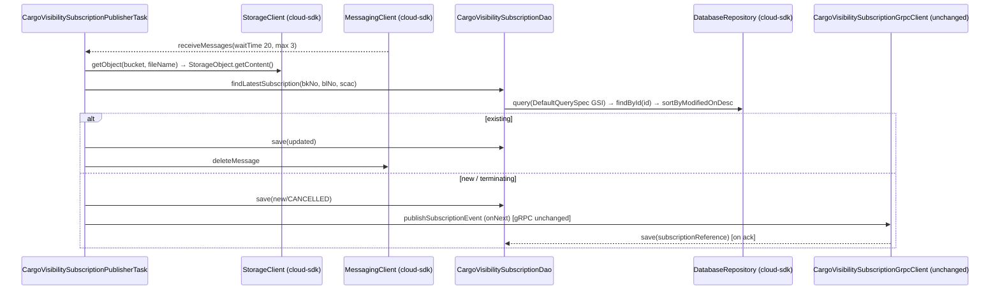

# Watermill Publisher — AWS SDK 2.x (cloud-sdk) Upgrade Design (Suite-wide)

**Module:** `watermill-publisher` (parent + `watermill-commons`, `watermill-booking`, `watermill-booking-aperak`, `watermill-cargo-visibility-subscription`)
**Date:** 2026-06-30
**Status:** Target design (AWS 1.x → AWS 2.x via cloud-sdk) — **NOT STARTED**
**Companion:** `2026-06-30-watermill-publisher-current-state-DESIGN-claude.md`
**Reference upgrades:** `booking` (S3 + DynamoDB, complete), `visibility` (S3 + DynamoDB + SNS/SQS), `network`/`registration`/`auth` (DynamoDB DAO patterns)

---

## 1. Change Overview

Replace all direct AWS SDK v1 (`com.amazonaws.*`) usage in the watermill-publisher suite with the in-house
**cloud-sdk** (`cloud-sdk-api` + `cloud-sdk-aws`, AWS SDK 2.x Enhanced Client + Apache HTTP under the hood). The bulk
of the AWS surface lives in **`watermill-commons`** (S3 + SQS, plus the SNS path via `commons`); **DynamoDB** is
exclusive to **`watermill-cargo-visibility-subscription`**.

| AWS service | Current (v1) | Target (cloud-sdk / v2) | Where |
|-------------|--------------|--------------------------|-------|
| **S3** | `AmazonS3` / `AmazonS3ClientBuilder`, `GetObjectRequest`, `CopyObjectRequest`, `ObjectMetadata`, `S3Object`, `IOUtils` | `StorageClient` + `StorageClientFactory.createDefaultS3Client()`; `StorageObject` for reads | `watermill-commons` `S3WorkspaceService`; 3 injectors |
| **SQS** | `AmazonSQS` / `AmazonSQSClientBuilder`, `ReceiveMessageRequest`, `SendMessageRequest`, `DeleteMessageRequest`, `GetQueueAttributesRequest`, `Message` | cloud-sdk messaging client (verify exact name in booking/visibility) + v2 `Message` | `watermill-commons` `SQSClient` / `SQSListener` / `SQSListenerClient` / `DeadLetterService`; 3 injectors |
| **SNS** | `AmazonSNS` / `AmazonSNSClientBuilder` bound as singleton; `commons` `SNSEventPublisher`/`messaging.sns.SNSClient` | cloud-sdk notification client (verify) — largely a `commons` concern | 3 injectors + `commons` |
| **DynamoDB** | `DynamoDBMapper` + v1 ORM annotations (via `dynamo-client`), `DynamoDBMapperConfig`, TTL API | `DatabaseRepository<T,K>` + Enhanced-client annotations (`cloud-sdk-aws`) + `DefaultQuerySpec` | `watermill-cargo-visibility-subscription` only |

**Out of scope:**
- **gRPC / Netty** (`grpc-netty-shaded` 1.77.0, `PublisherInitializer`, all `*GrpcClient`/`ResponseObserver`/
  `AuthCredentials`, proto codegen) — the e2open transport is orthogonal to the AWS SDK and stays byte-for-byte.
- **Parameter Store** (`${awsps:}` still resolved by `commons`).
- **The `booking` domain-model JAR** and the transformer/TypeMap layer (no AWS types; unchanged).
- **IBM MQ / Oracle** — not used by watermill.

**Backward-compatibility is mandatory.** The following must remain wire-identical:

- **DynamoDB** table `CargoVisibilitySubscription`; GSIs `bookingNumber-carrierScac-index`,
  `billOfLading-carrierScac-index`, `subscriptionReference-index` (all **KEYS_ONLY**); their key schema; the hash-key
  **attribute name `id`** (Java field `hashKey`); `expiresOn` as **epoch-second number** (TTL-eligible via
  `DateToEpochSecond`); `createdOn`/`modifiedOn` as their current encodings; enums (`state`/`type`/`clientType`) as
  their `name()` strings; the `subscriptionReference` back-fill write path.
- **S3** — the same bucket/key access, and the `ISO_8859_1` read charset used by both booking tasks (`getContent(...,
  StandardCharsets.ISO_8859_1)`); `RecoverableException` wrapping so failed reads stay on the queue.
- **SQS** — long-poll semantics (`waitTimeSeconds 20`, `maxNumberOfMessages 3`), the `<queueUrl>_dlq` DLQ naming, the
  `MetaData` JSON envelope shape (timestamp `yyyy-MM-dd HH:mm:ss.SS`), and the **poison-drop** behaviour
  (`deleteMessage` on transformation error).
- **SNS** — the `snsEventTopicArn` audit event body from `EventLogger`/`SNSEventPublisher`.

> **Decoupling rule.** The DynamoDB on-wire attribute formats (epoch-second `expiresOn`, enum `name()`) are independent
> of the SQS/S3 JSON formats (Jackson via commons `Json`, `MetaData` `@JsonFormat`). The v2 `AttributeConverter` must
> govern only the DynamoDB representation and must not leak into the JSON path, and vice-versa. Both keep their current,
> distinct encodings.

---

## 2. Maven Dependency Changes

### 2.1 `watermill-commons/pom.xml` (the substrate — do this first)

```diff
  <properties>
-   <aws.java.sdk.version>1.12.661</aws.java.sdk.version>
-   <mercury.commons.version>1.R.01.023</mercury.commons.version>
-   <mercury.dynamodbclient.version>1.R.01.023</mercury.dynamodbclient.version>
+   <mercury.commons.version>1.0.26-SNAPSHOT</mercury.commons.version>   <!-- cloud-sdk-bearing line; verify vs booking/visibility -->
    <grpc.version>1.77.0</grpc.version>                                  <!-- unchanged -->
    <google.protobuf.version>4.33.1</google.protobuf.version>            <!-- unchanged -->
  </properties>

  <dependencies>
    <dependency>
      <groupId>com.inttra.mercury</groupId>
      <artifactId>commons</artifactId>
      <version>${mercury.commons.version}</version>
      <!-- keep the jackson-core exclusion -->
    </dependency>
+   <dependency>
+     <groupId>com.inttra.mercury</groupId>
+     <artifactId>cloud-sdk-api</artifactId>
+     <version>${mercury.commons.version}</version>
+   </dependency>
+   <dependency>
+     <groupId>com.inttra.mercury</groupId>
+     <artifactId>cloud-sdk-aws</artifactId>
+     <version>${mercury.commons.version}</version>
+   </dependency>
    <!-- grpc-*, protobuf-* dependencies UNCHANGED -->
  </dependencies>
```

- `watermill-commons` gains `cloud-sdk-api` + `cloud-sdk-aws`; the transitive `com.amazonaws:aws-java-sdk-*` from the
  old `commons` line drops off once `commons` is on the cloud-sdk-bearing version.
- cloud-sdk uses **Apache HTTP** (no Netty for AWS). Note this does **not** touch `grpc-netty-shaded`, which is the
  e2open transport and stays.

### 2.2 `watermill-cargo-visibility-subscription/pom.xml`

```diff
  <properties>
-   <mercury.dynamodbclient.version>1.R.01.023</mercury.dynamodbclient.version>
  </properties>

  <dependencies>
-   <dependency>
-     <groupId>com.inttra.mercury</groupId>
-     <artifactId>dynamo-client</artifactId>
-     <version>${mercury.dynamodbclient.version}</version>
-   </dependency>
+   <!-- cloud-sdk-api/-aws come transitively from watermill-commons; add here only if a direct
+        compile dependency on the enhanced annotations is required -->

+   <!-- DynamoDB Local integration-test framework (matches booking) -->
+   <dependency>
+     <groupId>com.inttra.mercury</groupId>
+     <artifactId>dynamo-integration-test</artifactId>
+     <version>${mercury.commons.version}</version>
+     <scope>test</scope>
+   </dependency>
+   <dependency>
+     <groupId>com.amazonaws</groupId>
+     <artifactId>aws-java-sdk-dynamodb</artifactId>
+     <version>1.12.721</version>
+     <scope>test</scope>   <!-- DynamoDB-Local only, not on prod classpath -->
+   </dependency>
  </dependencies>
```

### 2.3 `watermill-booking/pom.xml` + `watermill-booking-aperak/pom.xml`

- **No AWS deps to remove** — both only carry `booking`, `watermill-commons`, lombok/test. They inherit the S3/SQS/SNS
  fix from `watermill-commons`.
- **aperak** currently excludes the booking JAR's transitive `aws-java-sdk-sns/-sqs/-dynamodb` +
  `aws-lambda-java-events`. Keep the exclusions (they harmlessly prune v1 artifacts); after the migration those v1 SDKs
  will no longer be on the classpath at all, so the exclusions become no-ops but are safe to leave.

> After this, **no `com.amazonaws` on any prod classpath** in the suite; the only remaining `aws-java-sdk-dynamodb` is
> the CV module's **test-scoped** DynamoDB-Local dependency.

---

## 3. Configuration Changes (`conf/<env>/config.yaml`)

Only the CV module has a DynamoDB block. Keep the existing keys, add the cloud-sdk `BaseDynamoDbConfig` fields
(`region`, `sseEnabled`, optional local-emulator endpoint). The `environment` prefixes — **including CVT's `inttra2_cv`**
— and 5/5 capacities stay unchanged. SQS/S3/SNS/gRPC config is untouched.

```diff
  dynamoDbConfig:
    environment: inttra2_cv        # CVT stays inttra2_cv; INT inttra_int, QA inttra2_qa, PROD inttra2_pr
+   region: us-east-1
+   sseEnabled: false
+   # local Dynamo emulator only:
+   #regionEndpoint: http://localhost:8000
+   #signingRegion: us-west-2

  dynamoDbTableCreationCommandConfig:
    - tableName: CargoVisibilitySubscription
      readThroughput: 5
      writeThroughput: 5
      globalSecondaryIndexes: [ ... unchanged: 3 KEYS_ONLY GSIs ... ]
```

**Config class change** — `CargoVisibilitySubscriptionConfig.dynamoDbConfig` moves from
`com.inttra.mercury.dynamo.respository.module.DynamoDbConfig` to
`com.inttra.mercury.cloudsdk.database.config.BaseDynamoDbConfig` (as in `BookingConfig`):

```diff
- import com.inttra.mercury.dynamo.respository.module.DynamoDbConfig;
+ import com.inttra.mercury.cloudsdk.database.config.BaseDynamoDbConfig;
  @Data @EqualsAndHashCode(callSuper = false)
  public class CargoVisibilitySubscriptionConfig extends ApplicationConfiguration {
    ...
-   @JsonProperty @NotNull private DynamoDbConfig dynamoDbConfig;
+   @JsonProperty @Valid @NotNull private BaseDynamoDbConfig dynamoDbConfig;
    @JsonProperty @NotNull private List<DynamoDbTableCreationCommandConfig> dynamoDbTableCreationCommandConfig;
  }
```

---

## 4. Per-Service Spec

### 4.1 S3 — `watermill-commons` `S3WorkspaceService`

**Before (v1):**
```java
// S3WorkspaceService (constructor-injected AmazonS3)
private final AmazonS3 s3Client;
public String getContent(String bucket, String fileName, Charset charset) {
    S3Object s3object = s3Client.getObject(new GetObjectRequest(bucket, fileName));
    return read(s3object.getObjectContent(), charset);            // IOUtils.toByteArray → new String(bytes, charset)
}
public PutObjectResult putObject(String bucket, String fileName, String content) {
    return s3Client.putObject(bucket, fileName, content);
}
public void copyObjectWithMetaDate(String s, String sf, String t, String tf, Map<String,String> md) {
    ObjectMetadata m = new ObjectMetadata(); m.setUserMetadata(md);
    s3Client.copyObject(new CopyObjectRequest(s, sf, t, tf).withNewObjectMetadata(m));
}
// all wrapped: catch (SdkClientException) -> throw new RecoverableException(ex)
```

**After (cloud-sdk):** (mirrors booking `S3WorkspaceService`)
```java
private final StorageClient storageClient;
@Inject public S3WorkspaceService(StorageClient storageClient) { this.storageClient = storageClient; }

public String getContent(String bucket, String fileName, Charset charset) {
    try {
        StorageObject obj = storageClient.getObject(bucket, fileName);
        return new String(obj.getContent().readAllBytes(), charset);  // preserve ISO_8859_1 caller
    } catch (StorageException | IOException ex) { throw new RecoverableException(ex); }
}
public void putObject(String bucket, String fileName, String content) {
    try { storageClient.putObject(bucket, fileName, content); }
    catch (StorageException ex) { throw new RecoverableException(ex); }
}
public void copyObjectWithMetaDate(String s, String sf, String t, String tf, Map<String,String> md) {
    try { storageClient.copyObject(s, sf, t, tf, md); }             // verify metadata-copy overload name
    catch (StorageException ex) { throw new RecoverableException(ex); }
}
```

- **Keep `RecoverableException`** as the wrapper (its whole purpose is to keep failed S3 reads on the queue) — swap only
  the caught type (`SdkClientException` → cloud-sdk `StorageException`).
- **Charset fidelity:** `WatermillBKTask`/`WatermillBKAperakTask` call `getContent(..., ISO_8859_1)`; the v2 read must
  decode with the caller's charset exactly (do not let cloud-sdk default to UTF-8).
- `getS3ObjectWrapper` (content + user metadata), `getS3InputStream`, `getMetaData`, `copyS3FileToFileSystem`,
  `putObject(byte[])`, `putObjectWithMetaData` migrate the same way via `StorageObject`/`StorageClient` overloads
  (drop `com.amazonaws.util.IOUtils`, `S3ObjectInputStream`, `ObjectMetadata`).

> **Gap call-out.** The v1 client is `AmazonS3ClientBuilder.standard().build()` (default retries/timeouts).
> `StorageClientFactory.createDefaultS3Client()` (used by booking) does not expose error-retry / socket / connection-pool
> tuning. Watermill sets no custom knobs today, so `createDefaultS3Client()` is behaviour-equivalent; if any tuning is
> later required use `StorageClientFactory.createS3Client(AwsStorageConfig…)` or raise a cloud-sdk enhancement (same gap
> flagged in the visibility upgrade).

### 4.2 SQS — `watermill-commons` `SQSClient`, `SQSListener`, `DeadLetterService`

**Before (v1):**
```java
// SQSClient (two AmazonSQS: amazonSQSForSender / listener via SQSListenerClient)
amazonSQS.sendMessage(new SendMessageRequest().withQueueUrl(t).withMessageBody(c));
amazonSQS.deleteMessage(new DeleteMessageRequest(queueUrl, receiptHandle));
GetQueueAttributesResult r = amazonSQS.getQueueAttributes(
    new GetQueueAttributesRequest(queueName, List.of("VisibilityTimeout")));

// SQSListener.pollAndExecute
ReceiveMessageRequest req = new ReceiveMessageRequest(queueUrl);
req.setWaitTimeSeconds(waitTimeSeconds);            // 20
req.setMaxNumberOfMessages(maxNoOfMessages);        // ≤3
List<Message> messages = sqs.receiveMessage(req).getMessages();
// catch (com.amazonaws.AbortedException | InterruptedException) -> stop loop
```

**After (cloud-sdk):** (verify exact messaging client name/signatures against booking/visibility)
```java
private final MessagingClient messagingClient;   // cloud-sdk messaging (queue) client
messagingClient.sendMessage(target, content);
messagingClient.deleteMessage(queueUrl, receiptHandle);
long vt = messagingClient.getVisibilityTimeout(queueName);

// SQSListener.pollAndExecute — preserve waitTime 20 / maxNumberOfMessages ≤3
List<QueueMessage> messages = messagingClient.receiveMessages(
    ReceiveSpec.builder().queueUrl(queueUrl).waitTimeSeconds(waitTimeSeconds).maxMessages(maxNoOfMessages).build());
// replace catch (com.amazonaws.AbortedException) with the cloud-sdk/SDK-v2 abort/interrupt equivalent
```

- **Message type ripple:** `SQSListener`/`AsyncDispatcher`/`Task.execute(List<Message>, String)` and both tasks import
  `com.amazonaws.services.sqs.model.Message`. This becomes the cloud-sdk/v2 message type — a **cross-cutting signature
  change** through `Task`, `AsyncDispatcher`, `TaskMessage`, `WatermillBKTask`, `WatermillBKAperakTask`,
  `CargoVisibilitySubscriptionPublisherTask`, and every `ResponseObserver` that reads `receiptHandle`. Do this in
  `watermill-commons` and propagate.
- **Preserve** the `<queueUrl>_dlq` DLQ naming (`DeadLetterService`), the two-client split
  (`amazonSQSForListener`/`amazonSQSForSender` → two cloud-sdk clients or one shared, verify), and the abort/interrupt
  loop-exit behaviour in `SQSListener.startup()`.

### 4.3 SNS — audit path

- The concrete SNS publish lives in `commons` (`messaging.logging.SNSEventPublisher` + `messaging.sns.SNSClient`);
  watermill only `bind(AmazonSNS).toInstance(AmazonSNSClientBuilder.standard().build())` and constructs
  `new SNSEventPublisher(snsEventTopicArn, snsClient)`. **After:** drop the `AmazonSNS` binding; obtain the SNS client
  from cloud-sdk and construct the (cloud-sdk-updated) `SNSEventPublisher`. Confirm the `EventLogger` event body is
  byte-identical (it is the `_sns_event` / `_sns_event_ce` audit contract).

### 4.4 DynamoDB — `CargoVisibilitySubscription` + `CargoVisibilitySubscriptionDao` (CV only)

**Entity before (v1 ORM):**
```java
@DynamoDBTable(tableName = "CargoVisibilitySubscription")
public class CargoVisibilitySubscription implements DynamoHashKey<String> {
  @DynamoDBHashKey(attributeName="id") private String hashKey;
  @DynamoDBAttribute @DynamoDBTypeConverted(converter=DateToEpochSecond.class) private Date expiresOn;
  @DynamoDBIndexHashKey(globalSecondaryIndexName=BOOKING_NUMBER_CARRIER_SCAC_INDEX) private String carrierBookingNumber;
  @DynamoDBIndexHashKey(globalSecondaryIndexName=BILL_OF_LADING_CARRIER_SCAC_INDEX) private String billOfLadingNumber;
  @DynamoDBIndexHashKey(globalSecondaryIndexName=SUBSCRIPTION_REFERENCE_INDEX)     private String subscriptionReference;
  @DynamoDBIndexRangeKey(globalSecondaryIndexNames={BOOKING_NUMBER_CARRIER_SCAC_INDEX, BILL_OF_LADING_CARRIER_SCAC_INDEX})
                                                                                    private String carrierScac;
  @DynamoDBTypeConvertedEnum private SubscriptionState state;    // + type, clientType
  // createdOn, modifiedOn, references, transportLegs, requestedRecipients, ...
}
```

**Entity after (Enhanced client — annotate getters, as booking does):**
```java
@DynamoDbBean
@Table(name = "CargoVisibilitySubscription")             // com.inttra.mercury.cloudsdk.database.annotation.Table
public class CargoVisibilitySubscription {
  @DynamoDbPartitionKey @DynamoDbAttribute("id") public String getHashKey() {...}

  @DynamoDbConvertedBy(DateToEpochSecondAttributeConverter.class)   // epoch-second number, TTL-eligible, wire-identical
  @DynamoDbAttribute("expiresOn") public Date getExpiresOn() {...}

  @DynamoDbSecondaryPartitionKey(indexNames = "bookingNumber-carrierScac-index")
  @DynamoDbAttribute("carrierBookingNumber") public String getCarrierBookingNumber() {...}

  @DynamoDbSecondaryPartitionKey(indexNames = "billOfLading-carrierScac-index")
  @DynamoDbAttribute("billOfLadingNumber") public String getBillOfLadingNumber() {...}

  @DynamoDbSecondaryPartitionKey(indexNames = "subscriptionReference-index")
  @DynamoDbAttribute("subscriptionReference") public String getSubscriptionReference() {...}

  // carrierScac is the SORT key on BOTH the booking and bill-of-lading GSIs
  @DynamoDbSecondarySortKey(indexNames = {"bookingNumber-carrierScac-index", "billOfLading-carrierScac-index"})
  @DynamoDbAttribute("carrierScac") public String getCarrierScac() {...}

  // enums: default enhanced-client enum handling stores name() (same as @DynamoDBTypeConvertedEnum)
  public SubscriptionState getState() {...}   // + type, clientType
}
```

- **Converter:** re-implement `DateToEpochSecond` as
  `software.amazon.awssdk.enhanced.dynamodb.AttributeConverter<Date>` producing the **same epoch-second `N`** value so
  the existing TTL config (`expiresOn`) keeps working. (Check whether cloud-sdk already ships an epoch-second Date
  converter before porting.)
- **GSI projections** are not declared on the v2 entity; they are created at table-bootstrap time — preserve the three
  **KEYS_ONLY** projections in the migrated table command.
- `sortByModifiedOnDesc` (`@DynamoDBIgnore` static helper) is not a mapped attribute; drop the annotation, keep the
  method.

**Converter mapping:**

| v1 converter | v2 replacement | On-wire encoding (unchanged) |
|---|---|---|
| `com.inttra.mercury.dynamo.converter.DateToEpochSecond` | `DateToEpochSecondAttributeConverter` (`AttributeValue` `N`) | epoch-second number (TTL-eligible) |
| `@DynamoDBTypeConvertedEnum` | enhanced-client default enum handling | enum `name()` string (`S`) |

**DAO before/after** (`findByBookingNumberFromIndex`):
```java
// BEFORE — DynamoDBCrudRepository.query(index, hashVal, sortVal, keyCond)
return query(BOOKING_NUMBER_CARRIER_SCAC_INDEX, trimmedBookingNumber, trimmedCarrierScac,
        "carrierBookingNumber = :hashKeyValue AND carrierScac = :sortKeyValue");   // KEYS_ONLY → then dynamoDBMapper.load(id)

// AFTER — DatabaseRepository + DefaultQuerySpec (mirrors booking TemplateSummaryDao)
List<CargoVisibilitySubscription> keys = repository.query(DefaultQuerySpec.builder()
    .indexName("bookingNumber-carrierScac-index")
    .partitionKeyValue(CloudAttributeValue.ofString(trimmedBookingNumber))
    .sortKeyName("carrierScac").sortKeyValue(CloudAttributeValue.ofString(trimmedCarrierScac))
    .sortKeyCondition("EQ").build());
// keep the follow-up: for each KEYS_ONLY key, repository.findById(new DefaultPartitionKey<>(key.getHashKey()))
// then CargoVisibilitySubscription.sortByModifiedOnDesc(full) and return the head (unchanged behaviour)
```

- `findByBillOfLadingFromIndex` migrates identically against `billOfLading-carrierScac-index`.
- `dynamoDBMapper.load(CargoVisibilitySubscription.class, hashKey)` → `repository.findById(new DefaultPartitionKey<>(hashKey))`.
- `save(...)` (upsert; used for create, recipient-append, cancel, and `subscriptionReference` back-fill) →
  `repository.save(...)`. The **KEYS_ONLY-then-load** two-step (query index → load full item by `id` → sort by
  `modifiedOn` desc) must be preserved behaviourally.

---

## 5. Guice Wiring Changes

Representative diff on `WatermillCargoVisibilitySubscriptionApplicationInjector` (the booking + aperak injectors get
the same S3/SQS/SNS edits, minus DynamoDB):

```diff
  public void configure() {
    bind(Clock.class).toInstance(Clock.systemUTC());
-   bind(AmazonSQS.class).annotatedWith(Names.named("amazonSQSForListener")).toInstance(AmazonSQSClientBuilder.standard().build());
-   bind(AmazonSQS.class).annotatedWith(Names.named("amazonSQSForSender")).toInstance(AmazonSQSClientBuilder.standard().build());
-   bind(AmazonS3.class).toInstance(AmazonS3ClientBuilder.standard().build());
-   bind(AmazonSNS.class).toInstance(AmazonSNSClientBuilder.standard().build());
+   // AWS clients now provided by @Provides methods below (cloud-sdk factories)
    bind(WorkspaceService.class).to(S3WorkspaceService.class);
    bind(WatermillServiceConfig.class).toInstance(config.getWatermillServiceConfig());

-   AmazonDynamoDB dynamoDBClient = DynamoSupport.newClient(config.getDynamoDbConfig());
-   bind(AmazonDynamoDB.class).toInstance(dynamoDBClient);
-   DynamoDBMapperConfig dynamoDBMapperConfig = DynamoSupport.newDynamoDBMapperConfig(config.getDynamoDbConfig());
-   bind(DynamoDBMapperConfig.class).toInstance(dynamoDBMapperConfig);
-   DynamoDBMapper mapper = DynamoSupport.newMapper(dynamoDBClient, config.getDynamoDbConfig(), dynamoDBMapperConfig);
-   bind(DynamoDBMapper.class).toInstance(mapper);
+   // DynamoDB repository provided below via cloud-sdk DynamoRepositoryFactory

    if (config.getServiceDefinitions() != null) { /* network-participants binding — unchanged */ }

    PublisherInitializer publisherInit = PublisherInitializer.getPublisherInitSingleton();   // gRPC — unchanged
    ManagedChannel channel = publisherInit.initializeChannel(config.getWatermillServiceConfig());
    publisherInit.initAsyncStub(channel); publisherInit.initBlockingStub(channel);
  }
```

```diff
+ @Provides @Singleton StorageClient provideStorageClient() {
+     return StorageClientFactory.createDefaultS3Client();
+ }
+ @Provides @Singleton @Named("amazonSQSForListener") MessagingClient provideListenerSqs() {
+     return MessagingClientFactory.createDefaultSqsClient();      // verify factory name
+ }
+ @Provides @Singleton @Named("amazonSQSForSender") MessagingClient provideSenderSqs() {
+     return MessagingClientFactory.createDefaultSqsClient();
+ }
+ @Provides @Singleton NotificationClient provideSns() {          // for SNSEventPublisher / SNSClient
+     return NotificationClientFactory.createDefaultSnsClient();
+ }
+ // DynamoDB (CV only) — pattern from BookingDynamoModule
+ @Provides @Singleton DynamoDbClientConfig provideDynamoCfg(CargoVisibilitySubscriptionConfig c) {
+     return c.getDynamoDbConfig().toClientConfigBuilder().build();
+ }
+ @Provides @Singleton CargoVisibilitySubscriptionDao provideCvDao(DynamoDbClientConfig cfg) {
+     String tableName = cfg.getTablePrefix() + "_" +
+         CargoVisibilitySubscription.class.getAnnotation(Table.class).name();      // env + "_" + CargoVisibilitySubscription
+     DatabaseRepository<CargoVisibilitySubscription, DefaultPartitionKey<String>> repo =
+         DynamoRepositoryFactory.createEnhancedRepository(cfg, tableName, CargoVisibilitySubscription.class,
+             DynamoRepositoryConfig.builder().domainType(CargoVisibilitySubscription.class).build());
+     return new CargoVisibilitySubscriptionDao(repo);
+ }
```

- `S3WorkspaceService` constructor: `AmazonS3` → `StorageClient`. `SQSClient` constructor: `@Named("amazonSQSForSender")
  AmazonSQS` → cloud-sdk messaging client. `CargoVisibilitySubscriptionDao` constructor:
  `(DynamoDBMapper, DynamoDBMapperConfig)` → `(DatabaseRepository<CargoVisibilitySubscription, DefaultPartitionKey<String>>)`.
- **`DynamoSupport` is deleted** (its `newClient`/`newMapper`/`newDynamoDBMapperConfig` env-prefix logic is replaced by
  `DynamoRepositoryFactory` + the config's `tablePrefix`).
- `CargoVisibilitySubscriptionTableCommand` moves off `AbstractDynamoCommand`/`DynamoDBMapper` to the cloud-sdk admin
  path; **preserve** table name, the 3 KEYS_ONLY GSIs, 5/5 capacity, and the `expiresOn` TTL enablement (re-implement
  `enableTTLOnTable` via the cloud-sdk / v2 `updateTimeToLive` equivalent).

---

## 6. Target Component Diagram

```mermaid
flowchart TB
  subgraph Commons[watermill-commons  (cloud-sdk backed)]
    S3W[S3WorkspaceService → StorageClient]
    SQSC[SQSClient / SQSListener → MessagingClient]
    ELH[EventLogHandler → commons SNSEventPublisher → NotificationClient]
  end
  subgraph Modules[deployable modules]
    WBK[watermill-booking: WatermillBKTask + 2 GrpcClients]
    WAP[watermill-booking-aperak: WatermillBKAperakTask]
    WCV[cargo-visibility: CargoVisibilitySubscriptionPublisherTask + Dao]
  end
  subgraph CloudSDK[cloud-sdk-aws  AWS SDK 2.x + Apache HTTP]
    STOR[StorageClient]
    MSG[MessagingClient]
    NOT[NotificationClient]
    REPO[DatabaseRepository&lt;CargoVisibilitySubscription, DefaultPartitionKey&lt;String&gt;&gt;]
  end
  subgraph GRPC[gRPC / Netty  (UNCHANGED)]
    PI[PublisherInitializer + PublisherStub]
  end

  WBK & WAP & WCV --> S3W --> STOR --> S3[(S3 workspace)]
  WBK & WAP & WCV --> SQSC --> MSG --> SQS[(SQS pickup + _dlq)]
  WBK & WAP & WCV --> ELH --> NOT --> SNS[(SNS _sns_event / _ce)]
  WCV --> REPO --> DDB[(DynamoDB CargoVisibilitySubscription + 3 GSIs)]
  WBK & WAP & WCV --> PI --> WM[(e2open Watermill gRPC :443)]
```

## 7. Target Data Flow — cargo-visibility (after)



---

## 8. Key Classes Changed

| Class | Change |
|-------|--------|
| `watermill-commons/pom.xml` | drop v1 SDK line; add `cloud-sdk-api` + `cloud-sdk-aws`; bump `commons`. |
| `S3WorkspaceService` | `AmazonS3` → `StorageClient`; `S3Object`/`ObjectMetadata`/`IOUtils` → `StorageObject`; keep `RecoverableException` + `ISO_8859_1`. |
| `SQSClient` | `AmazonSQS` + `SendMessageRequest`/`DeleteMessageRequest`/`GetQueueAttributesRequest` → cloud-sdk messaging client. |
| `SQSListener` / `SQSListenerClient` / `DeadLetterService` | `AmazonSQS`/`ReceiveMessageRequest`/`Message`/`AbortedException` → cloud-sdk equivalents; preserve waitTime/max/DLQ + interrupt loop-exit. |
| `Task` / `AsyncDispatcher` / `TaskMessage` | `com.amazonaws.…Message` in `execute(List<Message>, String)` → cloud-sdk/v2 message type (cross-cutting). |
| `WatermillBKTask`, `WatermillBKAperakTask`, `CargoVisibilitySubscriptionPublisherTask`, all `ResponseObserver`s | update the `Message`/`receiptHandle` type; behaviour unchanged. |
| `*ApplicationInjector` (×3) | drop `AmazonS3`/`AmazonSQS`/`AmazonSNS` (`AmazonDynamoDB`/`DynamoDBMapper*` on CV) bindings; add cloud-sdk `@Provides`. |
| `CargoVisibilitySubscription` | v1 ORM → `@DynamoDbBean`/`@Table` + enhanced key annotations on getters; `carrierScac` dual-GSI sort key; enums default; `DateToEpochSecond` → v2 converter. |
| `CargoVisibilitySubscriptionDao` | `extends DynamoDBCrudRepository` → injected `DatabaseRepository`; `query(...)` → `DefaultQuerySpec`; `load` → `findById`; keep KEYS_ONLY-then-load + `sortByModifiedOnDesc`. |
| `DynamoSupport` | **deleted** (replaced by `DynamoRepositoryFactory` + config `tablePrefix`). |
| `CargoVisibilitySubscriptionTableCommand` | table/GSI/TTL bootstrap via cloud-sdk admin path; preserve names, 3 KEYS_ONLY GSIs, 5/5, `expiresOn` TTL. |
| `DateToEpochSecond` usage | replaced by `DateToEpochSecondAttributeConverter` (epoch-second `N`). |
| `SNSEventPublisher` construction (×3 injectors) | source SNS client from cloud-sdk. |

**Unchanged:** `PublisherInitializer`, all `*GrpcClient`, `ResponseObserver`, `AuthCredentials`, the transformer chain +
`type/*TypeMap`, `Json` (timestamp format), the `booking` model JAR, and all proto files.

---

## 9. Testing Strategy

- **DynamoDB-Local IT** (`dynamo-integration-test` `BaseDynamoDbIT`, `@Tag("integration")`) for
  `CargoVisibilitySubscriptionDao`: all three GSIs (`bookingNumber-carrierScac-index`,
  `billOfLading-carrierScac-index`, `subscriptionReference-index`); `findLatestSubscription` booking-first-then-BOL
  fallback; the KEYS_ONLY-then-`findById` two-step; `sortByModifiedOnDesc` ordering; `save` upsert +
  `subscriptionReference` back-fill; converter fidelity (re-read an item written by the v1 mapper and assert the
  epoch-second `expiresOn` + enum `name()` parse identically); TTL attribute set to `expiresOn`.
- **S3 round-trip** unit/IT for `S3WorkspaceService`: `getContent` with **`ISO_8859_1`** (byte-exact), `putObject`
  (String + byte[]), `copyObjectWithMetaDate` user-metadata, and `RecoverableException` on a storage failure.
- **SQS** — mock the cloud-sdk messaging client (as booking/network do); assert waitTime 20 / max ≤3 receive spec, the
  poison-drop `deleteMessage` on transformation error, and `<queueUrl>_dlq` naming.
- **Envelope-shape tests** — `MetaData` deserialization keeps the `yyyy-MM-dd HH:mm:ss.SS` timestamp contract; the S3
  payload → `WatermillBookingDetail` / `CargoVisibilitySubscription` parse is unchanged.
- Reuse the existing `S3WorkspaceServiceTest`, `SQSClientTest`, `SQSListenerTest`, `DeadLetterServiceTest` after the
  mock types change (`AmazonS3`/`AmazonSQS` → cloud-sdk clients).
- **gRPC / transformer tests are untouched** (no AWS types).
- Certify **full local JaCoCo** on all changed code (note `**/model/**`, `**/type/**`, `**/*Config.*`, `**/*Application.*`
  are Sonar-excluded, so the commons S3/SQS wrappers + the CV DAO + converter carry the coverage weight). Per module:
  ```
  mvn -f watermill-publisher/watermill-commons/pom.xml clean verify
  mvn -f watermill-publisher/watermill-cargo-visibility-subscription/pom.xml clean verify
  mvn -f watermill-publisher/watermill-booking/pom.xml clean verify
  mvn -f watermill-publisher/watermill-booking-aperak/pom.xml clean verify
  ```

---

## 10. Risks & Call-outs

- **`watermill-commons` is the largest and highest-leverage surface** — its S3 (`S3WorkspaceService`) and SQS
  (`SQSClient`/`SQSListener`/`DeadLetterService`) wrappers back **all three** deployable services. Migrate and fully
  test commons first; a regression there (e.g. losing `RecoverableException` keep-on-queue semantics, or an
  `ISO_8859_1` → UTF-8 charset drift on S3 reads) breaks every module at once.
- **The `Message` type change is cross-cutting** — `com.amazonaws.services.sqs.model.Message` flows through `Task`,
  `AsyncDispatcher`, `TaskMessage`, and all three tasks + observers (via `receiptHandle`). Coordinate the signature
  change in one commons commit.
- **DynamoDB wire-compat (CV):** table `CargoVisibilitySubscription`, hash attribute `id`, the 3 KEYS_ONLY GSIs, the
  dual-GSI `carrierScac` sort key, epoch-second `expiresOn` (TTL), and enum `name()` encodings must all round-trip so
  existing items and the `subscriptionReference` back-fill keep working. **Decouple** the DynamoDB attribute format from
  the SQS/S3 JSON format.
- **CVT prefix trap** — watermill uses `inttra2_cv` (DynamoDB) and `inttra2-cv-*` (buckets), **not**
  `inttra2_test`/`inttra2_cvt`. Carry these exact strings through the `BaseDynamoDbConfig` migration.
- **INT account split** — INT is AWS account `081020446316` (`inttra_int_*`, `inttra-int-*`); QA/CVT/PROD are
  `642960533737`. The default credential chain / ECS task role handles this, but verify IAM policies cover the v2 SDK
  call paths.
- **cloud-sdk gaps** (flagged during visibility): S3 retry/timeout/pool knobs (watermill sets none today, so
  `createDefaultS3Client()` is fine), SNS/SQS credential-chain fallback semantics, and DynamoDB TTL-enablement API
  parity in `CargoVisibilitySubscriptionTableCommand`.
- **gRPC/Netty is out of scope** — keep `grpc-netty-shaded` 1.77.0 and the whole `PublisherInitializer`/`*GrpcClient`
  path exactly as-is; do not conflate it with the AWS SDK swap.
- **booking-model pin drift** (`2.1.7.M` aperak vs `2.1.8.M` booking/CV) and the `lib/` file-repo mechanism should be
  reconciled alongside the `commons`/`dynamo-client` line bump.
- **Sequencing** — commons → CV DynamoDB → S3/SNS/SQS bindings → booking/aperak (inherit); incremental, test-verified;
  one outgoing commit per team workflow, every commit message carrying the Jira ticket prefix (e.g. `ION-xxxxx …`).
