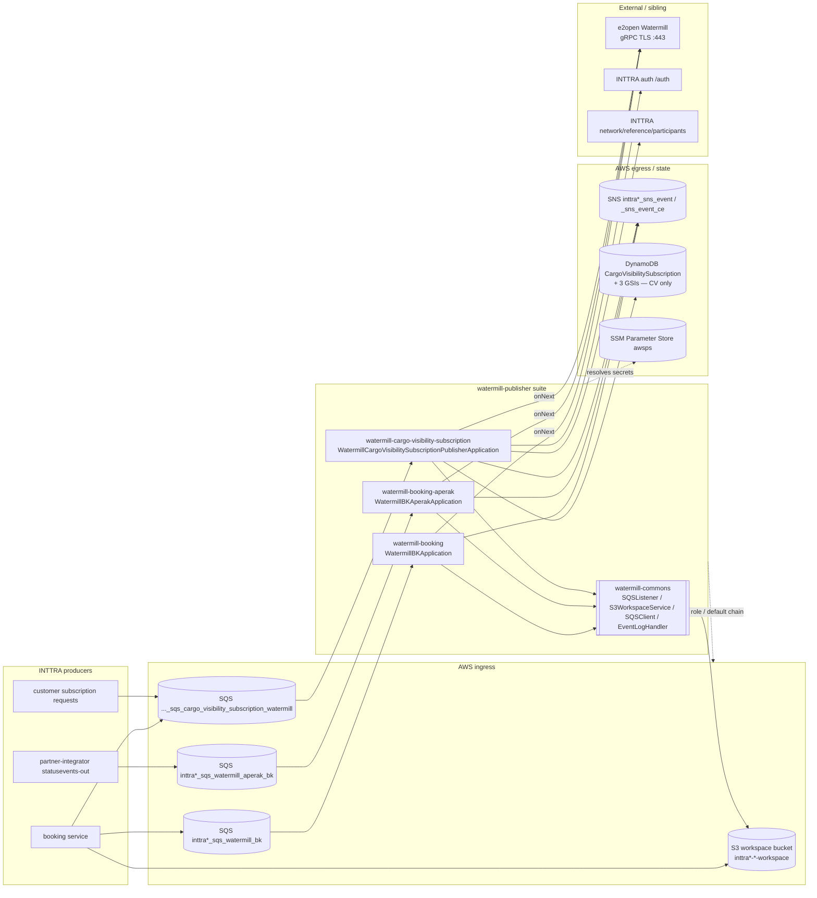
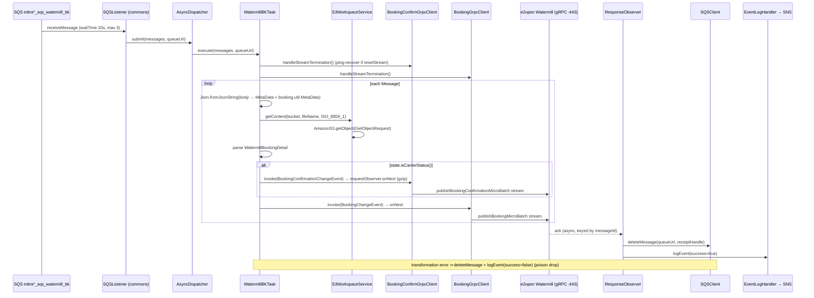
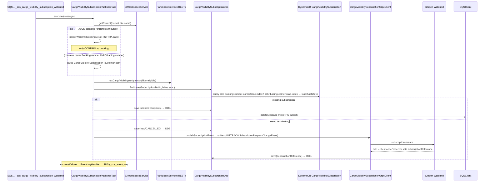

# Watermill Publisher — Current-State Design (Parent / Suite Overview)

**Module:** `watermill-publisher` (Maven aggregator / parent POM)
**Date:** 2026-06-30
**Status:** Current state — **AWS SDK 1.x** (`com.amazonaws` `1.12.661`) across all sub-modules; gRPC 1.77.0 outbound. cloud-sdk / AWS SDK v2 migration **NOT STARTED**.
**Packaging:** `pom` — `com.inttra.mercury:watermill-publisher:1.0`, parent `com.inttra.mercury:mercury-services:1.0`.
**JDK:** 17 (`maven.compiler.release=17`).
**Sub-modules (4):** `watermill-commons` (library), `watermill-booking`, `watermill-booking-aperak`, `watermill-cargo-visibility-subscription`.

> This is the **parent/aggregator** document. It describes the watermill-publisher suite as a system: what it does,
> how the sub-modules relate, the shared substrate (`watermill-commons`), the aggregate AWS footprint, and the
> suite-wide SDK state. The per-service deep-dives live in each sub-module's own `docs/` pair; a per-sub-module summary
> table appears in §3. There is **no Copilot baseline** for watermill — these are net-new Claude docs; the existing
> `docs/DESIGN-watermill-publisher.md` (2026-04-29) and the date-format exception analysis are background only.

---

## 1. Business Purpose

`watermill-publisher` ("Watermill") is the **outbound event bridge from the INTTRA Ocean Logistics platform to the
e2open Watermill event-streaming service**. It consumes booking / subscription change events that INTTRA services drop
onto AWS SQS, reads the full payload from S3, transforms the INTTRA canonical domain model into **Protocol Buffers
(proto3)**, and streams them to Watermill over **bidirectional gRPC** (TLS, port 443).

Core responsibilities:

- **Consume** — long-poll a dedicated SQS queue per event domain; the SQS body carries only a lightweight `MetaData`
  JSON envelope (`workflowId`, `bucket`, `fileName`, `timestamp`, `projections`) — never the full payload.
- **Dereference** — read the actual payload out of the S3 **workspace bucket** using `bucket`+`fileName` from the
  envelope (`WorkspaceService.getContent(..., ISO_8859_1)`), sidestepping the 256 KB SQS message limit.
- **Transform** — map the INTTRA booking / subscription domain model (imported from the `booking` module JAR) into
  Watermill proto messages via a per-domain transformer chain and 40+ enum `TypeMap` classes.
- **Publish** — send each proto message over a persistent gRPC stream (`requestObserver.onNext`), with a ping-based
  stream-recovery loop; acknowledge asynchronously via a `ResponseObserver`.
- **Persist (cargo-visibility only)** — create/update `CargoVisibilitySubscription` records in **DynamoDB**, tracking
  a `SUBMITTED → CANCELLED` lifecycle and back-filling the Watermill `subscriptionReference` on ack.
- **Audit** — on every success/failure path, publish an event-log record to an **SNS** topic (via commons
  `EventLogger`/`SNSEventPublisher`).

The runtime is **event-driven** — three independently deployable **Dropwizard** services (each an SQS listener, no REST
resources of its own), all backed by **S3**, **SQS**, **SNS**, **SSM Parameter Store** (gRPC credentials + auth
secret), and — for cargo-visibility only — **DynamoDB**. All AWS access uses **AWS SDK v1** (`com.amazonaws`).



---

## 2. Design — Layering & Shared Substrate

Every deployable sub-module is a **Dropwizard `InttraServer<Config>`** with **no JAX-RS resources** — the "application"
is an SQS-listener pipeline started in a `postSetupHook` (`WatermillBKApplication.startListener` registers a
`ListenerManager` on the Dropwizard lifecycle). `watermill-commons` supplies the entire messaging substrate; each
sub-module contributes only its config, Guice injector, gRPC client(s), transformer chain, and `Task`.

```mermaid
flowchart TB
  subgraph Commons[watermill-commons shared library]
    LST[SQSListener\nlong-poll loop, AmazonSQS ReceiveMessageRequest]
    LC[SQSListenerClient / ListenerManager\nLifecycle Managed]
    DISP[AsyncDispatcher implements Dispatcher\nidle-thread throttle → Task.execute]
    TASK[Task @FunctionalInterface\nexecute(List<Message>, queueUrl)]
    SQSC[SQSClient implements MessageSender\nAmazonSQS send/delete/attrs]
    S3W[S3WorkspaceService implements WorkspaceService\nAmazonS3 get/put/copy]
    DLQ[DeadLetterService]
    ELH[EventLogHandler → commons EventLogger/SNSEventPublisher]
    JSON[Json support\nDEFAULT_DATE_TIME_PATTERN yyyy-MM-dd HH:mm:ss.SS]
    CFG[Config: S3Config, SQSConfig,\nWatermillServiceConfig, HealthCheckConfig]
  end

  subgraph Module[each watermill-* Dropwizard sub-module]
    APP[*Application → InttraServer]
    INJ[*ApplicationInjector extends AbstractModule\n@Provides AmazonSQS/S3/SNS/(DynamoDB)]
    PI[PublisherInitializer\nManagedChannel + async/blocking stubs]
    GRPC[*GrpcClient + ResponseObserver\nStreamObserver + AuthCredentials]
    TR[transformer chain + TypeMap enums]
    T[concrete Task impl]
  end

  APP --> INJ --> T --> Commons
  INJ --> PI --> GRPC
  T --> GRPC
  T --> TR
```

### Key shared classes (`watermill-commons`, `com.inttra.mercury.watermill.commons.*`)

| Layer | Class | Responsibility | AWS v1 type held |
|-------|-------|----------------|------------------|
| SQS listen | `sqs.SQSListener` (impl `Listener`) | `startup()` runs a tight long-poll loop; requests `dispatcher.getIdleThreadCount()` messages per poll; delegates to `Dispatcher.submit`. Catches `com.amazonaws.AbortedException`. | `AmazonSQS` (via `SQSListenerClient`), `ReceiveMessageRequest`, `Message` |
| SQS listen | `sqs.SQSListenerClient`, `sqs.ListenerManager` (Dropwizard `Managed`) | Wrap the `amazonSQSForListener` client; manage listener thread lifecycle + DLQ wiring. | `AmazonSQS` |
| SQS send | `sqs.SQSClient` (impl `MessageSender`) | `sendMessage`, `deleteMessage`, `getVisibilityTimeout`. | `AmazonSQS` (`amazonSQSForSender`), `SendMessageRequest`, `DeleteMessageRequest`, `GetQueueAttributesRequest` |
| S3 | `s3.S3WorkspaceService` (impl `WorkspaceService`) | `getContent`/`getS3ObjectWrapper`/`getS3InputStream`/`putObject`(String+byte[])/`copyObject`/`copyObjectWithMetaDate`/`getMetaData`/`copyS3FileToFileSystem`. Wraps `SdkClientException` in `RecoverableException`. | `AmazonS3`, `GetObjectRequest`, `CopyObjectRequest`, `GetObjectMetadataRequest`, `ObjectMetadata`, `S3Object`, `S3ObjectInputStream`, `PutObjectResult`, `com.amazonaws.util.IOUtils` |
| DLQ | `sqs.DeadLetterService` | Move poison messages to `<queueUrl>_dlq`. | `AmazonSQS` (via clients) |
| Threading | `threaddispatcher.AsyncDispatcher` (impl `Dispatcher`), `TaskMessage` | Bridge listener → `Task`; fixed `maxNumberOfMsgs` signals capacity. | — |
| Task | `task.Task` (`@FunctionalInterface`), `task.TaskFactory`, `task.UnrecoverableAWSException` | Single `execute(List<Message>, queueUrl)`; each sub-module implements one. | — |
| Audit | `logging.EventLogHandler` | Build a commons `MetaData`, call `EventLogger.logCloseRunEvent(... success ...)`. | — (SNS is inside commons `SNSEventPublisher`/`SNSClient`) |
| Support | `support.Json` | Jackson `ObjectMapper` with `LocalDateTimeDeserializer` for `DEFAULT_DATE_TIME_PATTERN = "yyyy-MM-dd HH:mm:ss.SS"` (the timestamp-format contract with the booking producer). | — |
| Config | `config.S3Config`, `config.SQSConfig`, `config.WatermillServiceConfig`, `config.HealthCheckConfig` | Dropwizard-deserialized config beans; `WatermillServiceConfig` = gRPC `host`/`port`/`tenant`/`userIdKey`/`passwordKey`. | — |

> `watermill-commons` is a **plain jar** (`watermill-commons-1.0.jar`) and a `compile`-scope dependency of all three
> deployable sub-modules. It depends on `com.inttra.mercury:commons` (`1.R.01.023`), which supplies `InttraServer`,
> the service-client stack, `${awsps:}` resolution, and the `messaging.*` classes (`MetaData`, `EventLogger`,
> `SNSEventPublisher`, `messaging.sns.SNSClient`). The AWS S3/SQS/SNS v1 clients arrive transitively via `commons` and
> are bound as Guice singletons in each sub-module's injector.

---

## 3. Sub-Module Map

Declared `<modules>` order (parent pom): `watermill-commons`, `watermill-booking`, `watermill-booking-aperak`,
`watermill-cargo-visibility-subscription`.

| Sub-module | Runtime | Main class | Domain / proto published | AWS used (SDK v1) | booking JAR |
|------------|---------|-----------|--------------------------|-------------------|-------------|
| `watermill-commons` | jar (library) | — | Shared messaging substrate | S3, SQS (SNS via commons) | — |
| `watermill-booking` | Dropwizard (shaded uber-JAR) | `com.inttra.mercury.watermill.booking.WatermillBKApplication` | `BookingChangeEvent` + (legacy) `BookingConfirmationChangeEvent` | S3, SQS, SNS | `2.1.8.M` |
| `watermill-booking-aperak` | Dropwizard (shaded uber-JAR) | `com.inttra.mercury.watermill.bookingaperak.WatermillBKAperakApplication` | APERAK booking ack events | S3, SQS, SNS | `2.1.7.M` |
| `watermill-cargo-visibility-subscription` | Dropwizard (shaded uber-JAR) | `com.inttra.mercury.cargo.visibility.WatermillCargoVisibilitySubscriptionPublisherApplication` | `INTTRACWSubscriptionRequestChangeEvent` | S3, SQS, SNS, **DynamoDB** | `2.1.8.M` |

### Per-sub-module notes

- **watermill-booking** — the primary path. `WatermillBKTask` reads `MetaData` twice (commons `MetaData` and
  `booking.util.MetaData` for `externalIdentifiers` / `notificationParties`). If `bookingDetail.getState().isCarrierStatus()`,
  it publishes a legacy `BookingConfirmationChangeEvent` (backward-compat) via `BookingConfirmGrpcClient`; it **always**
  then publishes a `BookingChangeEvent` via `BookingGrpcClient`. Transformer chain: `BKConfirmProtobufTransformer`,
  `BKProtobufTransformer` + `BKCargo/BKCarriage/BKEquipment/BKLocation/BKParty` sub-transformers + ~40 `type/*TypeMap`
  enum mappers. **On any transformation error the SQS message is deleted** (poison-pill drop) and logged to SNS.
- **watermill-booking-aperak** — structurally the simplest. Same listener/S3/transform/publish shape via
  `WatermillBKAperakTask` → `BKAperakTransformer` + `BKAperakPartyTransformer`, publishing over a single
  `BookingAperakGrpcClient`. Pins the **older `booking:2.1.7.M`** and excludes the booking JAR's transitive
  `aws-java-sdk-sns/-sqs/-dynamodb` + `aws-lambda-java-events` (see pom). No DynamoDB.
- **watermill-cargo-visibility-subscription** — the only stateful module. `CargoVisibilitySubscriptionPublisherTask`
  handles **two payload shapes off one queue**, detected by string-probe on the S3 JSON:
  - contains `"enrichedAttributes"` → parse as `WatermillBookingDetail` (INTTRA-initiated, booking-state-driven; only
    `CONFIRM` with a booking number is processed; `DECLINE`/`REPLACE`/`CANCEL` are terminating → cancel existing subs);
  - contains `"carrierBookingNumber"`/`"billOfLadingNumber"` → parse as `CargoVisibilitySubscription`
    (customer-initiated).
  Eligible recipients are filtered via `ParticipantService.hasCargoVisibility()` (REST to network-participants).
  Existing subscription ⇒ `updateExistingSubscription` (save to DynamoDB, delete SQS, **no** gRPC publish); new ⇒
  save + `publishSubscriptionEvent` over `CargoVisibilitySubscriptionGrpcClient`; the `ResponseObserver` writes the
  Watermill-returned `subscriptionReference` back to DynamoDB. Subscription expiry = 400 days (DynamoDB TTL on
  `expiresOn`, `DateToEpochSecond` converter).

### Inter-module coupling (verified in sub-module poms)

| Sub-module | booking model pin | How fetched |
|------------|-------------------|-------------|
| `watermill-booking` | `com.inttra.mercury:booking:2.1.8.M` | local `file:${basedir}/lib` repo; `maven-dependency-plugin` `purge`+`get` at `package` |
| `watermill-booking-aperak` | `com.inttra.mercury:booking:2.1.7.M` | same local-repo purge/get dance |
| `watermill-cargo-visibility-subscription` | `com.inttra.mercury:booking:2.1.8.M` + `dynamo-client:1.R.01.023` | local `file:${basedir}/lib` repo |

> The `booking` JAR is resolved from an in-tree `lib/` **file repository**, not a remote Maven repo (the S3-backed
> `booking-model-s3-release` repo is commented out). Version drift is real: `2.1.7.M` (aperak) vs `2.1.8.M` (booking,
> CV) — and it maps to the APERAK module lagging one booking minor. The `aws-maven` (`com.github.platform-team:6.0.0`)
> build extension is present on every module but the model artifacts come from `lib/`.

---

## 4. Data Flow

### 4.1 watermill-booking (write path — SQS → S3 → gRPC)



> **Stream recovery:** `handleStreamTermination()` runs before each batch. If `resetStream` is set (a prior
> `onNext` threw), it `onCompleted()`s the old stream, then loops `blockingStub.ping(PingReq entity=SHIPMENTSTATUS)`
> every 5 s until `PingAck.ErrorCode.OK`, re-`initializeChannel` (Netty TLS) + re-inits async/blocking stubs via the
> singleton `PublisherInitializer`, and recreates the observer pair. Auth is via `AuthCredentials` (`io.grpc.CallCredentials`,
> OAuth bearer). Compression is `gzip`.

### 4.2 watermill-cargo-visibility-subscription (stateful path)



---

## 5. Data Stores & Integrations (aggregate footprint)

### DynamoDB (cargo-visibility only)

`CargoVisibilitySubscription` (`@DynamoDBTable("CargoVisibilitySubscription")`, hash key attribute `id` on Java field
`hashKey`). Table name is resolved by `DynamoSupport.newDynamoDBMapperConfig` as `<environment>_<tableName>`
(`TableNameOverride.withTableNamePrefix` + a `withTableNameResolver`). DAO = `CargoVisibilitySubscriptionDao extends
DynamoDBCrudRepository<CargoVisibilitySubscription, DynamoHashKey<String>>` (from `dynamo-client`).

- **GSIs** (`CargoVisibilitySubscriptionTableCommand`, verified against config.yaml):

  | Index | Hash key | Sort key | Projection |
  |-------|----------|----------|------------|
  | `bookingNumber-carrierScac-index` | `carrierBookingNumber` | `carrierScac` | KEYS_ONLY |
  | `billOfLading-carrierScac-index` | `billOfLadingNumber` | `carrierScac` | KEYS_ONLY |
  | `subscriptionReference-index` | `subscriptionReference` | — | KEYS_ONLY |

- **Capacity:** 5/5 base + 5/5 per GSI in **all four envs** (`dynamoDbTableCreationCommandConfig`).
- **TTL:** enabled on attribute `expiresOn` (`enableTTLOnTable`); `expiresOn` stored as epoch-seconds via
  `DateToEpochSecond` (`@DynamoDBTypeConverted`). Enums (`state`/`type`/`clientType`) via `@DynamoDBTypeConvertedEnum`
  (stored as `name()`).
- **Per-env prefix** (`dynamoDbConfig.environment`) → effective table:

  | Env | prefix | effective table | Account |
  |-----|--------|-----------------|---------|
  | INT | `inttra_int` | `inttra_int_CargoVisibilitySubscription` | `081020446316` |
  | QA | `inttra2_qa` | `inttra2_qa_CargoVisibilitySubscription` | `642960533737` |
  | **CVT** | **`inttra2_cv`** | `inttra2_cv_CargoVisibilitySubscription` | `642960533737` |
  | PROD | `inttra2_pr` | `inttra2_pr_CargoVisibilitySubscription` | `642960533737` |

> **CALIBRATION NOTE:** watermill CVT uses the **`inttra2_cv`** prefix and `inttra2-cv-*` bucket names — **not**
> `inttra2_test`/`inttra2_cvt` (that is bill-of-lading/partner-integrator, which are different). Verified in
> `watermill-cargo-visibility-subscription/conf/cvt/config.yaml`.

### S3 — single workspace bucket per env (all three services, read-mostly)

The SQS `MetaData.bucket`/`fileName` point into this bucket; watermill reads with `ISO_8859_1` and may `putObject`/
`copyObject` back (metadata staging). `s3WorkspaceConfig.bucket`:

| Env | Bucket |
|-----|--------|
| INT | `inttra-int-workspace` |
| QA | `inttra2-qa-workspace` |
| CVT | `inttra2-cv-workspace` |
| PROD | `inttra2-pr-workspace` |

### SQS (pickup queues, `us-east-1`; INT acct `081020446316`, QA/CVT/PROD acct `642960533737`)

| Service | INT | QA | CVT | PROD |
|---------|-----|-----|-----|------|
| watermill-booking | `inttra_int_sqs_watermill_bk` | `inttra2_qa_sqs_watermill_bk` | `inttra2_cv_sqs_watermill_bk` | `inttra2_pr_sqs_watermill_bk` |
| watermill-booking-aperak | `inttra_int_sqs_watermill_aperak_bk` | `inttra2_qa_sqs_watermill_aperak_bk` | `inttra2_cv_sqs_watermill_aperak_bk` | `inttra2_pr_sqs_watermill_aperak_bk` |
| cargo-visibility | `inttra_int_sqs_cargo_visibility_subscription_watermill` | `inttra2_qa_sqs_cargo_visibility_subscription_watermill` | `inttra2_cv_sqs_cargo_visibility_subscription_watermill` | `inttra2_pr_sqs_cargo_visibility_subscription_watermill` |

- Each: `waitTimeSeconds: 20`, `maxNumberOfMessages: 3`, `listenerThreads: 1`. DLQ = `<queueUrl>_dlq`
  (`DeadLetterService`).

### SNS — audit event topic (via commons `SNSEventPublisher(snsEventTopicArn, SNSClient)`)

| Service | INT | QA | CVT | PROD |
|---------|-----|-----|-----|------|
| watermill-booking / aperak | `arn:aws:sns:us-east-1:081020446316:inttra_int_sns_event` | `…:642960533737:inttra2_qa_sns_event` | `…:inttra2_cv_sns_event` | `…:inttra2_pr_sns_event` |
| cargo-visibility | `arn:aws:sns:us-east-1:081020446316:inttra_int_sns_event_ce` | `…:inttra2_qa_sns_event_ce` | `…:inttra2_cv_sns_event_ce` | `…:inttra2_pr_sns_event_ce` |

### gRPC egress — e2open Watermill (`WatermillServiceConfig`)

| Field | INT | QA | CVT | PROD |
|-------|-----|-----|-----|------|
| host:port | `watermill.staging.e2open.com:443` | `watermill.staging.e2open.com:443` | `watermill.staging.e2open.com:443` | `watermill.e2open.com:443` |
| tenant | `INTTRA_INT` | `INTTRA_QA` | `INTTRA` | `INTTRA` |
| userIdKey / passwordKey (SSM) | `/inttra/int/appianway/watermill-grpc/se/{username,password}` | `/inttra2/qa/appianway/watermill-grpc/se/…` | `/inttra2/cv/…` | `/inttra2/pr/…` |

TLS via `grpc-netty-shaded` (`NettyChannelBuilder.forAddress(host,port).build()` — TLS by default, no insecure mode).
RPCs (in `api/publisher.proto`): `publishBookingMicroBatch`, `publishBookingConfirmationMicroBatch`, cargo-visibility
subscription stream, and `ping`.

### External REST (cargo-visibility only, via commons service-client + `AuthClient`)

`auth` (OAuth client-credentials; `clientSecret` from `${awsps:…/partner-integration/authclientsecret}`) and
`network-participants` (`network/reference/participants`, checks the `cargoVisibility` entitlement). Per-env base:
INT `api-alpha`, QA `api-beta`, CVT `api-test`, PROD `api` (`*.inttra.com`).

---

## 6. Maven Dependencies (suite-wide)

| Artifact | Version | Where | Purpose |
|----------|---------|-------|---------|
| `com.inttra.mercury:commons` | `1.R.01.023` | watermill-commons (all inherit) | `InttraServer`, service client, `${awsps:}`, `messaging.*` (`MetaData`, `EventLogger`, `SNSEventPublisher`, `messaging.sns.SNSClient`). Pulls S3/SQS/SNS v1 transitively. |
| `com.inttra.mercury:dynamo-client` | `1.R.01.023` | cargo-visibility only | `DynamoDBCrudRepository`, `DynamoDbConfig`, `AbstractDynamoCommand`, `DateToEpochSecond`, `DynamoHashKey`. Pulls AWS SDK **v1** DynamoDB. |
| `com.inttra.mercury:booking` | `2.1.8.M` (booking, CV) / `2.1.7.M` (aperak) | deployable modules | INTTRA booking domain model (`ConfirmPendingMessage`, `Booking`, `BookingState`, `Common.Artifacts.TransactionParty`, `booking.util.MetaData`). From local `lib/`. |
| `com.google.protobuf:protobuf-java` | `4.33.1` | commons | proto3 runtime. |
| `com.googlecode.protobuf-java-format:protobuf-java-format` | `1.4` | commons | JSON rendering of proto for logging (`JsonFormat.printToString`). |
| `io.grpc:grpc-bom` / `grpc-netty-shaded` / `grpc-protobuf` / `grpc-stub` | `1.77.0` | commons | gRPC transport (Netty TLS), protobuf codec, stubs. |
| `com.fasterxml.jackson.core:jackson-core` | `2.19.2` | commons | JSON (commons `jackson-core` excluded then re-pinned). |
| `jakarta.validation:jakarta.validation-api` | `3.1.0` | commons | Config bean validation. |
| `org.projectlombok:lombok` | `${lombok.version}` (CV pins `1.18.30`) | all | `@Data/@Builder/@Slf4j`. |
| Test | `junit-jupiter 6.1.0-M1`/`5.11.3` (bk), `junit 4.13.2` (aperak), `assertj 4.0.0-M1`/`3.26.0`, `mockito 5.20.0`/`5.12.0` | all | Unit tests. |
| Build ext `com.github.platform-team:aws-maven` | `6.0.0` | all | S3-backed Maven wagon (present; models actually from `lib/`). |
| Build | `maven-shade-plugin` (2.3 bk/aperak, 3.6.1 CV), `protobuf-maven-plugin 0.6.1` (+ `protoc 4.33.1`, `protoc-gen-grpc-java 1.81.0`), `os-maven-plugin`, `maven-dependency-plugin` purge/get | — | Uber-JAR (Manifest main class) + proto codegen. |

> **AWS SDK is entirely v1 and mostly transitive.** No sub-module declares `aws-java-sdk-*` directly (parent property
> `aws.java.sdk.version=1.12.661` documents the line); the S3/SQS/SNS/DynamoDB v1 clients come through `commons` /
> `dynamo-client` and are bound as Guice singletons. `watermill-booking-aperak` **explicitly excludes** the booking
> JAR's transitive `aws-java-sdk-sns/-sqs/-dynamodb` + `aws-lambda-java-events`. **Zero `software.amazon.awssdk` and
> zero `cloudsdk` references** exist anywhere in the tree (grep confirmed).

---

## 7. Configuration & Deployment

- **Dropwizard config** (`conf/{int,qa,cvt,prod}/config.yaml` per deployable module): `server.rootPath`
  (`/watermill-booking`, `/watermill-booking-aperak`, `/watermill-cargo-visibility-subscription`), app/admin ports
  **8090/8091**, `listenerThreads: 1`, `sqsPickupConfig` (`queueUrl`, `waitTimeSeconds`, `maxNumberOfMessages`),
  `s3WorkspaceConfig.bucket`, `snsEventTopicArn`, `watermillServiceConfig`, `securityResources`, `serviceDefinitions`
  (`auth`; CV adds `network-participants`). CV additionally: `dynamoDbConfig.environment` +
  `dynamoDbTableCreationCommandConfig` (table + 3 GSIs, 5/5).
- **Config classes:** `WatermillBookingConfig`, `WatermillBookingAperakConfig`, `CargoVisibilitySubscriptionConfig`
  (all `extends ApplicationConfiguration`); CV's `dynamoDbConfig` is `com.inttra.mercury.dynamo.respository.module.DynamoDbConfig`.
- **Secrets:** SSM Parameter Store via `${awsps:/…}` resolved by commons — gRPC `username`/`password`
  (`/inttra{2}/<env>/appianway/watermill-grpc/se/…`) and auth `clientSecret`
  (`/inttra{2}/<env>/mercuryservices/partner-integration/authclientsecret`).
- **Guice wiring:** each `*ApplicationInjector extends AbstractModule`. Common bindings:
  `bind(AmazonSQS).annotatedWith("amazonSQSForListener"/"amazonSQSForSender").toInstance(AmazonSQSClientBuilder.standard().build())`,
  `bind(AmazonS3).toInstance(AmazonS3ClientBuilder.standard().build())`,
  `bind(AmazonSNS).toInstance(AmazonSNSClientBuilder.standard().build())`, `WorkspaceService → S3WorkspaceService`,
  and `EventPublisher` via `new SNSEventPublisher(snsEventTopicArn, snsClient)`. CV additionally binds
  `AmazonDynamoDB` + `DynamoDBMapperConfig` + `DynamoDBMapper` from `DynamoSupport`, and the `network-participants`
  `ServiceDefinition`. Each injector initializes the `PublisherInitializer` singleton (channel + async/blocking stubs).
- **Table bootstrap (CV):** `CargoVisibilitySubscriptionTableCommand extends AbstractDynamoCommand`
  (`createTableAndWaitUntilActive` + `createGlobalSecondaryIndexesIfNotExist` + `enableTTLOnTable`).
- **Packaging/deploy:** `maven-shade` uber-JAR with `ManifestResourceTransformer` main class + `ServicesResourceTransformer`
  (for gRPC/Netty SPI files); `protobuf-maven-plugin` generates proto+gRPC stubs from `src/main/proto`; per-env config
  copied at deploy; runs on ECS. **Credentials:** default AWS credential chain / ECS task IAM role
  (`…ClientBuilder.standard().build()` everywhere — no static keys).

---

## 8. AWS Services & SDK 1.x Usage (CALL-OUT — bridge to aws2x)

> **The entire suite is on AWS SDK v1 (`com.amazonaws` `1.12.661`).** No `software.amazon.awssdk` (v2), no `cloud-sdk`
> anywhere. gRPC/Netty is the outbound transport and is unrelated to the AWS SDK upgrade.

| Service | SDK | Where (class) | Concrete v1 classes |
|---------|-----|---------------|---------------------|
| **S3** | v1 (via commons transitive) | `watermill-commons` `s3.S3WorkspaceService`; each injector (`AmazonS3ClientBuilder.standard().build()`) | `AmazonS3`, `AmazonS3ClientBuilder`, `GetObjectRequest`, `CopyObjectRequest`, `GetObjectMetadataRequest`, `ObjectMetadata`, `PutObjectResult`, `S3Object`, `S3ObjectInputStream`, `SdkClientException`, `com.amazonaws.util.IOUtils` |
| **SQS** | v1 | `watermill-commons` `sqs.SQSClient` / `SQSListener` / `SQSListenerClient` / `DeadLetterService`; injectors | `AmazonSQS`, `AmazonSQSClientBuilder`, `SendMessageRequest`, `DeleteMessageRequest`, `ReceiveMessageRequest`, `GetQueueAttributesRequest`/`Result`, `Message`, `com.amazonaws.AbortedException` |
| **SNS** | v1 (via commons `SNSEventPublisher`/`messaging.sns.SNSClient`) | injectors bind `AmazonSNS`; `EventLogHandler` publishes through commons | `AmazonSNS`, `AmazonSNSClientBuilder` (`.standard().build()`) |
| **DynamoDB** | v1 ORM (via `dynamo-client`) — **CV only** | `dao.DynamoSupport`, `dao.CargoVisibilitySubscriptionDao`, `model.CargoVisibilitySubscription`, `config.CargoVisibilitySubscriptionTableCommand`, `WatermillCargoVisibilitySubscriptionApplicationInjector` | `AmazonDynamoDB`, `AmazonDynamoDBClientBuilder`, `AwsClientBuilder.EndpointConfiguration`, `DynamoDBMapper`, `DynamoDBMapperConfig`, `@DynamoDBTable/@DynamoDBHashKey/@DynamoDBAttribute/@DynamoDBIndexHashKey/@DynamoDBIndexRangeKey/@DynamoDBTypeConverted/@DynamoDBTypeConvertedEnum/@DynamoDBIgnore`, `UpdateTimeToLiveRequest`, `TimeToLiveSpecification`, `DescribeTimeToLiveRequest`, `ResourceNotFoundException` |
| **Parameter Store** | resolved by commons | config (`${awsps:…}`) | — (no direct SSM client) |
| **gRPC (not AWS)** | grpc 1.77.0 | `PublisherInitializer`, `*GrpcClient`, `ResponseObserver`, `AuthCredentials` | `ManagedChannel`, `NettyChannelBuilder`, `PublisherGrpc.*Stub`, `StreamObserver`, `CallCredentials` — **unchanged by the AWS upgrade** |

---

## 9. AWS 2.x / cloud-sdk Upgrade Plan (High Level, suite-wide)

Goal: replace direct AWS SDK v1 (`com.amazonaws.*`) with the in-house **cloud-sdk** (`cloud-sdk-api` + `cloud-sdk-aws`,
AWS SDK 2.x under the hood, Apache HTTP), mirroring the completed **booking** and **visibility** upgrades (and the
`network`/`registration`/`auth` DynamoDB DAO patterns). Full sequencing and code is in the companion
`…-aws2x-DESIGN-claude.md`.

| Step | Action | Reference |
|------|--------|-----------|
| 1 | **`watermill-commons` first** — migrate `S3WorkspaceService`, `SQSClient`/`SQSListener*`/`DeadLetterService` (and the SNS path via commons) to cloud-sdk. All three deployable modules inherit the fix. | booking, visibility |
| 2 | **DynamoDB (CV)** — migrate `CargoVisibilitySubscription` ORM annotations to enhanced-client `@DynamoDbBean`/`@Table`; re-implement `DateToEpochSecond` as a v2 `AttributeConverter`; rewrite `CargoVisibilitySubscriptionDao` on `DatabaseRepository` + `DefaultQuerySpec`; replace `DynamoSupport` + the table command. **Preserve** table name, the 3 GSIs (KEYS_ONLY), key schema, `id` hash-attr, epoch-second `expiresOn`/TTL, and enum `name()` encoding. | booking, network, registration |
| 3 | **S3 / SNS / SQS** — swap injector bindings to cloud-sdk storage/notification/messaging factories; keep the SQS long-poll semantics (waitTime 20 / max 3) and the poison-drop behaviour. | booking, visibility |
| 4 | **Reconcile the `commons`/`dynamo-client` line** to the cloud-sdk-bearing version, and normalize the `booking` model pins (`2.1.7.M` vs `2.1.8.M`). | booking |
| 5 | **Tests** — DynamoDB-Local IT for the DAO + 3 GSIs + TTL/epoch converter (`dynamo-integration-test`/`BaseDynamoDbIT`); S3 round-trip; SQS/SNS mocked; envelope-shape tests; full local JaCoCo on changed code. | network/auth `*DaoIT` |

**Risks / call-outs:**

- **Heaviest surface = `watermill-commons` S3/SQS + CV DynamoDB ORM.** The commons S3/SQS wrappers back all three
  services; any behavioural drift (e.g. `RecoverableException` semantics that keep messages on the queue) ripples
  suite-wide.
- **Message-shape contracts are hard wire-compat:** the SQS `MetaData` envelope timestamp is `yyyy-MM-dd HH:mm:ss.SS`
  (commons `Json` / the Apr-2026 date-format fix); the S3 payload is read as `ISO_8859_1`; the outbound proto messages
  are the e2open contract. None of these change with the AWS SDK swap — but the migration must not perturb them.
- **DynamoDB attribute encodings** (epoch-second `expiresOn` for TTL, enum `name()`, `id` hash-key attribute, the 3
  KEYS_ONLY GSIs) must round-trip so existing `CargoVisibilitySubscription` items and the `subscriptionReference`
  back-fill keep working.
- **CVT prefix trap:** watermill uses `inttra2_cv` / `inttra2-cv-*`, **not** `inttra2_test`/`inttra2_cvt`.
- **cloud-sdk gaps to verify** (flagged during the visibility upgrade): S3 retry/timeout/connection-pool knobs, SNS/SQS
  credential-chain fallback (`…ClientBuilder.standard().build()` semantics), and DynamoDB TTL enablement API parity.
- **gRPC/Netty is orthogonal** and stays as-is; do not conflate the grpc-netty-shaded dependency with the AWS upgrade.
- **Sequencing:** one outgoing commit per team workflow; every commit message carries the Jira ticket prefix.
