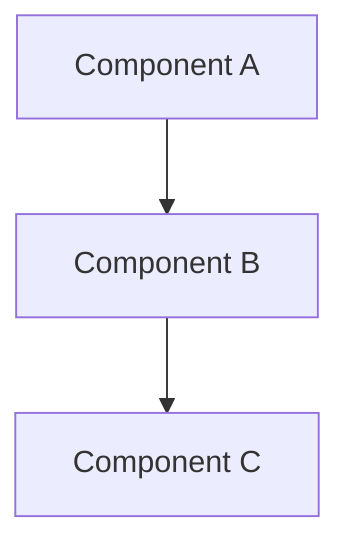
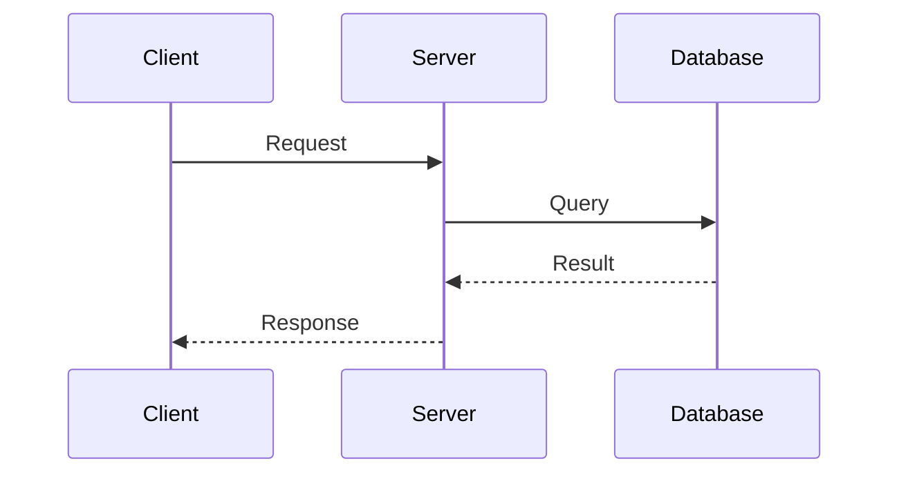
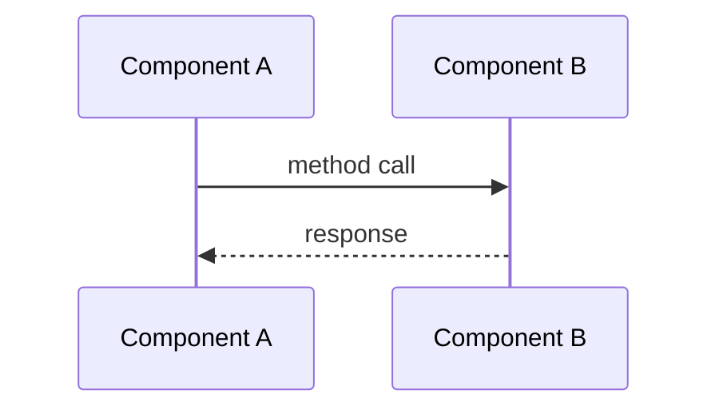

# Design Document Template — Confluence Format

> This is the standard design document template used for mercury-services engineering design reviews.
> It mirrors the Confluence wiki template at [BRM space](https://confluence.dev.e2open.com/display/BRM/).
> Sections with no applicable content should contain "N/A".

---

## Contents

<!-- Auto-generated table of contents -->

---

## Contributors

| Role | Name |
|------|------|
| Author | |
| Reviewer | |
| Approver | |

---

## Requirements

### Jira Tickets

<!-- JIRA issue table — populate with relevant tickets -->

| Key | Summary | Type | Priority | Status | Assignee |
|-----|---------|------|----------|--------|----------|
| | | | | | |

### Support Tickets

| Key | Summary | Priority | Status |
|-----|---------|----------|--------|
| | | | |

### Summary

<!-- High-level summary of what this change achieves -->

### Technology Stack

| Component | Technology |
|-----------|-----------|
| Framework | |
| Build | |
| AWS SDK | |
| Database | |
| Messaging | |

---

## Assumptions and Open Issues

| # | Item | Type | Status | Resolution |
|---|------|------|--------|------------|
| 1 | | Assumption / Open Issue | Open / Resolved | |

---

## High Level Design

### Architectural Overview

<!-- Module-level or system-level architectural overview. Use Mermaid diagrams when possible. -->

### Data Flow

<!-- Data flow pipeline. Use Mermaid sequence or flowchart diagrams. -->

---

## Low Level Design

### Key Components and Changes

| # | Component | Location | Purpose | Key Changes |
|---|-----------|----------|---------|-------------|
| 1 | | | | |

### Guice Module Loading Order

<!-- If applicable, describe the Guice module loading order -->

N/A

### AWS Services Used

<!-- If applicable for the change being made -->

| Service | Usage | SDK |
|---------|-------|-----|
| | | |

### DynamoDB Changes

<!-- If applicable: annotation mapping, table details, GSI -->

| Table | Partition Key | Sort Key | GSIs | Annotation Class |
|-------|--------------|----------|------|-----------------|
| | | | | |

### Component Interaction Flow

<!-- Use Mermaid sequence diagram for component interactions -->

---

## UI

N/A

---

## API Architecture

### Endpoints Affected

| Method | Path | Description | Changes |
|--------|------|-------------|---------|
| | | | |

### Request/Response Changes

N/A

---

## Configuration

### Model Level Configuration

N/A

### Stack Level Configuration

N/A

### Professional Services/System Integrator Configuration

N/A

---

## Auditing/Logging

### Logging Details

| Logger | Level | Message Pattern | When |
|--------|-------|----------------|------|
| | | | |

### Event Publishing

<!-- Lifecycle stages, event types published -->

N/A

---

## Metrics and Statistics

N/A

---

## Installer Changes

N/A

---

## Impact on Current Application

<!-- Describe runtime impact, performance impact, deployment considerations -->

---

## Resiliency

<!-- Failover, retry, circuit breaker considerations -->

N/A

---

## Temporary object cleanup, temporary files cleanup

N/A

---

## Impact on Tools

N/A

---

## Impact on Other Components

<!-- Cross-module or cross-service impact -->

N/A

---

## Backwards Compatible

<!-- Is this change backwards compatible? If not, describe migration path -->

---

## Unit Test Plan

### New Tests

| # | Test Class | Test Method | Coverage |
|---|-----------|-------------|----------|
| 1 | | | |

### Existing Test Impact

<!-- Were any existing tests modified? -->

---

## Pre-Dev Security

### Security Checklist

| # | Question | Yes/No | Comments |
|---|----------|--------|----------|
| 1 | Does the change handle user-supplied input? | | |
| 2 | Is input validated/sanitized at public API boundaries? | | |
| 3 | Does the change involve authentication or authorization? | | |
| 4 | Does the change handle sensitive data (PII, credentials, tokens)? | | |
| 5 | Are credentials hardcoded or stored in source code? | | |
| 6 | Does the change use cryptographic operations? | | |
| 7 | Does the change interact with external systems? | | |
| 8 | Does the change introduce new network endpoints? | | |
| 9 | Does the change modify access control or permissions? | | |
| 10 | Is the change vulnerable to injection attacks (SQL, LDAP, OS command, etc.)? | | |
| 11 | Does the change handle file uploads or downloads? | | |
| 12 | Does the change modify logging? Could it log sensitive data? | | |
| 13 | Does the change introduce any new dependencies with known CVEs? | | |
| 14 | Has the OWASP Top 10 been considered? | | |

---

## Required Documentation Changes

### User Documentation

| # | Question | Answer |
|---|----------|--------|
| 1 | Are changes to user-facing documentation needed? | |
| 2 | What documents/pages need updating? | |
| 3 | Are there new features requiring documentation? | |

### API Documentation

| # | Question | Answer |
|---|----------|--------|
| 1 | Are API docs (Swagger/OpenAPI) affected? | |
| 2 | Are there breaking API changes requiring migration guides? | |
| 3 | Do REST endpoint contracts change? | |

### Operations Documentation

| # | Question | Answer |
|---|----------|--------|
| 1 | Are runbook changes needed? | |
| 2 | Are monitoring/alerting changes required? | |
| 3 | Are deployment procedure changes needed? | |

---

## Blocking Issues and Actions from the Design Review

| # | Issue/Action | Owner | Status | Due Date | Resolution |
|---|-------------|-------|--------|----------|------------|
| 1 | | | Open | | |

---

## Review

| # | Reviewer | Role | Status | Date | Comments |
|---|----------|------|--------|------|----------|
| 1 | | Author | Draft | | |
| 2 | | Peer Reviewer | Pending | | |
| 3 | | Tech Lead | Pending | | |
| 4 | | Architect | Pending | | |
